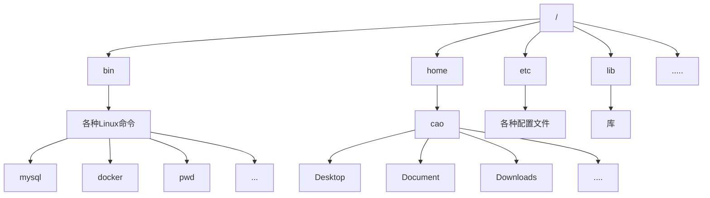

**Windows系统下的存储结构可以分区  分为C：D：E：F：**

**Linux系统下的存储结构没有分区  所有内容都存在/根目录**

# Linux的目录结构




# Linux基本命令

/  在Linux系统下表示根目录 和Windows的C盘的实际意义一样


命令提示符：

cao@cao-virtual-machine:~$ 

cao 														用户名

@cao-virtual-machine:  			 		主机名

~ 															表示用户主目录

$ 															表示权限为普通用户

/etc/lsb-release									文件中存储的是本机操作系统的信息

​																信息如下：

​																		DISTRIB_ID=Ubuntu
​																		DISTRIB_RELEASE=22.04
​																		DISTRIB_CODENAME=jammy
​																		DISTRIB_DESCRIPTION="Ubuntu 22.04 LTS"


```bash
whoami：											#查看当前系统下登录用户是谁

pwd 										 	 #查看当前所处位置

ls 											 	 #查看当前目录位置下有什么内容（文件或文件夹）

ls -l											 #小写L，查看文件详情，包括权限、链接数、拥有者、组、大小和修改时间。

ls 路径									  	    #查看具体那个路径下的内容

clear 											 #清除屏幕内容

echo “ 要输出的内容”             			         #输出内容

history 										 #查看命令历史

cd 要去往的文件夹/文件位置  		  			     #切换当前位置

apt install 下载的内容		                     #从Ubuntu系统上下载内容			 
apt-get install                                 #从Ubuntu系统上下载内容

apt install nano                                #nano 一个文本编辑器
apt remove nano

apt list										#列举应用商店的文件

apt update                                      #更新应用商店


sudo 命令									       #使用管理员权限执行某条命令

ping 网络地址        							  #检测网络环境是否良好

touch 文件名，文件名，文件名						  #创建一个/多个文件
rm  文件名（支持模糊查询 file*.txt）				  #删除文件

rm -r 目录名
mv oldName, newName								 #重命名文件


cat 文件名										   #查看文件
cat file1 file2  								 #拼接并显示两个文件
more 文件名    								   #只显示一部分内容，敲回车显示其他
head -n 5 fileName    							 #显示文件里的前五行
tail -n 5 fileName    							 #显示文件里的最后五行


#重定向
 >
 cat file1 > file2
 
 echo $PATH > fileName
 
 #搜索
 grep 搜索的内容 文件名   大小写敏感
 grep -i 搜索的内容  文件名  变为大小写不敏感
 grep -r 搜索的内容  目录名  
 
 #找文件
 find -type d/l/f  						#d代表目录，f代表普通文件,l代表符号链接
 #符号链接（Symbolic Link），也被称为软链接（Soft Link），是 Unix 和类 Unix 系统中的一种文件类型
 
 find -type d/l/f -name "文件名（支持模糊搜索）"
 
 #执行多个指令
 mkdir test; cd test; echo done
 
 mkdir test && cd test && echo done  		与的逻辑：前面有一个执行不成功就不执行后面的命令
 
 mkdir test || echo done					或的逻辑：前面执行成功，后面不执行
 
 
 
 # 找出所有的py文件， 然后重定向到python_files.txt
find -type f -name "*.py" > python_files.txt


 | :pipe, 一个命令的执行结果，传给下一个命令
 
ls /bin | cat


echo $PATH 等价于 printenv PATH

进程管理：ps， kill 进程id

export 变量名=变量值


echo db_user=sss >> .bashrc 				# >>： 加到文件最后一行

source .bashrc 								#手动激活环境变量的设置


netstat -tunlp								#查看机器占用的端口


```


# Linux命令集合

## 1、入门命令

```bash
date								# 显示或设置系统时间
 date +"%Y-%m-%d"					# 格式化输出
 date -s "2025-07-10 12:00:00"		#设置系统时间
	
clear		  # 清屏
history		  # 查看历史命令
!命令		     # 快速执行历史记录最近一次以指定字符串开头的命令
echo 字符串		# 打印文本或变量值到终端
man 命令 	     # 查看命令帮助文档
whereis 	  # 查看二进制文件、源代码文件的帮助文档
```


## 2、基础知识

```bash
根目录，linux整体目录结构
root用户
用户主目录
命令行提示符#和$
&&命令
```

命令提示符：

cao@cao-virtual-machine:~$ 

cao 														用户名

@cao-virtual-machine:  			 		主机名

~ 															表示用户主目录

$ 															表示当前是普通用户

\#															 表示当前是root用户

&&命令												  只有前一个命令成功才会执行下一个


## 3、基础文件与目录管理

### ls：查看文件和目录

**语法：`ls [OPTION]... [FILE]...`**

```bash
ls 			# 简单列出
ls -l		# 详细的列表（权限/大小/时间等信息）
ls -a		# 显示隐藏文件(以.开头)
ls -lh		# 文件大小以K、M为单位，而不是简单的字节数
ls -t		# 按修改时间排序
ls -R		# 递归列出子目录
```

### cd 切换目录

```bash
cd /      # 切换到根目录
cd ~      # 切换到当前用户主目录
cd ..     # 切换到上级目录
cd -      # 切换到上次所在目录
cd .      # 当前目录（常用于脚本）
```

### pwd 显示当前路径

### mkdir 创建目录

**语法：`mkdir [OPTION]...DIRECTORY`**

```bash
mkdir dir1					# 创建单个目录
mkdir -p dir1/dir2/dir3	 	# 递归创建多个目录
mkdir {dir1,dir2}			# 同时创建多个目录
```

### rmdir 只能删除空目录

### rm 删除文件或目录

**语法：`rm [OPTION]...[FILE]...`**

```bash
rm file.txt		# 删除文件
rm -r dir1		# 递归删除目录
rm -f file/dir	# 强制删除（无确认）
rm -i *.txt		# 交互式删除txt文件（每个文件确认）
rm -d dir		# 删除空目录
```


### cp 复制文件或目录

**语法：**

- **`cp [OPTION]...SOURCE...DIRECTORY`**
- **`cp [OPTION]... [-T] SOURCE DEST`**
- **`cp [OPTION]... -t DIRECTORY SOURCE...`**

```bash
cp file1 file2			# 复制文件
cp -r dir1 dir2			# 递归复制目录
cp -a src dir			# 保留所有属性复制
cp -v 					# 显示详细复制过程
cp -t 					# 反转
```


### mv 移动或重命名文件

**语法：`cp [OPTION]...SOURCE...DIRECTORY`**

```bash
mv old.txt new.txt 		# 重命名
mv file dir				# 移动文件
mv dir1 dir2			# 移动目录
```


### touch 创建空文件

**语法：`touch [OPTION]...FILE...`**

```bash
touch newfile		# 创建空文件
```


### find 查找文件

**语法：`find [path...] [expression]`，默认路径为当前路径，表达式为`-print`**

**表达式的逻辑操作：或与非`-o`/`-a`/`-not`**

:one:**按名称查找**

```bash
find path -name 'filename'			# 精确匹配文件名
find path -iname 'filename'			# 忽略大小写
find path -name '*.txt'				# 模糊匹配
find path -regex '.\*.txt$'			# 正则表达式匹配
```


**:two:按类型查找**

```bash
find /path -type f           # 普通文件
find /path -type d           # 目录
find /path -type l           # 符号链接
find /path -type s           # 套接字
find /path -type p           # 命名管道
find /path -type b           # 块设备
find /path -type c           # 字符设备
```


**:three:按时间查找**

```bash
find path -mtime n			# 在第n天修改
find path -mtime +n			# 修改时间超过n天
find path -mtime -n			# 修改时间小于n天
find path -mmin n/+n/-n		# 修改时间等于/大于/小于n分钟
find path -atime n			# 访问时间等于n天
find path -ctime n			# 状态改变时间
find path -amin n			# 访问时间等于n分钟
find path -cmin n			# 状态改变世界等于n分钟
find path -newer file		# 比file更新的文件
```


**:four:按文件大小查找**

```bash
find path -size +10M		# 大于10M的文件或目录
find path -size -1G			# 小于1G的文件或目录
find path -size 512k		# 等于512k(k小写)文件或目录
find path -size 80c			# 等于80字节的文件或目录
```


**:five:按权限/用户查找**

```bash
find path -perm 644			# 查找权限是644的文件或目录
find path -perm -644		# 查找权限至少是644的文件或目录
find path -perm /464		# 任意权限位匹配464即可
find path -user username	# 查找属于指定用户的文件或目录
find path -group groupname	# 查找属于指定组的文件或目录
```


**:six:其他实用操作**

```bash
find path -maxdepth 2		# 最大搜索深度
find path -mindepth 2		# 最小搜索深度
find path -empty			# 查找空文件或目录
find path ls				# 以ls -dils格式显示
find / -perm 4000           # 查找SUID文件
find / -perm 2000			# 查找SGID文件
```


### du （disk usage) 查看目录或文件大小

**语法：`du [OPTION]...[FILE]/[DIRECTORY]...`**

- **`a`：所有的文件和目录**
- **`h`：以人类可读的方式显式 **
- **`s`：summaries，统计每个参数项的所占内存大小**

```bash
du -sh *           # 查看当前目录各项目大小
du -h path			# 人性化显示大小
du -h --max-depth=1 /var  # 查看/var下级目录大小
du -ah				# 当前目录下所有文件和目录的大小统计
```


### df (disk free) 查看磁盘空间使用情况

**语法：`df [OPTIONS]...[FILE]...`，默认查看整个文件系统磁盘使用情况**

```bash
df -h			# 人类可读格式显示
df -i			# 查看inode使用情况
df -T			# 显示文件系统类型
df -t 类型名	  # 显示指定类型名的文件系统
```


**iNode（索引节点）**

- **是Linux/Unix文件系统中用于存储文件元数据的数据结构**
- **每个文件/目录都有一个唯一的iNode变化**
- **存储文件的元数据（metadata），但不包含文件名**
- **类似于书的目录页，记录内容的位置和属性**


```bash
>>> df

Filesystem     1K-blocks     Used Available Use% Mounted on
tmpfs             396140     2004    394136   1% /run
/dev/sda3       19946096 15455096   3452460  82% /
tmpfs            1980688        0   1980688   0% /dev/shm
tmpfs               5120        4      5116   1% /run/lock
/dev/sda2         524252     6228    518024   2% /boot/efi
tmpfs             396136      100    396036   1% /run/user/1000
/dev/sr0          159072   159072         0 100% /media/cao/CDROM
/dev/sr1         4919592  4919592         0 100% /media/cao/Ubuntu 22.04.3 LTS amd64
```


### tar 压缩或解压文件

**语法：`tar [OPTION]...[归档文件名]...[要归档的文件或目录]`**

**将许多文件一起保存到一个磁带或磁盘存档中，并且可以从存档中还原单个文件**

**:a:主操作模式（必选一个）**

- **`-c`：**
  - **create，创建一个新的存档**
  - **delete，从存档中删除（不在磁带上）**
- **`-r`：append，将文件附加到存档的末尾**
- **`-t`：list，列出存档的内容**
- **`-u`：update，更新存档中的文件**
- **`-x`：extract，从存档中提取文件**


**:b:常用辅助选项**

- **`-f`：指定归档文件名（必须）**
- **`-v`：显示详细过程**
- **`-z`：通过gzip压缩/解压（.tar.gz或.gz）**
- **`-j`：通过bzip2压缩/解压（.tar.bz2）**
- **`-J`：通过xz压缩/解压（.tar.xz）**
- **`-C`：`--directory`解压到指定目录**
- **`-p`：`--preserve-permissions`保留文件权限属性**
- **`--exclude`：排除指定文件/目录**


```bash
tar -cf archive.tar foo bar   # 从文件foo和bar中创建archive.tar

tar -tvf archive.tar		  # 详细列出archive.tar中的所有文件
tar -xf	archive.tar			  # 从archive.tar中提取所有文件
```


```bash
# 创建压缩文件
tar -cf archive1.tar homework.txt tree.txt 			# 将homework.txt和tree.txt压缩为archive1.tar，默认压缩方式
tar -czf archive2.gz libxul.so tree.txt 			# 以gzip的方式压缩文件
tar -cJf archive3.xz homework.txt tree.txt 			# 以xz的方式压缩文件

# 往压缩文件里添加新文件
tar -rf archive1.tar tree.txt 						# r: -append 向归档文件中添加新文件

# 列出压缩文件内容
tar -tf archive1.tar 								# 简单列出归档文件内容，只包含文件名
tar -tvf archive1.tar								# 详细列出归档文件内容


# 提取压缩文件，默认到当前路径 ，使用 -C 指定路径
tar -xf archive1.tar 								# 以tar解压的方式,将archive1.tar解压到当前目录下
tar -xf archive1.tar -C ./dir11						# 指定解压目录
tar -xjf archive2.gz -C ./dir12						# 以bzip2的方式解压到指定目录
tar -xzf archive2.gz -C ./dir12						# 以gzip的方式解压到指定目录
tar -xJf archive3.xz -C ./dir13						# 以xz的方式解压到指定目录
```


## 4、文件查看与编辑

### cat 查看完整文件内容

- **`-n`：number，按行号显示文件内容**

- **`-b`：--number-nonblank只对非空行进行编号**
- **`-s`：--squeeze-blank压缩连续空行为一行**
- **`-A`：--show-all等价于-vET**
- **`-E`：--show-ends，显示每行末尾，也就是在每行末尾添加$符，**

### nl 显示带行号的内容，空行不编号

### more 分页显示，支持上下翻页

### less 一行一行看（上下），按q退出

### head/tail 显示文件开头/末尾

**语法：`head/tail [OPTION]... [FILE]...`，默认输出一个或多个文件的前十行，当读取多个文件时，会生成一个文件头**

```bash
head -n 5 file		  # 查看文件前五行
head file 			  # 默认查看文件前10行
head file1 file2	  # 查看两个文件的前10行
head -c 1024 file	  # 显示文件中前1024个字节
```


### grep 搜索文本内容

**语法：`grep [OPTION]... PATTERNS [FILE]...`，在每个文件中搜索patterns，模糊匹配**

**:a:搜索控制选项**

- **`-i`：忽略大小写**
- **`-v`：--invert-match，反向匹配，显示不包含patterns的行**
- **`-w`：--word-regexp，全字匹配**
- **`-x`：--line-regexp，整行匹配**
- **`-E`：使用扩展的正则表达式**
- **`-F`：--fixed-regexp固定字符串匹配**
- **`-P`：使用Perl兼容正则表达式**


**:b:输出控制选项**

- **`-c`：count，只显示匹配行的计数**
- **`-l`：--files-with-matches，只显示包含匹配项的文件名**
- **`-L`：--files-without-match，只显示不包含匹配项的文件名**
- **`-n`：--line-number，显示匹配行的行号**
- **`-o`：--only-match只显示匹配的部分**
- **`-q`：静默模式（不输出任何内容）**


**:ab:上下文控制**

- **`-B`：--before-context=NUM， 打印匹配行的前NUM行**
- **`-A`：--after-context=NUM，打印匹配行的后NUM行**
- **`-C`：--context=NUM，打印上下文的NUM行**


```bash
grep "tree" tree.txt 				# 在tree.txt中模糊匹配tree
grep -i "color" tree.txt 			# 在tree.txt中模糊匹配color，忽略大小写
grep "tr" tree.txt 					# 在tree.txt中模糊匹配tr
grep -w "color" tree.txt 			# 在文件中全词匹配color
grep -n "color" tree.txt 			# 在文件中显示匹配color的行号
grep -n "color" *.txt 				# 在当前目录下的所有txt文件中匹配color并显示行号
grep  "co" *.txt 					# 在当前目录下的所有txt文件中模糊匹配co
grep -wl "color" *.txt 				# 在当前目录下全词匹配color并只显示匹配的文件名
grep -L "color" *.txt 				# 在当前目录下模糊匹配color显示不匹配的文件名
grep "^cla" homework.txt 			# 在homework.txt中匹配以cla开头的行
grep "end$" file.txt           		# 以"end"结尾的行
grep -E "[0-9]{3}" file.txt    		# 查找3位数字（扩展正则）
grep -P "\d{3}" file.txt       		# 同上（Perl正则）
grep -A 2 "^cla" homework.txt 		# 显示匹配成功的后两行
grep -B 2 "^cla" homework.txt 		# 显示匹配成功的前两行
grep -C 2 "^cla" homework.txt 		# 显示上下文的两行
grep -o "color" tree.txt 			# only-matches 仅显示在tree.txt中匹配的部分
grep -v "color" tree.txt 			# 显示在tree.txt中不匹配color的行
grep -r "pattern" /path         # 递归搜索目录
grep -R "pattern" /path         # 同上（跟随符号链接）
```


### awk 文本处理工具

**工作原理**

- **AWK逐行读取输入文件**
- **对于每一行，检查是否匹配指定的模式**
- **如果匹配，则执行相应的动作**
- **重复这个过程直到文件结束**

**常用内置变量：**

- **`$0`：整行内容**
- **`$1`，`$2`，...`$n`：第1,2，...，n个字段**
- **`FILENAME`：当前输入的文件的名称**
- **`NR`：Record number，当前行号**
- **`FNR`：filename的record number，当前文件中的行号**
- **`FS`：splits records into fields，输出字段分隔符，默认是空格或制表符**
- **`NF`：number of fields，当前行的字段数量**
- **`OFS`：inserted between fields on output，initially = ' '，输出字段分隔符，默认是空格**
- **`ORS`：terminates each record on output，initially = '\n'，输出记录分隔符，默认是换行符**
- **`RS`：input record separator，initially = '\n'，输入记录分隔符，默认是换行符**


**:one:打印文件内容**

```bash
awk '{print}' file.txt        # 打印整个文件
awk '{print $0}' file.txt    # 同上
awk '{print $1}' file.txt    # 打印每行第一个字段
awk '{print $1,$3}' file.txt # 打印第1和第3个字段
```


**:two:指定分隔符**

```bash
awk -F':' '{print $1}' /etc/passwd  # 以冒号分隔，打印第一字段（用户名）
awk -F'[,:]' '{print $2}' file.txt  # 使用多个分隔符（逗号或冒号）
```


**:three:条件过滤**

```bash
awk '$3 > 100 {print $0}' file.txt      # 第3个字段大于100的行
awk '/pattern/ {print}' file.txt        # 包含"pattern"的行
awk 'NR >= 5 && NR <= 10' file.txt      # 打印5-10行
awk 'length($0) > 80' file.txt          # 打印长度大于80字符的行
```


**:four:计算和统计**

```bash
awk '{sum += $1} END {print sum}' file.txt       # 计算第一列总和
awk '{count++} END {print count}' file.txt       # 统计行数
awk '{sum += $1; count++} END {print sum/count}' file.txt # 计算平均值
```


**:five:begin 和 end**

```bash
awk 'BEGIN {print "Start"} {print} END {print "End"}' file.txt
```


**:six:内置函数**

```bash
awk '{print toupper($0)}' file.txt      # 转换为大写
awk '{print length($0)}' file.txt       # 打印每行长度
awk '{print substr($1, 2, 5)}' file.txt # 提取子字符串
```


```bash
awk '{print $0}' demo.txt 								# 输出demo.txt文件中的所有内容
awk '{print $1}' demo.txt 								# 输出demo.txt文件中的每行第一个字段的内容
awk '{print NF}' demo.txt 								# 输出demo.txt文件中每行的字段数量，默认空格分隔
awk 'NR>1 && NR<5' demo.txt 							# 输出demo.txt中第2、3、4行的数据
awk 'FNR' demo.txt 										# 输出demo.txt中当前文件的行号 filename的record number
awk 'length($0) > 5' demo.txt 							# 输出总长度大于5的行
awk '{count++} END {print count}' demo.txt 				# 输出demo.txt中总字数
awk '{print $OFS}' demo.txt 							# 输出字段分隔符
awk '{print $ORS}' demo.txt 							# 输出记录分隔符
awk '{print toupper($0)}' demo.txt 						# 将demo.txt的所有字母转换成大写
awk '{print length($0)}' demo.txt 						# 输出demo.txt中的每一行的总长度
awk '{print substr($1, 2, 5)}' demo.txt 				# 截取demo.txt中每行的第一个字段的2到5的位置，不包含5
awk 'NR==5' demo.txt 									# 输出demo.txt中的第五行
```


## 5、权限、用户和组管理

**用户类型：**

- **root用户，超级管理员，UID=0**
- **系统用户：UID 1-999，用于运行系统服务/进程**
- **普通用户：UID>=1000，由管理员创建的一般用户**

**组类型：**

- **主组：用户创建文件时的默认属组**
- **附加组：用户可属于多个附加组**


### whoami 显示当前用户

### who 显示当前在线用户

### w 显示详细的当前在线用户信息

### sudo 以管理员权限运行命令

### groups 显示用户所属的组

### id 显示用户ID信息

**`uid>=1000`为普通用户**

```bash
id username
uid=1000(cao) gid=1000(cao) groups=1000(cao),4(adm),24(cdrom),27(sudo),30(dip),46(plugdev),122(lpadmin),135(lxd),136(sambashare)

uid/gid/groups   # 用户ID，主组ID，当前用户所在组ID
adm 			 # 系统监控组
cdrom            # 光驱设备访问组
sudo			 # sudo权限组，可以
dip				 # 拨号网络组
plugdev			 # 外设访问组（如USB设备）
lpadmin			 # 打印机管理组
lxd				 # LXD容器管理组
sambashare		 # Samba共享组
```


### chmod 修改文件权限

**语法：`chmod [OPTION]...权限...file/directory`**

**:a:符号模式：`u/g/o/a`+`+/-/=`+`r/w/x`:**

- **`u`：所有者，`g`：所属组，`o`：其他用户，`a`：所有用户**
- **`+`：添加权限，`-`：移除权限，`=`：直接设置权限**
- **`r/w/x`：可读/可写/可执行**

**:b:数字模式：**

- **`r=4,w=2,x=1`**


```bash
chmod u+x file.txt      # 给所有者添加执行权限
chmod g-w file.txt      # 移除所属组的写权限
chmod o=r file.txt      # 设置其他用户只有读权限
chmod a+rwx file.txt    # 给所有用户添加读、写、执行权限
chmod 755 file.txt      # 所有者：rwx，组和其他用户：r-x
chmod 644 file.txt      # 所有者：rw-，组和其他用户：r--
```


### chown 修改文件所有者

**语法：`chown [OPTION]... new_owner:[new_group] file/directory`**

- **`-R`：递归修改**

- **`-v`：显示详细的处理过程**
- **`--reference=参考文件`：使用参考文件的所有者和组**


```bash
# 修改文件所有者
sudo chown username file.txt

# 同时修改所有者和组
sudo chown username:groupname file.txt

# 只修改组（使用冒号加组名）
sudo chown :groupname file.txt

# 递归修改目录及内容
sudo chown -R username:groupname /path/to/directory

# 使用参考文件的所有权设置
sudo chown --reference=source.txt target.txt
```


### chgrp 修改文件所属组

**语法：`chgrp [OPTIONS]... new_group file/directory`**

- **`-R`：递归修改**
- **`-v`：显示详细信息**
- **`--reference=参考文件`：使用参考文件的组**


```bash
# 修改文件所属组
sudo chgrp groupname file.txt

# 递归修改目录及内容
sudo chgrp -R groupname /path/to/directory

# 使用参考文件的组设置
sudo chgrp --reference=source.txt target.txt
```


```bash
sudo chown cao1 demo.txt 					# 修改demo.txt文件所有者为cao1
sudo chown cao1:developer demo.txt 			# 修改demo.txt文件，所有者为cao1，所属组为developer
sudo chgrp testing demo.txt 				# 修改demo.txt文件的所属组为testing
sudo chown cao1 -R dir1						# 修改dir1目录所有者为cao1
sudo chgrp --reference=demo.txt  dir11		# 修改dir11的所属组，组名参照demo.txt
```


## 6、用户/组管理

### useradd 添加新用户

**语法：`sudo useradd [OPTION]... USERNAME`**

- **`-m`：创建用户的home目录，通常是/home/username**
- **`-d`：指定家目录路径**
- **`-s`：指定用户的登录shell**
- **`-g`：指定主组**
- **`-G`：指定附加组**
- **`-u`：指定用户ID**
- **`-e`：设置账号过期日期（YYYY-MM-DD）**
- **`-r`：创建系统用户（UID<1000）**


```bash
# 创建普通用户并建立家目录
sudo useradd -m testuser

# 创建用户并指定家目录和shell
sudo useradd -m -d /opt/testuser -s /bin/bash testuser

# 创建用户并指定UID和主组
sudo useradd -u 1500 -g developers testuser

# 创建系统用户（用于服务账户）
sudo useradd -r -s /usr/sbin/nologin serviceuser
```


### userdel 删除用户

**语法：`sudo userdel [OPTION]... USERNAME`**

- **`-r`：递归删除，同时删除用户的home目录和邮件池**

- **`-f`：强制删除，即使用户已登录**


```bash
# 删除用户但保留家目录
sudo userdel testuser

# 删除用户同时删除家目录
sudo userdel -r testuser

# 强制删除用户（即使该用户已登录）
sudo userdel -rf testuser
```


### usermod 修改用户信息

**语法：`sudo usermod [OPTION]...USERNAME`**

- **`-l`：修改用户名 (login name)**
- **`-d`：修改用户的home目录**
- **`-m`：将旧的home目录移动到新的位置**
- **`-s`：修改登录shell**
- **`-g`：修改主组**
- **`-aG`：将用户追加到附加组**
- **`-L`：锁定用户账号**
- **`-U`：解锁用户账号**
- **`-e`：设置账号过期日期(YYYY-MM-DD)**


```bash
# 修改用户名
sudo usermod -l newname oldname

# 修改家目录并移动内容
sudo usermod -d /new/home -m username

# 修改登录shell
sudo usermod -s /bin/bash username

# 修改用户主组
sudo usermod -g newgroup username

# 设置账号过期时间
sudo usermod -e 2024-12-31 username
```


```bash
sudo groupadd developers				# 添加组developers
sudo groupadd -g 1002 testing			# 指定gid为1002 名为testing
sudo groupadd tested					# 添加组tested
sudo groupadd -f tested					# 强制添加组，即使组已存在
sudo useradd -m cao1					# 添加用户cao1并创建home目录
sudo useradd -g developers cao1			# 将cao1添加进组developers
sudo userdel -f cao1					# 强制删除cao1
sudo usermod -l cao1 cao2				# 将cao2的用户名修改为cao1
sudo usermod -U cao2					# 解锁cao2用户，让其可以登录
sudo usermod -L username				# 锁定用户账号（禁止登录）

# 添加用户到附加组（不覆盖原有附加组）
# usermod 方式
sudo usermod -aG groupname username

# gpasswd 方式
sudo gpasswd -a username groupname
```


### passwd 设置或修改用户密码

**:a:更改当前用户密码**

**命令行直接输入passwd，会提示以下内容**

```bash
Changing password for user [当前用户名].
Current password: [输入当前密码]
New password: [输入新密码]
Retype new password: [再次输入新密码]
```


**:b:更改其他用户密码（需root权限）**

**语法：`sudo passwd username`**

- **`-d`：删除用户密码**

- **`-l/-u`：锁定/解锁用户账户**

- **`-e`：强制用户下次登录时修改密码**
- **`-S`：显示账户密码状态**
- **`-n/-x`：设置密码最短/最长使用天数**

- **`-w/-i`：设置密码过期前/后警告/宽限天数**


### chage 管理用户密码过期策略

**语法：`sudo chage [OPTIONS]...USERNAME`**

- **`-l`：列出账户时效信息**
- **`-d`：设置上次密码修改日期**
- **`-E`：设置账户过期日期**
- **`-I`：设置密码过期后的宽限天数**
- **`-m/M`：设置密码的最小/最大使用天数**
- **`-W`：设置密码过期前警告天数**


```bash
# 查看当前设置
sudo chage -l user1


sudo chage -m 7 -M 90 -W 7 -I 14 user1
# 上面一行表示
# 1、密码修改七天内不能再次修改
# 2、密码90天后过期
# 3、过期前7天开始警告
# 4、过期后给予14天宽限期
```


### cat /etc/group 查看Linux的所有组

**输出格式  组名：组密码（通常为X）：GID：组成员列表**


### getent group 组名

```bash
>>> getent group developers 		# Get entries from administrative database.
developers:x:1001:cao1,cao2			# 输出格式：组名:密码占位符:GID:成员列表
```


### groupadd 添加新组

**语法：`sudo groupadd [OPTIONS]...group`**

- **`-g`：指定GID**
- **`-r`：创建系统组（GID<1000）**
- **`-f`：强制创建组，即使组存在**


```bash
# 创建普通组
sudo groupadd developers

# 创建组并指定GID
sudo groupadd -g 1005 developers

# 创建系统组（用于服务账户）
sudo groupadd -r systemgroup

# 强制创建组（即使已存在）
sudo groupadd -f developers
```


### groupdel 删除组

**语法：`sudo groupdel [OPTIONS] GROUP`**

**`-f`：强制删除组，即使它是某些用户的主组**


### gpasswd 添加或删除用户到组

**`gpasswd`是Linux中专门用于管理`/etc/group`和`/etc/gshadow`文件的命令，主要用于管理组密码和组成员**

**语法：`sudo gpasswd [OPTIONS]...[USERNAME]...GROUPNAME`**

- **`-a`：添加用户到组**
- **`-d`：从组中移除用户**

- **`-r`：删除组密码**
- **`-A`：设置组管理员列表**
- **`-M`：设置组成员列表**
- **`无`：设置、修改组密码，例如`gpasswd group1`**


```bash
sudo gpasswd -a cao2 testing
sudo gpasswd -d cao1 testing
sudo gpasswd -M cao1,cao2 developers
sudo gpasswd -A cao1 developers 				# 管理员可设置组密码
```


### last 显示最近的登录记录


## 7、进程管理

### ps 显示进程列表

```bash
ps aux				# 查看所有运行中的进程
ps -p PID 			# 查看指定PID的进程
ps -ef 				# 完整格式列表
ps -u username		# 查看指定用户的进程
```


### top 实时查看进程状态


### kill 终止进程（需进程 ID）

**语法：`kill [信号] PID`**

**常用信号：`15`：正常终止（默认），`9`：强制终止，`1`：挂起重启**

```bash
kill -9 1234
```


### pkill 按名称终止进程

**语法：`pkill [OPTIONS]...进程名`**

```bash
pkill -9 nginx			# 强制终止所有nginx进程
pkill -u username		# 终止某用户的所有进程
```


### killall 终止所有指定名称的进程

**语法：`killall [信号] 进程名`**

```bash
killall -15 chrome   # 正常终止所有chrome进行
```


**信号列表速查：**

| 编号 | 信号名  |        作用        |
| :--: | :-----: | :----------------: |
|  1   | SIGHUP  | 挂起，重新加载配置 |
|  2   | SIGINT  |   中断，同Ctrl+C   |
|  9   | SIGKILL |      强制终止      |
|  15  | SIGTERM | 正常终止，默认行为 |
|  18  | SIGCONT |      继续运行      |
|  19  | SIGSTOP |   暂停，同Crtl+Z   |


### jobs 显示后台任务

```bash
jobs -l   # 显示任务ID和PID
```


### nohup 让进程在后台持续运行

```bash
nohup command &				# 让命令在后台运行
```


### disown 脱离终端

```bash
# 先暂停任务，然后
bg %任务号
disown -h %任务号
```


### fg %任务号：将后台任务切换到前台

### bg %任务号： 继续后台任务

### & 后台运行


### renice 调整进程优先级

**优先级范围：`-20`：最高，`19`：最低**

```bash
renice +5 -p PID		# 调低优先级
renice -5 -u username	# 提高某用户所有进程优先级
```


### lsof 查看打开的文件

```bash
lsof -i :80			# 查看80端口占用情况
lsof -u username	# 查看用户打开的文件
lsof filename		# 查看文件被谁使用
```


## 8、网络管理

### ssh：安全远程登录

**语法：`ssh [选项] 用户名@主机 [命令]`**

- **`-p`：指定端口（默认22）**

- **`-i`：指定私钥文件**
- **`-L`：本地端口转发**
- **`-R`：远程端口转发**


```bash
ssh user@192.168.1.100
ssh -p 2222 admin@example.com
ssh -i ~/.ssh/id_rsa user@host
```


### telnet 明文远程连接（不推荐）

**语法：`telnet 主机 端口`**

**主要用于测试端口的连通性，例如`telnet baidu.com 80`**


### ifconfig/ip 网络接口配置

```bash
ifconfig 				# 查看接口信息（旧版本）
ip addr show 			# 查看IP地址
ip route show 			# 查看路由表
ip link set eth0 up		# 启用接口
```


### ping 测试网络连通性

**语法：`ping [OPTIONS] 目标主机`**

**常用选项：**

- **`-c`：counts，发送次数**

- **`-i`：interval，间隔时间（秒）**
- **`-S`：Size，数据包大小**


### nc/netcat 网络瑞士军刀

**语法：`nc [OPTIONS] 主机 端口`**

```bash
nc -zv baidu.com 80					# 端口扫描
nc -l 1234							# 监听端口
echo "hello" | nc localhost 1234    # 发送数据
```


### scp 传输文件

**语法：`scp [OPTIONS]... source destination`**

**路径格式：本地 : `/path/to/file`，远程：`user@host:/path`**

```bash
scp file.txt user@remote:/tmp
scp -P 2222 -r dir/ user@remote:~/backup
```


### rsync 高效文件同步

**语法：`rsync [OPTION] SOURCE destination`**

**常用选项**

- **`-a`：归档模式（保留属性）**
- **`-v`：显示详情**
- **`-z`：压缩传输**
- **`-e`：指定远程shell**


```bash
rsync -avz /local/dir user@remote:/backup
rsync -e "ssh -p 2222" source/ user@host:target/
```


### wget 命令行下载工具

**语法：`wget [OPTION] URL`**


### curl 多功能传输工具

**语法：`curl [OPTIONS] URL`**

```bash
curl -O http://example.com/file				# 下载文件
curl -X POST -d 'data' http://api			# POST请求
curl -u user:pwd http://auth.site			# 认证
curl ifconfig.me							# 获取公网IP
```


## 9、系统监控与信息

### uname -a 查看系统信息

```bash
uname -s 		# 只显示内核名称
uname -r		# 只显示内核版本
uname -m		# 只显示硬件架构
```


**各字段含义：内核名称，主机名，内核版本，系统架构**

```bash
>>> uname -a
Linux 
cao-virtual-machine 6.8.0-60-generic 
#63~22.04.1-Ubuntu SMP PREEMPT_DYNAMIC Tue Apr 22 19:00:15 UTC 2 
x86_64 x86_64 x86_64 GNU/Linux
```


### uptime 显示系统运行时间和负载

**输出示例：`14:30:45 up 25 days,  3:15,  2 users,  load average: 0.08, 0.03, 0.05`**

**分别为当前时间（14:30:45），运行时间（25天3小时15分钟），登录用户数（2），系统负载（1/5/15分钟平均值）**


### env 查看环境变量

### export 设置环境变量

**语法：`export 变量名=值`**

```bash
export PATH=$PATH:/usr/local/bin
export EDITOR=vim						# 设置默认编辑器为vim
```


### free 查看内存使用情况


### history 查看命令历史

```bash
history 20 		# 查看最近20条命令
!55				# 执行历史记录中第55条命令
!!				# 执行上一条命令
!ssh			# 执行最近以ssh开头的命令
```


### reboot 重新启动系统

### shutdown 关闭系统


## 10、vi/vim

```bash
进入和退出

i命令：在当前光标处开始书写
a命令：在当前光标后开始书写
o命令：在当前光标的下一行插入一个新行开始书写
O命令：在当前光标的上一行插入一个新行开始书写
x命令：删除光标处的一个字符⚠️x命令之后依然处于命令模式


光标移动命令
hjkl这是4个命令，用来代表方向键（不考试）
0：快速定位到一行的开头
$：快速定位到行结束
G：定位到指定的行，单独的G一般都是到文件最后一行
    nG: n是一个数字，直接按，之后再按G，可以直接定位到文档的某一行
w：以单词为单位向后跳
b：以单词为单位向前跳

复制、粘贴
D：清空内容
dd: 剪切（也可以当删除用）
p和P：p是在当前行下一行粘贴，P是在当前行上一行粘贴
yy：复制
x: 删除光标所在位置的字符
X: 删除光标之前的字符
u: 撤销上一次操作，一直按一直撤销
ctrl+r：恢复


查找
/：/后面紧跟要查找的内容，比如/abc
?: 和/一样，只不过默认向前找
n：向后找
N：向前找

替换：
找到后直接替换
:s/旧内容/新内容   替换光标所在行的第一个内容
%的使用
```


## 11、输入/输出重定向

|   名称   | 文件描述符 | 默认目标 |    符号     |
| :------: | :--------: | :------: | :---------: |
| 标准输入 |    `0`     |   键盘   |  `<`或`<<`  |
| 标准输出 |    `1`     |   终端   |  `>`或`>>`  |
| 标准错误 |    `2`     |   终端   | `2>`或`2>>` |

**`>`：覆盖输出到文件**

**`>>`：追加输出到文件**

**`2>`：错误输出覆盖到文件**

**`2>>`：错误输出追加到文件**

**`&>`：标准输出+错误覆盖到文件**

**`<`：从文件读取输入**

**`<<`：多行输入**

**`<<<`：单行输入**

**`|`：管道，输出作为下一个命令的输入**

**`command > /dev/null`：丢弃输出**


## 13、Ubuntu的apt/snap命令

```bash
ubuntu的apt/snap命令
apt/snap命令一般都需要加sudo做前缀
1. sudo apt update  检查ubuntu中有哪些需要更新的内容

2. sudo apt upgrade  实际进行更新操作

3. sudo apt install 软件名   安装某一个软件

4. sudo apt remove 软件名     删除某一个软件

5. sudo apt search 软件名    查找是否安装了某个软件

6. apt list --installed    列出所有已经安装的软件
```


## 14、基本概念
### 什么是shell？

**Shell是用户与Linux内核（Kernel）之间的命令行接口，它：**

- **解释用户输入的命令**
- **启动和管理进程**
- **提供编程环境（脚本功能）**

- **处理输入/输出重定向**


**常见的shell**

| Shell 名称                    | 特点                          | 适用场景                   |
| :---------------------------- | :---------------------------- | :------------------------- |
| **sh** (Bourne Shell)         | 最原始的 Unix shell，语法简单 | 需要高兼容性的系统脚本     |
| **bash** (Bourne-Again Shell) | sh 的增强版，功能丰富         | Linux 默认 shell，日常使用 |
| **zsh**                       | 强大的自动补全和主题支持      | 开发者、高级用户           |
| **dash**                      | 轻量快速，功能较少            | Debian/Ubuntu 的系统脚本   |
| **fish**                      | 友好的交互式体验              | 命令行新手                 |


### 什么是shell脚本？

- **包含一系列shell命令的文本文件**
- **可以包含条件判断、循环等编程结构**
- **可以自动化重复任务**


**脚本的基本结构**

**示例：`hello.sh`**

```bash
#!/bin/bash					
# 这是一个注释
echo "hello world"
date
```

**`#!/bin/bash`：指定解释器，每一行一个命令**

