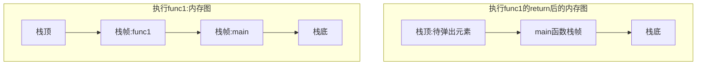
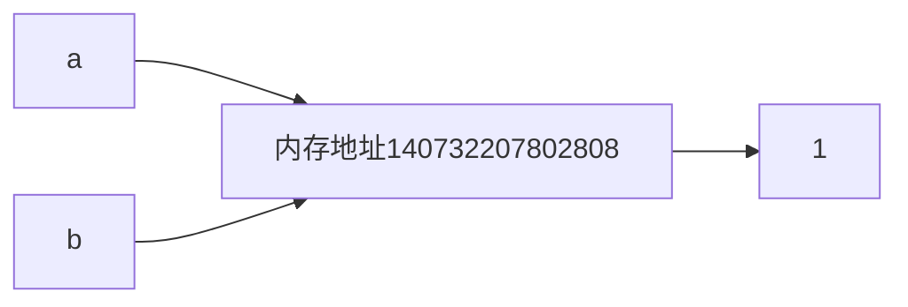
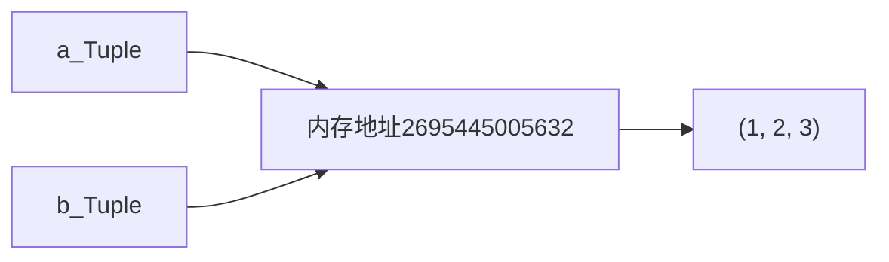
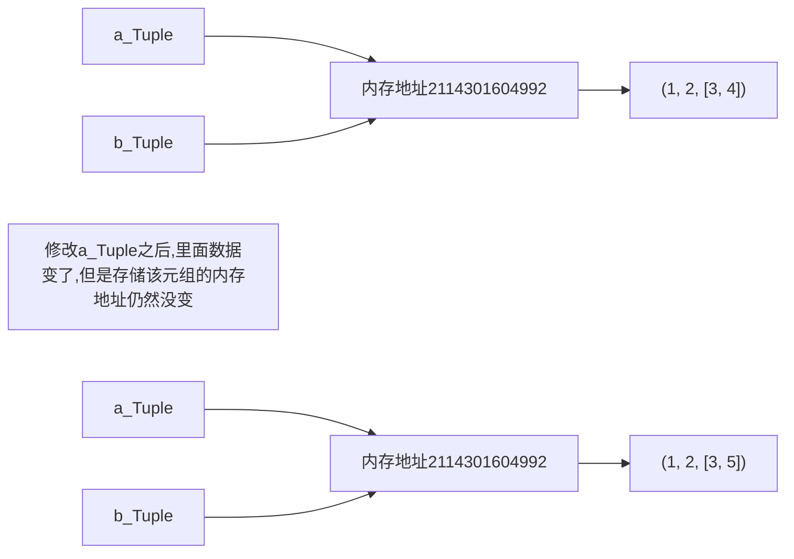
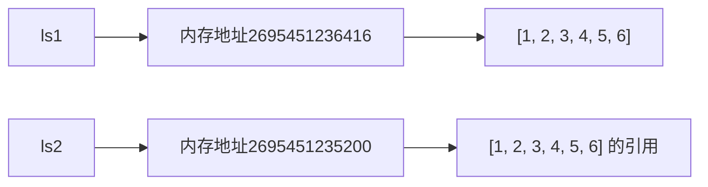
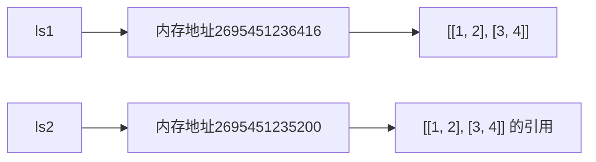
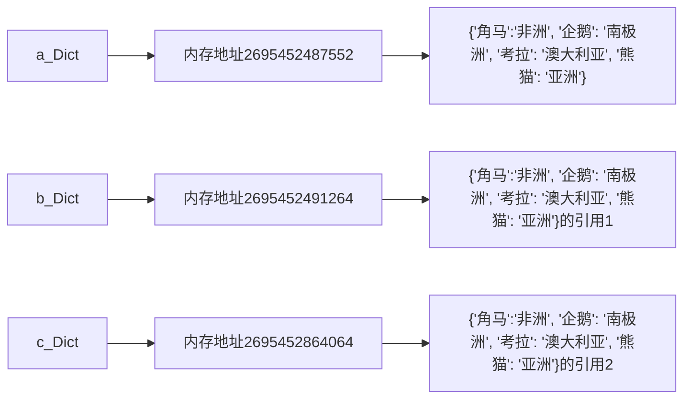
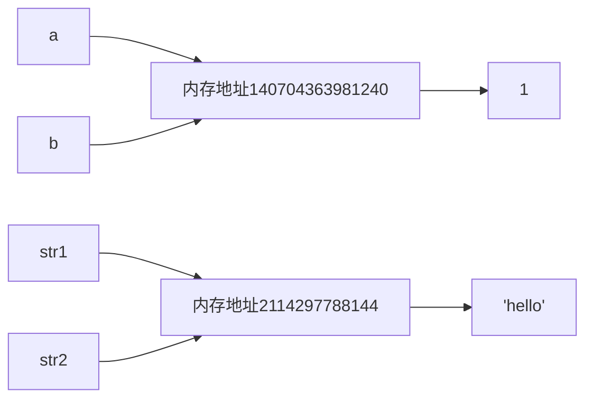
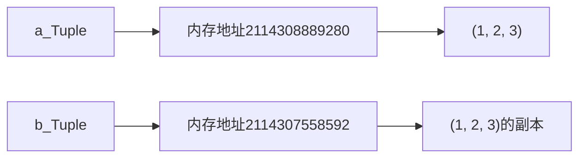
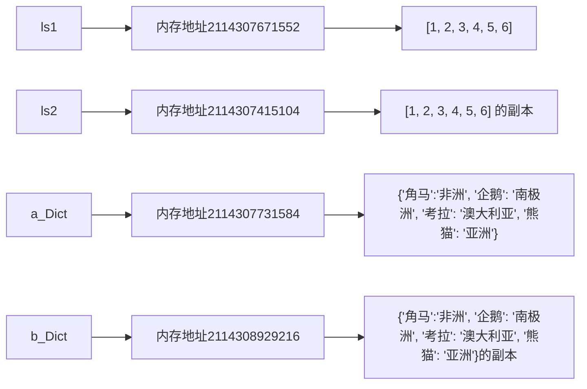

# Python：解释型语言


## 【前言】开发环境搭建

**1、本地：anacoda + pycharm**

anaconda下载官网：https://www.anaconda.com/download

pycharm下载官网：https://www.jetbrains.com/pycharm/ 

**下载anaconda后，自动有Python，且有其他功能**

**（1）、环境管理：**轻松创建、切换和管理多个独立的Python环境（如不同项目依赖不同版本库）

**（2）、预装科学计算包：**自带250+常用数据科学库（如Numpy、Pandas、Matplotlib），无需手动安装

**（3）、跨平台支持：**Windows、macOS、Linux均可使用

**（4）、依赖解决：**conda 工具能自动解决包之间的依赖冲突 	conda install 包名

**（5）、集成工具：**包含Jupyter Notebook、Spyder等开发工具，适合数据分析、机器学习


**pycharm：IDE（集成开发环境）：**写py代码不局限于在文本编辑器里编辑，集成环境提供了强大功能辅助代码编写+运行+测试。功能包括：代码提示，代码补全，运行代码等等。


**2、远程：google colab**

***google colab地址：https://colab.research.google.com/***

***google colab创建的notebook保存到了Google云盘（google drive）***

***google colab：connect，cell，创建一个新cell***


## 一、变量

**变量名命名规则：**

​		**只能字符 数字 下划线组成**

​		**变量名开头不能是数字 -->  语法错误**

​		**变量名包括 + - * / 等等，这些非下划线符号 --> 语法错误**


*%whos : 查看当前notebook里，所有定义的变量名，以及它对应的数据的值和类型*

*type() : 查看数据的数据类型*


**# 数值运算**

加减乘除、幂运算

*计算机存小数（IEEE 754），不能看成数学的小数，做小数运算会存在误差*

运算符重载：同一个运算符在不同数据类型下有不同的定义


## 二、数据类型

**Number、Boolean、String、List、Tuple、Dictionary、Set**

**不可变数据类型：Number、Boolean、String、Tuple**

**可变数据类型：List、Dictionary、Set**


**==str.isdigit()==**

​	**如果字符串中的所有字符都是数字，并且至少有一个字符，返回`True`，否则返回`False`。数字包括十进制字符和需要特殊处理的数字，如兼容性上标数字。这包括了不能用来组成10进制数的数字。严格的讲，数字是指属性值为Numeric_Type=Digit或Numeric_Type=Decimal的字符。**


例子：

```python
# 接收输入的一行字符，统计出字符串中包含数字的个数
a = input("请输入")
count = 0   #记录数字的次数
for i in a:
    if i.isdigit():
        count += 1
print(count)
```


## 三、列表

**列表：存放一系列数据，数据可以是任何类型**


**==list([*iterable*])==**

​	**可以用多种方式构建列表：**

- **使用一对方括号来表示空列表`[]`**
- **使用方括号，其中的项以逗号分隔`[a]`,`[a, b, c]`**
- **使用列表推导式`[x for i in iterable]`**
- **使用类型的构造器：`list()`或`list(iterable)`**


**构造器将构造一个列表，其中的项与*iterable*中的项具有相同的值与顺序。*iterable*可以是序列、支持迭代的容器或其他可迭代对象。如果*iterable*已经是一个列表，将创建并返回其副本，类似于`iterable[:]`。例如，`list['abc']`返回`['a', 'b', 'c']`而`list((1, 2, 3))`返回`[1, 2, 3]`。如果没有给出参数，构造器将创建一个空列表。**


### 1、列表运算

 **in/not in运算：查询某个元素在不在此列表里**

**+ 运算：两个列表进行拼接**

**`*`运算：乘几，一个列表就复制几次 **

```python
aList = [1, 2, 3, 4, 5]
bList = [4, 5, 6]
1 in aList				#TRUE
1 not in aList			#FALSE
aList + bList			#[1, 2, 3, 4, 5, 4, 5, 6]
aList * 2				#[1, 2, 3, 4, 5, 1, 2, 3, 4, 5]
```


### 2、列表方法

​	**==sort(key=None, reverse = False)==**

​			**此方法会对列表进行原地排序，只使用 `<`号进行排序**

​			**①key ：**

​					**指定列表中比较的内容(key)是什么，例如每一项的长度，用`key = len`，则这个对于列表中的每一项都会计算此项的长度，**

​					**然后在通过计算出来的长度进行排序。默认值`None`表示对直接对列表项进行排序**

​			**②reverse：**

​					**布尔值，True 表示逆序排序， False 表示正序排序**


​	**==count(x)==**

​			**返回x在数组中的出现次数**


​	**==append(x)==**

​			**往数组末尾添加一个值为x的数据**

```pyt
print(aList.append(10))			#None
#append这个方法直接对aList做修改， append本身不会有额外的返回结果， 所以为None
```


​	**==insert(i, x)==**

​			**在数组的位置 i 之前插入一个值为x的新项。负值被视为相对于数组末尾的位置。**


​	**==remove(x)==**

​			**从数组中移除第一个出现的x**

```python
#抽取列表中的整数数据并且进行排序(正序)
new_list_with_int_only = [x for x in aList if isinstance(element, int)]
new_list_with_int_only.sort()
```

​	**==pop([i])==**

​		**从数组中移除下标为 *i* 的项并将其返回。`i`默认值为 -1，因此默认移除并返回末项。**


## 四、元组

**通过`a = ()`去定义，甚至不用括号**

**+ 运算：两个元组进行拼接**

**`*`运算：乘几，一个元组就复制几次 **

**和列表的区别：列表可变，元组不可变**

​	**元组的不可变体现在：**

​			**1、没有那些对元组数据直接修改的方法，append,remove,insert，但是列表有**

​			**2、列表变量名[位置] = 新的值； 元组不支持左边的操作**

**元组的不可变用于，防止不小心把里面的元素修改的问题**

```python
#如果是一个元素的话，等价的是对应的赋值语句
a = (1)		#等价于a = 1
type(a)		#int

#如果想定义只有一个元素的元组，则加个逗号即可
a = (1, )
type(a)		#tuple
```


## 五、字典

**存储数据的一一对应关系，key—value pairs**

{} 字典， () 元组， []列表

```python
#初始化一个空的字典
D = dict()
D = {}
D['name'] = 'Frank'
D['ageRange'] = [20, 50]

D = {'name': 'Frank', 'ageRange': [20, 50]}

#修改值
D['name'] = 'TOM'
D['nameX'] = 'Harry'		#报错，因为nameX不在字典的键里

#查看字典所有的键
D.keys()

#查看字典所有的值
D.values()

#查看字典所有的键值对，结果是	列表形式，列表里的元素类型是元组， 元组长度为2，(key, value)
D.items()
```

### # 字典方法

**==dict.get(key, default=None)==**

​	**如果`key`存在于字典中，则返回key所对应的value，否则返回`default`。**

```python
#完成字符统计：给定字符串，计算每个letter的出现次数。遍历string字符，统计letter出现字数
letter_text = 'qwewssederrtuyiokjshdgaklsenfhd'
letterDict = {}
for i in letter_text:
    curCount = letterDict.get(i, 0)
    letterDict[i] = curCount + 1
    
letterDict
#以下为输出结果
{'q': 1,
 'w': 2,
 'e': 4,
 's': 4,
 'd': 3,
 'r': 2,
 't': 1,
 'u': 1,
 'y': 1,
 'i': 1,
 'o': 1,
 'k': 2,
 'j': 1,
 'h': 2,
 'g': 1,
 'a': 1,
 'l': 1,
 'n': 1,
 'f': 1}
```

**==dict.items()==**

​	**返回由字典项（（`key`, `value`）对）组成的一个新视图**

**==dict.keys()==**

​	**返回由字典键组成的一个新视图**

**==dict.values()==**

​	**返回由字典值组成的一个新视图**

​	**两个`dict.values()`视图之间的相等性比较将总是返回`False`。这在`dict.values()`与其自身比较时也同样适用：**

```python
>>> d = {'a': 1}
>>> d.values() == d.values()
False
```

*这里需要说明的一点是：**视图，也叫视图对象***

*由 [`dict.keys()`](#dict.keys), [`dict.values()`](#dict.values) 和 [`dict.items()`](#dict.items) 所返回的对象是 视图对象*

*该对象提供字典条目的一个动态视图，这意味着当字典改变时，视图也会相应改变。*

**==list(d)==**

​	**返回字典 d 中使用的所有键的列表**

**==len(d)==**

​	**返回字典 d 中的项数**

**==d[key]==**

​	**返回 d 中以key为键的值，如果不存在key则会引发KeyError**

**==d[key] = value==**

​	**将`d[key]`的值设为value**

**==key (not) in d==**

​	**如果 d 中存在(不存在)键 key 则返回 True，否则返回False**

**==pop(key[, default])==**

​	**如果 key 存在于字典中则将其移除并返回值，否则返回default。如果default未给出且 key 不存在于字典中，则会引发[KeyError][]**

**==popitem()==**

​	**从字典中移除并返回一个 `(键， 值)` 对。键值对会按 [LIFO][](先进后出) 的顺序被返回。若字典为空，调用 popitem() 将引发 [KeyError][]**

​	<span style="color: #30BB6A">在3.7版本发生变更：</span>**现在会确保采用 LIFO 顺序，在之前的版本中， popitem() 会返回一个任意的键值对**


## 六、分支与循环

### 1、条件分支

#### （1）if - else语句

​		可有零个或多个 [`elif`](../reference/compound_stmts.html#elif) 部分，[`else`](../reference/compound_stmts.html#else) 部分也是可选的。关键字 '`elif`' 是 'else if' 的缩写，用于避免过多的缩进。`if` ... `elif` ... `elif` ... 序列可以当作其它语言中 `switch` 或 `case` 语句的替代品。

​		`if`语句的判断条件是布尔值，即 True 和 False。

​		注意：冒号不要忽略，语句块内要有缩进

```python
x = int(input("Please enter an integer: "))
if x < 0:
    print('负数')
elif x == 0:
    print('Zero')
elif x == 1:
    print('Single')
else:
    print('More')
```


#### （2）match语句 *python3.10*

​		**`match`语句接受一个表达式并把它的值与一个或多个`case`块给出的一系列模式进行比较。**

​		**只有第一个匹配的模式会被执行，并且它还可以提取值的组成部分（序列的元素或对象的属性）赋给变量。**


**# match基础用法**

​		*最简单的形式是将一个主语值（如：status）与一个或多个字面值进行比较：*

```python
match status:
    case 400:
        return "Bad request"
    case 401 | 403 | 404:
        return "Not allowed"
    case 418:
        return "I'm a teapot"			#反爬虫机制触发
    case _:								#通配符
        return "Someting's wrong with the internet"
```

​		*注意最后一个代码块：变量名`_`被作为通配符并表示必定会匹配成功。如果没有case匹配成功，则不会执行任何分支。*


**# match元组**

```python
# point 是一个 (x, y) 元组
match point:
    case (0, 0):
        print("Origin")
    case (0, y):
        print(f"Y = {y}")
    case (x, 0):
        print(f"X = {x}")
    case (x, y):
        print(f"X = {x}, Y = {y}")
    case _:
        raise ValueError("Not a point")		#抛出异常
```

**第一个模式（0， 0）有两个字面值；接下来的两个模式（x, 0）(0, y)结合了一个字面值和一个变量，变量 *绑定*了来自主语`point`的一个值；第四个模式捕获了两个值，使其在概念上与[解包赋值][]`(x, y) = point`类似**

**[解包赋值][]**：在Python中，解包赋值是一种将可迭代对象（如列表、元组、字符串等）的元素拆分并赋值给多个变量的便捷方式。它通过`=`左侧的变量模式匹配到右侧的可迭代对象来实现。


**# match列表**

```python
match items:
    case [x, y]:
        print(f"2个元素{x}和{y}")
    case [x, y, z]:
    	print(f"3个元素{x},{y},{z}")
    case [x, *rest]:						 #这个匹配至少含一项的序列，不比绑定剩余的项
        print(f"第一个元素{x}, 剩余列表{rest}")
    case []:
        print("空列表list")
    case _:
        print("不是列表")
```

***`*rest`： 这里可以跟任意长度的列表；长度大于或者等于1的列表；`*`表示把列表给摊开了***


**# match字典**

```python
# match字典
data = {"type": "text", "content": "Hello!"}
data = {"type": "image", "url": "pic.jpg"}
data = {"type": "video", "duration": 30}
match data:
    case {"type": "text", "content": content}:
    	print(f"文本内容{content}")
    case {"type": "image", "url": url}:
    	print(f"图片URL{url}")
    case {"type": "video", "duration": duration}:
    	print(f"video时长{duration}")
    case {"type": type_value}:
        print(f"未知类型：{type_value}")
    case _:
        print(f"内容不符合格式")
```


**# match + if :  不常用**

```python
match score:
    case score if score >= 90:
        print('A')
    case score if score >= 80:
        print('B')
    case score if score >= 70:
        print('C')
    case score if score >= 60:
        print('D')   
    case _:
        print('F')    
     
```


### 2、循环

#### （1）while语句

**`while`语句用于在表达式保持为真的情况下重复执行**

**作用：执行重复代码逻辑，由计算机记录次数，什么时候结束**

*以下是while循环的伪代码*

```python
循环嵌套中不同缩进会导致执行结果有差异
while 外层循环:
	while 内层循环:
		 语句...1
         语句...n
         和此语句块对齐的语句，外层和内层循环均会执行
    和内层while循环对齐的语句，只有外层循环会执行
和外层while循环对齐的语句，不会被循环执行
```


***编写循环条件退出的条件是最重要的部分，因为如果循环不退出，会持续占用CPU的内存空间，直到死机***

*以下是几种循环退出的情况*

*a. 循环结束，正常退出*

*b. 执行出错，异常退出*

```python
while True:
    1 + '1'
    print('循环在执行')

#以下是报错信息
TypeError: unsupported operand type(s) for +: 'int' and 'str'
```


*c. 使用标志退出（标志位）*

```python
flag = True
while flag:
    user_input = input("请输入")
    if user_input == 'a':
        flag = False			#即用户输入a字符结束
```


*d. 使用break，continue语句退出*

*e. 条件不满足，不执行循环  例如 while False*

*f. 死循环，不退出 while True:  一直执行，直到循环内有break*


#### （2）for循环

​	**for循环强调遍历；遍历：给一个列表， 元组， 集合，字符串， 字典，对这些数据集里的每一个元素进行操作**

​	**基本格式：for 循环变量（变量名自定，遵从命名规则） in 序列（可遍历对象/列表）:**


​	**`for`循环遍历 序列 **

```python
#下面以列表为例
>>> friends = ['wilson', 'monica', 'john', 'wang']

for elem in friends:
    print(elem.capitalize(), end=' ')	#将列表里的元素首字母大写 输出
    print(elem.upper())			#将列表里的元素都转成大写 输出
  
#输出结果如下
Wilson WILSON
Monica MONICA
John JOHN
Wang WANG
```


**`for`循环遍历 字典**

```python
movie1 = {"name":"Friends", "language":"En", "Sessions":10, "Other name": "Six of One"}
#遍历键值对
for item in movie1.items():
    print(item[0], item[1])

for k, v in movie1.items():
    print(k, v)

#仅对字典的键进行遍历
for k in movie1.keys():
    print(k)

#这里需要强调的是，movie1 和 movie.keys() 是等价的
#也就是上述循环等价于
for k in movie1:
    print(k)

#仅对字典的值进行遍历
for v in movie1.values():
    print(v)
```


**<span style="color: #cc0033">有一个这样的需求：遍历 序列 的时候不仅仅想取序列里的元素值，而且还想知道元素值在序列里的位置</span>**

**解决这个需求：使用  ==enumerate(iterable, start = 0)==  函数**

```python
#对列表进行操作，enumerate生成的是一个二元组（pos， data）
friends = ['wilson', 'monica', 'john', 'wang']

list = []
for x in enumerate(friends):
    list.append(x)
print(list)

#以列表的形式返回
[(0, 'wilson'), (1, 'monica'), (2, 'john'), (3, 'wang')]

>>> for i, enumx in enumerate(friends):
    	print(f"第{i}个位置是{enumx}")
        
第0个位置是wilson
第1个位置是monica
第2个位置是john
第3个位置是wang


#对字典进行操作
#若enumerate的参数传的是 movie.items()，则enumerate生成的是一个嵌套的二元组(pos, (k, v))
#%%
movie1 = {"name":"Friends", "language":"En", "Sessions":10, "Other name": "Six of One"}

ls = []
for enumx in enumerate(movie1.items()):
    ls.append(enumx)
print(ls)
执行结果 --> [(0, ('name', 'Friends')), (1, ('language', 'En')), (2, ('Sessions', 10)), (3, ('Other name', 'Six of One'))]


#若enumerate的参数传的是 movie（等价于movie.key()），则enumerate生成的是一个的二元组(pos, k)
ls = []
for enumx in enumerate(movie1):
    ls.append(enumx)
print(ls)

执行结果 --> [(0, 'name'), (1, 'language'), (2, 'Sessions'), (3, 'Other name')]

#若enumerate的参数传的是 movie.values()，则enumerate生成的是一个的二元组(pos, v)
ls = []
for enumx in enumerate(movie1.values()):
    ls.append(enumx)
print(ls)

执行结果 --> [(0, 'Friends'), (1, 'En'), (2, 10), (3, 'Six of One')]
```


#### （3） 使用for循环实现推导式 ####

推导式的作用：**从一个序列构造另一个序列**

推导式能生成常见的数据类型：列表，字典，元组(生成元组时需要加 `tuple()`)

**推导式的格式：**

```python
expression for expr in sequence1
		   for expr2 in sequence2 ...
    	   for exprN in sequenceN
           if condition
            
#等价于以下代码
for expr1 in sequence1:
    for expr2 in sequence2:
        ...
        for exprN in sequenceN:
            if(condition):
                #将表达式的值添加到
                #结果列表中
```

**上述迭代的序列（sequence）不必具有相同的长度，因为它们不是并行迭代的，而是从左到右依次迭代。**

**最后的`if`子句是可选的；如果存在，只有当condition为真时，表达式才会被求值并添加到结果中**

**这意味着当有多个 for 循环子句时，生成的列表将等于所有序列长的乘积。**

```python
seq1 = 'abc'
seq2 = (1, 2, 3)
>>> [(x, y) for x in seq1 for y in seq2]			#如果表达式创建的是一个元组的话，必须用括号括起来       
[('a', 1), ('a', 2), ('a', 3), ('b', 1), ('b', 2), ('b', 3), ('c', 1),('c', 2), ('c', 3)]		#3x3=9
```


**以下是推导式的几个例子**

```python
# data for data in range(4) 是一个生成器对象generator
>>> type(data for data in range(4))
generator
-------------------------------------------------------------------------------

>>> list1 = [i for i in range(4)]

#等价于
list1 = []
for i in range(4):
    list1.append(i)


>>> ls2 = [i*i for i in range(1, 5) if i > 2]

#等价于
ls2 = []
for i in range(1, 5):
    if i > 2:
        ls2.append(i * i)
        

# 使用两个 'for' 来展平嵌套的列表
>>> vec = [[1,2,3], [4,5,6], [7,8,9]]
>>> [num for elem in vec for num in elem]
[1, 2, 3, 4, 5, 6, 7, 8, 9]

#列表推导式可以使用复杂的表达式和嵌套函数：
>>> from math import pi
>>> [str(round(pi, i)) for i in range(1, 6)]
['3.1', '3.14', '3.142', '3.1416', '3.14159']

---------------------------------------------------------------------
#以下是嵌套的列表推导式实现
matrix = [
    [1, 2, 3, 4],
    [5, 6, 7, 8],
    [9, 10, 11, 12],
]

#实现矩阵转置(使用zip函数也可以实现矩阵的转置)
>>> ls = [[row[i] for row in matrix] for i in range(4) ]
[[1, 5, 9], [2, 6, 10], [3, 7, 11], [4, 8, 12]]

#生成一个5x6的矩阵，矩阵内的元素取1-50的随机数
>>> import random
>>> ls = [[random.randint(1, 50) for column in range(6)] for row in range(5)]
[[26, 17, 9, 28, 33, 32],
 [33, 25, 17, 42, 6, 42],
 [32, 12, 42, 37, 33, 17],
 [2, 41, 8, 25, 39, 1],
 [33, 9, 15, 9, 18, 26]]
```


### #、 break 和 continue

**1、break 语句将跳出最近的一层 `for`或`while`循环：**

```python
for n in range(2, 10):
    for x in range(2, n):
        if n % x == 0:
            print(f"{n} = {x} * {n//x}")
            break
            
#以下是执行结果
4 = 2 * 2
6 = 2 * 3
8 = 2 * 4
9 = 3 * 3
```

**2、continue语句将继续执行循环的下一次迭代：**

```python
for num in range(2, 10):
    if num % 2 == 0:
        print(f"发现一个偶数：{num}")
        continue
    print(f"发现一个奇数：{num}")

#以下是执行结果
发现一个偶数：2
发现一个奇数：3
发现一个偶数：4
发现一个奇数：5
发现一个偶数：6
发现一个奇数：7
发现一个偶数：8
发现一个奇数：9
```


## 七、函数 ##

### 1、定义函数 ###

<span style='color: blue'>[引]</span>： *函数的用途：函数可以包装代码片段，能做到像内置函数那样，随时反复的使用，提高代码的重复利用率*

**定义函数的格式如下：**

```python
def 函数名(函数参数(可选)):
    函数里的代码1
    函数里的代码2
    return 返回值(可选)
```

**函数名：函数名的命名要求和变量名一致，*即1.只允许使用数字、字符、下划线 2.不能以数字开头 3.不能是关键字***

**函数参数：在调用函数时需要传入的不确定的变量**

**返回值：函数返回的一个值，可以为None，可以是整数等等。这里要注意的是：函数返回值和输出不是一回事**

**调用函数：通过`函数名()`调用；<span style = 'color: red'>函数定义并不会执行函数体，只有当函数被调用时才会执行此操作</span>**

**函数调用总是会给形参列表中列出的所有形参赋值，或是用位置参数，或是用关键字参数，或是用默认值**


### 2、函数参数 ###

#### （1）实参和形参 ####

```python
def func(形参列表):
    对形参进行操作
fun(实参列表)
```

**默认形参值会在执行函数定义时按从左至右的顺序被求值。**


#### （2）位置参数 ####

**需要传递多个参数时，最简单的方法是按顺序传递，这种基于顺序关联参数的方式，叫作位置参数**

```python
def foo(a1, a2, a3):
    print(a1)
    print(a2)
    print(a3)

>>> foo('one', 'two', 'three')
one
two
three

>>> foo('one', 'three', 'two')
one
three
two

>>> foo('one', 'two')
TypeError: foo() missing 1 required positional argument: 'a3'		#缺失一个位置参数

>>> foo('one', 'two', 'three', 'four')
TypeError: foo() takes 3 positional arguments but 4 were given		#期望3个参数，给了4个
```


#### （3）关键字参数和默认值 ####

**关键字参数需指定参数传递，可以脱离位置**

```python
def stu_learn(name, subject = 'Python', major = '计算机'):
    print(f"{name}正在学{subject}，专业是{major}")

#两次函数调用结果一样
>>> stu_learn('lisi', major='数学', subject='docker')
>>> stu_learn('lisi', subject='docker', major='数学')

lisi正在学docker，专业是数学
lisi正在学docker，专业是数学
```


**默认值：给定形参默认值，这样就可以在函数调用的时候省略相应的实参**

```python
def stu_learn(name, subject = 'Python'):
    print(f"{name}正在学{subject}")

>>> stu_learn('Tom')
Tom正在学Python

>>> stu_learn('张三', 'Java')
张三正在学Java
```


***<span style = 'color: red'>注意：</span>函数定义使用默认值时，必须在形式参数中先列出没有默认值的形参，再列出有默认值的形参，这样Python才能正常解读位置参数***

```python
#一旦开始在定义使用默认值，后面都得带有默认值
>>> def stu_learn(name, subject = 'Python', major = '计算机', age):
    	print(f"{name}正在学{subject}，专业是{major}")

SyntaxError: parameter without a default follows parameter with a default
```


#### （4）返回值 ####

**函数的返回值用`return`语句实现，如果不写return，或者return后面不跟内容，则默认返回None**

**返回值类型：return var、 return 列表 元组 字典、 return 字面值 、 return 函数调用**

**return语句可以将函数执行的结果赋值给变量，例如 `usr_input = input("请输入")`**


### 3.函数的特殊用法 ###

#### **（1）类型提示 *Python3.5*** ####

**类型提示只是对开发人员提示，不会真的做类型检查**

```python
def func(变量名:类型) -> 返回类型:
    return 数据(属于返回类型)

-------------------------------------------------------------------------
#对参数的指定类型测试
def stu_learn(name:str, age:int, height:float) -> str:
    return f"{name},年龄{age},身高{height}"

aCard = stu_learn('Tom', 18, 178.5)
bCard = stu_learn('Alex', 24.5, 180)			#虽然函数定义的时候指定age的类型是int，但只是形式上的
print(aCard)
print(bCard)

#执行结果
Tom,年龄18,身高178.5
Alex,年龄24.5,身高180

--------------------------------------------------------------------
#对函数返回值的指定类型测试
def stu_learn(name:str, age:int, height:float) -> str:
    print(f"{name},年龄{age},身高{height}")
    return None										#虽然指定了函数返回值的类型是str，但只是形式上的

stu_learn('Tom', 18, 178.5)
stu_learn('Alex', 24.5, 180)

#执行结果
Tom,年龄18,身高178.5
Alex,年龄24.5,身高180
```


#### （2）循环语句中定义 ####

**def是一个语句，这个语句是在执行的时候才发挥效果的，Python是一个动态的编程语言，不会预编译代码**

```python
#这里要说明的是pass和... 这两个符号等效，表示什么也不做，只是占位

x = int(input("请输入"))
if x < 2:
    def func():         #此时我们定义了一个函数，但它只有在条件成立时（x<2），才会被真正定义
        pass
else:
    def func():
        ...			#python3语法
```


#### （3）解包： `*`和`**` ####

**1、`*args`**

**这个正式参数将接受一个包含了多余位置参数的元组**

**如果存在`*args`这样的形式，它会被初始化为一个元组来接受任何额外的位置参数，默认为一个空元组**


**2、`**args`**

**这个正式参数将接受一个包含了多余关键字参数的字典，关键字 = 键， 值 = 与关键字对应的值**

**如果存在`**args`这样的形式，它会被初始化为一个新的字典来接受任何额外的关键字参数，默认为一个相同类型的空字典**


*<span style ='color: blue'>在`*`和`*args`之后的形参都是仅限关键字形参因而只能通过关键字参数传入。</span>*

*<span style='color: blue'>在"`/`"之前的形参都是仅限位置形参因而只能通过位置参数传入</span>*


```python
# *args 用法
def show_items(*items):
    print(type(items))
    print(items)

>>> show_items()
<class 'tuple'>
()


def show_items2(*args):
    for i in enumerate(args):
        print(i)

ls = ['a', 'b', 'c', 'd']

>>> show_items2(ls)
(0, ['a', 'b', 'c', 'd'])

# ‘*’ 将ls解包
>>> show_items2(*ls)
(0, 'a')
(1, 'b')
(2, 'c')
(3, 'd')


--------------------------------------------------------------------------------
#**kwargs 用法
def show_items(**items):
    print(type(items))
    print(items)

>>> show_items()
<class 'dict'>
{}


def show_dict_item(**kwargs):
    for k, v in kwargs.items():
        print(f"{k} : {v}")

movie1 = {"name":"Friends", "language":"En", "Sessions":10, "Other name": "Six of One"}

>>> show_dict_item(movie1)
TypeError: show_dict_item() takes 0 positional arguments but 1 was given
#这个错误意味着 ** 只能去传关键字参数

#这样传的话，关键字就是 字典中的key， 其所对应的值就是 字典中key所对应的value
>>> show_dict_item(movieName = 'Hello')
movieName : Hello

>>> show_dict_item(**movie1)
name : Friends
language : En
Sessions : 10
Other name : Six of One

-------------------------------------------------------------------------------------------
# '/' 用法
def my_divmod(a, b, /, c, d):
    print(c + d)
    return a // b, a % b


>>> my_divmod(5, 6, 1, 3)
4
(0, 5)


# 这个报错仅仅报错了'/'之前的参数a,b, 说明'/'之前仅限位置参数传递，在'/'后面可以使用任何参数
>>> my_divmod(a=5, b=6, c=1, d=3)
TypeError: my_divmod() got some positional-only arguments passed as keyword arguments: 'a, b'


#正确方法
>>> my_divmod(5, 6)
(0, 5)
```


#### （4）函数导入/模块导入 ####

**.py 文件就是python模块，当你需要使用到这个python模块中的函数的话，可以使用import导入**

```python
#导入整个模块并指定别名
import math	as mt
a = mt.sin(math.pi / 6)

>>> print(a)
0.49999999999999994		#IEEE754

#导入模块中特定的函数
from math import sin

```


#### （5）匿名函数 ####

匿名函数是借用`lambda`关键字（表达式），对函数进行定义和调用

lambda语法限制：主体只能是纯粹表达式，不能有while、try等python语句，  = 赋值也不能出现在lambda主体中


**==sorted(iterable, key=None,reverse=False)==**

​	**根据 *iterable* 中的项返回一个新的已排序列表。**

​	**具有两个可选参数，它们都必须指定为关键字参数。**

​	***key* 指定带有单个参数的函数，常配合匿名函数，用于从 *iterable*的每个元素中提取用于比较的键（例如`key=str.lower`），默认值为`None`（直接比较元素）。**

​	***reverse* 为一个布尔值。如果为`True`，则iterable中的元素按逆序排序**

​	**sorted()是一种稳定的排序算法实现，排序算法只使用`<`号在项目之间比较**


**==max( *iterable*, *key=None*)==**

**==max( *iterable*,  *default*, *key=None*)==**

**==max( *arg1, arg2, \*args, key=None*)==**

​	**返回可迭代对象中最大的元素，或者返回两个及以上实参中最大的。**

​	**如果只提供了一个位置参数，它必须是非空 *iterable*，返回可迭代对象中最大的元素；如果提供了两个及以上的位置参数，则返回最大的位置参数。**

​	**有两个可选只能用关键字的实参。*key*和*default***

- **key实参指定排序函数用的参数**
- **default实参是当可迭代对象为空时返回的值。如果可迭代对象为空，并且没有给出default，则会触发[ValueError][]**

​	**如果有多个最大参数，则此函数将返回第一个找到的。这和其他稳定排序工具如`sorted(iterable, key=keyfunc, reverse=True)[0]`和`heapq.nlargest(1, iterable, key=keyfunc)`保持一致**

​	<span style='color: green'>|	3.4版本：增加了default仅限关键字形参；3.8版本：key可以为`None`</span>


```python
add_1 = lambda x: x + 1
print(add_1(10))

#上面的一行相当于定义如下函数
def add_1(x):
    return x + 1
print(add_1(10))

--------------------------------------------------------------
#下面是具体实例

players = [
    ("詹姆斯", 28.9),
    ("库里", 30.1),
    ("杜兰特", 27.3),
    ("东77", 32.4)
]

#这里有一点需要说明的是：lambda后跟形参的`x`或`ele`，表示players(iterable)的每一项

# 1. 找得分最高的球员, max+lambda配合
>>> a = max(players, key=lambda x: x[1])
>>> print(a)
('东77', 32.4)

# 2. 球员得分从高到底排序, sorted+lambda配合
>>> bList = sorted(players, key=lambda ele: ele[1], reverse=True)
>>> print(bList)
[('东77', 32.4), ('库里', 30.1), ('詹姆斯', 28.9), ('杜兰特', 27.3)]


players = [
    ("詹姆斯", 28.9, 212),
    ("库里", 30.1, 195),
    ("杜兰特", 27.3, 204),
    ("东77", 32.4, 212)
]

#先按照年薪排序，再按照身高排序，即(x1, x2)
>>> sorted(players, key=lambda x: (x[1],x[2]), reverse=True)
[('东77', 32.4, 212), ('库里', 30.1, 195), ('詹姆斯', 28.9, 212), ('杜兰特', 27.3, 204)]
```


#### （6）函数调用的原理和递归 ####

##### 1、函数调用的原理 #####

**在函数内定义的变量是本地变量，只存在于当前定义的函数内**

<span style='color: red'>**每发生一次函数调用，内存的栈区会往下push一个独立的内存空间供当前函数使用，这个独立的内存空间叫作栈帧**</span>

```python
def func1(a, b):
    return a + b
```


***其内存结构图如图所示***




##### 2、函数递归实现 #####

***下面是阶乘的递归实现代码以及递归调用的动态图***

```python
#1! = 1
#2! = 2 x 1!=2x1
#3! = 3 x 2! = 3x2x1
#4! = 4 x 3! = 4x3x2x1
# ...
#n! = n * (n-1)!=nx(n-1)x(n-2)....x3x2x1
def factorial(n):
    if(n <= 1):						    #递归基
        return 1
    else:
        subSolution = factorial(n - 1)
        solution = subSolution * n
        return solution
```


**# <span style='color: blue'>无限递归的例子,会触发</span><span style='color: red'>RecursionError</span>**

例如：

```python
def infinite_recursion():
    return infinite_recursion()

>>> infinite_recursion()

RecursionError: maximum recursion depth exceeded

```

**<span style='color: red'>RecursionError: maximum recursion depth exceeded</span>**

* **递归错误，说明达到最大递归深度，也就是内存中存放函数的栈满了，达到maximum了**

* **每次递归调用消耗一个栈帧，最终导致 栈溢出（Stack Overflow）**

  *栈帧中存储：函数的返回地址，函数参数，局部变量，保存的寄存器值*


#### （7）浅拷贝与深拷贝 ####

**Python的赋值语句不复制对象，而是创建目标和对象的绑定关系。**

**对于自身可变，或包含可变项的集合，有时要生成副本用于改变操作，而不必改变原始对象。**


**==copy.copy(obj)==**

​	**返回obj的浅拷贝**

**==copy.deepcopy(obj[, memo])==**

​	**返回obj的深拷贝**

==**copy.replace**(obj,  /, **changes )==

​	**新建一个与obj类型相同的对象，使用来自changes的值替换字段**

*<span style= 'color: green;font-size: 20px'>| Added in version 3.13.</span>*


**<span style='color: red;font-size: 30px'>接下来的是重点，细看！！！</span>**

**1、浅拷贝与深拷贝的区别仅与复合对象（即包含列表或类的实例等其他对象的对象）相关：**

- ***浅拷贝* 构造一个新的复合对象，然后（在尽可能的范围内）将原始对象中找到的对象的 *引用* 插入其中**

- ***深拷贝*构造一个新的复合对象，然后，<span style='color: blue'>递归地</span>将在原始对象里找到对象的 *副本* 插入其中**

  

**2、深拷贝操作通常存在两个问题，而浅拷贝并不存在这些问题：**

- **递归对象（直接或间接包含对自身引用的复合对象）可能会导致递归循环**
- **由于深层复制会复制所有内容，因此可能会过多复制（例如本该在副本之间共享的数据）**


**[deepcopy( )][] 函数用以下方式避免了这些问题：**

- **保留在当前复制过程中已复制的对象的"备忘录"（`memo`）字典；以及**
- **允许用户定义的类重写复制操作或复制的组件集合**


**浅拷贝和深拷贝不会复制模块、方法、栈追踪、栈帧、文件、套接字、窗口以及任何相似的类型。**


*# 这里要说一个id函数，它与浅拷贝和深拷贝息息相关*

**==id(object)==**

​	**<span style='color: blue'>这是对象在内存中的地址</span>**

​	**返回对象的"标识值"。该值是一个整数，在此对象的生命周期中保证是唯一且恒定的。两个生命期不重叠的对象可能具有相同的[id()][]值**


*# 再来说一下数据类型的可变性，如下图所示*

| 数据类型                                                | 是否可变 |
| :------------------------------------------------------ | :------: |
| 整型                                                    |  不可变  |
| 字符串   <span style='color: blue'>**`str`**</span>     |  不可变  |
| 元组       <span style='color: blue'>**`tuple`**</span> |  不可变  |
| 列表       <span style='color: blue'>**`list`**</span>  |   可变   |
| 集合       <span style='color: blue'>**`set`**</span>   |   可变   |
| 字典       <span style='color: blue'>**`dict`**</span>  |   可变   |


##### 1、浅拷贝： #####

*下面是浅拷贝和浅拷贝的示意图*

<span style='color: red'>**浅拷贝的特点是：**</span>

- <span style='color: red'>**对于可变的数据类型：修改原数据，不会引起已经拷贝的数据变化。**</span>
- <span style='color: red'>**对于不可变的数据类型：重新赋值原数据，也不会引起已经拷贝的数据变化，但是原数据的内存地址会变化，也就是内存又重新为其开了一个内存空间去存新数据**</span>


**# 浅拷贝不可变类型，其拷贝前后的内存地址不变**

```python
import copy
-------------------------------------------------------------------------------------------
#浅拷贝一个字面量
-------------------------------------------------------------------------------------------
a = 1
b = copy.copy(a)						#对a进行浅拷贝
>>> print(id(a), id(b))
	print(a, b)
140732207802808 140732207802808				#内存地址一样，说明浅拷贝只是找到了原对象的引用
1 1


a = 2
>>> print(a, b)
>>> print(id(a), id(b))
2 1
140732207802840 140732207802808			#修改了a的值，b的值不会变，b还是指向原来1的内存空间，a又开辟了另一个内存空间

```




```py
--------------------------------------------------------------------------------------------
#浅拷贝一个元组
--------------------------------------------------------------------------------------------
a_Tuple = (1,2,3)
b_Tuple = copy.copy(a_Tuple)
>>> print(id(a_Tuple), id(b_Tuple))
2695445005632 2695445005632				#内存地址相同
```





*比较特别的例子：*

```python
-------------------------------------------------------------------------------------------------------
#浅拷贝一个嵌套元组
-------------------------------------------------------------------------------------------------------
import copy
a_Tuple = (1,2,[3, 4])
b_Tuple = copy.copy(a_Tuple)
>>> print(id(a_Tuple), id(b_Tuple))
2114301604992 2114301604992


a_Tuple[2][1] = 5
>>> print(a_Tuple)
	print(b_Tuple)
	print(id(a_Tuple), id(b_Tuple))
(1, 2, [3, 5])
(1, 2, [3, 5])
2114301604992 2114301604992
```





**# 浅拷贝可变类型**

```python
---------------------------------------------------------------------------------------------
#浅拷贝一个列表
--------------------------------------------------------------------------------------------
ls1 = [1, 2, 3, 4, 5, 6]
ls2 = copy.copy(ls1)
>>> print(id(ls1), id(ls2))
2695451236416 2695451235200				#浅拷贝对于可变类型，内存地址会发生改变

ls1.append(7)
>>> print(ls1)
>>> print(ls2)
[1, 2, 3, 4, 5, 6, 7]					#我修改ls1，不会修改ls2,因为是浅拷贝，仅仅通过对象的副本的引用来进行拷贝
[1, 2, 3, 4, 5, 6]

```





```python
-------------------------------------------------------------------------------------------------
#浅拷贝一个嵌套列表
-------------------------------------------------------------------------------------------------
ls = [[1, 2], [3, 4]]
ls_copy = copy.copy(ls)
>>> print(id(ls), id(ls_copy))
2695452746560 2695442342272				#浅拷贝对于可变类型，内存地址会发生改变

ls.append(5)
>>> print(ls)
	print(ls_copy)	
	print(id(ls), id(ls_copy))

[[1, 2], [3, 4], 5]						#我修改原ls，不会修改ls_copy,因为是浅拷贝
[[1, 2], [3, 4]]
2695452746560 2695442342272


```





```python
------------------------------------------------------------------------------------------------
#浅拷贝一个字典
----------------------------------------------------------------------------------------------
a_Dict = {'角马':'非洲', '企鹅': '南极洲', '考拉': '澳大利亚', '熊猫': '亚洲'}
b_Dict = copy.copy(a_Dict)
c_Dict = dict.copy(a_Dict)						#字典有自己的浅拷贝方法，等价于copy.copy()
>>> print(id(a_Dict), id(b_Dict), id(c_Dict))	#对于可变类型的浅拷贝，内存地址会发生改变
2695452487552 2695452491264 2695452864064


a_Dict['狮子'] = '美洲'
>>> print(a_Dict)
	print(b_Dict)
	print(c_Dict)
	print(id(a_Dict), id(b_Dict), id(c_Dict))

#这里可以看到的是，我修改a_Dict并不会改变b_Dict和c_Dict的数据，因为是浅拷贝

{'角马': '非洲', '企鹅': '南极洲', '考拉': '澳大利亚', '熊猫': '亚洲', '狮子': '美洲'}
{'角马': '非洲', '企鹅': '南极洲', '考拉': '澳大利亚', '熊猫': '亚洲'}
{'角马': '非洲', '企鹅': '南极洲', '考拉': '澳大利亚', '熊猫': '亚洲'}
2695452487552 2695452491264 2695452864064
```





##### 2、深拷贝 #####

<span style='color: red'>**深拷贝一般是会改变内存地址的，但数字和字符串除外**</span>


**# 深拷贝不可变类型**

```python
#深拷贝一个字面值,他与浅拷贝字面值完全一样
----------------------------------------------------------------------
a = 1
b = copy.deepcopy(a)
>>> print(a, b)
	print(id(a), id(b))
1 1
140704363981240 140704363981240

a = 2
>>> print(a, b)
	print(id(a), id(b))
2 1
140704363981272 140704363981240


#深拷贝一个字符串，两者的内存地址也不会变化
--------------------------------------------------------------------------
str1 = 'hello'
str2 = copy.deepcopy(str1)
>>> print(id(str1), id(str2))
2114297788144 2114297788144

```





```python
#深拷贝一个元组,两者内存地址不同
------------------------------------------------------------------------
a_Tuple = (1, 2, 3)
b_Tuple = copy.deepcopy(b_Tuple)
>>> print(id(a_Tuple), id(b_Tuple))
2114308889280 2114307558592
```





**# 深拷贝可变类型，其内存地址会发生变化，所以改变原来的数据，并不会影响到已经深拷贝过的数据**

```python
#深拷贝一个列表
----------------------------------------------------------------------------------
aList = [1, 2, 3, 4, 5, 6]
bList = copy.deepcopy(aList)
>>> print(id(aList),id(bList))
2114307671552 2114307415104

aList.append(7)
>>> print(aList)
	print(bList)
	print(id(aList),id(bList))
[1, 2, 3, 4, 5, 6, 7]
[1, 2, 3, 4, 5, 6]
2114307671552 2114307415104

#深拷贝一个字典
-------------------------------------------------------------------------------------
a_Dict = {'角马':'非洲', '企鹅': '南极洲', '考拉': '澳大利亚', '熊猫': '亚洲'}
b_Dict = copy.deepcopy(a_Dict)
>>> print(id(a_Dict), id(b_Dict))
2114307731584 2114308929216


a_Dict['狮子'] = '美洲'
>>> print(a_Dict)
	print(b_Dict)
	print(id(a_Dict), id(b_Dict))
{'角马': '非洲', '企鹅': '南极洲', '考拉': '澳大利亚', '熊猫': '亚洲', '狮子': '美洲'}
{'角马': '非洲', '企鹅': '南极洲', '考拉': '澳大利亚', '熊猫': '亚洲'}
2114307731584 2114308929216
```





#### （8）高阶函数（Higher-order Function） ####

**Python中，函数的地位和整数，字符串，列表，字典等数据一样，是一等对象**

***一等对象：***

- **运行时创建**
- **能赋值给变量** **或者** **赋值给数据结构（如列表，字典等）里的元素**

- **能作为参数传给函数**
- **能作为函数的返回值**


*# 函数作为一等对象的前两点的示例：*

```python
#函数赋值给变量
-----------------------------------------------------------------------
def func():
    print("Hello World")

#other保存的是func的地址
other = func			#讲一个函数赋值给变量时，实际上是将这个函数产生的对象地址保存到这个变量中
print(other)

#函数赋值给列表里的元素
---------------------------------------------------------------------
def fun():
    return 1

ls = [fun, fun]
>>> print(ls)
[<function fun at 0x000001EC46AB2200>, <function fun at 0x000001EC46AB2200>]
```


*# 函数作为一等对象的后两点示例：*

**这里引入一个高阶函数的概念：**

​	**高阶函数：即参数或（和）返回值为其他函数的函数。**


**==map(*function, iterable, \*iterable*)==**

​	**返回一个将 *function* 应用于 *iterable*的每一项，并产生其结果的迭代器。**

​	**如果传入了额外的 *iterables* 参数，则 *function*必须接受相同个数的参数并被用于到从所有可迭代对象中并行获取的项。**

​	**当有多个可迭代对象时，当最短的可迭代对象耗尽整个迭代将会停止。**


**==filter(*function, iterable*)==**

​	**使用iterable中function返回真值的元素构造一个迭代器。iterable可以是一个序列，一个支持迭代的容器或者一个迭代器。如果function为`None`，则会使用标识号函数，也就是说，iterable中所有具有假值的元素都将被移除。**

​	**请注意，`filter(function, iterable)`相当于一个生成器表达式，当function不是`None`的时候为`(item for item in iterable if function(item))`; function是`None`的时候为`(item for item in iterable if item)`**


```python
#map()函数里的iterable有几个，function里面必须有几个参数，以便它可以并行获取多个iterable的项
def sum_for_0_to_n(n, m):
    sum_n = 0
    sum_m = 0
    for i in range(n+1):
        sum_n = sum_n + i
    for i in range(m+1):
        sum_m = sum_m + i
    return sum_n, sum_m

ls1 = [1, 2, 3, 4, 5, 6, 7]
ls2 = [2, 3, 4, 5, 6, 7, 8]
>>> for i in map(sum_for_0_to_n, ls1, ls2):
	    print(i)
(1, 3)
(3, 6)
(6, 10)
(10, 15)
(15, 21)
(21, 28)
(28, 36)    


#当map()函数里的iterable有多个时，当最短的iterable中的对象耗尽时，迭代停止
ls1 = [1, 2, 3, 4, 5]
ls2 = [2, 3, 4, 5, 6, 7, 8]
>>> for i in map(sum_for_0_to_n, ls1, ls2):
    	print(i)
    
(1, 3)
(3, 6)
(6, 10)
(10, 15)
(15, 21)    


#例子：求0-9的中奇数的阶乘
def factorial(n):
    return 1 if n < 2 else n * factorial(n-1)

print(list(filter(lambda x: x%2, range(10))))		#产生0-9以内的奇数，filter作用与下一行的列表推导式作用完全等价
ls1 = [item for item in range(10) if item % 2]
print(ls1)

#使用map函数，将filter出来的结果一一调用factorial函数
#filter生成的序列为iterable,但其类型是filter
print(list(map(factorial, filter(lambda x: x%2, range(10)))))
filter(lambda x: x%2, range(10))

#运行结果如下
[1, 3, 5, 7, 9]
[1, 3, 5, 7, 9]
[1, 6, 120, 5040, 362880]
<filter at 0x1ec4656f970>
```


##### # functools 模块 #####

<span style='color: blue;'>***functools—— 高阶函数，以及可调用对象上的操作***</span>

​	***functools模块应用于高阶函数，通常来说，此模块的功能适用于所有可调用对象。***


**==reduce(*function*, *iterable*, [*initial*, ]/)==**

​	**将两个参数的 function 从左至右累积地应用到 iterable 的条目，以便将该可迭代对象缩减为单个值。**

​	**例如，`reduce(lambda x,y: x+y, [1, 2, 3, 4, 5])`就是计算`((((1+2)+3)+4)+5)`。左边的参数x是累积的值，而右边的参数y则是来自 iterable 的更新值。如果存在可选项 initial，它会被放在参与计算的可迭代对象的条目之前，并在可迭代对象为空时作为默认值。如果未给出 initial 并且 iterable 仅包含一个条目， 则将返回第一项。**


**其函数内部实现大致相当于以下**

```python
#reduce函数内部实现大致相当于以下的reduce1实现
initial_missing = object()

def reduce1(function, iterable, initial=initial_missing, /):
    it = iter(iterable)
    if initial is initial_missing:
        value = next(it)
    else:
        value = initial
    for element in it:
        value = function(value, element)
    return value


#下面是函数调用
----------------------------------------------------
def add_two_number(x,y):
    return x+y

ls = [1, 2, 3, 4, 5, 6]
result1 = reduce1(add_two_number, ls, 5)
result2 = reduce1(lambda x, y: x+y, ls)
print(result1)
print(result2)
26					#等价于(((((5+1)+2)+3)+4)+5),从5（initial）开始 
21					#等价于((((1+2)+3)+4)+5) = 21

import functools
result = functools.reduce(lambda x, y: x+y, ls)
print(result)		#((((1+2)+3)+4)+5) = 21
```


**reduce和operator模块中的函数结合使用**

```python
#把算数运算符当作函数使用
#1 加到 n 和 1乘到n 模式都一样 1 op 2 op ... op n
#通过函数式编程，去写这种模式
from functools import reduce
from operator import add, mul
def op_from_1_to_n(op, n):
    return reduce(op, range(1, n+1))

>>> print(op_from_1_to_n(add, 6))		#从1加到n
>>> print(op_from_1_to_n(mul, 6))		#从1乘到n
21
720
```


*这是operator模块的函数*

**==itemgetter(*item*)==**

**==itemgetter(*items*)==**

​	**返回一个使用操作数的[__getitem__()][]方法从操作数中获取 *item* 的可调用对象。如果指定了多个条目，则返回一个查找值的元组。**

**例如：**

- **在`f = itemgetter(2)`之后，调用`f(r)`将返回`r[2]`**
- **在`g = itemgetter(2, 5, 3)`之后，调用`g(r)`将返回`(r[2], r[5], r[3])`**


**等价于：**

```python
def itemgetter(*items):
    if len(items) == 1:
        item = items[0]
        def g(obj):
            return obj[item]
    else:
        def g(obj):
            return tuple(obj[item] for item in items)
    return g
```


**条目可以是操作数的[__getitem__()][]方法所接受的任何类型。字典接受任意的 *<span style='color: blue'>hashble</span>* 值。列表、元组和字符串接受索引或切片对象：**


**<span style='color: blue;font-size: 20px'>hashable——可哈希</span>**

​	**一个对象如果具有在其生命期内绝不改变的哈希值（它需要有[__hash__()][]方法），并可以同其他对象进行比较（它需要有[__eq__()][]方法）就被称为 *可哈希* 对象。可哈希对象必须具有相同的哈希值比较结果才会相等。**

​	**可哈希性使得对象能够作为字典键或集合成员使用，因为这些数据结构要在内部使用哈希值。**

​	**大多数Python中的不可变内置对象都是可哈希的；可变容器（例如列表和字典）都不可哈希；不可变容器（例如元组和frozenset）仅当它们的元素均为哈希时才是可哈希的。**

​	**用户定义类的实例对象默认时可哈希的，它们在比较时一定不相同（除非是与自己比较），它们的哈希值的生成是基于它们的[id()][]**


```python
>>> itemgetter(1)('ABCDEFG')
'B'
>>> itemgetter(1, 3, 5)('ABCDEFG')
('B', 'D', 'F')
>>> itemgetter(slice(2, None))('ABCDEFG')
'CDEFG'
>>> soldier = dict(rank='captain', name='dotterbart')
>>> itemgetter('rank')(soldier)
'captain'
```


**使用[itemgetter()][]从元组的记录中提取特定字段的例子：**

```python
fruits = [('apple', 3), ('banana', 2), ('pear', 5), ('orange', 1)]
getSpecious = itemgetter(0)						#获取水果的种类
getCount = itemgetter(1)						#获取每种水果的个数
>>> print(list(map(getSpecious, fruits)))
>>> print(list(map(getCount, fruits)))
['apple', 'banana', 'pear', 'orange']
[3, 2, 5, 1]

#根据数量进行排序
>>> sorted(fruits, key=getCount)
[('orange', 1), ('banana', 2), ('apple', 3), ('pear', 5)]
```


**==partial( *func, /, \*args, \*\*keywords*)==**

​	**返回一个新的部分对象，当被调用时其行为类似于 *func* 附带位置参数 *args* 和关键字参数 *keywords* 被调用。**

​	**如果为调用提供了更多的参数，它们会被附加到 *args*。如果提供了额外的关键字参数，它们会扩展并重写 *keywords*。**

​	**大致等价于：**

```python
def partial(func, /, *args, **keywords):
    def newfunc(*fargs, **fkeywords):
        newkeywords = {**keywords, **fkeywords}
        return func(*args, *fargs, **newkeywords)
    newfunc.func = func
    newfunc.args = args
    newfunc.keywords = keywords
    return newfunc
```


**[partial()][]会被“冻结了”一部分函数参数和/或关键字的部分函数应用所使用，从而得到一个具有简化签名的新对象。**

**例如，[partial()][]可用来创建一个行为类似于[int()][]函数的可调用对象，其中 *base* 参数默认为2**

```python
from functools import partial
basetwo = partial(int, base=2)
basetwo.__doc__ = '把二进制表示的字符串转成十进制的int类型'
basetwo('10011')

#输出结果为19，对应二进制的10011
19							#1 * (2**4) + 0 * (2**3) + 0*(2**2) + 1*(2**1) + 1*(2**0) = 19


----------------------------------------------------------------------------
#下面同理，把十六进制表示的字符串转换成十进制的int类型
basesixt = partial(int, base=16)
basesixt.__doc__ = 'Convert base 16 string to an int'
basesixt('ABC')

#十六进制的ABC对应十进制的2748
2748						#10 * (16**2) + 11*(16**1) + 12*(16**0) = 2748


-----------------------------------------------------------------------------
# 使用partial 来计算5000万年薪，打65场比赛和打30场比赛，平均一场比赛各多少钱
def salary_per_game(salary_million, games):
    return (salary_million * 1000000) / games

#普通方式
print("------普通方式-----------")
print(salary_per_game(50, 65))
print(salary_per_game(50, 30))
print()

print("------使用partial---------")
#现在有这样一个需求，假设每个球员的年薪是不变的，我想只传入一个比赛场数，就能获取到这个球员场均多少钱
#解决需求：使用partial优化，partial可以固定某个参数，例如5000万年薪
#所以我下面通过位置参数将50传到了函数salary_per_game的参数salary_million中，这样就固定了salary_per_game的第一个参数是50,也就是固定了每年5000万薪资
salary_5000_per_game = partial(salary_per_game, 50)

#上面我已经通过partial固定了5000万年薪了，现在只需要对新的函数传入一个比赛场数的参数就可以了
print(salary_5000_per_game(65))    # 5000万年薪，打65场比赛的年薪
print(salary_5000_per_game(30))   # 5000万年薪，打30场比赛的年薪

#运行结果如下，可以看出两次结果一样
------普通方式-----------
769230.7692307692
1666666.6666666667

------使用partial---------
769230.7692307692
1666666.6666666667

```


#### （9）装饰器与闭包 ####

##### **<span style='color: blue; font-size: 18px'>1、decorator——装饰器</span>** #####

​	**返回值为另一个函数的函数，通常使用`@wrapper`语法形式来进行函数变换。装饰器的常见例子包括[classmethod()][] 和 [staticmethod()][]**

​	**装饰器语法只是一种[语法糖][]，以下两个函数定义在语义上完全等价：**

```python
def f(arg):
    ...
f = staticmethod(f)

@staticmethod
def f(arg):
    ...
  
#f 名称最终会绑定 staticmethod(f) 返回的函数 —— 可能是原来名为 f 的函数，也可能是另一个函数
```

***<span style='color: #268DAB'>语法糖 是编程语言中一种简化代码书写的语法结构，它不会引入新功能，只是让代码变得简洁、易读。</span>***


*<span style='color: blue'>有关装饰器的详情可以在函数定义或者类定义里体现，下面只介绍函数定义，因为通常在类中很少使用</span>*

**函数定义是一条可执行语句。 它执行时会在当前局部命名空间中将函数名称绑定到一个函数对象（函数可执行代码的包装器）。 这个函数对象包含对当前全局命名空间的引用，作为函数被调用时所使用的全局命名空间。**

**函数定义并不会执行函数体；只有当函数被调用时才会执行此操作。**

**一个函数定义可以被一个或多个 [decorator]() 表达式所包装。 当函数被定义时将在包含该函数定义的作用域中对装饰器表达式求值。 求值结果必须是一个可调用对象，它会以该函数对象作为唯一参数被唤起。 其返回值将被绑定到函数名称而非函数对象。 多个装饰器会以嵌套方式被应用。 例如以下代码**

```python
@f1(arg)
@f2
def func(): pass
```


**大致等价于：**

```python
def func(): pass
func = f1(arg)(f2(func))
```

**不同之处在于原始函数并不会被临时绑定到名称`func`**


*<span style='color: blue'>下面来看一些具体的例子：</span>*

```python
def decorator(func):
    def inner():
        print("running inner")
    return inner

@decorator					#这行等价于 target = decorator(target), 其本质是语法糖
def target():
    print("running target")

target()
print("-----------------")

a = decorator(target)
a()

#下面是输出结果
running inner
-----------------
running inner
```


**装饰器的3个基本性质**

- **装饰器是一个函数 或者其他可调用的对象**
- **装饰器可以把被装饰的函数替换成别的函数**
- **装饰器在`import`模块时立即执行**


**装饰器的前两个性质上述例子已经体现，下面来看第三点**

```python
test.py文件
--------------------------------------------------------------------------------
def decorator(func):
    def inner():
        print("running inner")
    return inner

@decorator
def target():
    print("running target")

target()
print("-------------------")


test2.py文件
--------------------------------------------------------------------------------
import test
test.target()


#运行test2.py文件，结果如下
#这里可以看出，输出结果输出了两行，意味着调用了两次target方法，而实际上我只运行了test2.py文件，但该文件只有一行函数调用
#那就说明我import test的时候也调用了一次函数，返回到test.py文件中去看，发现target函数被装饰器修饰，而被装饰器修饰的函数在其他模块import时会立即执行，所以会出现两行target函数调用的结果
running inner
-------------------
running inner
```


##### 2、<span style='color: blue; font-size: 18px'>closure —— 闭包</span> #####

**闭包：**

​	**延伸了作用域的函数，函数（例如func）内不仅可以引用局部变量，也可以是来自包含func的外部函数的局部作用域的变量，这种变量既不是func的局部变量，也不是函数外的全局变量。**


**闭包变量——closure variable**

​	**引用自 嵌套作用域 的 自由变量，它是在外层作用域中定义而不是在运行时自全局或内置命名空间中取得。 可能使用 `nonlocal` 关键字显式地定义以允许写入访问，或者如果变量仅供读取则只需隐式地定义。**


**例如，在以下代码的 `inner` 函数中，`x` 和 `y` 均为自由变量，但只有 `x` 属于 *闭包变量*:**

```python
def outer():
    x = 0
    def inner():
        nonlocal x
        x += 1
        y = 0
        print(x)
    return inner
```


***<span style='color: #6600ff'>global：把某个变量设置为全局变量</span>***

***<span style='color: #6600ff'>nonlocal：把某个变量设置为非局部变量</span>***


**以下是关于闭包的示例代码：**

```python
def make_averager():
    series = []
    d1 = {}
    def averager(new_value):
        series.append(new_value)
        total = sum(series)
        d1[new_value] = total
        return total / len(series)
    return averager

avg = make_averager()
print("内部函数当前闭包的Tuple：")
print(avg.__closure__)
print("内部函数调用前闭包里面的值：")
print(avg.__closure__[0].cell_contents)
print(avg.__closure__[1].cell_contents)
print("内部函数调用：")
print(avg(10))
print(avg(11))
print(avg(12))
print("-----------内部函数调用前后分界线-------------------")
print(f"内部函数的自由变量：{avg.__code__.co_freevars}")
print(f"内部函数的局部变量：{avg.__code__.co_varnames}")
print("函数调用后闭包里面的值")
print(avg.__closure__[0].cell_contents)
print(avg.__closure__[1].cell_contents)


#运行结果如下
内部函数当前闭包的Tuple：
(<cell at 0x0000013AE6603BB0: dict object at 0x0000013AE4875080>, <cell at 0x0000013AE6603BE0: list object at 0x0000013AE4651140>)
内部函数调用前闭包里面的值：
{}
[]
内部函数调用：
10.0
10.5
11.0
-----------内部函数调用前后分界线-------------------
内部函数的自由变量：('d1', 'series')
内部函数的局部变量：('new_value', 'total')
函数调用后闭包里面的值
{10: 10, 11: 21, 12: 33}
[10, 11, 12]

```


```python
def make_averager():
    count = 0
    total = 0.0
    def averager(new_value):
        nonlocal count, total
        count += 1
        total += new_value
        return total / count
    return averager

avg = make_averager()
print("内部函数当前闭包的Tuple：")
print(avg.__closure__)
print("内部函数调用前闭包里面的值：")
print(avg.__closure__[0].cell_contents)
print(avg.__closure__[1].cell_contents)
print("内部函数调用：")
print(avg(1))
print(avg(2))
print(avg(3))
print("-----------内部函数调用前后分界线-------------------")
print(f"内部函数的自由变量：{avg.__code__.co_freevars}")
print(f"内部函数的局部变量：{avg.__code__.co_varnames}")
print("函数调用后闭包里面的值")
print(avg.__closure__[0].cell_contents)
print(avg.__closure__[1].cell_contents)


#以下是执行结果
内部函数当前闭包的Tuple：
(<cell at 0x000001A3E9023AC0: int object at 0x00007FFE979E2998>, <cell at 0x000001A3E9023AF0: float object at 0x000001A3E8D71590>)
内部函数调用前闭包里面的值：
0
0.0
内部函数调用：
1.0
1.5
2.0
-----------内部函数调用前后分界线-------------------
内部函数的自由变量：('count', 'total')
内部函数的局部变量：('new_value',)
函数调用后闭包里面的值
3
6.0


```


***上述两个案例的不同之处在于：***

- ***对于元组（tulpe）、字典（dict）、字符串（str），在其内部函数中可以读取到外部定义的数据（如series，d1）,并且将其当成自己的闭包变量，即在内部函数调用之前，闭包就已经存在，完全不需要`nonlocal`声明；而对于int，float，必须使用`nonlocal`声明相关变量不是局部变量，这个变量才会放在内部函数的闭包内***


##### 3、<span style='color: blue; font-size: 18px'>示例</span> #####

:arrow_right:*<span style='color: purple;font-size: 18px'>计时装饰器</span>*

***定义一个装饰器，该装饰器会在每次调用 被装饰的函数时 计时，把运行时间，传入的参数和调用的结果打印出来***

```python
import time
def clock(func):
    def wrapper(*args, **kwargs):
        t0 = time.perf_counter()
        result = func(*args, **kwargs)
        total_time = time.perf_counter() - t0
        name = func.__name__
        arg_str = ', '.join(str(arg) for arg in args)
        print(f'[{total_time:0.8f}s] {name} ({arg_str} -> {result})')
        return result
    return wrapper


#被装饰的函数
@clock
def factorial(n):
    return 1 if n < 2 else n * factorial(n-1)

>>> factorial(10)

#以下是运行结果
[0.00000030s] factorial (1 -> 1)
[0.00002170s] factorial (2 -> 2)
[0.00002800s] factorial (3 -> 6)
[0.00003230s] factorial (4 -> 24)
[0.00003630s] factorial (5 -> 120)
[0.00004030s] factorial (6 -> 720)
[0.00004440s] factorial (7 -> 5040)
[0.00004840s] factorial (8 -> 40320)
[0.00005270s] factorial (9 -> 362880)
[0.00005770s] factorial (10 -> 3628800)
```


:arrow_right:*<span style='color: purple;font-size: 18px'>模拟技能冷却：</span>*

​		**有的函数调用要冷却时间（比如放技能），在调用完成之后，不能马上调用，需要过了冷却时间后才能调用，用装饰器实现这个机制**

```python
# 提示：time.time()获取当前时间
#      需要记录函数上一次调用的时间 t0； 刚开始可以指定t0为0
#      当前时间 减去 t0 超过 自定的冷却时间，说明函数可以调用
#                 函数调用后，更新t0 （调用完成 更新上一次调用的时间）
#     当前时间 减去 t0 小于 自定的冷却时间，说明函数不能调用
#                打印个信息， 提示函数正在冷却

import time

def cool_down(func):
    t0 = 0                                          #最开始调用冷却函数的时间，默认为0
    def wrapper(*args, **kwargs):
        nonlocal t0
        cooldown_time = 3                           #冷却时间3s
        t1 = time.time()                            #当前调用函数的时间
        if t1 - t0 <= cooldown_time:
            print("技能正在冷却")
        else:
            func(*args, **kwargs)
            t0 = t1                    #如果冷却时间过了，更新cool_down函数开始的时间，此时时间已经是开始时间+冷却时间了（0+3）
    return wrapper


@cool_down                              #等价于func_with_cool_down = cool_down(func_with_cool_down)
def func_with_cool_down():
    print("放技能: 旋风斩")


# 模拟隔1秒，对函数发起一次调用
for _ in range(5):
    func_with_cool_down()
    time.sleep(1)
    
    
    
#输出结果如下，冷却时间为3s
放技能: 旋风斩
技能正在冷却
技能正在冷却
放技能: 旋风斩
技能正在冷却
```


:arrow_right:*<span style='color: purple;font-size: 18px'>参数化的装饰器：</span>*

​	**本质：装饰器的外面再包一层接受参数的函数**

:a:*<span style='color: blue;font-size: 18px'>一个简单的例子：</span>*

```python
def three_times(n):                                 #参数化的装饰器
    def decorator(func):
        def wrapper(*args, **kwargs):
            for i in range(n):                      #调用n次被装饰的函数
                func(*args, **kwargs)
        return wrapper
    return decorator


@three_times(5)
def say_hello():
    print("Hello Decorator")

say_hello()


#运行结果如下
Hello Decorator
Hello Decorator
Hello Decorator
Hello Decorator
Hello Decorator
```


:b:*<span style='color: blue;font-size: 18px'>模拟技能冷却（冷却时间通过参数传入）：</span>*

```python
#对比上一个模拟技能冷却的例子，它又多添加了一层装饰器
import time
def cool_down_seconds(seconds):
    def cool_down(func):
        t0 = 0                                          #最开始调用冷却函数的时间，默认为0
        def wrapper(*args, **kwargs):
            nonlocal t0
            cooldown_time = seconds                      #冷却时间通过参数传入
            t1 = time.time()                            #当前调用函数的时间
            if t1 - t0 <= cooldown_time:
                print("技能正在冷却")
            else:
                func(*args, **kwargs)
                t0 = t1                    #如果冷却时间过了，更新cool_down函数开始的时间，此时时间已经是开始时间+冷却时间了（0+seconds）
        return wrapper
    return cool_down

@cool_down_seconds(3)                         
def func_with_cool_down():
    print("放技能: 旋风斩")


# 模拟隔1秒，对函数发起一次调用
for _ in range(10):
    func_with_cool_down()
    time.sleep(1)
    

#运行结果如下，即冷却时间为3s，10秒内放技能3次
放技能: 旋风斩
技能正在冷却
技能正在冷却
放技能: 旋风斩
技能正在冷却
技能正在冷却
放技能: 旋风斩
技能正在冷却
技能正在冷却
放技能: 旋风斩
```


:arrow_right:*<span style='color: purple;font-size: 18px'>标准库（functools）中的装饰器：</span>*

:ab:*functools.cache(user_function)*

​	**简单轻量级未绑定函数缓存。**

​	**返回值与`lru_cache(maxsize=None)`相同，创建一个查找函数参数的字典的简单包装器。因为他不需要清除旧值，所以比带有大小限制的`lru_cache()`更小更快。**


```python
@cache					#cache装饰器，存到缓存中
def factorial(n):
    return n * factorial(n-1) if n else 1

>>> factorial(10)      # 不预先缓存结果，执行 11 次递归调用
3628800
>>> factorial(5)       # 只查找缓存结果值
120
>>> factorial(12)      # 执行两次新的递归调用，另外 10 次已缓存
479001600
```


**自定义缓存装饰器：**

```python
#自定义缓存装饰器
def my_cache(func):
    cache_dict = {}								#设一个字典，字典的键是n，值是函数返回值
    def wrapper(*args, **kwargs):
        arg = args[0]
        if arg in cache_dict.keys():
            return cache_dict[arg]				#这个里面要有返回语句，因为如果在字典中找到了，就不需要执行函数了
        result = func(arg)
        cache_dict[arg] = result
        return result
    return wrapper

@my_cache
def factorial(n):
    return n*factorial(n-1) if n>1 else 1
```


:ab:*functools.lru_cache(user_function)*

​	*functools.lru_cache(maxsize=128, typed=False)*

​	**maxsize：缓存最大容量**

​	**如果typed被设置为True，不同类型的函数参数将被分别缓存。如果typed为false，实现通常会将它们视为等价的调用，只缓存一个结果。**


**以下是使用缓存通过动态规划来计算斐波那契数列的例子：**

```python
@lru_cache(maxsize=None)
def fib(n):
    if n < 2:
        return n
    return fib(n-1) + fib(n-2)

>>> [fib(n) for n in range(16)]
[0, 1, 1, 2, 3, 5, 8, 13, 21, 34, 55, 89, 144, 233, 377, 610]

>>> fib.cache_info()
CacheInfo(hits=28, misses=16, maxsize=None, currsize=16)
```


:ab:*functools.wraps()*

​	**这是一个便捷函数，用于在定义包装器函数时唤起[update_wrapper()][]作为函数装饰器。**

**[update_wrapper()][]：更新一个 *包装器* 函数以使其与 *被包装的* 函数相似。**


示例

```python
from functools import wraps
def my_decorator(func):
    @wraps(func)
    def wrapper(*args, **kwargs):
        print("正在调用装饰函数")
        return func(*args, **kwargs)
    return wrapper

@my_decorator
def example():
    """被装饰的函数"""
    print("调用example函数")

>>> example()
正在调用装饰函数
调用example函数

>>> example.__doc__
'被装饰的函数'

>>> example.__name__
'example'
```

**<span style='color:red'>如果不使用这个装饰器工厂函数，则example函数的名称将变为`wrapper`，并且example()原本文档字符串将会丢失。</span>**


##### *<span style='color: blue;font-size: 18px'># 变量的作用域顺序：LEGB</span>* #####

​	**L = Local(局部作用域)， E = Enclosing(闭包作用域)， G = Global(全局作用域)，B = Built-in**

```python
x = '全局'
def outer():
    x = '闭包'
    def inner():
        x = '局部'
        print(x)			#查找顺序：局部-> 闭包 -> 全局 -> built-in
    inner()
outer()

```


#### （10）生成器函数与yield ####

<span style='color: purple;font-size: 20px'>*generator——生成器*</span>

​	**返回一个生成器迭代器的函数。它看起来很像普通函数，不同点在于其包含yield表达式以便产生一系列值供给for循环使用，或是通过[next()][]函数逐一获取。**

​	**生成器函数所创建的对象叫[generator iterator][](生成器迭代器)**


<span style='color: purple;font-size: 20px'>*yield表达式*</span>

​	**yield表达式在定义生成器函数或异步生成器函数才会用到，因此只能在函数定义的内部使用。在一个函数体内使用yield表达式会使这个函数变成一个生成器函数。**

​	<span style='color: green;font-size: 19px'>| Add in 3.8 version</span> ***禁止在实现推导式和生成器表达式的隐式嵌套作用域使用yield表达式。***

​	**当一个生成器函数被调用时，它将返回一个名为生成器的迭代器，然后这个生成器将控制生成器函数的执行。**


<span style='color: green;font-size: 19px'>| Add in 3.3 version：</span>***添加  `yield from <expr>`以委托控制流给一个子迭代器***

​	**当使用`yield from <expr>`时，所提供的表达式必须是一个可迭代对象，迭代该可迭代对象所产生的值会被直接传递给当前生成器方法的调用者。当迭代器完成时，会引发[StopIteration][]。**


**==next(*iterator*)==**

**==next(*iterator, default*)==**

​	**通过调用iterator的[__next__()][]方法获取下一个元素。如果迭代器耗尽，则返回给定的*default*，如果没有默认值，则触发[StopIteration][]**


**==generator.send(*value*)==**

​	**恢复执行并向生成器函数发送一个值，*value*参数将成为当前yield表达式的结果。[send()][]方法会返回生成器所产生的下一个值，或者如果生成器没有产生下一个值就退出则会引发[StopIteration][]。当调用[send()][]来启动生成器时，它必须以`None`作为调用参数，因为这时没有可接受值的yield表达式。**


示例：

```python
#生成n个数的生成器函数
def gen(n):
    yield from range(n)				#等价于 for i in range(n):
    								#		  yield i

num_n = gen(10)
next(num_n)			#挨个访问即可
...
next(num_n)			#第n+1个next，会触发StopIteration


#异常如下
StopIteration                             Traceback (most recent call last)
Cell In[36], line 1
----> 1 next(f)

StopIteration:
    
    

--------------------------------------------------------------------------
#无限生成随机数的迭代器
import random
def gen():
    while True:								#这里不会死循环，因为循环体内有yield，运行到yield函数会挂起
       yield random.randint(0, 100)


f = gen()									#调用函数
print("=================带有yield的函数的返回值类型===================")
print(f)									#函数返回的是一个generator，生成器
print("==============生成十个随机数==================")
for i in range(10):
    print(next(f), end=' ')					#使用next访问下一个generator的元素
    
    
#运行结果如下
=================带有yield的函数的返回值类型===================
<generator object gen at 0x0000019924C65A80>
==============生成十个随机数==================
96 63 99 85 20 21 53 15 8 37 


--------------------------------------------------------------------------
#持续接受send并返回累积的均值
def avg():
    total = 0
    count = 0
    while True:
        num = yield total / count if count > 0 else 0
        total += num
        count += 1

cal_avg = avg()                 #生成生成器对象
next(cal_avg)                   #启动生成器

print(cal_avg.send(10))			#第一次送10
print(cal_avg.send(20))			#第二次送20
print(cal_avg.send(30))			#第三次送30


#结果如下
10.0			#10
15.0			#(10 + 20)/2
20.0			#(10 + 20 + 30)/3
```


## 八、类和对象 ##

### 【前言】面向对象和面向过程 ###

- **面向对象：是一种基于对象和类的编程范式，它将程序的基本单元定义为对象，并通过类来组织这些对象。每个对象都包含属性和操作属性的方法，对象之间可以通过方法调用来交互。**

  

- **面向过程：是一种以过程（或函数）为核心的编程范式，它将程序视为一系列步骤的集合，每一步都通过函数或子程序完成。**


### 1、类的语法和使用方式 ###

**# 定义一个类、类的实例化、类的属性和方法**

```python
#类名首字母要大写，以便区分
class Student:
    #在类的实例化之后会自动运行双下划线init方法
    def __init__(self, sno: int, name: str):
        self.sno = sno						#sno为类Student的属性
        self.sname = name					#sname为类Student的属性

    def study(self):						#study叫做类的方法，在类中的函数叫方法
        print(f"学号为：{self.sno}, 名字为：{self.sname}的学生正在学习")

s1 = Student(101, 'Tom')				#类的实例化
s1.study()								#通过对象.方法名调用类里的方法
s2 = Student(101, 'Tom')
print(id(s1) == id(s2))					#False,这里可以看到，即使两个学生对象具有相同的sno和sname，它们在内存中仍然是两个不同的对象

#执行结果如下
学号为：101, 名字为：Tom的学生正在学习
False
```


**# 私有属性(两个下划线)、受保护的属性（一个下划线）、类属性**

```python
class Dog:

    specious = '犬类'					 #类属性，通过类名.变量名获取

    def __init__(self, name, age):
        self.__name = name				#私有属性name，防止外部直接修改属性值，只能通过setter、getter
        self._age = age					#受保护的属性age

    def show_info(self):
        print(f"狗的名字为{self.__name},年龄为：{self._age}岁,物种为：{Dog.specious}")

d1 = Dog("可乐", 2)
>>> d1.show_info()
狗的名字为可乐,年龄为：2岁,物种为：犬类

私有属性
--------------------------------------------------------------
#一般来说，私有属性对类外的修改和读取都不支持
print(d1.__name)							#AttributeError: 'Dog' object has no attribute 'name'
d1.__name = 'zzz'							#这个代码虽然执行时不报错，但是它并没有把名字改为zzz

#但是Python没有真正的私有机制，通过_类名__变量名还是可以访问到私有属性
>>> print(d1._Dog__name)
可乐


受保护的属性
-----------------------------------------------------------------------------
>>> print(d1._age)						#对于受保护的属性，Python不会强制保护，但按照惯例不建议类外部访问，子类可直接访问
2

d1._age = 5								#对于受保护的属性，Python还是可以修改


类属性：类属性被所有实例共享
-------------------------------------------------------------------------
>>> Dog.specious					#获取类属性,可以通过类名获取，也可以通过类的实例获取
>>> d1.specious
'犬类'
'犬类'

Dog.specious = '动物'					#修改类属性
```


### 2、类的继承 ###

**当一个类继承另一个类时，将自动获得父类的所有属性和方法，另外，子类还可以定义自己的属性和方法**

```python
基本格式 class 子类(父类1, 父类2):
    		...

        
单继承
----------------------------------------------------------------------
class Animal:
    def __init__(self, specious):
        self.specious = specious

    def show_method(self):
        print("父类方法")

    def show_info(self):
        ...

class Cat(Animal):
    def __init__(self, name):
        super().__init__('猫科')					#子类要先执行父类的init
        self.name = name

    def show_info(self):
        print(f"物种：{self.specious}, 名字：{self.name}")

c = Cat('小猫')
c.show_info()					#调用了子类重写的方法
c.show_method()					#通过子类对象调用了父类的方法
物种：猫科, 名字：小猫
父类方法


多继承：不推荐
--------------------------------------------------------------------------
class Vehicle:
    def __init__(self):
        print('交通工具')

    def show(self):
        print("我是交通工具")

class Car:
    def __init__(self):
        print("一般的车")

    def show(self):
        print("我是车")

class OilCar(Car, Vehicle):
    def __init__(self, name):
        super().__init__()
        self.name = name
        
#mro的顺序：调用方法的顺序首先查找当前类，然后从左往右顺序查找父类，再查找父类的父类，直到object
#可以看出：下面c1.show()之后，调用的是第一个Car内的show，而不是Vehicle的show
c1 = OilCar('benci')
c1.show()
print(OilCar.__mro__)				#通过类名.__mro__可以查看当前类继承的父类
一般的车
我是车
(<class '__main__.OilCar'>, <class '__main__.Car'>, <class '__main__.Vehicle'>, <class 'object'>)
```


### 3、类方法装饰器 ###

#### （1）@classmethod ####

​		**把一个方法封装成类方法。类方法隐含的第一个参数就是类，就像实例方法接受实例作为参数一样。要声明一个类方法，按惯例使用以下方案：**

```python
class C:
    @classmethod
    def f(cls, arg1, arg2): ...
```

*@classmethod 这样的形式称为函数的装饰器*

**类方法的调用可以在类上进行（例如`C.f()`），也可在实例上进行（例如`C().f()`）。其所属类以外的类实例会被忽略。如果类方法在其所属类的派生类上调用，则该派生类对象会被作为隐含的第一个参数被传入。**

**类方法与C++或Java中的静态方法不同。**


#### （2）@staticmethod ####

​		**将方法转换为静态方法。静态方法不会接收隐式的第一个参数。要声明一个静态方法，请使用此语法：**

```python
class C:
    @staticmethod
    def f(arg1, arg2, argN): ...
```

​		**静态方式既可以在类上调用（如`C.f()`），也可以在实例上调用（如`C().f()`）。此外，静态方法描述器也属于可调用对象，因而它们可以在类定义中使用（如`f()`）。**

​		**Python的静态方法与C++或Java类似。**

​		**像所有装饰器一样，也可以像常规函数一样调用`staticmethod`，并对其结果执行某些操作。比如某些情况下，需要从类主体引用函数并且希望避免自动转换为实例方法。对于这种情况，可以使用此语法：**

```python
def regular_function():
    ...
 
class C:
    method = staticmethod(regular_function)
```


#### （3）property装饰器 ####

*@property是一个语法糖*

**==property(*fget = None,  fset = None, fdel = None, doc = None*)==**

​	**返回property属性**

​	***fget* 是获取属性值的函数，*fset* 是用于设置值的函数， *fdel*是用于删除属性值的函数，*doc* 为属性对象创建文档字符串。**


**一个典型的用法是定义一个托管属性`x`：**

```python
class C:
    def __init__(self):
        self._x = None

    def getx(self):
        return self._x

    def setx(self, value):
        self._x = value

    def delx(self):
        del self._x

    x = property(getx, setx, delx, "I'm the 'x' property")
```

**如果c为C的实例，`c.x`将调用getter，`c.x = value`将调用setter，`del c.x`将调用deleter**


​		**如果给出 *doc* , 它的内容将成为该 property 属性的文档字符串。否则该property将拷贝 *fget* 的文档字符串（如果存在）。这令使用property()作为装饰器来创建只读的特征属性可以很容易实现：**

```python
class Parrot:
    def __init__(self):
        self._voltage = 10
    
    @property
    def voltage(self):
        """Get the current voltage."""
        return self,_voltage
```

​		***@property* 装饰器会将 voltage() 方法转换成一个具有相同名称的只读属性"getter"，并将 voltage 的文档字符串设为"Get the current voltage."**


***<span style='color: #368ABD'>@getter/@setter/@deleter</span>***

​		**特征属性对象具有`getter`,`setter`和`deleter`方法，它们可用作装饰器来创建该特征属性的副本，并将相应的访问函数设为所装饰的函数。例如：**

```python
class C:
    def __init__(self):
        self._x = None
    
    @property
    def x(self):
        """I'm the 'x' property."""
        return self._x
    
    @x.setter
    def x(self, value):
        self._x = value
    
    @x.deleter
    def x(self):
        del  self._x
```

**上述代码与第一个例子完全等价。<span style='color: red'>注意一定要给附加函数与原始的特征属性相同的名称（在本例中为`x`）</span>**

**返回的特征属性对象同样具有与构造器参数相对应的属性`fget`,`fset`和`fdel`。**


<span style='color: green;font-size: 18px'>*|    Add in version 3.5：特征属性对象的文档字符串现在是可写的。*</span>

<span style='color: green;font-size: 18px'>*|      Add in version 3.13：`__name__` ： 保存特征属性名称的属性。特征属性名称可在运行时被修改*</span>


**下面看一个具体例子：**

```python
# 只读属性->只定义@property，不写setter
# 依赖属性->@property+内部拼接逻辑
# 懒加载属性->@property+缓存变量


from datetime import datetime
from typing import Optional					#Optional的引入是为了类型可选

class Report:
    def __init__(self, title: str, content: str):
        self._title = title                             #标题
        self._content = content                         #内容
        self._created_at = datetime.now()               #创建时间
        self._html_cache: Optional[str] = None          #等价于str | None,表示html_cache的类型为str 或 None

    # ✅ 只读属性
    @property
    def created_at(self) -> datetime:
        return self._created_at

    # ✅ 标准 getter/setter 封装
    @property
    def title(self) -> str:
        return self._title

    @title.setter
    def title(self, value: str) -> None:
        if not value.strip():                               #strip()去空格
            raise ValueError("Title cannot be empty")
        self._title = value

    # ✅ 依赖属性（自动拼接）
    @property
    def summary(self) -> str:
        return f"{self._title} - {len(self._content)} chars"


    # ✅ 懒加载属性：首次访问才会计算和存储其值的属性
    #   之后访问直接返回缓存值，不会重复计算
    @property
    def content_html(self) -> str:
        if self._html_cache is None:
            print("[INFO] Generating HTML from content...")
            self._html_cache = self._render_html(self._content)
        return self._html_cache

    def _render_html(self, text: str) -> str:
        return f"<p>{text.replace('\n', '<br>')}</p>"

    
# 使用示例
r = Report("Monthly Report", "This is the content.\nIt spans multiple lines.")

print("Title:", r.title)
print("Created:", r.created_at)
print("Summary:", r.summary)

 # 懒加载触发
print("HTML:", r.content_html)              # 首次触发计算
print("HTML again:", r.content_html)        # 第二次直接用缓存


#运行结果如下
Title: Monthly Report
Created: 2025-05-25 15:18:42.033106
Summary: Monthly Report - 45 chars
[INFO] Generating HTML from content...
HTML: <p>This is the content.<br>It spans multiple lines.</p>
HTML again: <p>This is the content.<br>It spans multiple lines.</p>
```


### 4、多态和抽象类 ###

*面向对象编程三大特性：封装、继承、多态*

**多态是指同一操作作用于不同类的实例时，能表现出不同的行为。**


*<span style='color: blue;font-size: 20px'>duck-typing——鸭子类型</span>*

​	*指一种编程风格，它并不依靠查找对象类型来确定其是否具有正确的接口，而是直接调用或使用其方法或属性（"看起来像鸭子，叫起来也像鸭子，那么肯定就是鸭子。"）由于强调接口而非特定类型，设计良好的代码可以通过允许多态替代来提升灵活性。鸭子类型避免使用[type()][]或[isinstance()][]检测。但要注意鸭子类型可以使用抽象基类作为补充。*


*<span style='color: blue;font-size: 20px'>abstract base class——抽象基类</span>*

​	*抽象基类简称ABC，是对鸭子类型的补充，它提供了一种定义接口的新方式，相比之下其他技巧例如[hasattr()][]显得过于笨拙或有微妙错误。ABC引入了虚拟子类，这种类并非继承自其他类，但却仍能被[isinstance()][]和[issubclass()][]所认可；你可以使用 [abc][]模块来创建自己的ABC。*


***@abstractmethod：用于声明抽象方法的装饰器***

**当abstractmethod()与其他方法描述器配合应用时，它应当被应用为最内层的装饰器，如下列用法所示：**

```python
from abc import ABC, abstractmethod				#要先从abc模块中引入ABC和abstractmethod
class C(ABC):
    @abstractmethod
    def my_abstract_method(self, arg1):
        ...

    @classmethod
    @abstractmethod
    def my_abstract_classmethod(cls, arg2):
        ...

    @staticmethod
    @abstractmethod
    def my_abstract_staticmethod(arg3):
        ...

    @property
    @abstractmethod
    def my_abstract_property(self):
        ...

    @my_abstract_property.setter
    @abstractmethod
    def my_abstract_property(self, value):
        ...

    #getter
    @abstractmethod
    def _get_x(self):
        ...

    #setter
    @abstractmethod
    def _set_x(self, value):
        ...

    x = property(_get_x, _set_x)

```


### 5、双下划线方法(魔术方法) ###


#### *<span style='color: blue;font-size:20px'># 运算符重载</span>* ####

```python
	#self op(运算符) other 的运算
     __add__(self, other):         +
     __sub__(self, other):         -
     __mul__(self, other):         *
     __truediv__(self, other):     /
     __floordiv__(self, other):   //
     __mod__(self, other):         %
     __lshift__(self, other):     <<
     __rshift__(self, other):      >>


     # other op(运算符) self 的运算 
     #相应的运算函数前面加个r(right),列举几个其他同理
     __rsub__(self, other):        -
     __rmul__(self, other):        *
     __rtruediv__(self, other):    /
        
        
     #self op(运算符) other 的运算
     __iadd__(self, other):        +=
     __isub__(self, other):        -=
     __imul__(self, other):        *=
     __itruediv__(self, other):    /=
    
    #一元运算符
    __abs__(self)		abs()
    __neg__(self)		 -
    __invert__(self)	 ~
    __pos__(self)		 +
    
    #比较运算
    __eq__(self, other)  ==
    __ne__(self, other)  !=
    __lt__(self, other)	 <
    __le__(self, other)	 <=
    __gt__(self, other)	 >
    __ge__(self, other)  >=
```


**以下是运算符重载的实例：**

```python
import math
class Vector2D:

    def __init__(self, x:float, y:float):
        self.__x = x
        self.__y = y

    def length(self) -> float:
        """返回向量的模长"""
        return math.sqrt(self.__x ** 2 + self.__y ** 2)

    def normalize(self):
        """单位化向量"""
        unit_x = self.__x / self.length()
        unit_y = self.__y / self.length()
        return Vector2D(unit_x, unit_y)

    def __str__(self):
        """print的时候可以输出"""
        return f"({self.__x}, {self.__y})"

    def __add__(self, other):
        """加法 """
        add_x = self.__x + other.__x
        add_y = self.__y + other.__y
        return Vector2D(add_x, add_y)

    def __sub__(self, other):
        """向量减法"""
        diff_x = self.__x - other.__x
        diff_y = self.__y - other.__y

    def __mul__(self, value):
        """向量数乘，数在左边"""
        new_x = value * self.__x
        new_y = value * self.__y
        return Vector2D(new_x, new_y)

    def __rmul__(self, value):
        """向量数乘，数在右边"""
        new_x = value * self.__x
        new_y = value * self.__y
        return Vector2D(new_x, new_y)

    def __eq__(self, other) -> bool:
        """比较两个向量是否相等"""
        flag = (self.__x == other.__x) and (self.__y == other.__y)
        return flag


# 示例测试代码：
v1 = Vector2D(3.0, 4.0)
v2 = Vector2D(1.0, 2.0)

#以下的print(对象)可以输出对应值，是因为在类里面重写了有关print函数的__str__方法
print(v1 + v2)      # 输出: (4.0, 6.0)
print(v1 * 2)       # 输出: (6.0, 8.0)
print(2 * v1)       # 输出: (6.0, 8.0)
print(v1.length())  # 输出: 5.0
print(v1.normalize())		#输出：(0.6, 0.8)
print(v1 == Vector2D(3, 4))  # 输出: True
```


#### *<span style='color: blue;font-size:20px'># attr相关</span>* ####

**==\_\_getattribute\_\_(*self, name*)==             								<span style='color: red'>对应obj.name</span>**

​	**此方法会无条件被调用以实现对类实例属性的访问，如果类还定义了`__getattr__`方法，则`__getattr__`方法不会被调用，除非`__getattribute__`显式地调用它或是引发了[AttributeError][]。**

​	**此方法应当返回（找到的）属性值或者引发一个[AttributeError][]异常。另外，为了避免此方法中的无限递归，其实现应该总是调用具有相同名称的基类方法来访问它所需要的任何属性，例如`object.__getattribute__(self, name)`**


**==\_\_getattr\_\_(*self, name*)==**

​	**仅当类实例的属性不存在的时候会调用，做兜底处理或者动态生成属性**


**==\_\_setattr\_\_(*self, name, value*)== 									<span style='color: red'>对应obj.name = value</span>**

​	**此方法在一个属性被尝试赋值时被调用，name为属性名称，value为要赋给属性的值。**


**==\_\_delattr\_\_(*self, name*)==												<span style='color: red'>对应del obj.name</span>**

​	**删除类实例对象name属性**


```python
class C:
    def __init__(self, a, b):
        self.a = a
        self.b = b

    def __getattr__(self, item):
        return "default"

    def __getattribute__(self, item):
        return super().__getattribute__(item)

    def __setattr__(self, key, value):
        super().__setattr__(key, value)

    def __delattr__(self, item):
        super().__delattr__(item)


c = C(1, 2)
print(c.a)
print(c.x)
c.a = 5
print(c.a)
del c.a
print(c.a)


#运行结果如下
1						#走__getattribute__函数
default					#没有属性x，返回default
5						#说明set值成功
default					#删掉c.a之后，获取不到属性a的值，只能走兜底的__getattr__,返回default


-------------------------------------------------------------------------------------------------


class C:
    def __getattribute__(self, item):
        return self.__getattribute__(item)
 

#如果返回对象本身的getattribute,会导致无限递归，所以要调用基类的方法
---------------------------------------------------------------------------
RecursionError                            Traceback (most recent call last)
Cell In[43], line 20
     16         super().__delattr__(item)
     19 c = C(1, 2)
---> 20 print(c.a)
     21 print(c.x)
     22 c.a = 5

Cell In[43], line 10, in C.__getattribute__(self, item)
      9 def __getattribute__(self, item):
---> 10     return self.__getattribute__(item)

Cell In[43], line 10, in C.__getattribute__(self, item)
      9 def __getattribute__(self, item):
---> 10     return self.__getattribute__(item)

    [... skipping similar frames: C.__getattribute__ at line 10 (1489 times)]

Cell In[43], line 10, in C.__getattribute__(self, item)
      9 def __getattribute__(self, item):
---> 10     return self.__getattribute__(item)

RecursionError: maximum recursion depth exceeded
```


#### *<span style='color: blue;font-size:20px'># 其他</span>* ####

**==\_\_len\_\_(*self*)==												<span style='color: red'>对应len(obj)</span>**

​	**返回对象的长度，以一个`>=0`的整数表示，此外，如果一个对象未定义`__bool__`方法而其`__len__`方法返回值为零则它在布尔运算中将被视为具有假值。**


**==\_\_bool__(*self*)==												<span style='color: red'>对应bool(obj)</span>**

​	**返回`True`或`False`。**


**==__contains\_\_(*self, item*)==												<span style='color: red'>对应item in self</span>**

​	**调用此方法以实现成员检测运算符，如果item是self的成员则应该返回真，否则返回假。对于映射类型，此检测应基于映射的键而不是值或者键值对。**


**==\_\_getitem__(*self, key*)==												<span style='color: red'>对应self[key]，支持切片</span>**

​	**调用此方法以实现`self[key]`的求值。**


**==\_\_setitem__(*self, key, value*)==												<span style='color: red'>对应self[key] = value</span>**

​	**调用此方法以实现向`self[key]`赋值。为对象实现此方法应该仅限于需要映射允许基于键修改值或者添加键，或是序列允许元素被替换时。**


**==\_\_delitem__(*self, key*)==												<span style='color: red'>对应del self[key]</span>**

​	**调用此方法以实现`self[key]`的删除。**


**==\_\_iter__(self)==												<span style='color: red'>对应iter(self)，支持for和*解包</span>**

​	**此方法会在需要为一个容器（如dict，list，tuple，set等）创建 *iterator* 时被调用。此方法返回一个新的迭代器对象，他可以对容器中的所有对象执行迭代。对于映射，它应当对字典中的键执行迭代。**


**==iterator.\_\_next()__==												<span style='color: red'>对应next(iterator)</span>**

​	**iterator中返回下一项。如果没有可返回的项，会引发[StopIteration][]异常。**


**==\_\_repr__(*self*)==									<span style='color: red'>对于`__str__`来说，要优先实现此方法，对应repr(self)/print(self)/str(self)</span>**

​	**返回值必须是一个字符串对象。**


**==\_\_str__(*self*)==												<span style='color: red'>对应str(self)/print(self)</span>**

​	**返回值必须是一个字符串对象**


**下面是一个具体的例子：**

```python
import collections
from collections.abc import Sequence            #Sequence 只读序列的抽象基类
#定义一张卡片类
class Card:
    def __init__(self, rank, suit):
        self.rank = rank            #大小
        self.suit = suit            #花色

    def __repr__(self):
        return f"Card(rank={self.rank}, suit={self.suit})"


#定义牌组
class Poker:
    ranks = [i for i in range(2, 11)] + ['J', 'Q', 'K', 'A']
    suits = ['红桃', '方片', '黑桃', '梅花']

    def __init__(self):
        self._cards = [Card(rank, suit) for suit in self.suits for rank in self.ranks]

    def __getitem__(self, x):
        return self._cards[x]

    def __setitem__(self, key, value):
        self._cards[key] = value

    #获取扑克牌的长度
    def __len__(self):
        return len(self._cards)


# 使用自定义的扑克牌
deck = Poker()
print(deck[10])               # Card(rank='2', suit='spades')
deck[0] = Card('3', '方片')
print(deck[0])
print(deck[:3])              # 切片支持
print("---------------调用__len__方法------------------")
print(f"牌组的长度：{len(deck)}")             # 52
print("---------------调用__contains__方法------------------")
print(f"Card('Q', '红桃') in deck: {Card(rank='Q', suit='红桃') in deck}")  # True，触发 __contains__
print("---------------切片/for调用__getitem__方法,print调用Card类的__repr__方法------------------")
for card in deck[:5]:        # 触发 __iter__
    print(card)
    

#以下是执行结果
Card(rank=Q, suit=红桃)
Card(rank=3, suit=方片)
[Card(rank=3, suit=方片), Card(rank=3, suit=红桃), Card(rank=4, suit=红桃)]
---------------调用__len__方法------------------
牌组的长度：52
---------------调用__contains__方法------------------
Card('Q', '红桃') in deck: False
---------------切片/for调用__getitem__方法,print调用Card类的__repr__方法------------------
Card(rank=3, suit=方片)
Card(rank=3, suit=红桃)
Card(rank=4, suit=红桃)
Card(rank=5, suit=红桃)
Card(rank=6, suit=红桃)
```


### 6、类对象属性的获取、设置和判断 ###

**==getattr(*object, name*)==**

**==getattr(*object, name, default*)==**

​	***object*中指定名称的属性的值，name必须是字符串，如果该字符串是对象的某一属性的名称，则结果将为该属性的值，如`getattr(x, 'foobar')`相当于`x.foobar`，如果指定名称的属性不存在，则如果提供了default则返回该值，否则将引发[AttributeError][]。**


**==setattr(*object, name, value*)==**

​	**其参数为一个对象，一个字符串和一个任意值。字符串可以为某现有属性的名称，或者是新属性。只要对象允许，函数会将值赋给属性。如`setattr(x, 'foobar', 123)`等价于`x.foobar = 123`。**


**==hasattr(*object, name*)==**

​	**该实参是一个对象和一个字符串。如果字符串是对象的属性之一的名称，则返回`True`，否则返回`False`。（此功能是通过调用`getattr(object, name)`）看是否有[AttributeError][]实现的。**


**==delattr(*object, name*)==**

​	**其参数是一个对象和一个字符串。其中字符串必须是对象的某个属性的名称。该函数会删除指定的属性，如果对象允许这样做的话。例如，`delattr(x, 'foobar')`等价于`del x.foobar`。name不要求必须是Python标识符。**


下面是具体实例：

```python
class C:
    def __init__(self, a, b):
        self.a = a
        self.b = b

c = C(1, 2)
print(getattr(c, 'a'))
print(getattr(c, 's', 5))
print(c.b)
setattr(c, 'b', 6)
print(c.b)
print(hasattr(c, 'a'))
print(hasattr(c, 'x'))
```


### 7、类的特殊属性 ###

**==\_\_dict__==**

​	**返回一个关于类信息的字典**

**==\_\_name__==**

​	**返回类的名称**

**==\_\_doc__==**

​	**返回类的文档字符串，如果未定义则为`None`**

**==\_\_mro__==**

​	**返回类的继承关系**

**==\_\_subclasses__==**

​	**返回该类的子类**

**==\_\_class__==**

​	**返回对象所属的类**


以下是实例

```python
class C:
    """ 这是一个C类 """
    def __init__(self, a, b):
        """hhh"""
        self.a = a
        self.b = b

class A(C):
    ...

class B(A):
    ...

c = C(1, 2)
print(f"类C的字典：{C.__dict__}")
print(f"类C的名字：{C.__name__}")
print(f"类C所在的模块：{C.__module__}")
print(f"类C的说明文档：{C.__doc__}")
print(f"类C的直接子类：{C.__subclasses__()}")
print(f"对象c的字典：{c.__dict__}")
print(f"类B的继承关系：{B.__mro__}")


#执行结果如下
C的字典：{'__module__': '__main__', '__firstlineno__': 1, '__doc__': '这是一个C类 ', '__init__': <function C.__init__ at 0x0000027AA1359440>, '__static_attributes__': ('a', 'b'), '__dict__': <attribute '__dict__' of 'C' objects>, '__weakref__': <attribute '__weakref__' of 'C' objects>}
C的名字：C
C所在的模块：__main__
C的说明文档：这是一个C类 
C的直接子类：[<class '__main__.A'>]
对象c的字典：{'a': 1, 'b': 2}
B的继承关系：(<class '__main__.B'>, <class '__main__.A'>, <class '__main__.C'>, <class 'object'>)
```


#### **slots属性** ####

**==\_\_slots__==**

​	**`__slots__`允许我们显式地声明数据成员并禁止创建`__dict__`和`__weakref__`（弱引用）。**

​	<span style='color: red;font-size:19px'>*相比于使用  `__dict__`，使用  `__slot__`可以显著节省空间，并且属性的查找速度也可以得到显著的提升。*</span>


**举个例子并且看看它对继承的影响：**

```python
class Point:
    __slots__ = ('x', 'y')      #限定该类只有x和y属性

    def __init__(self, x, y):
        self.x = x
        self.y = y

#子类如果不定义__slots__，恢复原有的__dict__，这样就可以动态的添加属性
class Point3V(Point):
    ...

#子类如果定义__slots__，可以扩展父类的slots属性
class Point2(Point):
    __slots__ = ('z', )
    def __init__(self, x, y, z):
        super().__init__(x, y)
        self.z = z

        
p = Point(1, 2)
print(p.x, p.y)	#1, 2
print(p.__slots__)				#输出('x', 'y')
p.z = 5         #AttributeError: 'Point' object has no attribute 'z' and no __dict__ for setting new attributes
p1 = Point3V(1, 2)
p1.z = 6                    #因为子类Point3V没有自动实现slots属性，所以恢复原有的dict，可以动态添加属性
a = Point2(2, 3, 4)
print(a.__slots__)				#输出('z',)


#对于多重继承
class A:
    __slots__ = ('a', )

class B:
    __slots__ = ('b', )

class C(A, B):							#多重继承，限制只能有一个父类使用槽
    __slots__ = ('c', )
    
   
---------------------------------------------------------------------------
TypeError                                 Traceback (most recent call last)
Cell In[21], line 7
      4 class B:
      5     __slots__ = ('b', )
----> 7 class C(A, B):
      8     __slots__ = ('c', )

TypeError: multiple bases have instance lay-out conflict
```


### 8、元类和动态类 ###

​	元类是"类的类"，控制类的创建行为，所有类（包括内置类）都由元类实例化而来。

​	默认元类是`type`，可通过继承`type`自定义元类

​	动态类无需显示编写class定义，使用`type()`函数或元类直接创建


示例：

```python
#使用元类实现单例模式
class SingletonMeta(type):
    _instances = {}                     #类对象的字典

    #实例化类时触发
    def __call__(cls, *args, **kwargs):
        """创建类实例，调用类的__new__ + __init__"""
        print(f"[DEBUG] __call__ for class {cls.__name__}")
        # 如果该类已经有实例，则直接返回已有实例，否则创建新实例
        if cls not in cls._instances:
            print(f"[DEBUG] Creating new instance for {cls.__name__}")
            instance = super().__call__(*args, **kwargs)
            cls._instances[cls] = instance
        else:
            print(f"[DEBUG] Returning cached instance for {cls.__name__}")
        return cls._instances[cls]

    
# 使用上面元类的类，Config就变成了动态类
class Config(metaclass=SingletonMeta):  				# 此时使用上面的SingletonMeta，
    def __init__(self, env):
        self.env = env

# 测试
a = Config("dev")
b = Config("production")

print(a.env)  # dev
print(b.env)  # dev

print(a is b)  # True,可以看到，单例模式下，类对象值创建了一次


#运行结果如下
[DEBUG] __call__ for class Config					#调用类方法
[DEBUG] Creating new instance for Config			#第一次创建类实例
[DEBUG] __call__ for class Config					#调用方法
[DEBUG] Returning cached instance for Config		#再次创建类实例时，已经有了原来的类实例了，所以直接从缓存拿数据
dev							
dev
True					#两次类实例对象是一样的，说明类实例化了一次
```


## 九、异常和断言 ##

*异常和断言都是处理程序运行时可能出现的错误*

### 1、处理异常 ###

​	**异常是中断代码块的正常控制流程以便处理错误或其他异常条件的一种方式。异常会在错误被检测到的位置 *引发*。**

​	**Python解析器会在检测到运行时错误（例如零作为除数）的时候引发异常。Python程序也可以通过[raise][]语句显式的引发异常。异常处理通过[try...except][]语句来指定，该语句的[finally][]子句可被用来指定清理代码，它并不处理异常，而是无论之前的代码是否发生异常都会被执行。**


*处理异常的基本语法如下：*

```python
try:
    risky_code()
except ValueError as e:
    handle_specific_exception(e)
except (TypeError, KeyError) as e:
    handle_multiple_exception(e)
except Exception as e:
    handle_general_exception(e)
else:
    handle_no_exception()
finally:
    cleanup()
```


#### *<span style='color: blue;font-size: 24px'># try语句</span>* ####

​	指定一组语句处理异常

​	*<span style='color: blue;font-size: 21px'>except子句</span>*

​		**except子句指定一个或多个异常处理器。当在[try][]子句中未发生异常时，将不会执行任何异常处理器。当在try语句块中发生异常时，将启动对异常处理器的搜索。此搜索会依次检查except子句直至找到与异常相匹配的处理器。不带表达式的except子句如果存在，则它必须是最后一个，因为它将匹配到任何异常。**

​		**对于带有表达式的except子句，该表达式必须被求值为一个异常类型或是由异常类型组成的元组。被引发的异常将会匹配某个表达式被求值为该异常对象对应的类或其抽象基类，或者是包含该类的元组的except子句。**

​		**当匹配到一个except子句时，异常将被赋值给该except子句在`as`关键字之后指定的目标。**

​		**当使用`as target`来为异常赋值时，它将在except子句结束时被清除。这就相当于**

```python
except E as N:
    foo
```

**被转写为**

```python
except E as N:
    try:
        foo
    finally:
        del N
```


​		**在except子句的代码块被执行之前，异常将被保存在sys模块中，在那里它可以从except子句的语句体内部通过[sys.exception()][]被访问。当离开一个异常处理器时，保存在sys模块中的异常将被重置为在此之前的值：**

```python
>>> print(sys.exception())
None

try:
    raise TypeError
except:
    print(repr(sys.exception()))
    try:
        raise ValueError
    except:
        print(repr(sys.exception()))			#repr 返回包含一个对象的可打印表示形式的字符串
    print(repr(sys.exception()))

TypeError()
ValueError()
TypeError()

>>> print(sys.exception())
None
```

​	

​	*<span style='color: blue;font-size: 21px'>else子句</span>*

​		**如果控制流离开try子句体时没有引发异常，并且没有执行return，continue或break语句，可选else子句将被执行。else语句中的异常不会由之前的except子句处理。**


​	*<span style='color: blue;font-size: 21px'>finally子句</span>*

​		**如果存在finally，它将指定一个'清理'处理器。try子句会被执行，包括任何except和else子句。如果在这些子句中发生任何未处理的异常，该异常会被临时保存。finally子句将被执行，如果存在被保存的异常，它会在finally子句的末尾被重新引发。如果finally子句引发了另一个异常，被保存的异常会被设为新异常的上下文。如果finally子句执行了return，break或continue语句，则被保存的异常会被丢弃：**

```python
def func():
    try:
        1/0					#ZeroDivisionError
    finally:
        return 12
    
>>> func()
12
```


​	**当return，break或continue语句在一个try...finally语句的try子句的代码块中被执行时，finally子句也会在离开时被执行。**

```python
def f():
    try:
        return 'try'
    finally:
        return 'finally'

>>> f()
'finally'
```


#### *<span style='color: blue;font-size: 24px'># raise语句</span>* ####

​	**用来抛出异常**

​	*基本语法：raise expression1 [from expression2]*

​	**`from`子句用于异常串联：如果给出该子句，则第二个表达式必须为另一个异常类或实例。如果第二个表达式是一个异常实例，它将作为`__cause__`属性（为一个可写属性）被关联到所引发的异常。如果该表达式是一个异常类，这个类将被实例化且所生成的异常实例将作为`__cause__`属性被关联到所引发的异常。如果所引发的异常未被处理，则两个异常都将被打印：**

```python
try:
    a = 1/0
except Exception as e:
    raise RuntimeError("Something bad") from e
 
#以下是运行结果
---------------------------------------------------------------------------
ZeroDivisionError                         Traceback (most recent call last)
Cell In[56], line 2
      1 try:
----> 2     a = 1/0
      3 except Exception as e:

ZeroDivisionError: division by zero

The above exception was the direct cause of the following exception:		#关注下个例子同样位置的这句话

RuntimeError                              Traceback (most recent call last)
Cell In[56], line 4
      2     a = 1/0
      3 except Exception as e:
----> 4     raise RuntimeError("Something bad") from e

RuntimeError: Something bad
```


**当已经有一个异常在处理时如果有新的异常被引发则类似的机制会隐式的起作用。**

**下面这个例子和上一个例子抛出的异常没什么差别，只是[raise][]语句中少了`from`**

```python
try:
    a = 1/0
except Exception as e:
    raise RuntimeError("Something bad")

 
---------------------------------------------------------------------------
ZeroDivisionError                         Traceback (most recent call last)
Cell In[57], line 2
      1 try:
----> 2     a = 1/0
      3 except Exception as e:

ZeroDivisionError: division by zero

During handling of the above exception, another exception occurred:			#这句话不同

RuntimeError                              Traceback (most recent call last)
Cell In[57], line 4
      2     a = 1/0
      3 except Exception as e:
----> 4     raise RuntimeError("Something bad")

RuntimeError: Something bad
```


**下面例子体现了异常的链式结构，即通过`raise...from`实现，通过`__cause__`查看上一层异常**

```python
def f1():
    try:
        a = 1/0
    except ZeroDivisionError as e:
        raise ValueError("Have a value Error") from e
  
def f2():
    try:
        f1()
    except ValueError as e:
        print(f"上一层异常：{e.__cause__}")
        raise RuntimeError("Have a runtimeError") from e
        
>>> f2()


#以下是执行结果
#生成了链式结构： RuntimeError --> ValueError --> ZeroDivisionError
---------------------------------------------------------------------------
上一层异常：division by zero
ZeroDivisionError                         Traceback (most recent call last)
Cell In[11], line 3, in f1()
      2 try:
----> 3     a = 1/0
      4 except ZeroDivisionError as e:

ZeroDivisionError: division by zero

The above exception was the direct cause of the following exception:

ValueError                                Traceback (most recent call last)
Cell In[11], line 9, in f2()
      8 try:
----> 9     f1()
     10 except ValueError as e:

Cell In[11], line 5, in f1()
      4 except ZeroDivisionError as e:
----> 5     raise ValueError("Have a value Error") from e

ValueError: Have a value Error

The above exception was the direct cause of the following exception:

RuntimeError                              Traceback (most recent call last)
Cell In[11], line 14
     11         print(f"上一层异常：{e.__cause__}")
     12         raise RuntimeError("Have a runtimeError") from e
---> 14 f2()

Cell In[11], line 12, in f2()
     10 except ValueError as e:
     11     print(f"上一层异常：{e.__cause__}")
---> 12     raise RuntimeError("Have a runtimeError") from e

RuntimeError: Have a runtimeError
```


### 2、断言（assert） ###

*<span style='color:blue;font-size:19px'>assert语句</span>*

​	assert语句是在程序中插入调试性断言的简便方式：

​	基本语法：assert expression1 [ ", " expression2]，其中expression1总为bool值

​	简单的`assert expression`等价于

```python
if __debug__:
    if not expression: raise AssertionError
```


​	扩展形式`assert expression1, expression2`等价于

```python
if __debug__:
    if not expression1: raise AssertionError(expression2)
```


**下面是一个具体例子：**

```python
def is_prime(n):
    if n < 2:
        return False
    elif n == 2:
        return True
    else:
        for i in range(2, int(n ** 0.5) + 1):
            if n % i == 0:
                return False
    return True

print(is_prime(4))
print(is_prime(937))

# assert写法示例：
#当且仅当assert后面的第一个表达式为False时才会触发第二个表达式，为True时什么也不做
assert is_prime(4) == False, f"is_prime(4)应该是{False}, 但你的结果是{is_prime(4)}"
assert is_prime(937) == True, f"is_prime(937)应该是{True}, 但你的结果是{is_prime(937)}"

#运行结果如下：
#assert没有执行，说明程序没有问题；如果执行了说明程序有bug
False
True


#假如上面的is_prime有bug，则是下面的执行结果
---------------------------------------------------------------------------
AssertionError                            Traceback (most recent call last)
Cell In[12], line 17
     13 print(is_prime(937))
     14 # assert写法示例：
     15 # assert is_prime(4) == False, f"is_prime(4)应该是{False}, 但你的结果是{is_prime(4)}"
     16 # assert is_prime(937) == True, f"is_prime(937)应该是{True}, 但你的结果是{is_prime(937)}"
---> 17 assert is_prime(937) == True, f"is_prime(937)应该是{True}, 但你的结果是{is_prime(937)}"

AssertionError: is_prime(937)应该是True, 但你的结果是False
```


## 十、文件 ##

*文件的基本操作：打开、关闭、读取、写入*

### 1、打开文件 ###

**==open(*file, mode='r', buffering=-1, encoding=None, errors=None, newline=None, closefd=True, opener=None*)==**

​	**打开file并返回对应的文件对象。如果该文件不能被打开，则引发[OSError][]。**

​	**①*file*是一个路径类对象，表示要打开文件的路径，可以是绝对路径，也可以是相对路径。**

​	**②*mode*指明文件的打开模式，默认为`'r'`。可用的模式有：**

| 字符  |               含意               |
| :---: | :------------------------------: |
| `'r'` |           读取（默认）           |
| `'w'` | 写入，（若文件已存在则将其清空） |
| `'x'` |  独占创建，如果文件已存在则失败  |
| `'a'` |             追加写入             |
| `'b'` |            二进制模式            |
| `'t'` |         文本模式（默认）         |
| `'+'` |    打开用于更新（读取与写入）    |

**默认模式为`r`,（打开文本用于读取文本，与`rt`同义）。`w+`和`w+b`模式将打开文件并清空内容。而`r+`和`r+b`模式将打开文件但不清空内容。**

**③*buffering*是一个可选的整数，用于设置缓冲策略。传入0来关闭缓冲（仅在二进制模式下允许），传入1来选择行缓冲（仅在文本模式下写入时可用），传一个整数 >1 来表示固定大小的块缓冲区的字节大小。**

**④ *encoding*是用于编码或编码文件的编码格式，例如UTF-8，UTF-16，Unicode等**

**⑤ *errors*是一个可选的字符串参数，用于指定如何处理编码和解码错误**

**⑥ *newline*决定如何解析来自流的换行符，可以为`None`,`''`,`'\n'`,`'\r'`,`\r\n`**

**⑦可以通过传递可调用的*opener*来使用自定义开启器。**


### 2、文件读写 ###

读写文件使用open函数就可以实现，通过修改mode参数的值即可。


**==read(*size=-1*)==**

​	**从流中读取至多*size*个字符并以单个str的形式返回。如果*size*为负值或`None`,则读取至文件末尾。**


**==readline(*size=-1*)==**

​	**读取至换行符或EOF并返回单个str，如果流已经到达EOF，则将返回一个空字符串。如果指定了size，最多将读取size个字符。**


**==write(*s*)==**

​	**将字符串s写入到流并返回写入的字符数**


### 3、文件关闭 ###

**==close()==**

​	**关闭文件，文件关闭后，对文件的任何操作都会引发[ValueError][]。允许多次调用此方法，但是只有第一个调用才会生效。**

​	*文件关闭有助于保存文件内容，文件关闭有利于多文件操作时及时释放文件描述符。*


### # with语句 ###

*with语句可以实现文件的开闭一致性，离开with作用域文件自动关闭。基本语法为：*

*with open(文件) as 文件描述符:*

​	*对文件描述符处理*

*没有缩进，文件关闭*


示例：

```python
#文件较小的情况
-----------------------------------------------------------------------
#复制一个文件
#将file527.txt的内容复制到c.txt中
myfile = open("file527.txt", mode='r', encoding='utf-8')		#以只读的方式打开文件
my_c_file = open("c.txt", mode='w')								#打开文件写入，如果文件不存在会自动创建
my_c_file.write(myfile.read())									#文件复制

myfile.close()													#手动关闭文件
my_c_file.close()												#手动关闭文件


#合并多个文件
files = ['alice.txt', 'demo2.txt', 'demo3.txt']
#contents = []								#可以用列表append
f1 = ''										#也可以用字符串做拼接
for file in files:
    with open(file, 'r', encoding='utf-8') as f:			#使用with语句可实现文件的自动关闭
        f1 += (f.read(1024) + '\n')							#这里设定每次只读取1024个字符
        # contents.append(f.read())

with open('merge.txt', 'w', encoding='utf-8') as merge_f:
    # for data in contents:
    #     merge_f.write(data +'\n')
    merge_f.write(f1)
    

    
    

#大文件读写
-----------------------------------------------------------------------
import os
files = os.listdir('jupyternotebook')           #获取目录下的所有文件，返回列表，列表中的元素都是字符串
for file in files:                              #筛选目录下的txt文件
    if not file.endswith('.txt'):
        files.pop(file)

merge_str = ''
for file in files:                              #对目录下的txt文件进行合并
    title_str = f"-------------{file}-----------------\n"
    with open('jupyternotebook/' + file, 'r', encoding='utf-8') as f1, open('merge.txt', 'a', encoding='utf-8') as f2:										#一次性打开两个文件，读一个，续写一个
        f2.write(title_str)
        while True:
            merge_str = f1.read(1024)			#一次读1024个字符
            if not merge_str:					#如果字符读出来是空的，说明已经到了文件末尾，跳出循环
                break
            f2.write(merge_str)					#写入读取的1024个字符
            merge_str = ''						#字符串置空，以便下次读写
        tail_str = f"\tfrom\t{file}\n"
        f2.write(tail_str)
        
 
#输出结果如下（仅显示部分内容）
-------------alice.txt-----------------
The Project Gutenberg eBook of Alice's Adventures in Wonderland

This ebook is for the use of anyone anywhere in the United States and
most other parts of the world at no cost and with almost no restrictions
whatsoever. 	
				from	alice.txt
-------------demo2.txt-----------------
2Hello World	from	demo2.txt
-------------demo3.txt-----------------
3Hello World	from	demo3.txt


# 处理FileNotFound异常：
try:
    read_file = open("alice.txt", 'r', encoding='utf-8')
    contents = read_file.read()
except FileNotFoundError:
	print("文件不存在")
```


### 4、JSON模块 ###

**==json.dumps(python的数据) -> 字符串（json化之后的Python数据）==**

​	**将Python数据转换成JSON格式数据文件**

```python
import json
#将字典转换为json格式的文件
volume_dict =  {
                "Type": "volume",
                "Name": "7c6248bf9dc266365c345cdd8e11399b448604b5d14a64d66299c06b5b5f8424",
                "Source": "/var/lib/docker/volumes/7c6248bf9dc266365c345cdd8e11399b448604b5d14a64d66299c06b5b5f8424/_data",
                "Destination": "/data",
                "Driver": "local",
                "Mode": "",
                "RW": True,
                "Propagation": ""
            }
with open('number.json', 'w') as json_f:
    contents = json.dumps(numbers)
    json_f.write(contents)
```


<span style='color: red; font-size: 25px'>*重点，细看*：</span>

**用json去存用户输入的数据，如果原json文件中有，直接返回，如果没有，则手动添加**

**此示例是把json数据当成Python中的字典去操作**

**json.loads(file.read)把json转换成Python的数据类型，json.dumps(contents)把Python的数据类型转换成json**

```python
import json, time
def get_stored_destination(path):
    """如果存储了卷挂载的目标目录，就读取它"""
    try:
        with open(path, 'r', encoding='utf-8') as f:
            contents = f.read()
            if contents:
                contents_dict = json.loads(contents)
                result = contents_dict.get('Destination', 0)
                return None if result == 0 else result
            return None
    except FileNotFoundError as e:
        raise "文件找不到"


def search_destination():
     """在json文件里搜寻卷挂载的目标目录"""
     path = 'volume.json'
     result = get_stored_destination(path)
     if result:
         print(f"Find success, {result}!")
     else:
         print(f"Find failed, 请输入相关信息")
         time.sleep(1)
         destination = input("What is your destination? (卷挂载目标路径)")
         with open(path, 'r+', encoding='utf-8') as f1, open('volume1.json', 'w', encoding='utf-8') as f2:
             strs = f1.read()
             if strs:
                strs_dict = json.loads(strs)            #json转Python数据类型
                strs_dict['Destination'] = destination
             contents = json.dumps(strs_dict)           #Python转json数据类型
             f2.write(contents)
         print(f"Add success, {destination}!")

search_destination()


#volume.json如下
-----------------------------
{
                "Type": "volume",
                "Name": "7c6248bf9dc266365c345cdd8e11399b448604b5d14a64d66299c06b5b5f8424",
                "Source": "/var/lib/docker/volumes/7c6248bf9dc266365c345cdd8e11399b448604b5d14a64d66299c06b5b5f8424/_data",

                "Driver": "local",
                "Mode": "",
                "RW": true,
                "Propagation": ""
            }
```


### 5、csv文件读取 ###

**==csv.reader(*file, delimiter, quotechar*)==**

​	***file* ：文件操作符**

​	***delimiter* 表示字段的分隔符，最常见的是逗号，但有的csv会有`\t`,`;`等**

​	***quotechar*表示字段的引用符号，用于包含那些内部带有分隔符、换行符或引号的字段。常见的是双引号**

```python
#需求：
1.使用 csv.reader 读取 people.csv 文件；
2.跳过第一行（表头） 
3.把每一行的 age 转成整数；
4.输出总年龄和平均年龄。

#people.csv文件
name,age
Alice,30
Bob,25
Charlie,35


#具体实现：
import csv
with open('people.csv', 'r', encoding='utf-8') as f:
    reader = csv.reader(f, delimiter=',', quotechar='"')
    next(reader)				 #跳过第一行，因为csv第一行是表头，这里可以用next的原因是因为reader是一个iterator
    total_age = 0
    count = 0
    for row in reader:
        total_age += int(row[1])			#把年龄转换成int
        count += 1
    print(f"总年龄为{total_age}, 平均年龄为：{total_age / count}")
   

#输出结果如下
总年龄为90, 平均年龄为：30.0
```


****

## 附1：常用函数

**==input(prompt)==**

​	**如果存在prompt实参，则将其写入标准输出，末尾不带换行符。接下来，该函数从输入中读取一行，将其转换为字符串（除了末尾的换行符）并返回。**


**==zip(*iterables, strict = False)==**

​	**`zip()`的参数可以是多个迭代器**

​	**`zip()`返回元组的迭代器，其中第`i`个元组包含的是每个参数迭代器的第`i`个元素，通常使用`list(zip())`转换成列表**

​	**换一种方法认识`zip()`: 它会把行变成列，把列变成行。这类似于*矩阵转置***

​	**`zip()`是延迟执行的：直至迭代时才会对元素进行处理，比如for循环或者放入list中**

​	**默认情况下，`zip()`在最短的迭代完成后停止。**

```python
>>> list(zip(range(3), ['fee', 'fi', 'fo', 'fum']))
[(0 , 'fee'), (1, 'fi'), (2, 'fo')]
```


​	**`zip()`与`*`运算符相结合可以用来转置一个列表**

```python
matrix = [
    [1, 2, 3, 4],
    [5, 6, 7, 8],
    [9, 10, 11, 12],
]

#矩阵转置
>> list(zip(*matrix))
[(1, 5, 9), (2, 6, 10), (3, 7, 11), (4, 8, 12)]

>>> x = [1, 2, 3]
>>> y = [4, 5, 6]
>>> list(zip(x, y))						#转置
[(1, 4), (2, 5), (3, 6)]		
>>> x2, y2 = zip(*zip(x, y))			#转置的转置，回归到了原矩阵
>>> x == list(x2) and y == list(y2)
True									#经过两次转之后，矩阵仍然没变
```


**==class range(start, stop [, step])==**

**range 类型表示不可变的数字序列，通常用于在for循环中指定循环的次数。**

**`range`构造器的参数（start 、stop、step）必须为整数**

**① start： **

​		**如果省略start参数，则默认为0**

**② stop：**

​		**结束值，只取到stop - 1**

**③ step: **

​		**step默认为1， 如果step为0，则会引发[ValueError][]**

​		**如果step为正值，则`range r`内容的公式为 `r[i] = start + step*i`，其中`i >= 0`且`r[i] < stop`**

​		**如果step为负值，则`range r`内容的公式仍然为 `r[i] = start + step*i`，但限制条件改为`i >= 0`且`r[i] > stop`**

​		**如果`r[0]`不符合值的限制条件，则该`range`对象为空。**


**==isinstance(object, classinfo)==**

​	**如果 object 参数是 classinfo 参数的实例(对象)，或者是其（直接、间接或虚拟）子类的实例则返回`True`，否则返回`False`**


**==enumerate(iterable, start = 0)==**

**返回一个枚举对象。 *iterable*必须是一个序列，或者其他支持迭代的对象。**

**enumerate()返回的是一个元组，里面包含一个计数值（从start开始，默认为0）和通过迭代 *iterable*获得的值**

```python
>>> seasons = ['Spring', 'Summer', 'Fall', 'Winter']
>>> list(enumerate(seasons))
[(0 ,'Spring'), (1, 'Summer'), (2, 'Fall'), (3, 'Winter')]

>>> list(enumerate(seasons, start = 1))
[(1 ,'Spring'), (2, 'Summer'), (3, 'Fall'), (4, 'Winter')]
```

**等价于：**

```python
def enumerate(iterable, start = 0):
    n = start
    for elem in iterable:
        yield n, elem			#yield 表达式，表示生成(n, elem)的元组
        n += 1
```

*yield 表达式和语句仅在定义 generator 函数时使用，并且仅被用于生成器函数的函数体内部。在函数定义中使用 yield 就足以使得该定义创建的是生成器函数而非普通函数*


### # 字符串方法 ###

**==str.split(sep = None, maxsplit = -1)==**

​	**分割字符串，返回一个由字符串内单词组成的列表。**

​	**①sep: 分隔符**

​			**如果sep未指定或者为`None`，则会应用另一种拆分算法：这时连续的空格被视为单个分隔符，其结果不包含开头或末尾的空字符串，如果字符串包含前缀或后缀空格的话。**

​	**②maxsplit:**

​			**最多进行maxsplit次拆分，因此列表最多会有maxsplit + 1个元素，`maxsplit = -1`则不限制拆分次数**


**==str.join(iterable)==**

​	**返回一个字符串，对iterable中的元素，通过str进行拼接，如果iterable中存在任何非字符串值包括`bytes`对象则会引发`TypeError`**

​	**返回一个字符串，字符串的元素之间通过str拼接**

```python
# 输入：某个Linux 风格路径字符串
# 输出：对应的Windows 风格路径字符串
# 结果应为：'home\\user\\documents\\file.txt'

linux_path = "home/user/documents/file.txt"
#使用`/`对linux_path进行拆分，拆分成多个元素
path_split = linux_path.split('/')		#path_split = ['home', 'user', 'documents', 'file.txt']

#对path_split中的元素，通过'\\'进行拼接
windows_path = '\\'.join(path_split)	#windows_path = 'home\\user\\documents\\file.txt'


```


**==str.strip([chars])==**

​	**返回原字符串的副本，移除其中的前导和末尾字符。*chars* 参数为指定要移除字符的字符串。如果省略或为`None`，则 *chars* 参数默认移除空白符。实际上 *chars* 参数并非指定单个前缀或后缀；而是会移除参数值的所有组合。**

​	**另外，最外侧的前导和末尾 *chars*参数值将从字符串中移除。开头端的字符的移除将在遇到一个未包含于 *chars* 所指定字符集的字符时停止。类似的操作也将在结尾端发生。**

**例如：**

```python
>>> '   specious   '.strip()
'specious'
>>> 'www.example.com'.strip('mocw.')
'example'
>>> 'www.example.com'.strip('mew.')
'xample.co'							#没有删掉右侧的e，因为删除chars没有o，所以会停止
```


**==str.count(*sub, [, start[, end]]*)==**

​	**返回子字符串*sub*在*[start, end]*范围内出现的次数。可选参数*start*与*end*会被解读为切片表示法。**

​	**如果sub为空，则返回字符之间的空字符串数，即字符串的长度加一**


**==str.isalnum()==**

​	**如果字符串中的所有字符都是字母或数字且至少有一个字符，则返回`True`，否则返回`False`。如果`c.isalpha()`，`c.isdecimal()`，`c.isdigit()`，或`c.isnumeric()`之中有一个返回`True`，则字符`c`是字母或数字**


**==str.startswith(*prefix [, start [, end]]*)==**

​	**如果字符串以指定的*prefix*开始则返回`True`，否则返回`False`。*prefix*也可以为由多个供查找的前缀构成的元组。如果有可选项*start*，将从指定位置开始检查。如果有可选项*end*，将在所指定位置停止比较。**


**==str.endswith(*suffix[, start [, end]]*)==**

​	**如果字符串以指定的*suffix*结束返回`True`，否则返回`False`。*suffix*也可以为由多个供查找的后缀构成的元组。如果有可选项*start*将从指定位置开始检查。如果有可选项*end*，将在所指定位置停止比较。**


**==str.swapcase()==**

​	**返回原字符串的副本，其中大写字符转为小写，小写字符转为大写。**


## 附2：基础语法

### # 索引（Index）

**用于获取列表里的具体元素，不局限于列表，可以是任何有顺序的数据（比如元组，字符串等）**


### # 切片（Slicing）

**==str[start : end : step=1]==**

​	**截取位置：从start开始到end - 1截取str，如果不指定，step默认为1**

​	**需要说明的一点是：对于一个序列，则其对应的位置如下表所示**

例如 :  

字符串：`myStr = "ABCDEF"`

列表：`myList = [4, 'hi', [5,4,3], 'yo', {'角马':'非洲','企鹅': '南极洲'}]`

字典：`myDict = {'角马':'非洲', '企鹅': '南极洲', '考拉': '澳大利亚', '熊猫': '亚洲'}`

|      字符串      |       A       |        B         |         C          |       D        |                E                 |  F   |
| :--------------: | :-----------: | :--------------: | :----------------: | :------------: | :------------------------------: | :--: |
|       列表       |       4       |       'hi'       |     [5, 4, 3]      |      'yo'      | {'角马':'非洲','企鹅': '南极洲'} |      |
| 字典(key: value) | '角马':'非洲' | '企鹅': '南极洲' | '考拉': '澳大利亚' | '熊猫': '亚洲' |                                  |      |
|      位置+       |       0       |        1         |         2          |       3        |                4                 |  5   |
|      位置-       |      -6       |        -5        |         -4         |       -3       |                -2                |  -1  |

**a.取列表里的3：myList[2] --> [5, 4, 3] --> myList[2] [2]**

**b.取列表里的o：myList[3] --> 'yo' --> myList[3] [1]**

**c.取列表里的`南极洲`: myList[4] --> {'角马':'非洲','企鹅': '南极洲'} --> myList[4].get('企鹅') **

**d.截取字符串前三个：myStr[:3]**

**e.截取字符串最后三个：myStr[-3:]**

**f.截取字符串/列表中所有偶数的索引：myStr[::2]/myList[::2]**

**g.截取字符串/列表中所有奇数的索引：myStr[1::2]/myList[1::2]**

**h.反转字符串/列表：myStr[::-1]/myList[::-1]**


### # `==`和`is` 

**1、运算符 `==`比较两个对象的值，两个对象不要求为相同类型**

**2、运算符`is`和`is not`用来比较两个对象在内存中的地址，即检测对象的标识号：当且仅当x 和 y 是同一对象时 `x is y`为真。一个对象的标识号可使用[id()][]函数来确定。`x is not y` 会产生相反的逻辑值。**

**==id(object)==**

​		**这是对象在内存中的地址；返回对象的标识值，该值是一个整数，在此对象的生命周期中保证是唯一且恒定的。两个生命周期不重叠的对象可能具有相同的[id][]值**


### # 布尔类型和布尔运算 and、 or、not

**① 布尔类型**

bool类型只有两个常量实例：`True`和`False`

**内置函数[bool()][]可以将任意值转换为布尔值，如果该值可以被解读为逻辑值的话**

**# 逻辑值检测**

***任何对象都可以进行逻辑值的检测，以便在`if`或`while`作为条件或者作为下文所述布尔运算的操作数来使用***

​	**a. 默认情况下，一个对象会被视为具有真值**

​	**b.以下是具有假值的内置对象（也就是bool(内置对象) = False）**

- 被定义为假值的常量：`None`和`False`
- 任何数值类型的零：`0`， `0.0`， `0j`， `Decimal(0)`， `Fraction(0, 1)`
- 空的序列和多项集：`''`， `()`， `[]`， `{}`， `set()`， `range(0)`


**② and,or ,not这些属于布尔运算**

`x or y` 或；短路运算符，只有第一个参数为假时才会对第二个参数求值。有一个真才为真

`x and y`与；短路运算符，只有第一个参数为真时，才会对第二个参数求值。一假则假

`not x`取非，`not`的优先级比非布尔运算符低，因此`not a == b`会被解读为`not (a == b)`，而`a == not b`会引发语法错误


