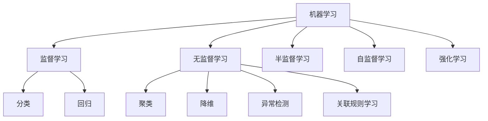
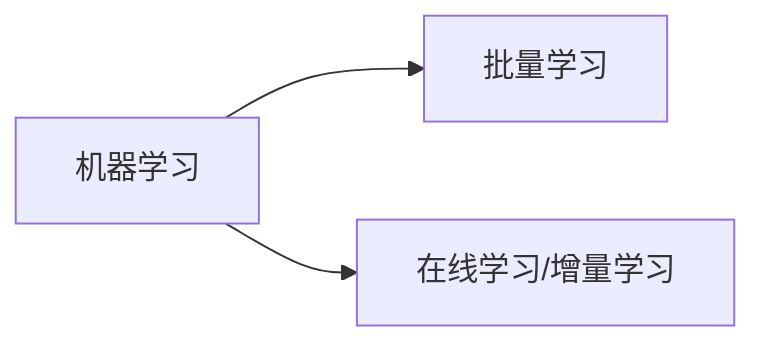
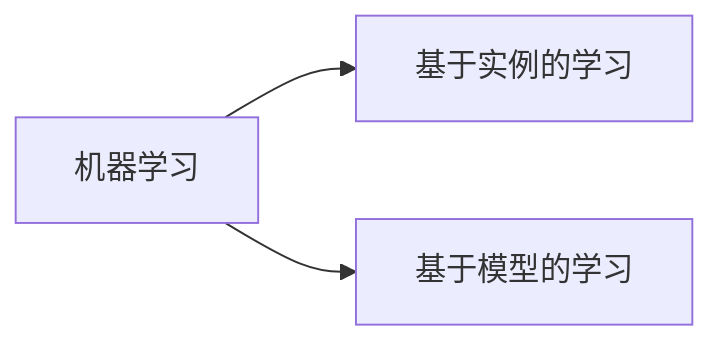
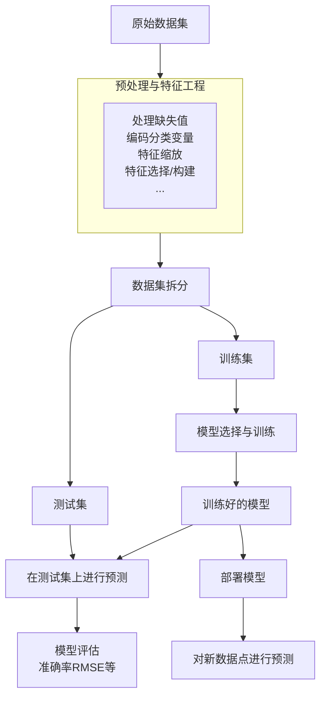
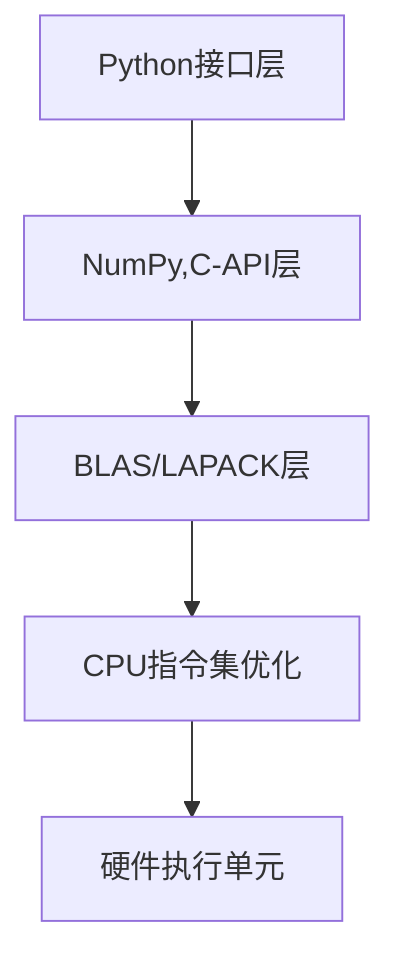

# 机器学习


# 一、基础知识

​		**机器学习是一门通过编程让计算机从数据中进行学习的科学，即：如果一个计算机程序在任务T上的性能P随着经验E的增加而提高，就称它在学习。**

**机器学习的分类：**

**:one:按学习方式分**





**:two:按能否从输入数据流中进行增量学习分类**




**:three:按泛化方式分类**




## 1、有监督和无监督学习 ##

| /<br />      | **监督学习 (Supervised Learning)**                           | **无监督学习 (Unsupervised Learning)**                       |
| :----------- | :----------------------------------------------------------- | :----------------------------------------------------------- |
| **核心思想** | 通过“已有答案”（标签）学习输入与输出的映射。                 | 让算法自行发现数据中的**隐藏结构或分布**。                   |
| **典型任务** | - **分类**：垃圾邮件识别、肿瘤良恶性判断。<br>- **回归**：房价预测、股票价格预估。 | - **聚类**：客户细分、图像分组。<br>- **降维 / 表示学习**：特征压缩、异常检测、可视化。 |
| **常见算法** | 线性回归、逻辑回归、决策树、随机森林、支持向量机、深度网络等。 | K-Means、 PCA等。                                            |
| **所需数据** | 数据集中每个样本都附有**标签 y**。                           | 只有特征 **x**，没有标签；或仅少量标签。                     |
| **评价指标** | Accuracy、RMSE等与真实标签比对的度量。                       | 可解释性定性评估等。                                         |
| **典型输出** | 一个可对新样本给出具体预测的模型。                           | – 样本簇标签或相似度矩阵<br>– 降维后的新特征表示<br>– 发现的规则/共现模式。 |


## 2、模型的参数和超参数

**:a:参数**

- 模型从**训练数据中自动学习**得到的内部变量
- **直接影响模型的预测能力**
- **调整目标：最小化损失函数**
- 例如：线性回归的权重$\mathbf{w}$，偏置$b$


**:b:超参数**

- 在训练之前**手动设定**的配置选项
- **控制模型的学习过程和结构**
- **调整目标：最大化模型泛化性能**
- 例如，学习率 $\alpha$，正则化强度 $\lambda$


## 3、模型的数据集划分

- **训练集：用于训练模型参数**
- **验证集：用于调整超参数 和 监控过拟合**
- **测试集**：用于最终**评估模型泛化能力**
- **Train-Dev集：检测数据分布不一致问题（如训练集和测试集来源不同）**


# 二、监督学习

​		**监督学习的样本由输入值$\mathbf{x}$（特征向量）和标签值组成，它的目标是给定训练样本集$(\mathbf{x},y)$，根据它确定一个预测模型  $y = f(\mathbf{x})$，从而实现从输入值  $\mathbf{x}$  到输出值  $y$ 的映射**

**监督学习的<span style='color: orange'>样本标签</span>**

- **如果是整数，则为<span style='color: red'>分类</span>问题，此时预测函数（模型）为  $\mathbb{R}^n \rightarrow \mathbb{Z}$  的映射**
- **如果是连续的实数，则称为<span style='color: blue'>回归</span>问题，此时预测函数（模型）为 $\mathbb{R}^n \rightarrow \mathbb{R}$ 的映射**


## （一）回归

### 1、简单线性回归

#### # 模型

​		**从机器学习的角度来看，自变量就是样本的特征向量 $\mathbf{x} \in \mathbb{R}^D$（每一维对应一个自变量）,因变量是标签$\mathbf{y}$，这里 $\mathbf{y} \in \mathbb{R}$是连续值（实数或连续整数）。假设空间是一组参数化的线性函数**
$$
f(\mathbf{x};\mathbf{w},b) = \mathbf{w}^T\mathbf{x} + \mathbf{b}
$$
**其中权重向量 $\mathbf{w} \in \mathbb{R}^D$ 和 $\mathbf{b} \in \mathbb{R}$都是可学习的参数，函数$f(\mathbf{x};\mathbf{w},b) \in \mathbb{R}$称为线性模型**


#### # 损失函数

**均方误差损失函数（MSE），其中预测值为 $\hat{y}$ **
$$
\hat y^{(i)} \;=\; w^{\top}x^{(i)} + b \\
J(w,b) \;=\; \frac{1}{2m}\sum_{i=1}^{m}\!\bigl(\,\hat y^{(i)} - y^{(i)}\bigr)^2
$$
**训练目标是最小化损失函数，也就是找到损失函数的最小值，即使用<span style='color: red;font-size: 19px'>梯度下降法</span>**


#### # 梯度下降

**对于上述的模型和损失函数来说，使用以下方式迭代**
$$
\tilde w = w - \alpha g_w \\
\tilde b = b - \alpha g_b
$$
**其中，损失函数$J(w, b)$ 的 梯度 $\nabla J(w, b) = (\frac{\partial J}{\partial w},\frac{\partial J}{\partial b}) = (g_w, g_b) $ 推导如下**
$$
\begin{aligned}
g_w = 
\frac{\partial J}{\partial w}
   &=\frac{\partial}{\partial w}\;
     \frac1{2m}\sum_{i=1}^{m}\Bigl(f_{w,b}\bigl(x^{(i)}\bigr)-y^{(i)}\Bigr)^2 \\[4pt]
   &=\frac1{2m}\sum_{i=1}^{m}2\bigl(wx^{(i)}+b-y^{(i)}\bigr)\,x^{(i)} \\[4pt]
   &=\frac1{m}\sum_{i=1}^{m}\Bigl(f_{w,b}\bigl(x^{(i)}\bigr)-y^{(i)}\Bigr)\,x^{(i)}
\end{aligned}
$$

$$
\begin{aligned}
g_b = 
\frac{\partial J}{\partial b}
   &=\frac{\partial}{\partial b}\;
     \frac1{2m}\sum_{i=1}^{m}\Bigl(f_{w,b}\bigl(x^{(i)}\bigr)-y^{(i)}\Bigr)^2 \\[4pt]
   &=\frac1{2m}\sum_{i=1}^{m}2\bigl(wx^{(i)}+b-y^{(i)}\bigr) \\[4pt]
   &=\frac1{m}\sum_{i=1}^{m}\Bigl(f_{w,b}\bigl(x^{(i)}\bigr)-y^{(i)}\Bigr)
\end{aligned}
$$
**计算出梯度后，使用下述公式进行迭代**
$$
\begin{aligned}
w &\;\leftarrow\; w - \alpha \,\frac{1}{m}\sum_{i=1}^{m}
      \Bigl(f_{w,b}\bigl(x^{(i)}\bigr)-y^{(i)}\Bigr)\,x^{(i)},\\[6pt]
b &\;\leftarrow\; b - \alpha \,\frac{1}{m}\sum_{i=1}^{m}
      \Bigl(f_{w,b}\bigl(x^{(i)}\bigr)-y^{(i)}\Bigr).
\end{aligned}
$$
**可以看到，这个算法梯度下降的每一步都用到了之前所有的训练数据，这种方式叫作<span style='color: red;font-size:18px'> 批量梯度下降（Batch Gradient Descent）</span>**


 **一般的，梯度下降都会使用同步更新策略**

|     步骤      | 同步更新——最常用                                             | 不同步更新                                                   |
| :-----------: | :----------------------------------------------------------- | :----------------------------------------------------------- |
|   1计算梯度   | $g_w = \frac{\partial J}{\partial w}(w,b), g_b = \frac{\partial J}{\partial b}(w,b)\\$ | 先算$w$ 梯度<br/>$g_w = \frac{\partial J}{\partial w}(w,b)\\$ |
| 2生成暂存变量 | $\tilde w = w - \alpha g_w$<br />$\tilde b = b - \alpha g_b$ | 无暂存，直接改<br />$w \leftarrow w - \alpha g_w$            |
|     3赋值     | $w \leftarrow \tilde w$<br />$b \leftarrow \tilde b$<br />同时生效 | 再用已更新的$w$重新计算<br />$g_b = \frac{\partial J}{\partial b}(w,b)$<br />然后$b \leftarrow b - \alpha g_b$ |
|  4迭代下一轮  |                                                              |                                                              |


### 2、多特征线性回归

**常用符号**

| 记号                                 | 含义                                                         | Python 变量名 (示例)               | 典型形状          |
| :----------------------------------- | :----------------------------------------------------------- | :--------------------------------- | :---------------- |
| **通用线性代数记号**                 |                                                              |                                    |                   |
| $a$                                  | 标量（非粗体）                                               | `a`                                | $()$              |
| $\mathbf{a}$                         | 向量（粗体小写）                                             | `a_vec`                            | $(n,)$ 或 $(n,1)$ |
| $\mathbf{A}$                         | 矩阵（粗体大写）                                             | `A_mat`                            | $(m,n)$           |
| **回归数据**                         |                                                              |                                    |                   |
| $\mathbf{X}$                         | 训练样本特征矩阵                                             | `X_train`                          | $(m,n)$           |
| $\mathbf{y}$                         | 训练样本目标向量                                             | `y_train`                          | $(m,)$ 或 $(m,1)$ |
| $\mathbf{x}^{(i)}$                   | 第 $i$ 条样本的特征向量                                      | `X_train[i]`                       | $(n,)$            |
| $y^{(i)}$                            | 第 $i$ 条样本的目标值                                        | `y_train[i]`                       | $()$              |
| $m$                                  | 样本数量                                                     | `m = X_train.shape[0]`             | —                 |
| $n$                                  | 每条样本的特征数                                             | `n = X_train.shape[1]`             | —                 |
| **模型参数**                         |                                                              |                                    |                   |
| $\mathbf{w}$                         | 权重向量                                                     | `w`                                | $(n,)$            |
| $b$                                  | 偏置（截距）                                                 | `b`                                | $()$              |
| **模型与预测**                       |                                                              |                                    |                   |
| $f_{\mathbf{w},b}(\mathbf{x}^{(i)})$ | 在样本 $\mathbf{x}^{(i)}$ 上的模型输出：<br>$\displaystyle f_{\mathbf{w},b}(\mathbf{x}^{(i)}) = \mathbf{w}\cdot\mathbf{x}^{(i)} + b$ | `f_wb = np.dot(w, X_train[i]) + b` | $()$              |


#### # 模型

**对于多个输入变量$x$来说，其基本模型为**
$$
\begin{aligned}
f_{\mathbf{w},b}(\mathbf{X}) = \mathbf{w}^T \cdot \mathbf{x} + b 
&= [\,w_0,\;w_1,\;w_2,\;\dots,\;w_{n-1}\,]
   \begin{bmatrix}
     x_0 \\ x_1 \\ x_2 \\ \vdots \\ x_{n-1}
   \end{bmatrix} + b\\[4pt]
&= w_0x_0 + w_1x_1 + \cdot\cdot\cdot + w_{n-1}x_{n-1} + b
\end{aligned}
$$
**其中，权重向量 $w = [\,w_0,\;w_1,\;w_2,\;\dots,\;w_n\,]^T$ 和标量 $b$ 为模型参数，向量 $\mathbf{x}$ 代表了每个特征下所有样本的特征值组成的向量，也就是对应于原训练数据的每一列，如果训练数据的每一行是每一个样本的话**

**训练样本 `X_train` 和 标签 `y_train`存放在NumPy的矩阵中，矩阵的每一行代表一个样本，矩阵如下 **
$$
\mathbf{X}_{m \times n} = \begin{pmatrix}
 x^{(0)}_0 & x^{(0)}_1 & \cdots & x^{(0)}_{n-1} \\
 x^{(1)}_0 & x^{(1)}_1 & \cdots & x^{(1)}_{n-1} \\
 \vdots & \vdots & \ddots & \vdots \\
 x^{(m-1)}_0 & x^{(m-1)}_1 & \cdots & x^{(m-1)}_{n-1}
\end{pmatrix} & & & & 
\mathbf{y}_{m \times1} = \begin{pmatrix}
y_0 \\
y_1 \\
\vdots \\
y_{m-1}
\end{pmatrix}
$$
**其中，$x_j^{(i)}$ 表示训练样本`X_train`的第 $i$ 个样本中的第 $j$ 个特征的值**

**所以，矩阵的运算形式为：**
$$
\begin{aligned}
 f_{\mathbf{w},b}(\mathbf{X}) 
 &= \mathbf{w}^T \cdot \mathbf{x} + b \\
 \\
 &= [\,w_0,\;w_1,\;w_2,\;\dots,\;w_{n-1}\,]_{1 \times n} 
 \begin{pmatrix}
 x^{(0)}_0 & x^{(1)}_0 & \cdots & x^{(m-1)}_0 \\
 x^{(0)}_1 & x^{(1)}_1 & \cdots & x^{(m-1)}_{1} \\
 \vdots & \vdots & \ddots & \vdots \\
 x^{(0)}_{n-1} & x^{(1)}_{n-1} & \cdots & x^{(m-1)}_{n-1}
\end{pmatrix}_{n \times m} + b = [\,y_0,\;y_1,\;y_2,\;\dots,\;y_{m-1}\,]_{1 \times m}
 \\ \\ \\ \\
 另一种形式为
&:   \begin{pmatrix}
 x^{(0)}_0 & x^{(0)}_1 & \cdots & x^{(0)}_{n-1} \\
 x^{(1)}_0 & x^{(1)}_1 & \cdots & x^{(1)}_{n-1} \\
 \vdots & \vdots & \ddots & \vdots \\
 x^{(m-1)}_0 & x^{(m-1)}_1 & \cdots & x^{(m-1)}_{n-1}
\end{pmatrix}_{m \times n}
\begin{pmatrix}
w_0 \\
w_1 \\
\vdots \\
w_{n-1}
\end{pmatrix}_{n \times 1} + b
=   \begin{pmatrix}
y_0 \\
y_1 \\
\vdots \\
y_{m-1}
\end{pmatrix}_{m \times 1}
\end{aligned}
$$
**其中，第一种形式把y看成了行向量，行向量$\mathbf{w}$ 乘一个矩阵相当于矩阵的每一行都乘一个对应的数；**

​			**第二种形式把y看成了列向量，矩阵乘一个列向量$\mathbf{w}$ 相当于矩阵的每一列乘一个对应的数**


#### # 损失函数

**多特征情况下的代价函数$J(\mathbf{w}, b)$定义为：**
$$
J(\mathbf{w}, b) = \frac{1}{2m} \sum_{i=0}^{m-1}(f_{\mathbf{w},b}(\mathbf{x^{(i)}}) - y^{(i)})^2
$$
**其中：**
$$
f_{\mathbf{w}, b}(\mathbf{x}^{(i)}) = \mathbf{w} \cdot \mathbf{x}^{(i)} + b
$$
**这里的 $\mathbf{w}$ 和 $\mathbf{x}^{(i)}$ 都是向量，用来支持包含多个特征的输入**


#### # 梯度下降

**对于多变量输入，使用以下方式迭代**
$$
\begin{cases}
    w_j \;=\;
      w_j
      \;-\;
      \alpha\,
      \dfrac{\partial J}{\partial w_j}\,,
      & j = 1,\dots,n \\[8pt]
    b   \;=\;
      b
      \;-\;
      \alpha\,
      \dfrac{\partial J}{\partial b}
\end{cases}
$$
**其中，$n$为特征数量，$w_j$表示第$j$个权重**

**多输入变量的损失函数的梯度 $\nabla f_{\mathbf{w}, b}(\mathbf{x}^{(i)})$ 为：**
$$
\frac{\partial J(\mathbf{w},b)}{\partial w_j} = \frac{1}{m} \sum_{i=0}^{m-1}(f_{\mathbf{w},b}(\mathbf{x}^{(i)})-y^{(i)})x_j^{(i)} \\ \\
\frac{\partial J(\mathbf{w},b)}{\partial b} = \frac{1}{m} \sum_{i=0}^{m-1} (f_{\mathbf{w},b}(\mathbf{x}^{(i)})-y^{(i)})
$$
**其中，$m$为训练样本数，$f_{\mathbf{w}, b}(\mathbf{x}^{(i)})$为模型对第$i$条样本的预测值，$y^{(i)}$是第$i$条样本的真实目标值**


### # 入门实例 X：一维，Y：一维

```python
import numpy as np
import matplotlib.pyplot as plt
```


#### 1、自定义训练集数据，并用散点图可视化

```python
x_train = np.arange(10)  # 输入数据
y_train = 1.0 * x_train + 0.5 + 1.1 * np.random.rand(10)  # 输入数据对应的标签
plt.scatter(x_train, y_train, marker="x")
plt.show()
```


#### 2、实现损失函数$J(w, b)$

```python
def compute_cost(x, y, w, b):
    """
    x: ndarray (m,) 训练数据的特征
    y: ndarray (m,) 训练数据的标签
    w: 浮点数，直线模型的参数
    b: 浮点数，直线模型的参数
    return: 浮点数，当前w，b下的损失值
    """
    m = x.shape[0]
    return np.sum((w*x + b - y) ** 2) / (2 * m)
```


#### 3、计算梯度$\nabla J(w, b)$

 $\nabla J(w, b) = (g_w, g_b) = (\frac{\partial J}{\partial w},\frac{\partial J}{\partial b})$

```python
def compute_gradient(x, y, w, b):
    """
    计算线性回归的梯度
    参数:
      x (ndarray (m,)): 输入数据，m 个样本
      y (ndarray (m,)): 目标值
      w, b (浮点数)   : 模型参数
    返回:
      dj_dw (浮点数): 损失函数对参数 w 的梯度
      dj_db (浮点数): 损失函数对参数 b 的梯度
    """
    m = x.shape[0]
    err = w*x + b - y
    return np.sum(err * x) / m, np.sum(err) / m
```


#### 4、检测梯度

```python
def gradient_check(x, y, w, b, eps=1e-7, tol=1e-4, verbose=True):
    """
    使用数值差分验证 compute_gradient 是否正确
    Args:
        x, y : 数据集
        w, b : 当前参数（float）
        eps  : 微小扰动 ε，用于近似数值梯度
        tol  : 容差阈值，|解析梯度 - 数值梯度| < tol 视为通过
        verbose: 打印详细差异
    Returns:
        passed (bool) : 是否通过梯度检查
    """
    # 1) 解析梯度
    dj_dw, dj_db = compute_gradient(x, y, w, b)

    # 2) 数值梯度——中心差分
    num_dj_dw = (compute_cost(x, y, w + eps, b) -
                 compute_cost(x, y, w - eps, b)) / (2 * eps)
    num_dj_db = (compute_cost(x, y, w, b + eps) -
                 compute_cost(x, y, w, b - eps)) / (2 * eps)

    # 3) 误差
    diff_w = abs(dj_dw - num_dj_dw)
    diff_b = abs(dj_db - num_dj_db)
    passed = diff_w < tol and diff_b < tol

    if verbose:
        print(f"你实现的 dj_dw = {dj_dw: .6e}, 数值模拟 = {num_dj_dw: .6e}, 误差 = {diff_w: .2e}")
        print(f"你实现的 dj_db = {dj_db: .6e}, 数值模拟 = {num_dj_db: .6e}, 误差 = {diff_b: .2e}")
        print("OK! Gradient check PASSED" if passed else "Gradient check FAILED")

    return passed

test_w = 2
test_b = 1
assert gradient_check(x_train,y_train,test_w,test_b), "梯度检查失败 梯度的实现有问题！！！"
```


**这里使用了中心差分，即 **
$$
\frac{\partial J}{\partial \theta}\approx\frac{J(\theta+\varepsilon)-J(\theta-\varepsilon)}{2\varepsilon}，误差 (O(\varepsilon^2))
$$
**证明中心差分，使用Taylor公式**
$$
\begin{aligned}
J(\theta + \varepsilon)
&= J(\theta) + \varepsilon J'(\theta) + \frac{\varepsilon^{2}}{2}J''(\theta) + \mathcal{O}\!\bigl(\varepsilon^{3}\bigr) \ \ \ ①\\[6pt]
J(\theta - \varepsilon)
&= J(\theta) - \varepsilon J'(\theta) + \frac{\varepsilon^{2}}{2}J''(\theta) + \mathcal{O}\!\bigl(\varepsilon^{3}\bigr) \ \ \ ②
\end{aligned}
$$
**①式$-$②式，可得偏导的中心差分公式**


#### 5、实现梯度下降算法

**即最小化损失函数**

```python
import math
def gradient_descent(x, y, w_in, b_in, alpha, num_iters,
                     cost_function, gradient_function):
    """
    执行梯度下降以拟合线性模型参数 w、b
    将进行 num_iters 次参数更新，学习率为 alpha。

    参数:
      x (ndarray (m,))  : 输入数据，共 m 个样本
      y (ndarray (m,))  : 目标值
      w_in, b_in (float): 参数初始值
      alpha (float)     : 学习率
      num_iters (int)   : 梯度下降迭代次数
      cost_function     : 计算成本 J 的函数
      gradient_function : 计算梯度 (dj_dw, dj_db) 的函数

    返回:
      w (float)        : 迭代结束后的 w
      b (float)        : 迭代结束后的 b
      J_history (list) : 每次迭代的损失值
      p_history (list) : 每次迭代的参数 [w, b]
    """
    
    # 用于保存损失值和参数历史，便于后续绘图
    J_history = []
    p_history = []

    w, b = w_in, b_in
    dj_dw, dj_db = 0, 0

    for i in range(num_iters):
        #1. 利用形式参数 gradient_function 计算梯度
        dj_dw, dj_db = gradient_function(x, y, w, b)
        #2.  按梯度下降公式同步更新参数 w，b
        w = w - (alpha * dj_dw)
        b = b - (alpha * dj_db)
        # 保存成本与参数
        if i < 100_000:            # 防止存储资源消耗过大
            J_history.append(cost_function(x, y, w, b))
            p_history.append([w, b])

        # 每进行总迭代次数的 1/10（或不足 10 次时每次）打印一次训练的信息
        if i % math.ceil(num_iters / 10) == 0:
            print(f"迭代 {i:4d}:  成本 {J_history[-1]:0.2e}  "
                  f"dj_dw: {dj_dw: 0.3e}, dj_db: {dj_db: 0.3e}  "
                  f"w: {w: 0.3e}, b: {b: 0.5e}")
            
    # 返回最终参数及历史记录
    return w, b, J_history, p_history
```


#### 6、运行测试

```python
# 初始化直线的参数
w_init = 0
b_init = 0.2

# 梯度下降算法 设置迭代次数 和 学习率
iterations = 10000
tmp_alpha = 1.0e-2
# 运行梯度下降
w_final, b_final, J_hist, p_hist = gradient_descent(x_train ,y_train, w_init, b_init, tmp_alpha,
                                                    iterations, compute_cost, compute_gradient)
>>> print(f"梯度下降找到的(w,b) : ({w_final:8.4f},{b_final:8.4f})")


迭代    0:  成本 9.20e+00  dj_dw: -3.224e+01, dj_db: -5.246e+00  w:  3.224e-01, b:  2.52459e-01
迭代 1000:  成本 3.66e-02  dj_dw:  9.633e-04, dj_db: -6.041e-03  w:  1.050e+00, b:  7.16378e-01
迭代 2000:  成本 3.66e-02  dj_dw:  5.698e-05, dj_db: -3.573e-04  w:  1.046e+00, b:  7.36448e-01
迭代 3000:  成本 3.66e-02  dj_dw:  3.371e-06, dj_db: -2.114e-05  w:  1.046e+00, b:  7.37636e-01
迭代 4000:  成本 3.66e-02  dj_dw:  1.994e-07, dj_db: -1.250e-06  w:  1.046e+00, b:  7.37706e-01
迭代 5000:  成本 3.66e-02  dj_dw:  1.179e-08, dj_db: -7.396e-08  w:  1.046e+00, b:  7.37710e-01
迭代 6000:  成本 3.66e-02  dj_dw:  6.977e-10, dj_db: -4.375e-09  w:  1.046e+00, b:  7.37710e-01
迭代 7000:  成本 3.66e-02  dj_dw:  4.127e-11, dj_db: -2.588e-10  w:  1.046e+00, b:  7.37710e-01
迭代 8000:  成本 3.66e-02  dj_dw:  2.443e-12, dj_db: -1.531e-11  w:  1.046e+00, b:  7.37710e-01
迭代 9000:  成本 3.66e-02  dj_dw:  1.460e-13, dj_db: -9.055e-13  w:  1.046e+00, b:  7.37710e-01
梯度下降找到的(w,b) : (  1.0463,  0.7377)
```


#### 7、画相关图像

**拟合情况**

```python
plt.scatter(x_train, y_train, color='r', label='orgin')
y_pre = w_final * x_train + b_final
plt.plot(x_train, y_pre, label='pred')
plt.legend()
plt.show()
```


**损失函数和迭代次数的关系**

```python
# 画损失值 和 迭代次数的关系
fig, (ax1, ax2) = plt.subplots(1, 2, figsize=(12,4))
ax1.plot(J_hist[:100])
ax2.plot(1000 + np.arange(len(J_hist[1000:])), J_hist[1000:])
ax1.set_title("Cost vs. iteration(start)")
ax2.set_title("Cost vs. iteration (end)")
ax1.set_ylabel('Cost')
ax2.set_ylabel('Cost')
ax1.set_xlabel('iteration step')
ax2.set_xlabel('iteration step')
plt.show()
```


### # 实例2: X（m, n）和Y（m，）

```python
import copy, math
import numpy as np
import matplotlib.pyplot as plt
np.set_printoptions(precision=2)   # 减少数组里 浮点数显示出来的精度
```


#### 1、自定义训练集数据

```python
## 构造 `X_train` 和 `y_train`
import numpy as np

# 特征矩阵：每行一个样本，每列一个特征
X_train = np.array([
    [2104, 5, 1, 45],
    [1416, 3, 2, 40],
    [ 852, 2, 1, 35],
    [1260, 3, 1, 20],
    [3000, 4, 2,  5],
    [1980, 4, 1, 15],
    [ 890, 2, 1, 60]
], dtype=float)

# 目标向量：对应的房价，单位千美元
y_train = np.array([460, 232, 178, 240, 540, 350, 155], dtype=float)

m, n = X_train.shape
print(f"样本数 m = {m},  特征数 n = {n}")
```


#### 2、实现损失函数

```python
def compute_cost(X, y, w, b):
    """
    计算损失
    Args:
      X (ndarray (m,n)): 训练集的输入, m 样本 with n 特征
      y (ndarray (m,)) : 训练集目标
      w (ndarray (n,)) : 模型参数 w
      b (scalar)       : 模型参数 b

    Returns:
      cost (scalar): 损失值
    """
    m = X.shape[0]
    cost = 0.0

    # TODO： 根据公式实现损失函数
    err = (X @ w) + b - y
    cost = np.sum(err ** 2) / (2 * m)
    return cost

w_test = np.ones((4,))
b_test = 10
cost_answer = 1117012.2142857143
assert np.isclose(compute_cost(X_train,y_train,w_test,b_test), cost_answer), "compute cost实现有问题"
```


#### 3、计算梯度

```python
def compute_gradient(X, y, w, b):
    """
    Computes the gradient for linear regression
    Args:
      X (ndarray (m,n)): Data, m examples with n features
      y (ndarray (m,)) : target values
      w (ndarray (n,)) : model parameters
      b (scalar)       : model parameter

    Returns:
      dj_dw (ndarray (n,)): The gradient of the cost w.r.t. the parameters w.
      dj_db (scalar):       The gradient of the cost w.r.t. the parameter b.
    """
    m,n = X.shape           #(number of examples, number of features)
    dj_dw = 0
    dj_db = 0
    err = np.dot(X, w) + b - y
    # TODO： 根据公式实现梯度
    dj_dw = X.T @ err / m
    dj_db = np.sum(err) / m
    return dj_dw, dj_db
```


#### 4、检测梯度

```python
def gradient_check(x, y, w, b, eps=1e-7, tol=1e-2, verbose=True):
    """
    使用数值差分验证 compute_gradient 是否正确
    Args:
        x, y : 数据集
        w, b : 当前参数, w是ndarray，b是float
        eps  : 微小扰动 ε，用于近似数值梯度
        tol  : 容差阈值，|解析梯度 - 数值梯度| < tol 视为通过
        verbose: 打印详细差异
    Returns:
        passed (bool) : 是否通过梯度检查
    """
    # 1) 解析梯度
    dj_dw, dj_db = compute_gradient(x, y, w, b)

    # 2) 数值梯度——中心差分
    n = x.shape[1]

    num_dj_dw = np.zeros((n,))

    for i in range(n):
        eps_vec = np.zeros((n,))
        eps_vec[i] = eps
        num_dj_dw[i] =(compute_cost(x, y, w + eps_vec, b) -
                 compute_cost(x, y, w - eps_vec, b)) / (2 * eps)

    num_dj_db = (compute_cost(x, y, w, b + eps) -
                 compute_cost(x, y, w, b - eps)) / (2 * eps)

    # 3) 误差
    diff_w = np.abs(dj_dw - num_dj_dw)
    diff_b = abs(dj_db - num_dj_db)
    passed = np.all(diff_w < tol) and diff_b < tol

    if verbose:
        print(f"你实现的 dj_dw = {dj_dw}, 数值模拟 = {num_dj_dw}, 误差 = diff_w: {diff_w}")
        print(f"你实现的 dj_db = {dj_db: .6e}, 数值模拟 = {num_dj_db: .6e}, 误差 = {diff_b: .2e}")
        print("OK! Gradient check PASSED" if passed else "Gradient check FAILED")

    return passed

# 梯度检查
w_test = np.ones((4,))
b_test = 10
assert gradient_check(X_train,y_train,w_test,b_test), "梯度检查失败 梯度的实现有问题！！！"
```


#### 5、实现梯度下降算法

```python
# 使用梯度下降算法
def gradient_descent(X, y, w_in, b_in, cost_function, gradient_function,
                     alpha, num_iters):
    """
    批量梯度下降（Batch Gradient Descent）
    --------------------------------------
    循环执行 num_iters 轮参数更新，通过梯度下降学习权重 w 与偏置 b。

    参数
    ----
    X : ndarray (m, n)
        训练数据，m 行样本、n 列特征
    y : ndarray (m,)
        目标值（标签）
    w_in : ndarray (n,)
        权重向量的初始值
    b_in : 标量
        偏置的初始值
    cost_function : callable
        计算代价 J 的函数
    gradient_function : callable
        计算代价函数梯度的函数
    alpha : float
        学习率
    num_iters : int
        梯度下降的迭代次数

    返回值
    ------
    w : ndarray (n,)
        训练完毕后的权重向量
    b : 标量
        训练完毕后的偏置
    J_history : list
        每一次迭代计算得到的代价，用于绘图或分析
    """

    # 用于记录每次迭代的 J 以及 w，方便后续绘图
    J_history = []

    # 深拷贝，避免在函数内部修改外部变量
    w = copy.deepcopy(w_in)
    b = b_in

    for i in range(num_iters):

        # 计算梯度，并更新参数
        dj_dw, dj_db = gradient_function(X, y, w, b)

        # 梯度下降：按照学习率 alpha 更新 w 和 b
        w = w - alpha * dj_dw
        b = b - alpha * dj_db

        # 记录当前代价（防止资源耗尽，只保存前 100000 步）
        if i < 100000:
            J_history.append(cost_function(X, y, w, b))

        # 每迭代总次数的 1/10 打印一次代价
        if i % math.ceil(num_iters / 10) == 0:
            print(f"迭代 {i:4d} 次：代价 {J_history[-1]:8.2f}")

    # 返回最终参数和代价历史，便于绘图
    return w, b, J_history
```


#### 6、运行测试

```python
# initialize parameters
initial_w = np.zeros((4,))
initial_b = 0.
# some gradient descent settings
iterations = 100000
alpha = 1e-7
# run gradient descente)
w_final, b_final, J_hist = gradient_descent(X_train, y_train, initial_w, initial_b,
                                                    compute_cost, compute_gradient,
                                                    alpha, iterations)

print(f"通过梯度下降找到的b,w : {b_final:0.2f},{w_final} ")
m,_ = X_train.shape
for i in range(m):
    print(f"预测值: {np.dot(X_train[i], w_final) + b_final:0.2f}, 目标值: {y_train[i]}")
    
  
# 输出结果如下
迭代    0 次：代价 26381.40
迭代 10000 次：代价   470.70
迭代 20000 次：代价   466.12
迭代 30000 次：代价   464.89
迭代 40000 次：代价   464.45
迭代 50000 次：代价   464.22
迭代 60000 次：代价   464.03
迭代 70000 次：代价   463.85
迭代 80000 次：代价   463.68
迭代 90000 次：代价   463.50
通过梯度下降找到的b,w : -0.02,[ 0.18  0.1  -0.09  0.26] 
预测值: 398.07, 目标值: 460.0
预测值: 270.29, 目标值: 232.0
预测值: 165.52, 目标值: 178.0
预测值: 236.53, 目标值: 240.0
预测值: 551.76, 目标值: 540.0
预测值: 367.38, 目标值: 350.0
预测值: 179.03, 目标值: 155.0
```

**这里的代价还是很大**


#### 7、绘图

```python
# plot cost vs 迭代次数
fig, (ax1, ax2) = plt.subplots(1, 2, figsize=(12, 4))
ax1.plot(J_hist)
ax2.plot(100 + np.arange(len(J_hist[100:])), J_hist[100:])
ax1.set_title("Cost vs. iteration")
ax2.set_title("Cost vs. iteration (tail)")
ax1.set_ylabel('Cost')
ax2.set_ylabel('Cost')
ax1.set_xlabel('iteration step')
ax2.set_xlabel('iteration step')
plt.show()
```


**这里可以看到迭代到最后，损失函数$J$是465，代价还是很大，原因是数据量级差别较大**


#### 8、不足与改进

**上述例子是对此数据做的模拟，可以看到面积这个特征的量级远大于其他特征的量级，所以会导致面积这个特征对于损失函数的影响较大**

| 样本 | 面积 (sqft) | 卧室数 | 楼层数 | 房龄 (年) | 价格 (千美元) |
| :--: | :---------: | :----: | :----: | :-------: | :-----------: |
|  1   |    2104     |   5    |   1    |    45     |      460      |
|  2   |    1416     |   3    |   2    |    40     |      232      |
|  3   |     852     |   2    |   1    |    35     |      178      |
|  4   |    1260     |   3    |   1    |    20     |      240      |
|  5   |    3000     |   4    |   2    |     5     |      540      |
|  6   |    1980     |   4    |   1    |    15     |      350      |
|  7   |     890     |   2    |   1    |    60     |      155      |

**所以，对于量级不同的数据，需进行<span style='color: red;font-size: 19px'>特征缩放，缩放的时候X和y要一起缩放，否则还是达不到很好的效果</span>**


### # 实例2进阶，特征缩放

#### 1、自定义训练集数据

```python
## 构造 `X_train` 和 `y_train`
import numpy as np

# 特征矩阵：每行一个样本，每列一个特征
X_train = np.array([
    [2104, 5, 1, 45],
    [1416, 3, 2, 40],
    [ 852, 2, 1, 35],
    [1260, 3, 1, 20],
    [3000, 4, 2,  5],
    [1980, 4, 1, 15],
    [ 890, 2, 1, 60]
], dtype=float)

# 目标向量：对应的房价，单位千美元
y_train = np.array([460, 232, 178, 240, 540, 350, 155], dtype=float)

m, n = X_train.shape
print(f"样本数 m = {m},  特征数 n = {n}")
```


#### 2、实现损失函数

```python
# 损失函数
def cost_function(X, y, w, b):
    m = X.shape[0]
    err = np.dot(X, w) + b - y
    total_cost = np.sum(err ** 2) / (2*m)
    return total_cost
```


#### 3、计算梯度

```python
# 计算梯度
def gradient_function(X, y, w, b):
    m = X.shape[0]
    err = np.dot(X, w) + b - y
    dj_dw = X.T @ err / m
    dj_db = np.sum(err) / m
    return dj_dw, dj_db
```


#### 4、检测梯度

```python
# 梯度检测，中心差分 J(w+eps) - J(w-eps) / 2 * eps
def gradient_check(x, y, w, b, eps=1e-7, tol=1e-2, verbose=True):
    dj_dw, dj_db = gradient_function(x, y, w, b)

    n = x.shape[1]
    new_dj_dw = np.zeros((n,))

    for i in range(n):
        eps_vec = np.zeros((n,))
        eps_vec[i] = eps
        new_dj_dw[i] = (cost_function(x, y, w + eps_vec, b) -
                        cost_function(x, y, w - eps_vec, b)) / (2 * eps)

    new_dj_db = (cost_function(x, y, w, b + eps) -
                 cost_function(x, y, w, b - eps)) / (2 * eps)
    if verbose:
        dj_db_cha = abs(new_dj_db - dj_db)
        dj_dw_cha_vec = np.abs(new_dj_dw - dj_dw)
        print(dj_dw_cha_vec)
        if np.all(dj_dw_cha_vec < tol) and dj_db_cha < tol:
            return True
    return False
```


#### 5、实现梯度下降算法

```python
# 梯度下降
import math,copy
def gradient_descent(X, y, w_in, b_in, cost_function, gradient_function,
                     alpha, num_iters):

    J_history = []
    w = copy.deepcopy(w_in)
    b = b_in

    for i in range(num_iters):
        dj_dw, dj_db = gradient_function(X, y, w, b)
        w = w - alpha * dj_dw
        b = b - alpha * dj_db

        total_cost_i = cost_function(X, y, w, b)
        J_history.append(total_cost_i)
        if i % math.ceil(num_iters / 10) == 0:
            print(f"迭代 {i:4d} 次：代价 {total_cost_i:8.2f}")

    return w, b, J_history
```


#### 6、训练样本标准化

```python
# Z-score标准化
def Z_score(X):
    return (X - X.mean()) / X.std()
```


#### 7、测试

```python
alpha = 0.2
nums_iters = 200
n = X_train.shape[1]
w_in = np.zeros((n, ))
b_in = 0
X_norm = Z_score(X_train)
y_norm = Z_score(y_train)
print(f"Z-score标准化 训练集数据之后：\n {X_norm}")
print(f"Z-score标准化 标签之后之后：\n {y_norm}")
w_final, b_final, J_hist = gradient_descent(X_norm, y_norm, w_in, b_in, cost_function, gradient_function,
                 alpha, nums_iters)
print(w_final, b_final)


# 输出结果如下
Z-score标准化 训练集数据之后：
 [[ 2.128381 -0.524174 -0.529229 -0.473625]
 [ 1.258939 -0.526702 -0.527966 -0.479944]
 [ 0.546199 -0.527966 -0.529229 -0.486263]
 [ 1.061798 -0.526702 -0.529229 -0.505219]
 [ 3.260677 -0.525438 -0.527966 -0.524174]
 [ 1.971679 -0.525438 -0.529229 -0.511537]
 [ 0.594221 -0.527966 -0.529229 -0.45467 ]]
Z-score标准化 标签之后之后：
 [ 1.119005 -0.557926 -0.955094 -0.499087  1.707402  0.309959 -1.124259]
迭代    0 次：代价     0.40
迭代   20 次：代价     0.06
迭代   40 次：代价     0.03
迭代   60 次：代价     0.03
迭代   80 次：代价     0.03
迭代  100 次：代价     0.03
迭代  120 次：代价     0.03
迭代  140 次：代价     0.03
迭代  160 次：代价     0.03
迭代  180 次：代价     0.03
[1.087584 0.497152 0.48985  0.470574] -0.930070393999849
```

**这里的代价很低，原因是对数据进行特征缩放的结果**


#### 8、绘图

```python
# plot cost vs 迭代次数
from matplotlib import pyplot as plt
fig, (ax1, ax2) = plt.subplots(1, 2, figsize=(12, 4))
# plot(y)  横坐标x是 0, 1, 2...n-1，其中n是len(y)
ax1.plot(J_hist)
ax2.plot(np.arange(len(J_hist[100:])), J_hist[100:])
ax1.set_title("cost about all iteration")
ax2.set_title("cost about tail iteration")
ax1.set_ylabel('Cost')
ax2.set_ylabel('Cost')
ax1.set_xlabel('iterations')
ax2.set_xlabel('iterations')
plt.show()
```


**虽然第二张图看起来下降很快，但是纵坐标的损失函数值$J(\mathbf{w}, b)$可以看到是接近0.03，损失很小，特征缩放目的达到**


## （二）分类

​		**一个<span style='color: red'>线性分类模型</span>或<span style='color: red'>线性分类器</span>，是由一个（或多个）线性的判别函数 $f(x; \mathbf{w},b) = \mathbf{w}^Tx + b$和非线性的决策函数$g(\cdot)$组成。分类问题包含二分类或多分类问题。**

​		**在训练分类器时，我们希望确保带有正标签的样本位于超平面的正面，带有负标签的样本位于超平面的反面**

​		**所以，一般的决策函数 $g(\cdot)$ 可以是定义为如下公式**
$$
g(f(x;\mathbf{w},b)) = sgn(f(x;\mathbf{w},b)) \\
= \begin{cases}
      +1, & f(x;\mathbf{w},b) >0 \\
      -1, & f(x;\mathbf{w},b) <0
    \end{cases}
$$
​		**线性分类模型如下：**


​		**在二分类问题中，<span style="color: red">决策边界</span>将特征空间一分为二，决策边界是所有满足$f(x; \mathbf{w},b) = 0$的点组成的一个分割的<span style='color:red'>超平面</span>**

​		**下面是最简单的二分类的决策边界示例，其中样本特征向量为$\mathbf{x} = [x_1, x_2]$，权重向量为$\mathbf{w} = [w_1, w_2]$，可以推出的是，我们得到的权重向量$\mathbf{w}$与超平面上的任何向量都正交**


### 1、logistic回归

​		**对于某些训练数据来说，其标签值$y$可能是<span style='color:red'>离散</span>的，也就是说取值范围是`[0,1]`之类的，此时使用线性回归的来拟合数据就表现的不好，所以对于这种标签值$y$是离散且二分的情况，一般使用logistic回归函数去拟合数据点**

​		**以最简单的一维数据来说，下图展示了两种回归算法的区别**


#### # 模型

​		**Logistic回归与线性回归不同，它预测的是概率而非连续值，它通过逻辑函数（Sigmoid函数）将线性回归的输出映射到$(0, 1)$区间，表示属于某一类的概率。**

​		**一般情况下，对于二分类问题，<span style='color: red'>默认使用0.5</span>作为分类的阈值，也就是说通过预测出来的概率是否大于0.5来分为正样本和负样本。**

​		**在医疗领域，为了最小化漏诊率，一般会采取低阈值的策略，如0.2~0.3；但在金融风控领域，为了最小化误报的目标，一般采取高阈值的策略（如0.7 ~ 0.8），此时更关注高精确率**


:a:**Sigmoid/Logistic函数**
$$
g(z) = \frac{1}{1+e^{-z}}, \ \ \  0< g(z) <1
$$
**其函数图像如下：**


**:b:线性判别函数与决策边界**

**令$z = \mathbf{w} \cdot \mathbf{x} + b$，则<span style='color: red'>线性判别函数</span>为：**
$$
f_{\,\mathbf{w},\,b}(\mathbf{x}) = g(z)   = g(\mathbf{w} \cdot \mathbf{x} + b) = \frac{1}{1 + e^{-(\mathbf{w} \cdot \mathbf{x} + b)}}
$$


**我们默认的<span style='color: red'>阈值</span>定为0.5，即应用上述函数，我们的预测值y为：**
$$
\hat{y} \;=\;
    \begin{cases}
      1, & f_{\,\mathbf{w},\,b}(\mathbf{x}) \,\ge\, 0.5 \\
      0, & f_{\,\mathbf{w},\,b}(\mathbf{x}) \,<\, 0.5
    \end{cases}
$$
**进一步来看，当权重向量$\mathbf{w}$ 和 偏置$b$满足什么条件时上述等式成立？推导如下（$g(z)<0.5$同理）**
$$
\begin{aligned}
    f_{\,\mathbf{w},\,b}(\mathbf{x}) \,\ge\, 0.5
      \ &\Longleftrightarrow\;
      g(z) \,\ge\, 0.5 \\
      \ &\Longleftrightarrow\;
      z = \mathbf{w}\!\cdot\!\mathbf{x} + b \,\ge\, 0 
  \end{aligned}
$$
**于是有：**
$$
 \hat{y} \;=\;
    \begin{cases}
      1, & \mathbf{w}\!\cdot\!\mathbf{x} + b \ge 0 \\
      0, & \mathbf{w}\!\cdot\!\mathbf{x} + b < 0 .
    \end{cases}
$$
**则<span style='color: red'>决策边界</span>为 $\mathbf{w} \cdot \mathbf{x} + b = 0$ 所代表的一个超平面，这个超平面把数据分为两类**


#### # 损失函数

**逻辑回归使用交叉熵损失函数，也称为对数损失函数**

**:one:损失函数定义及特性**

**对于单个样本，其损失值为：**
$$
L(y, \hat{y}) = -[y\log(\hat{y}) + (1-y)\log(1-\hat{y})]
$$
**其中，$y$是真实标签（0或1），$\hat{y}$是预测概率，是通过sigmoid函数计算出来的**

**假设数据集有$m$个样本，则总的损失函数为：**
$$
J(\mathbf{w},b) = -\frac{1}{m} \sum_{i=1}^m[y^{(i)}\log(\hat{y}^{(i)}) + (1-y^{(i)})\log(1-\hat{y}^{(i)})]
$$
**其中上标$(i)$代表第$i$个样本**


**另外，交叉熵损失函数还有一些特性**

- **$J(\mathbf{w},b)$是凸函数，保证梯度下降可以找到全局最优解**

- **分类感知性，即当真实值为1时，预测值$\hat{y}$越接近1，损失函数越趋近于0，说明拟合的最好，反之亦然**

  - 当$y=1$时：$L = -\log(\hat{y})$

    - $\hat{y} \to 1$时，$L \to 0$

    - $\hat{y} \to 0$时，$L \to +\infty$

  - 当$y=0$时：$L = -\log(1-\hat{y})$
    - $\hat{y} \to 0$时，$L \to 0$
    - $\hat{y} \to 1$时，$L \to +\infty$


**:two:损失函数推导**

**对于二分类问题，其标签$y \in \{0, 1\}$ 服从伯努利分布，也叫0-1分布或二项分布，其概率质量函数（离散变量）为：**
$$
P(y) = p^y(1-p)^{1-y}, \ \ \ \ \  y \in \{0, 1\}
$$
**在逻辑回归问题中，$\hat{y}$ 为模型预测出的概率，**

- **如果真实标签$y = 1$，我们希望$\hat{y}$尽可能大，也就是预测出来的概率尽可能接近1（真实标签）**
- **如果真实标签$y = 0$，我们希望$1 - \hat{y}$尽可能大，也就是$\hat{y}$尽可能小，也就是$\hat{y} \rightarrow 0$**


**于是，我们可以令$ p = \hat{y}$，则可以达到我们希望的效果**
$$
P(y \;| \;x) = \hat{y}^y(1-\hat{y})^{1-y}
$$
**则对于独立同分布的$m$个样本，联合的似然函数为：**
$$
L(\mathbf{w}, b) = \prod_{i=1}^mP(y^{(i)}|x^{(i)}) = \prod_{i=1}^m(\hat{y}^{(i)})^{y^{(i)}}(1-\hat{y}^{(i)})^{1-y^{(i)}}
$$
**两边取对数，得：**
$$
\log L(\mathbf{w}, b) = \sum_{i=1}^m[y^{(i)}\log \hat{y}^{(i)} \; + \; (1-y^{(i)})\log(1-\hat{y}^{(i)})]
$$
**再取负平均，得到损失函数**
$$
J(\mathbf{w},b) = -\frac{1}{m} \log L(\mathbf{w}, b) =  -\frac{1}{m} \sum_{i=1}^m[y^{(i)}\log(\hat{y}^{(i)}) + (1-y^{(i)})\log(1-\hat{y}^{(i)})] \\
$$


#### # 梯度下降

**梯度下降迭代方式如下**
$$
\boxed{
w_j = w_j - \alpha \frac{\partial J}{\partial w_j}
}\\
\boxed{
b = b - \alpha \frac{\partial J}{\partial b}
}
$$
**其中$j = 0, 1, ..., n - 1$，$n$为训练样本的n个特征**


**:a:损失函数的梯度$\nabla J(\mathbf{w}, b)$**
$$
\nabla J(\mathbf{w}, b) = (\frac{\part J}{\part w_j} \;, \; \frac{\part J}{\part b})
$$
**其中：**
$$
\frac{\part J}{\part w_j} = \frac{1}{m}\sum_{i=1}^m(\hat{y}^{(i)} - y^{(i)})x_j^{(i)} \\ \\
\frac{\part J}{\part b} = \frac{1}{m}\sum_{i=1}^{m}(\hat{y}^{(i)} - y^{(i)})
$$
**损失函数对于权重偏导的向量化的表示如下：**
$$
\frac{\part J}{\part \mathbf{w}} = \frac{1}{m}X^T(\hat{Y} - Y)
$$


**:b:梯度$\nabla J(\mathbf{w}, b)$的推导**

**对于损失函数**
$$
J(\mathbf{w},b) = -\frac{1}{m} \log L(\mathbf{w}, b) =  -\frac{1}{m} \sum_{i=1}^m[y^{(i)}\log(\hat{y}^{(i)}) + (1-y^{(i)})\log(1-\hat{y}^{(i)})] \\
$$
**里面的$\hat{y}$ （预测模型）为**
$$
\hat{y} = \frac{1}{1 + e^{-(\mathbf{w} \cdot \mathbf{x} + b)}} = \frac{1}{1+e^{-z}}
$$
**所以，使用链式法则先求单个样本损失值的偏导，然后对于总损失函数，将单个样本求和除以样本数即可，原理如下：**
$$
\frac{\partial L}{\partial w}
     = \frac{\partial L}{\partial \hat{y}}\;
       \frac{\partial \hat{y}}{\partial z}
       \frac{\partial z}{\partial w}
\\
\\
\frac{\partial L}{\partial b}
     = \frac{\partial L}{\partial \hat{y}}\;
       \frac{\partial \hat{y}}{\partial z}
       \frac{\partial z}{\partial b}
$$


**:one:首先，$J$ 对$\hat{y} $ 求导得**
$$
\frac{\partial L^{(i)}}{\partial \hat{y}^{(i)}}
     = -\frac{y^{(i)}}{\hat{y}^{(i)}} + \frac{1-y^{(i)}}{1-\hat{y}^{(i)}}
     = \frac{\hat{y}^{(i)}-y^{(i)}}{\hat{y}^{(i)}(1-\hat{y}^{(i)})}
$$
**其中$i$代表样本的第$i$个特征**


**:two:其次，$\hat{y}$ 对 $z$ 求导得**
$$
\frac{\partial \hat{y}^{(i)}}{\partial z^{(i)}} = \hat{y}^{(i)}\bigl(1-\hat{y}^{(i)}\bigr)
$$
**其中$i$代表样本的第$i$个特征**


**:three:然后，$z$  对 $w, b$求导得**
$$
\frac{\part z}{w^{(i)}} = x^{(i)} \\
\frac{\part z}{b} = 1
$$
**其中$i$代表样本的第$i$个特征**


**:four:最后，使用链式法则，得到单个样本的损失值的梯度为：**
$$
\frac{\partial L}{\partial w}
     = \frac{\partial L}{\partial \hat{y}}\;
       \frac{\partial \hat{y}}{\partial z}
       \frac{\partial z}{\partial w}
     = \frac{\hat{y}^{(i)}-y^{(i)}}{\hat{y}^{(i)}(1-\hat{y}^{(i)})} \cdot
     \bigl[\hat{y}^{(i)}(1-\hat{y}^{(i)})\bigl] \cdot x^{(i)}
     = \color{#014fd2}\bigl[\hat{y}^{(i)}-y^{(i)}\bigl] \cdot x^{(i)}
\\
\\
\frac{\partial L}{\partial b}
     = \frac{\partial L}{\partial \hat{y}}\;
       \frac{\partial \hat{y}}{\partial z}
       \frac{\partial z}{\partial b}
     = \frac{\hat{y}^{(i)}-y^{(i)}}{\hat{y}^{(i)}(1-\hat{y}^{(i)})} \cdot
     \bigl[\hat{y}^{(i)}(1-\hat{y}^{(i)})\bigl]
     = \color{#d65745}\hat{y}^{(i)}-y^{(i)}
$$


**:five:最终，所有样本的损失函数的梯度为：**
$$
\bbox[cyan]{
\frac{\partial J}{\partial w_j}
  = \frac1m\sum_{i=1}^{m}
     \bigl(\hat{y}^{(i)}-y^{(i)}\bigr)\;
     x^{(i)}_j \\
     } \\
\bbox[cyan]{
 \frac{\partial J}{\partial b}
  = \frac1m\sum_{i=1}^{m}
     \bigl(\hat{y}^{(i)}-y^{(i)}\bigr)
}
$$
**其中，$i$代表样本的第$i$个特征，$j$代表 第$j$个样本**


### # logistic回归实例

#### 1、准备数据

```python
import numpy as np
data = np.loadtxt("./homework/HW1/data/hw1data1.txt", delimiter=",")
X_train = data[:, :2]
y_train = data[:, -1]
assert type(X_train) == np.ndarray and X_train.shape == (100, 2) and type(y_train) == np.ndarray and y_train.shape == (100,), "形状错误"
```


#### 2、可视化数据

```python
import matplotlib.pyplot as plt
fig, ax = plt.subplots(1, 1, figsize=(6, 4))

# 分类为0的数据
ax.scatter(X_train[y_train == 0, 0], X_train[y_train == 0, 1], label="y = 0")
# 分类为1的数据
ax.scatter(X_train[y_train == 1, 0], X_train[y_train == 1, 1], marker="+", c='r', label="y = 1")
ax.set_xlabel("X1")
ax.set_ylabel("X2")
plt.legend()
plt.show()
```


#### 3、实现sigmoid()和损失函数

```python
# 实现损失函数
# y_pred = sigmoid()
def sigmoid(z):
    return 1 / (1 + np.exp(-z))

def compute_cost(X, y, w, b):
    m = X.shape[0]
    z = X @ w + b
    y_pred = sigmoid(z)
    loss =  -(y * np.log(y_pred) + (1 - y) * np.log(1 - y_pred))
    cost = np.sum(loss) / m
    return cost
```


#### 4、计算梯度

```python
def compute_gradient(X, y, w, b):
    m = X.shape[0]
    z = X @ w + b
    y_pred = sigmoid(z)
    err = y_pred - y
    dj_dw = X.T @ err / m
    dj_db = np.sum(err) / m

    return dj_dw, dj_db
```


#### 5、实现梯度下降算法

```python
import math
def gradient_descent(X, y, w_in, b_in, cost_function, gradient_function, alpha, num_iters):
    w = w_in
    b = b_in
    J_history = []              # 记录损失函数
    w_history = []

    for i in range(num_iters):
        dj_dw, dj_db = gradient_function(X, y, w, b)
        w = w - alpha * dj_dw
        b = b - alpha * dj_db

        if i < 100000:
            cost = cost_function(X, y, w, b)
            J_history.append(cost)

        if i % math.ceil(num_iters/10) == 0 or i == (num_iters - 1):
            w_history.append(w)
            print(f"迭代次数：{i:4}->  cost {float(J_history[-1]):8.2f}")

    return w, b, J_history, w_history
```


#### 6、运行测试

```python
w_init = 0.01 * (np.random.rand(2) - 0.5)
b_init = -8

alpha = 1e-3
num_iters = 2000
w_final, b_final, J_history, w_history = gradient_descent(X_train, y_train, w_init, b_init, compute_cost, compute_gradient, alpha, num_iters)
print(w_final, b_final)


# 输出结果如下
迭代次数：   0->  cost     0.84
迭代次数： 200->  cost     0.31
迭代次数： 400->  cost     0.31
迭代次数： 600->  cost     0.31
迭代次数： 800->  cost     0.31
迭代次数：1000->  cost     0.31
迭代次数：1200->  cost     0.31
迭代次数：1400->  cost     0.30
迭代次数：1600->  cost     0.30
迭代次数：1800->  cost     0.30
迭代次数：1999->  cost     0.30
[0.07007469 0.06363257] -8.03752857665942
```


#### 7、绘制相关图像

**:one:绘制决策边界**

```python
fig, ax = plt.subplots(1, 1, figsize=(8, 6))

# 分类为0的数据
ax.scatter(X_train[y_train == 0, 0], X_train[y_train == 0, 1], label="y = 0")
# 分类为1的数据
ax.scatter(X_train[y_train == 1, 0], X_train[y_train == 1, 1], marker="+", c='r', label="y = 1")
# 画决策边界 w1 * x1 + w2 * x2 + b = 0 超平面 f(w,b) = 0，分类的阈值为0.5
x1min = X_train[:, 0].min()
x1max = X_train[:, 1].max()
ax.plot([x1min, -(b_final + w_final[0]*x1min)/ w_final[1]], [x1max, -(b_final + w_final[0]*x1max)/ w_final[1]], c='y')
ax.set_xlabel("X1")
ax.set_ylabel("X2")
plt.legend()
plt.show()
```


**决策边界如下，阈值为0.5**


**:two:绘制损失函数**

```python
fig, (ax1, ax2) = plt.subplots(1, 2, figsize=(12, 4))
ax1.plot(J_history[:100])
ax2.plot(1000 + np.arange(len(J_history[1000:])), J_history[1000:])
ax1.set_title("Cost vs. iteration(start)")
ax2.set_title("Cost vs. iteration (end)")
ax1.set_ylabel('Cost')
ax2.set_ylabel('Cost')
ax1.set_xlabel('iteration step')
ax2.set_xlabel('iteration step')
plt.show()
```


#### 8、测试模型好坏

```python
# 预测的结果为0 1组成的ndarray，是该分类设置为1 不是该分类设置为0 , 且训练集有多少个预测的值就有多少个
def predict(X, w, b):
    """

    :param X:   训练集
    :param w:   训练出来的权重向量
    :param b:   训练出来的偏置
    :return: 返回一个标签预测值的向量
    """
    z = X @ w + b
    y_pred = sigmoid(z)
    p = y_pred >= 0.5
    p = p.astype(np.int8)           # 转成 0 1 的ndarray
    return p

pred = predict(X_train, w_final, b_final)
print(f"预测成功率为： {np.mean(pred == y_train)}")


# 输出结果如下
预测成功率为： 0.92
```


### # logistic回归进阶—正则化

#### 1、准备数据

```python
data = np.loadtxt("./homework/HW1/data/hw1data2.txt", delimiter=",")
X_train = data[:, :2]       # 前两列为训练集数据
y_train = data[:, -1]       # 最后一列为标签值
assert type(X_train) == np.ndarray and type(y_train) == np.ndarray and X_train.shape == (118, 2) and y_train.shape == (118,), "数据错误"
```


#### 2、可视化数据

```python
fig, ax = plt.subplots(1, 1, figsize=(8, 6))
# 绘制 0 类的点，用默认的样式表示
ax.scatter(X_train[y_train == 0, 0], X_train[y_train == 0, 1], label="y = 0")
# 绘制 1 类的点，颜色使用红色，标记符号使用+号
ax.scatter(X_train[y_train == 1, 0], X_train[y_train == 1, 1], c='r', marker='+', label="y = 1")
ax.set_title("classes")
ax.set_xlabel("X0")
ax.set_ylabel("X1")
plt.legend()
plt.show()
```


#### 3、实现sigmoid()和损失函数

```python
# sigmoid 函数
def sigmoid(z):
    return 1 / (1 + np.exp(-z))

# 损失函数
def compute_cost(X, y, w, b):
    m = X.shape[0]
    z = X @ w + b
    y_pred = sigmoid(z)
    loss = - y * np.log(y_pred) - (1 - y) * np.log(1 - y_pred)
    total_cost = np.sum(loss) / m
    return total_cost
```


#### 4、计算梯度

```python
# 计算损失函数的梯度
def compute_gradient(X, y, w, b):
    m = X.shape[0]
    z = X @ w + b
    y_pred = sigmoid(z)
    err = y_pred - y
    dj_dw = X.T @ err / m
    dj_db = np.sum(err) / m
    return dj_dw, dj_db
```


#### 5、实现梯度下降算法

```python
# 梯度下降找最优解 w，b
def gradient_descent(X, y, w_init, b_init, cost_function, gradient_function, alpha, num_iters, _lambda):
    w = w_init
    b = b_init
    m = X.shape[0]
    # 损失值记录，用于画图
    J_history = []

    # 进行 num_iters 次梯度下降，计算损失函数的值，看是否达到最好效果
    for i in range(num_iters):
        dj_dw, dj_db = gradient_function(X, y, w, b)
        w = w * (1 - (alpha * _lambda / m)) - alpha * dj_dw
        b = b - alpha * dj_db

        # 防止内存满
        if i < 100000:
            cost = cost_function(X, y, w, b, _lambda)
            J_history.append(cost)

        if math.ceil(i % 1000) == 0:
            print(f"迭代次数：{i}, 损失值：{float(J_history[-1]):8.2f}")

    return w, b, J_history
```


#### 6、运行测试

```python
# 运行梯度下降算法，手动设置一些参数：初始的w和b， 学习率alpha，正则化系数lambda，迭代次数 num_iters
w_init = np.random.randn(2)
b_init = 1.0

alpha = 0.01
lab = 0.01
num_iters = 10000
w_final, b_final, J_history = gradient_descent(X_train, y_train, w_init, b_init, compute_cost, compute_gradient, alpha, num_iters, lab)
print(w_final, b_final)


# 输出结果如下
迭代次数：0, 损失值：    0.83
迭代次数：1000, 损失值：    0.71
迭代次数：2000, 损失值：    0.70
迭代次数：3000, 损失值：    0.69
迭代次数：4000, 损失值：    0.69
迭代次数：5000, 损失值：    0.69
迭代次数：6000, 损失值：    0.69
迭代次数：7000, 损失值：    0.69
迭代次数：8000, 损失值：    0.69
迭代次数：9000, 损失值：    0.69
[-0.30388104 -0.02018556] -0.013654806275834873
```


#### 6+ 模型预测的效果

```python
# 测试模型预测的效果
def pred(X, w, b):
    z = X @ w + b
    y_pred = sigmoid(z)
    p = y_pred >= 0.5
    p = p.astype(np.int8)
    return p

pred_vec = pred(X_train, w_final, b_final)
print(f"预测成功率：{np.mean(pred_vec == y_train)}")

# 输出结果如下
预测成功率：0.5508474576271186
```


:heavy_exclamation_mark:**可以看到预测的成功率才 <span style="color: red">55 % </span>，这属于欠拟合，使用的特征数少了，所以要增加特征的数量**


#### 7、增加特征数量—重新梯度下降

**:a:多项式特征组合**

```python
def map_feature(X1, X2):
    """
    多项式特征组合
    """
    X1 = np.atleast_1d(X1)
    X2 = np.atleast_1d(X2)
    degree = 6
    out = []
    for i in range(1, degree+1):
        for j in range(i + 1):
            out.append((X1**(i-j) * (X2**j)))
    return np.column_stack(out)
```


**:b:使用多特征映射后的特征进行梯度下降**

```python
X_mapped = map_feature(X_train[:, 0], X_train[:, 1])
# 运行梯度下降算法，手动设置一些参数：初始的w和b， 学习率alpha，正则化系数lambda，迭代次数 num_iters
w_init = np.random.rand(X_mapped.shape[1])
b_init = np.random.rand()

alpha = 0.5
lab = 0.1
num_iters = 10000
w_final, b_final, J_history = gradient_descent(X_mapped, y_train, w_init, b_init, compute_cost, compute_gradient, alpha, num_iters, lab)
print(w_final, b_final)


# 输出结果如下
迭代次数：0, 损失值：    1.00
迭代次数：1000, 损失值：    0.40
迭代次数：2000, 损失值：    0.40
迭代次数：3000, 损失值：    0.39
迭代次数：4000, 损失值：    0.39
迭代次数：5000, 损失值：    0.39
迭代次数：6000, 损失值：    0.39
迭代次数：7000, 损失值：    0.39
迭代次数：8000, 损失值：    0.39
迭代次数：9000, 损失值：    0.39
[ 1.80854203  2.95658396 -4.21450855 -3.37722407 -4.22515203  0.74186775
 -1.08722211 -0.48125658 -0.49815394 -3.2653033   0.52463922 -1.76324454
 -1.20738458 -2.77774278 -0.61678275 -0.46361739  0.61973654 -1.12639437
 -1.1993815  -0.09289886 -2.63299406  0.44508982 -0.73633548  0.42885912
 -1.13607324 -0.95925708 -1.15007025] 2.7538676481451057
```


#### 8、画决策边界

```python
def plotData(X_train, y_train, pos_label="y=1", neg_label="y=0"):
    plt.scatter(X_train[y_train==0,0], X_train[y_train==0,1], marker='o', label=neg_label)
    plt.scatter(X_train[y_train==1,0], X_train[y_train==1,1], marker='+', c="black", label=pos_label)
    plt.legend()

def plot_decision_boundary(w, b, X, y):
    plotData(X[:, 0:2], y)   

    if X.shape[1] <= 2:
        plot_x = np.array([min(X[:, 0]), max(X[:, 0])])
        plot_y = (-1. / w[1]) * (w[0] * plot_x + b)

        plt.plot(plot_x, plot_y, c="b")

    else:
        u = np.linspace(-1, 1.5, 50)
        v = np.linspace(-1, 1.5, 50)
        U, V = np.meshgrid(u, v)
        z = map_feature(U.ravel(), V.ravel()) @ w + b
        z = z.reshape(U.shape)
        plt.contour(U, V, z, levels = [0], colors="g")
```


```python
plot_decision_boundary(w_final, b_final, X_mapped, y_train, map_feature)

plt.ylabel('Microchip Test 2')

plt.xlabel('Microchip Test 1')
plt.legend(loc="upper right")
plt.show()
```


#### 9、模型预测的效果

```python
pred_vec = pred(X_mapped, w_final, b_final)
print(f"预测成功率：{np.mean(pred_vec == y_train)}")

# 输出结果如下
预测成功率：0.8389830508474576
```


**:heavy_exclamation_mark:可以看到模型预测的成功率增加到了 <span style="color: red">83.8%</span>，这是在增加特征数量之后，模型训练的更好了**


### # **logistic回归示例数据**

#### **:a:普通示例数据** ####

```python
34.62365962451697,78.0246928153624,0
30.28671076822607,43.89499752400101,0
35.84740876993872,72.90219802708364,0
60.18259938620976,86.30855209546826,1
79.0327360507101,75.3443764369103,1
45.08327747668339,56.3163717815305,0
61.10666453684766,96.51142588489624,1
75.02474556738889,46.55401354116538,1
76.09878670226257,87.42056971926803,1
84.43281996120035,43.53339331072109,1
95.86155507093572,38.22527805795094,0
75.01365838958247,30.60326323428011,0
82.30705337399482,76.48196330235604,1
69.36458875970939,97.71869196188608,1
39.53833914367223,76.03681085115882,0
53.9710521485623,89.20735013750205,1
69.07014406283025,52.74046973016765,1
67.94685547711617,46.67857410673128,0
70.66150955499435,92.92713789364831,1
76.97878372747498,47.57596364975532,1
67.37202754570876,42.83843832029179,0
89.67677575072079,65.79936592745237,1
50.534788289883,48.85581152764205,0
34.21206097786789,44.20952859866288,0
77.9240914545704,68.9723599933059,1
62.27101367004632,69.95445795447587,1
80.1901807509566,44.82162893218353,1
93.114388797442,38.80067033713209,0
61.83020602312595,50.25610789244621,0
38.78580379679423,64.99568095539578,0
61.379289447425,72.80788731317097,1
85.40451939411645,57.05198397627122,1
52.10797973193984,63.12762376881715,0
52.04540476831827,69.43286012045222,1
40.23689373545111,71.16774802184875,0
54.63510555424817,52.21388588061123,0
33.91550010906887,98.86943574220611,0
64.17698887494485,80.90806058670817,1
74.78925295941542,41.57341522824434,0
34.1836400264419,75.2377203360134,0
83.90239366249155,56.30804621605327,1
51.54772026906181,46.85629026349976,0
94.44336776917852,65.56892160559052,1
82.36875375713919,40.61825515970618,0
51.04775177128865,45.82270145776001,0
62.22267576120188,52.06099194836679,0
77.19303492601364,70.45820000180959,1
97.77159928000232,86.7278223300282,1
62.07306379667647,96.76882412413983,1
91.56497449807442,88.69629254546599,1
79.94481794066932,74.16311935043758,1
99.2725269292572,60.99903099844988,1
90.54671411399852,43.39060180650027,1
34.52451385320009,60.39634245837173,0
50.2864961189907,49.80453881323059,0
49.58667721632031,59.80895099453265,0
97.64563396007767,68.86157272420604,1
32.57720016809309,95.59854761387875,0
74.24869136721598,69.82457122657193,1
71.79646205863379,78.45356224515052,1
75.3956114656803,85.75993667331619,1
35.28611281526193,47.02051394723416,0
56.25381749711624,39.26147251058019,0
30.05882244669796,49.59297386723685,0
44.66826172480893,66.45008614558913,0
66.56089447242954,41.09209807936973,0
40.45755098375164,97.53518548909936,1
49.07256321908844,51.88321182073966,0
80.27957401466998,92.11606081344084,1
66.74671856944039,60.99139402740988,1
32.72283304060323,43.30717306430063,0
64.0393204150601,78.03168802018232,1
72.34649422579923,96.22759296761404,1
60.45788573918959,73.09499809758037,1
58.84095621726802,75.85844831279042,1
99.82785779692128,72.36925193383885,1
47.26426910848174,88.47586499559782,1
50.45815980285988,75.80985952982456,1
60.45555629271532,42.50840943572217,0
82.22666157785568,42.71987853716458,0
88.9138964166533,69.80378889835472,1
94.83450672430196,45.69430680250754,1
67.31925746917527,66.58935317747915,1
57.23870631569862,59.51428198012956,1
80.36675600171273,90.96014789746954,1
68.46852178591112,85.59430710452014,1
42.0754545384731,78.84478600148043,0
75.47770200533905,90.42453899753964,1
78.63542434898018,96.64742716885644,1
52.34800398794107,60.76950525602592,0
94.09433112516793,77.15910509073893,1
90.44855097096364,87.50879176484702,1
55.48216114069585,35.57070347228866,0
74.49269241843041,84.84513684930135,1
89.84580670720979,45.35828361091658,1
83.48916274498238,48.38028579728175,1
42.2617008099817,87.10385094025457,1
99.31500880510394,68.77540947206617,1
55.34001756003703,64.9319380069486,1
74.77589300092767,89.52981289513276,1
```


#### **:b:正则化示例数据** ####

```python
0.051267,0.69956,1
-0.092742,0.68494,1
-0.21371,0.69225,1
-0.375,0.50219,1
-0.51325,0.46564,1
-0.52477,0.2098,1
-0.39804,0.034357,1
-0.30588,-0.19225,1
0.016705,-0.40424,1
0.13191,-0.51389,1
0.38537,-0.56506,1
0.52938,-0.5212,1
0.63882,-0.24342,1
0.73675,-0.18494,1
0.54666,0.48757,1
0.322,0.5826,1
0.16647,0.53874,1
-0.046659,0.81652,1
-0.17339,0.69956,1
-0.47869,0.63377,1
-0.60541,0.59722,1
-0.62846,0.33406,1
-0.59389,0.005117,1
-0.42108,-0.27266,1
-0.11578,-0.39693,1
0.20104,-0.60161,1
0.46601,-0.53582,1
0.67339,-0.53582,1
-0.13882,0.54605,1
-0.29435,0.77997,1
-0.26555,0.96272,1
-0.16187,0.8019,1
-0.17339,0.64839,1
-0.28283,0.47295,1
-0.36348,0.31213,1
-0.30012,0.027047,1
-0.23675,-0.21418,1
-0.06394,-0.18494,1
0.062788,-0.16301,1
0.22984,-0.41155,1
0.2932,-0.2288,1
0.48329,-0.18494,1
0.64459,-0.14108,1
0.46025,0.012427,1
0.6273,0.15863,1
0.57546,0.26827,1
0.72523,0.44371,1
0.22408,0.52412,1
0.44297,0.67032,1
0.322,0.69225,1
0.13767,0.57529,1
-0.0063364,0.39985,1
-0.092742,0.55336,1
-0.20795,0.35599,1
-0.20795,0.17325,1
-0.43836,0.21711,1
-0.21947,-0.016813,1
-0.13882,-0.27266,1
0.18376,0.93348,0
0.22408,0.77997,0
0.29896,0.61915,0
0.50634,0.75804,0
0.61578,0.7288,0
0.60426,0.59722,0
0.76555,0.50219,0
0.92684,0.3633,0
0.82316,0.27558,0
0.96141,0.085526,0
0.93836,0.012427,0
0.86348,-0.082602,0
0.89804,-0.20687,0
0.85196,-0.36769,0
0.82892,-0.5212,0
0.79435,-0.55775,0
0.59274,-0.7405,0
0.51786,-0.5943,0
0.46601,-0.41886,0
0.35081,-0.57968,0
0.28744,-0.76974,0
0.085829,-0.75512,0
0.14919,-0.57968,0
-0.13306,-0.4481,0
-0.40956,-0.41155,0
-0.39228,-0.25804,0
-0.74366,-0.25804,0
-0.69758,0.041667,0
-0.75518,0.2902,0
-0.69758,0.68494,0
-0.4038,0.70687,0
-0.38076,0.91886,0
-0.50749,0.90424,0
-0.54781,0.70687,0
0.10311,0.77997,0
0.057028,0.91886,0
-0.10426,0.99196,0
-0.081221,1.1089,0
0.28744,1.087,0
0.39689,0.82383,0
0.63882,0.88962,0
0.82316,0.66301,0
0.67339,0.64108,0
1.0709,0.10015,0
-0.046659,-0.57968,0
-0.23675,-0.63816,0
-0.15035,-0.36769,0
-0.49021,-0.3019,0
-0.46717,-0.13377,0
-0.28859,-0.060673,0
-0.61118,-0.067982,0
-0.66302,-0.21418,0
-0.59965,-0.41886,0
-0.72638,-0.082602,0
-0.83007,0.31213,0
-0.72062,0.53874,0
-0.59389,0.49488,0
-0.48445,0.99927,0
-0.0063364,0.99927,0
0.63265,-0.030612,0
```


# # Sklearn库

## # 基础知识

### 1、sklearn的对象

**估计器主要有两大类**

- **第一类可视为简单估计器，它包括大多数估计器，如`LogisticRegresion`或`RandomForestClassifier`。**

- **第二类是元估计器，即包装其他估计器的估计器，例如`Pipeline`和`GridSearchCV`**


**<span style="font-size: 19px;color: blue">sklearn主要的对象有：</span>**

#### （1）Estimator：估计器

**基础且主要的对象，实现了`fit`方法，实现方式如下：**

```python
estimator = estimator.fit(X, y)
or
estimator = estimator.fit(X)
```


**估计器是一个基于一些训练数据拟合模型的对象，并且能够推断新数据的某些属性，例如，它可以是分类器或回归器，所有估计器都实现了`fit`方法。在估算器实现的所有方法中，`fit`通常是需要实现的方法，而其他的方法，如`set_params`、`get_params`等应该从`BaseEstimator`中继承。你必须继承更多的`Mixin`类，这是提供特定功能的辅助类**


**:one:实例化**

**实例化一个类时会调用类的`__init__`方法，此方法可能会接受一个常量作为参数，而它不应将实际的训练数据作为参数，因为这是留给`fit()`方法处理的。理想情况下，所有`__init__`接受的参数都应该是带有默认值的关键字参数。**

**此外，`__init__`方法接受的每个关键字参数都应该与实例上的一个属性相对应**

**总而言之，`__init__`应该是这样的：**

```python
def __init__(self, param1=1, param2=2):
    self.param1 = param1
    self.param2 = param2
```

**不应有任何逻辑，甚至不应该有输入验证，参数也不应该被更改，这意味着它们不应该是可变对象，例如，以下代码是错误的**

```python
def __init__(self, param1=1, param2=2, param3=3):
    # 错误：参数不应该被修改
    if param1 > 1:
        param2 += 1
    self.param1 = param1
    # WRONG: 每个关键字参数都应该与实例上的一个属性相对应
    self.param3 = param2
```

**此外，还应注意，尾部带有下划线`_`的参数不应在`__init__`方法的内部中设置**


**:two:fitting：拟合**

​		**`fit()`方法的实现，意外着模型在此处开始训练；`fit()`方法把训练的数据当作参数，在无监督学习中数据是一个数组，而在有监督学习中，它是两个数组，训练数据附带的其他元数据（例如`sample_weight`）也可以作为`fit()`的关键字参数**

​		**模型拟合使用的`X`和`y`，不包含对`X`和`y`的引用**

| 参数   |                                         |
| ------ | --------------------------------------- |
| X      | 形状为`(n_samples, n_features)`的类数组 |
| y      | 形状为`(n_samples,)`的类数组            |
| kwargs | 可选的数据相关参数                      |

**`X.shape[0]`应与`y.shape[0]`形状相同，否则会触发[ValueError][]**


**根据约定，那些你想向用户公开的属性并且从数据中估计或学习到的属性，其名称的尾部必须以下划线结尾。**


#### （2）Predictor：预测器

**对于有监督的学习，或者一些无监督的学习，实现如下：**

```python
prediction = predictor.predict(data)
```

**分类算法通常还提供了一种量化预测确定性的方法，使用`decision_function`或`predict_proba`**

```python
probablity = predictor.predict_proba(data)
```


#### （3）Transformer：转换器

**用于转换有监督或无监督学习的数据（例如，增加、改变或者移除一些列，而不是增加或删除行），实现如下：**

```python
new_data = transformer.transform(data)
```

**还可以使用：**

```python
new_data = transformer.fit_transform(data)
```


#### （4）Model：模型

**一个可以预估拟合数据的好坏程度或预测未见数据的相似度的模型，实现如下：**

```python
score = model.score(data)
```


### 2、基本处理流程如下




## # 数据集拆分

### 1、train_test_split

**==sklearn.model_selection.train_test_split(*\*arrays, test_size=None, train_size=None, random_state=None, shuffle=True, stratify=None*)==**

​	**把多个数组或矩阵拆分成训练集和测试集**


| 参数： |
| ------ |

**①\*arrays：具有相同长度、shape[0]的可索引的序列**

​	**允许输入的是列表，NumPy数组，scipy的稀疏矩阵或pandas的DataFrame**

**②test_size：float or int，默认为None**

​	**如果是`float`，则应介于0.0到1.0之间，表示测试集占数据集的百分比。如果为`int`，则表示测试样本的绝对数量。如果为`None`，则该值是`train_size`参数的补集，如果`train_size`也为`None`，则`test_size = 0.25`**

**③train_size：float 或 int， 默认为None**

​	**如果为`float`，则应介于 0.0 到 1.0 之间，表示训练集占数据集的百分比。如果为`int`，则表示训练集的绝对数量，如果为None，则该值自动设置为`test_size`的补集**

**④random_state：int，RandomState的实例或None，默认None**

​	**传递一个int值，以便在多个函数调用之间获得可重现的输出，一般设置为 0 或 42，且范围一般在`[0, 2**32 - 1]`内**

**⑤shuffle：bool，默认为True**

​	**指定是否在拆分数据之前进行混洗，如果`shuffle=False`，则`stratify`必须为`None`**

**⑥stratify：array_like，默认None**

​	**如果不是None，则数据将以分层方式拆分，并以此作为类标签。**


| 返回值： |
| -------- |

**:arrow_right:splitting：list，length = 2*len(arrays)**

​	**包含训练测试集的列表**


```python
from sklearn.model_selection import train_test_split
import numpy as np
from sklearn.datasets import load_iris
iris = load_iris(as_frame=True)
X, y = iris["data"], iris["target"]
print(f"原数据集：\n {X}")
print(f"原数据的标签：\n {y}")
print(f"原数据集有 {X.shape[0]} 个样本")
print("*************************** 不指定拆分比例, 默认 3:1分 ****************************")
X_train_set, X_test_set, y_train_set, y_test_set = train_test_split(X, y, random_state=42)
print(f"拆分后的训练集有 {X_train_set.shape[0]} 个样本，测试集有 {X_test_set.shape[0]} 个样本，占原样本的 {X_test_set.shape[0] / X.shape[0] } %")
print("======================简单看下数据=======================")
print(f"训练集前五行：\n {X_train_set.head()}")
print(f"样本标签的前五行：\n {y_train_set.head()}")
print("**************************** 指定test_size = 0.2 ***************************")
X_train_set, X_test_set, y_train_set, y_test_set = train_test_split(X, y, test_size=0.2, random_state=42)
print(f"拆分后的训练集有 {X_train_set.shape[0]} 个样本，测试集有 {X_test_set.shape[0]} 个样本，占原样本的 {X_test_set.shape[0] / X.shape[0] } %")
print("======================简单看下数据=======================")
print(f"训练集前五行：\n {X_train_set.head()}")
print(f"样本标签的前五行：\n {y_train_set.head()}")
print("*************************** 指定test_size = 0.2 ,shuffle = False ****************************")
X_train_set, X_test_set, y_train_set, y_test_set = train_test_split(X, y, test_size=0.2, shuffle=False, random_state=42)
print(f"拆分后的训练集有 {X_train_set.shape[0]} 个样本，测试集有 {X_test_set.shape[0]} 个样本，占原样本的 {X_test_set.shape[0] / X.shape[0] } %")
print("======================简单看下数据，可以看到数据没有经过混洗，依然是原始数据的前五个=======================")
print(f"训练集前五行：\n {X_train_set.head()}")
print(f"样本标签的前五行：\n {y_train_set.head()}")
print("**************************** 指定test_size = 0.2,stratify = y 表示以y为类别标签，对每个类别进行分层抽样***************************")
X_train_set, X_test_set, y_train_set, y_test_set = train_test_split(X, y, test_size=0.2, stratify=y, random_state=42)
print(f"拆分后的训练集有 {X_train_set.shape[0]} 个样本，测试集有 {X_test_set.shape[0]} 个样本，占原样本的 {X_test_set.shape[0] / X.shape[0] } %")
print("======================验证一下分层抽样的正确性=======================")
print(f"抽样之前，各分类的比例：\n {pd.Series(y).value_counts() / len(y)}")
print(f"分层抽样之后，训练集分类的比例：\n {pd.Series(y_train_set).value_counts() / len(y_train_set)}")
print(f"分层抽样之后，训练的样本分类的比例：\n {pd.Series(y_test_set).value_counts() / len(y_test_set)}")


# 输出结果如下
原数据集：
      sepal length (cm)  sepal width (cm)  petal length (cm)  petal width (cm)
0                  5.1               3.5                1.4               0.2
1                  4.9               3.0                1.4               0.2
2                  4.7               3.2                1.3               0.2
3                  4.6               3.1                1.5               0.2
4                  5.0               3.6                1.4               0.2
..                 ...               ...                ...               ...
145                6.7               3.0                5.2               2.3
146                6.3               2.5                5.0               1.9
147                6.5               3.0                5.2               2.0
148                6.2               3.4                5.4               2.3
149                5.9               3.0                5.1               1.8

[150 rows x 4 columns]
原数据的标签：
 0      0
1      0
2      0
3      0
4      0
      ..
145    2
146    2
147    2
148    2
149    2
Name: target, Length: 150, dtype: int32
原数据集有 150 个样本
*************************** 不指定拆分比例, 默认 3:1分 ****************************
拆分后的训练集有 112 个样本，测试集有 38 个样本，占原样本的 0.25333333333333335 %
======================简单看下数据=======================
训练集前五行：
      sepal length (cm)  sepal width (cm)  petal length (cm)  petal width (cm)
4                  5.0               3.6                1.4               0.2
32                 5.2               4.1                1.5               0.1
142                5.8               2.7                5.1               1.9
85                 6.0               3.4                4.5               1.6
86                 6.7               3.1                4.7               1.5
样本标签的前五行：
 4      0
32     0
142    2
85     1
86     1
Name: target, dtype: int32
**************************** 指定test_size = 0.2 ***************************
拆分后的训练集有 120 个样本，测试集有 30 个样本，占原样本的 0.2 %
======================简单看下数据=======================
训练集前五行：
     sepal length (cm)  sepal width (cm)  petal length (cm)  petal width (cm)
22                4.6               3.6                1.0               0.2
15                5.7               4.4                1.5               0.4
65                6.7               3.1                4.4               1.4
11                4.8               3.4                1.6               0.2
42                4.4               3.2                1.3               0.2
样本标签的前五行：
 22    0
15    0
65    1
11    0
42    0
Name: target, dtype: int32
*************************** 指定test_size = 0.2 ,shuffle = False ****************************
拆分后的训练集有 120 个样本，测试集有 30 个样本，占原样本的 0.2 %
======================简单看下数据，可以看到数据没有经过混洗，依然是原始数据的前五个=======================
训练集前五行：
    sepal length (cm)  sepal width (cm)  petal length (cm)  petal width (cm)
0                5.1               3.5                1.4               0.2
1                4.9               3.0                1.4               0.2
2                4.7               3.2                1.3               0.2
3                4.6               3.1                1.5               0.2
4                5.0               3.6                1.4               0.2
样本标签的前五行：
 0    0
1    0
2    0
3    0
4    0
Name: target, dtype: int32
**************************** 指定test_size = 0.2,stratify = y 表示以y为类别标签，对每个类别进行分层抽样***************************
拆分后的训练集有 120 个样本，测试集有 30 个样本，占原样本的 0.2 %
======================验证一下分层抽样的正确性=======================
抽样之前，各分类的比例：
 target
0    0.333333
1    0.333333
2    0.333333
Name: count, dtype: float64
分层抽样之后，训练集分类的比例：
 target
0    0.333333
2    0.333333
1    0.333333
Name: count, dtype: float64
分层抽样之后，训练的样本分类的比例：
 target
0    0.333333
2    0.333333
1    0.333333
Name: count, dtype: float64
```


### 2、zlib库的crc32哈希值拆分

**它是通过标识符来决定是否应该进入测试集，`crc32`提供了根据样本的ID计算唯一哈希值的方式**

```python
from zlib import crc32

def is_id_in_test_set(identifier, test_ratio):
    return crc32(np.int64(identifier)) < test_ratio * (2**32)

def split_data_with_id_hash(data, test_ratio, id_column):
    ids = data[id_column]
    in_test_set = ids.apply(lambda id_: is_id_in_test_set(id_, test_ratio))
    return data.loc[~in_test_set], data.loc[in_test_set]


housing_with_id = housing.reset_index()  # 加一个索引列
train_set, test_set = split_data_with_id_hash(housing_with_id, 0.2, "index")
```


### 3、K-fold

**`KFold`把样本分成k个组，称为折，其中$k - 1$折用于训练，剩下的那1折用于预测。另外，`KFold`对样本的类别和组都没影响**

示例：

```python
from sklearn.model_selection import KFold

X = ["a", "b", "c", "d"]
kf = KFold(n_splits=2)
for i, (train_index, test_index) in enumerate(kf.split(X)):
    print(f"Fold: {i}")
    print(f"  Train: {train_index}")
    print(f"  Test: {test_index}")
    
 
# 输出结果如下
Fold: 0
  Train: [2 3]
  Test: [0 1]
Fold: 1
  Train: [0 1]
  Test: [2 3]
```


### 4、Shuffle Split

**`ShuffleSplit`迭代器生成用户定义数量的分隔，样本首先被打乱再进行分隔，另外，`ShuffleSplit`没有影响类别和组**

```python
from sklearn.model_selection import ShuffleSplit
X = np.arange(10)

ss = ShuffleSplit(n_splits=5, test_size=0.2)
print(f"总分离次数：{ss.get_n_splits(X)}, 测试集数量：{len(X) * ss.test_size}")
for i, (train_index, test_index) in enumerate(ss.split(X)):
    print(f"Split: {i + 1}")
    print(f"  Train_index: {train_index}")
    print(f"  Test_index: {test_index}")
    
    
    
# 输出结果如下 
总分离次数：5, 测试集数量：2.0
Split: 1
  Train_index: [1 4 7 9 8 3 6 5]
  Test_index: [0 2]
Split: 2
  Train_index: [1 2 4 8 6 9 0 7]
  Test_index: [3 5]
Split: 3
  Train_index: [0 6 1 4 5 9 8 2]
  Test_index: [7 3]
Split: 4
  Train_index: [9 2 4 1 0 3 6 5]
  Test_index: [8 7]
Split: 5
  Train_index: [8 9 3 2 6 0 1 4]
  Test_index: [7 5]
```


### 5、Stratified K-fold & Stratified Shuffle Split

​		**一些分类问题会自然表现出稀少的类别，例如：负面的例子比正面的例子要大很多（例如：医疗筛查，欺诈检测），如果使用上述的拆分方法，很可能抽不到类别较少的例子，所以这样训练出来的模型没有说服力，或者说性能不会太好。为了解决这个问题，我们要确保每个类别都会被抽样到，因此使用分层抽样，在sklearn中，引入了分层采样，体现在`StratifiedKFold`和`StratifiedShuffleSplit`**


​		**`StratifiedKFold`返回了分层的折：每个集合包含了几乎与每个类别的样本相同比例的数据。`StratifiedShuffleSplit`是`ShuffleSplit`的变体，只不过是在它（ShuffleSplit）基础上增加了分层抽样的限制**


**:one:`StratifiedKFold`**

**在下面的例子中，可以看到使用`KFold`的分离数据中，最后一折没有取到`1`类的数据，只取到`0`类数据34个**

```python
from sklearn.model_selection import KFold, StratifiedKFold

X, y = np.ones((50, 1)), np.hstack(([0] * 45, [1] * 5))
kf = KFold(n_splits=3)
skf = StratifiedKFold(n_splits=3)

print("=======StratifiedKFold 分层K折抽样 ========")
for i, (train_index, test_index) in enumerate(skf.split(X, y)):
    print(f"Fold: {i}")
    print(f"  Train: {np.bincount(y[train_index])}")
    print(f"  Test: {np.bincount(y[test_index])}")
    
print("=======KFold，K折抽样========")
for i, (train_index, test_index) in enumerate(kf.split(X, y)):
    print(f"Fold: {i}")
    print(f"  Train: {np.bincount(y[train_index])}")
    print(f"  Test: {np.bincount(y[test_index])}")
    
    
 

# 输出结果如下
=======StratifiedKFold 分层K折抽样 ========
Fold: 0
  Train: [30  3]
  Test: [15  2]
Fold: 1
  Train: [30  3]
  Test: [15  2]
Fold: 2
  Train: [30  4]
  Test: [15  1]
=======KFold，K折抽样========
Fold: 0
  Train: [28  5]
  Test: [17]
Fold: 1
  Train: [28  5]
  Test: [17]
Fold: 2
  Train: [34]							# 可以看到没取到 1 类别的数据
  Test: [11  5]
```


**:two:`StratifiedShuffleSplit`**

```python
import numpy as np
from sklearn.model_selection import StratifiedShuffleSplit
X = np.array([[1, 2], [3, 4], [1, 2], [3, 4], [1, 2], [3, 4]])
y = np.array([0, 0, 0, 1, 1, 1])
sss = StratifiedShuffleSplit(n_splits=5, test_size=0.5, random_state=0)
sss.get_n_splits(X, y)
print(sss)
for i, (train_index, test_index) in enumerate(sss.split(X, y)):
    print(f"Fold {i}:")
    print(f"  Train: index={train_index}")
    print(f"  Test:  index={test_index}")
    
 

# 输出结果如下 
StratifiedShuffleSplit(n_splits=5, random_state=0, test_size=0.5,
            train_size=None)
Fold 0:
  Train: index=[5 2 3]
  Test:  index=[4 1 0]
Fold 1:
  Train: index=[5 1 4]
  Test:  index=[0 2 3]
Fold 2:
  Train: index=[5 0 2]
  Test:  index=[4 3 1]
Fold 3:
  Train: index=[4 1 0]
  Test:  index=[2 3 5]
Fold 4:
  Train: index=[0 5 1]
  Test:  index=[3 4 2]
```


### 6、Group K-fold

<span style="font-size: 18px">[链接][https://scikit-learn.org/stable/modules/cross_validation.html#group-k-fold]</span>


### 示例：帮助理解各种拆分算法

​		**此示例的数据为虚拟数据，有100个随机生成的数据点，将其不均匀的分为三类，并且不均匀的分为十个组，在此数据集上应用各种拆分算法，绘图来比较它们的不同**


#### **:one:可视化数据** ####

```python
import numpy as np
import matplotlib.pyplot as plt
from sklearn.model_selection import GroupKFold, StratifiedGroupKFold


rng = np.random.RandomState(1338)
cmap_data = plt.cm.Paired
cmap_cv = plt.cm.coolwarm
n_splits = 4
n_points = 100
X = rng.randn(100, 10)  # 100个样本，10个特征

# 创建不平衡的类别分布
percentiles_classes = [0.1, 0.3, 0.6]  		# 三个类别的比例：10%, 30%, 60%
y = np.hstack([[ii] * int(100 * perc) for ii, perc in enumerate(percentiles_classes)])

# 创建分组信息 - 10个组，每个组的样本数不同
group_prior = rng.dirichlet([2] * 10)  		# 生成10个组的先验分布
groups = np.repeat(np.arange(10), rng.multinomial(100, group_prior))  # 根据分布生成100个样本的组标签

def visualize_groups(classes, groups, name):
    
    fig, (ax1, ax2) = plt.subplots(2, 1, figsize=(10, 8))

    # 上图：显示分组和类别分布
    ax1.scatter(
        range(len(groups)),
        [0.5] * len(groups),
        c=groups,
        marker="s",
        s=100,
        cmap=cmap_data,
        edgecolors='black',
        linewidth=0.5
    )
    ax1.scatter(
        range(len(groups)),
        [3.5] * len(groups),
        c=classes,
        marker="s",
        s=100,
        cmap=cmap_data,
        edgecolors='black',
        linewidth=0.5
    )
    ax1.set(
        ylim=[-1, 5],
        yticks=[0.5, 3.5],
        yticklabels=["Data Group\n(10 groups)", "Data Class\n(3 classes)"],
        xlabel="Sample Index (100 samples total)",
        title=f"Data Distribution - {name}"
    )
    ax1.grid(True, alpha=0.3)

    # 添加颜色条
    from mpl_toolkits.axes_grid1 import make_axes_locatable

    # 组别的颜色条
    divider = make_axes_locatable(ax1)
    cax1 = divider.append_axes("right", size="2%", pad=0.1)
    norm1 = plt.Normalize(vmin=min(groups), vmax=max(groups))
    sm1 = plt.cm.ScalarMappable(cmap=cmap_data, norm=norm1)
    sm1.set_array([])
    plt.colorbar(sm1, cax=cax1, label='Group ID')

    # 类别的颜色条
    cax2 = divider.append_axes("right", size="2%", pad=0.5)
    norm2 = plt.Normalize(vmin=min(classes), vmax=max(classes))
    sm2 = plt.cm.ScalarMappable(cmap=cmap_data, norm=norm2)
    sm2.set_array([])
    plt.colorbar(sm2, cax=cax2, label='Class ID')

    # 下图：显示统计信息
    # 计算每个组的样本数和类别分布
    group_counts = np.bincount(groups, minlength=10)
    class_counts = np.bincount(classes, minlength=3)

    # 组分布柱状图
    ax2.bar(range(10), group_counts, color=cmap_data(np.linspace(0, 1, 10)),
            alpha=0.7, edgecolor='black')
    ax2.set_xlabel('Group ID')
    ax2.set_ylabel('Number of Samples')
    ax2.set_title('Sample Distribution Across Groups')
    ax2.grid(True, alpha=0.3)

    # 在柱状图上添加数值标签
    for i, count in enumerate(group_counts):
        ax2.text(i, count + 0.5, str(count), ha='center', va='bottom')

    plt.tight_layout()
    plt.show()

# 可视化数据分布
visualize_groups(y, groups, "Grouped Data Structure")
```


#### **:two:可视化交叉验证的行为（cv=KFold object）** ####

```python
def plot_cv_indices(cv, X, y, group, ax, n_splits, lw=10):
    use_groups = "Group" in type(cv).__name__
    groups = group if use_groups else None

    for ii, (tr, tt) in enumerate(cv.split(X=X, y=y, groups=groups)):
        # 使用分好的组填充indices
        indices = np.array([np.nan] * len(X))
        indices[tt] = 1
        indices[tr] = 0

        # 画拆分结果
        ax.scatter(
            range(len(indices)),
            [ii + 0.5] * len(indices),
            c=indices,
            marker="_",
            lw=lw,
            cmap=cmap_cv,
            vmin=-0.2,
            vmax=1.2,
        )

    # 画数据类别
    ax.scatter(
        range(len(X)), [ii + 1.5] * len(X), c=y, marker="_", lw=lw, cmap=cmap_data
    )

    # 画数据的分组
    ax.scatter(
        range(len(X)), [ii + 2.5] * len(X), c=group, marker="_", lw=lw, cmap=cmap_data
    )

    # 格式
    yticklabels = list(range(n_splits)) + ["class", "group"]
    ax.set(
        yticks=np.arange(n_splits + 2) + 0.5,
        yticklabels=yticklabels,
        xlabel="Sample index",
        ylabel="CV iteration",
        ylim=[n_splits + 2.2, -0.2],
        xlim=[0, 100],
    )
    ax.set_title("{}".format(type(cv).__name__), fontsize=15)
    return ax

fig, ax = plt.subplots()
cv = KFold(n_splits)
plot_cv_indices(cv, X, y, groups, ax, n_splits)
plt.show()
```


**正如你所见到的，K折拆分交叉验证可能不会采样到所有类别或组的数据点，所以我们使用分层抽样，组K折和分层组K折**


#### :three:分层抽样-交叉验证

```python
cvs = [StratifiedKFold, GroupKFold, StratifiedGroupKFold]

for cv in cvs:
    fig, ax = plt.subplots(figsize=(6, 3))
    plot_cv_indices(cv(n_splits), X, y, groups, ax, n_splits)
    ax.legend(
        [Patch(color=cmap_cv(0.8)), Patch(color=cmap_cv(0.02))],
        ["Testing set", "Training set"],
        loc=(1.02, 0.8),
    )
    
    plt.tight_layout()
    fig.subplots_adjust(right=0.7)
```


运行结果如下

<table>
    <tr>
        <!-- 第一行图片 -->
        <td></td>
        <td></td>
    </tr>
    <tr>
        <!-- 第二行图片 (如果需要的话) -->
        <td></td>
    </tr>
</table>


#### :four:Splitter汇总

```python
cvs = [
    KFold,
    GroupKFold,
    ShuffleSplit,
    StratifiedKFold,
    StratifiedGroupKFold,
    GroupShuffleSplit,
    StratifiedShuffleSplit,
    TimeSeriesSplit,
]


for cv in cvs:
    this_cv = cv(n_splits=n_splits)
    fig, ax = plt.subplots(figsize=(6, 3))
    plot_cv_indices(this_cv, X, y, groups, ax, n_splits)

    ax.legend(
        [Patch(color=cmap_cv(0.8)), Patch(color=cmap_cv(0.02))],
        ["Testing set", "Training set"],
        loc=(1.02, 0.8),
    )

    plt.tight_layout()
    fig.subplots_adjust(right=0.7)
plt.show()
```


运行结果如下

<table>
    <tr>
        <!-- 第一行图片 -->
        <td></td>
        <td></td>
    </tr>
    <tr>
        <!-- 第二行图片 (如果需要的话) -->
        <td></td>
        <td></td>
    </tr>
    <tr>
        <!-- 第二行图片 (如果需要的话) -->
        <td></td>
        <td></td>
    </tr>
    <tr>
        <!-- 第二行图片 (如果需要的话) -->
        <td></td>
        <td></td>
    </tr>
</table>


## 1、预处理数据

**`sklearn.preprocessing`包提供了几个常见的实用函数和转换器类，为了将原始特征向量转换成更适合估计器处理的特征向量**

### （1）特征缩放

**:one:标准化**

​		**特征缩放对于机器学习的预处理部分来说是最重要的一步，<span style="color: red">数据集的标准化是许多机器学习估计器的共同要求</span>；如果各个特征看起来不像标准正态分布数据，它们可能会表现不佳。**

​		**例如：学习算法（例如RBF，SVM或线性模型的L1/L2正则化）的目标函数所使用的许多元素都假定所有特征均值为0且方差不会相差太大，我们经常使用的是`Z-score`标准化**

​		**`preprocessing`模块提供了`StandardScaler`类，让我们的数据可以进行标准化**

```python
from sklearn.preprocessing import StandardScaler
import numpy as np
>>> X_train = np.array([[ 1., -1.,  2.],
...                    [ 2.,  0.,  0.],
...                    [ 0.,  1., -1.]])
>>> scaler = StandardScaler().fit(X_train)
>>> scaler
>>> StandardScaler()

>>> scaler.mean_
array([1., 0., 0.33])

>>> scaler.scale_
array([0.81, 0.81, 1.24])

>>> X_scaled = scaler.transform(X_train)
>>> X_scaled
array([[ 0.  , -1.22,  1.33 ],
       [ 1.22,  0.  , -0.267],
       [-1.22,  1.22, -1.06 ]])
```


**:two:特征缩放到一个范围**

​		**我们可以将特征值缩放到一个范围，一般是在`[0, 1]`之间，`preprocessing`库中的`MinMaxScaler`或`MaxAbsScaler`提供了此种缩放方式。其中，`MinMaxScaler`的缩放方式为`(x - min)/(max - min)`，`MaxAbsScaler`的缩放方式为每个元素除以当前特征向量中的最大值。**

```python
from sklearn.preprocessing import MinMaxScaler, MaxAbsScaler
X_train = np.array([[ 1., -1.,  2.],
                    [ 2.,  0.,  0.],
                    [ 0.,  1., -1.]])
min_max_sca = MinMaxScaler()
print("============使用MinMaxScaler，每个数据-min / (max-min)缩放到[0, 1]内=================")
print(min_max_sca.fit_transform(X_train))
print("============使用MinMaxScaler，缩放到[-1, 1]内=================")
min_max_sca1 = MinMaxScaler((-1, 1))
print(min_max_sca1.fit_transform(X_train))
print("============使用MaxAbsScaler，每个数据都除以最大值，缩放到[0, 1]内=================")
div_max = MaxAbsScaler()
print(div_max.fit_transform(X_train))


# 输出结果如下
============使用MinMaxScaler，每个数据-min / (max-min)缩放到[0, 1]内=================
[[0.5   0.    1.   ]
 [1.    0.5   0.333]
 [0.    1.    0.   ]]
============使用MinMaxScaler，缩放到[-1, 1]内=================
[[ 0.    -1.     1.   ]
 [ 1.     0.    -0.333]
 [-1.     1.    -1.   ]]
============使用MaxAbsScaler，每个数据都除以最大值，缩放到[0, 1]内=================
[[ 0.5 -1.   1. ]
 [ 1.   0.   0. ]
 [ 0.   1.  -0.5]]

```


### （2）非线性变换

**有两种类型的变换：分位数变换和幂变换，因为这两种变换是基于单调变换的，所以这两种变换都保留了输出数据中每个特征的秩。**

**分位数变换可以把数据映射到类似均匀分布的数据上，幂变换可以把任何分布映射到相近于高斯分布**


#### **:a:分位数变换** ####

**类似均匀分布**

```python
from sklearn.preprocessing import QuantileTransformer
from sklearn.datasets import load_iris					# 这是鸢尾花的数据集
X, y = load_iris(return_X_y=True)
qt = QuantileTransformer(n_quantiles=30)				# 分位数定为30个
new_X = qt.fit_transform(X)
>>> np.percentile(new_X[:, 1], [0, 25, 50, 75])


# 输出结果如下，可以看到，类似均匀分布
array([0.   , 0.259, 0.466, 0.724])
```


#### **:b:幂变换** ####

**类似高斯分布，为了稳定方差并最小化偏度**

:one:**使用`QuantileTransformer`映射到高斯分布，参数设置为`output_distribution='normal'`**

```python
from sklearn.preprocessing import QuantileTransformer
from sklearn.datasets import load_iris
X, y = load_iris(return_X_y=True)
qt = QuantileTransformer(n_quantiles=30, output_distribution="normal")
X_norm = qt.fit_transform(X)
print(f"每一列的均值为：{X_norm.mean(axis=0)}")
print(f"每一列的标准差为：{X_norm.std(axis=0)}")


# 输出结果如下，类似高斯分布
每一列的均值为：[ 0.001 -0.001  0.006 -0.051]
每一列的标准差为：[1.127 1.111 1.13  1.459]
```


**:two:使用正式的`PowerTransformer`转换器映射到高斯分布**

**两种转换方式：`Yeo-Johnson`和`Box-cox`转换**

#**`Yeo-Johnson Transform`**
$$
x_i^{(\lambda)} = 
\begin{cases}
[(x_i + 1)^\lambda - 1]/\lambda  & & & & \lambda \ne 0,x_i \ge0 \\
\\
ln(x_i + 1) & & & & \lambda = 0,x_i \ge0 \\ \\
- [(-x_i + 1)^{2-\lambda} - 1]/(2-\lambda) & & & & \lambda \ne 2,x_i < 0 \\ \\
-ln(-x_i + 1) & & & & \lambda = 2,x_i < 0
\end{cases}
$$
#**`Box-Cox`转换（需满足 $x_i > 0$）**
$$
x_i^{(\lambda)} = 
\begin{cases}
(x_i^\lambda - 1)/\lambda & & & & \lambda \ne 0 \\ \\
ln(x_i)  & & & & \lambda = 0
\end{cases}
\\
$$
**上述两种变换中，$x_i$ 是原始的数据，参数 $\lambda$ 是通过最大似然函数确定，$x_i^{(\lambda)}$ 表示变换后的数据**


```python
from sklearn.preprocessing import PowerTransformer
from sklearn.datasets import load_iris
X, y = load_iris(return_X_y=True)
pt = PowerTransformer()             # 默认yeo-johnson方式
X_norm = pt.fit_transform(X)
print("===============使用yeo-johnson转换方式后=================")
print(f"每一列的均值为：{X_norm.mean(axis=0)}")
print(f"每一列的标准差为：{X_norm.std(axis=0)}")
pt = PowerTransformer(method="box-cox")             # 指定box-cox方式
X_norm1 = pt.fit_transform(X)
print("===============使用box-cox转换方式后=================")
print(f"每一列的均值为：{X_norm1.mean(axis=0)}")
print(f"每一列的标准差为：{X_norm1.std(axis=0)}")


# 输出结果如下
===============使用yeo-johnson转换方式后=================
每一列的均值为：[-0.  0.  0.  0.]
每一列的标准差为：[1. 1. 1. 1.]
===============使用box-cox转换方式后=================
每一列的均值为：[-0. -0.  0.  0.]
每一列的标准差为：[1. 1. 1. 1.]
```


### （3）规范化（Normalization）

**归一化是将每个样本缩放至具有单位范数的过程，可选的范数有L1、L2，使用`normalize`实现**

```python
from sklearn.preprocessing import normalize
X_train = np.array([[ 1., -1.,  2.],
                    [ 2.,  0.,  0.],
                    [ 0.,  1., -1.]])
norml_x = normalize(X_train)
print("===========l2范数，平方和开根号，规范后的向量为单位向量=============")
print(norml_x)
print(f"每个样本向量的长度为：{np.linalg.norm(norml_x, axis=1)}")
norml_x1 = normalize(X_train, norm="l1")
print("===========l1范数，绝对值之和，归一化后的向量为=============")
print(norml_x1)
print(f"每个样本向量的长度为：{np.linalg.norm(norml_x1, axis=1)}")


===========l2范数，平方和开根号，规范后的向量为单位向量=============
[[ 0.408 -0.408  0.816]
 [ 1.     0.     0.   ]
 [ 0.     0.707 -0.707]]
每个样本向量的长度为：[1. 1. 1.]
===========l1范数，绝对值之和，归一化后的向量为=============
[[ 0.25 -0.25  0.5 ]
 [ 1.    0.    0.  ]
 [ 0.    0.5  -0.5 ]]
每个样本向量的长度为：[0.612 1.    0.707]
```


### （4）分类编码

​		**大多数情况下，分类特征通常由分类值给出，而不是通过连续的值。**

​		**为了将分类特征转换为整数代码，我们一般使用`OrdinalEncoder`和`OneHotEncoder`，前者将每个分类特征转换为 `0 ~ n_categories-1`的整数，后者则称为独热编码（只含0/1）**

#### **:one:`OrdinalEncoder`** ####

**这种整数表示不能直接与所有的sklearn的估计器一起使用，因为它们需要连续的输入，并且会将类别解释为有序的**

```python
from sklearn.preprocessing import OrdinalEncoder
X = [['male', 'US', 'Safari'],
     ['female', 'Europe', 'Firefox'],
     ['female', 'Asia', 'Chrome']]
print(f"原分类：{X}")
ord_enc = OrdinalEncoder()
print(f"转换后：\n {ord_enc.fit_transform(X)}")
print(f"反转换：\n {ord_enc.inverse_transform([[1, 0, 0], [0, 2, 2]])}")
print("============================对新的分类进行编码转换================")
print("============================对于已知的分类进行转换================")
print("=============== ord_enc.transform([['female', 'US', 'Firefox']]) ========================")
print(ord_enc.transform([['female', 'US', 'Firefox']]))
print("============================对于未知的分类进行转换，需指定参数================")
print("================ord_enc.transform([['female', 'US', 'use Firefox']]) ,把未知分类编码为-1=============")
ord_enc.set_params(handle_unknown="use_encoded_value", unknown_value=-1)
print(ord_enc.transform([['female', 'US', 'use Firefox']]))


# 输出结果如下
原分类：[['male', 'US', 'Safari'], ['female', 'Europe', 'Firefox'], ['female', 'Asia', 'Chrome']]
转换后：
 [[1. 2. 2.]
 [0. 1. 1.]
 [0. 0. 0.]]
反转换：
 [['male' 'Asia' 'Chrome']
 ['female' 'US' 'Safari']]
============================对新的分类进行编码转换================
============================对于已知的分类进行转换================
=============== ord_enc.transform([['female', 'US', 'Firefox']]) ========================
[[0. 2. 1.]]
============================对于未知的分类进行转换，需指定参数================
================ord_enc.transform([['female', 'US', 'use Firefox']]) ,把未知分类编码为-1=============
[[ 0.  2. -1.]]


# 分类缺失值的处理
----------------------------------------------------------------------------------------------------
import numpy as np
X = [['male'], ['female'], [np.nan], ['female']]
print("==============默认情况下，缺失值也被OrdinalEncoder传递======================")
print(ord_enc.fit_transform(X))
print("==============指定encoded_missing_value=-1,填充缺失值的分类为-1======================")
ord_enc1 = OrdinalEncoder(encoded_missing_value=-1)         # 把缺失值的分类填成-1
print(ord_enc1.fit_transform(X))


# 输出结果如下
==============默认情况下，缺失值也被OrdinalEncoder传递======================
[[ 1.]
 [ 0.]
 [nan]
 [ 0.]]
==============指定encoded_missing_value=-1,填充缺失值的分类为-1======================
[[ 1.]
 [ 0.]
 [-1.]
 [ 0.]]
```


#### :two:**`OneHotEncoder`**

**独热编码会把`n_categories`转换只有0/1的编码；它还支持缺失值的分类，比如`None`或`np.nan`也会被视为一类**

**另外，通过`OneHotEncoder`的实例调用`fit_transform()`后，返回值是scipy的稀疏矩阵（`scipy.sparse.csr_matrix`），需要使用`toarray()`方法来转换成NumPy的ndarray**


```python
from sklearn.preprocessing import OneHotEncoder
X = [['male', 'from US', 'uses Safari'], ['female', 'from Europe', 'uses Firefox']]
print("==============忽略未知的编码===================")
one_hot_enc = OneHotEncoder(handle_unknown="ignore")
print(f"原数据：\n {X}")
print(f"独热编码后：\n {one_hot_enc.fit_transform(X).toarray()}")
print(f"分类名：\n {one_hot_enc.categories_}")
print(f"反转换：\n {one_hot_enc.inverse_transform([[1, 0, 1, 0, 0, 1]])}")
print("===============通过指定drop='first'，删除每个特征的第一个类别，如果只有一个类别的话，删除所有======================")
one_hot_enc = OneHotEncoder(handle_unknown="ignore",drop="first")
X = [['male', 'from US', 'uses Safari'],
     ['female', 'from Europe', 'uses Firefox']]
print(f"原数据：\n {X}")
print(f"独热编码后：\n {one_hot_enc.fit_transform(X).toarray()}")
print(f"分类名：\n {one_hot_enc.categories_}")

print("===============通过指定drop='if_binary'，如果每个特征的类别有两个的话，删除第一个类别======================")
one_hot_enc = OneHotEncoder(handle_unknown="ignore", drop="if_binary")
X = [['male', 'US', 'Safari'],
     ['female', 'Europe', 'Firefox'],
     ['female', 'Asia', 'Chrome']]
print(f"原数据：\n {X}")
print(f"独热编码后：\n {one_hot_enc.fit_transform(X).toarray()}")
print(f"分类名：\n {one_hot_enc.categories_}")


# 输出结果如下
==============忽略未知的编码===================
原数据：
 [['male', 'from US', 'uses Safari'], ['female', 'from Europe', 'uses Firefox']]
独热编码后：
 [[0. 1. 0. 1. 0. 1.]
 [1. 0. 1. 0. 1. 0.]]
分类名：
 [array(['female', 'male'], dtype=object), array(['from Europe', 'from US'], dtype=object), array(['uses Firefox', 'uses Safari'], dtype=object)]
反转换：
 [['female' 'from Europe' 'uses Safari']]
===============通过指定drop='first'，删除每个特征的第一个类别，如果只有一个类别的话，删除所有======================
原数据：
 [['male', 'from US', 'uses Safari'], ['female', 'from Europe', 'uses Firefox']]
独热编码后：
 [[1. 1. 1.]
 [0. 0. 0.]]
分类名：
 [array(['female', 'male'], dtype=object), array(['from Europe', 'from US'], dtype=object), array(['uses Firefox', 'uses Safari'], dtype=object)]
===============通过指定drop='if_binary'，如果每个特征的类别有两个的话，删除第一个类别======================
原数据：
 [['male', 'US', 'Safari'], ['female', 'Europe', 'Firefox'], ['female', 'Asia', 'Chrome']]
独热编码后：
 [[1. 0. 0. 1. 0. 0. 1.]
 [0. 0. 1. 0. 0. 1. 0.]
 [0. 1. 0. 0. 1. 0. 0.]]
分类名：
 [array(['female', 'male'], dtype=object), array(['Asia', 'Europe', 'US'], dtype=object), array(['Chrome', 'Firefox', 'Safari'], dtype=object)]
```


**支持缺失值的分类，可以看到`None`和`np.nan`被视为了一个分类**

```python
X = [['male', 'Safari'],
     ['female', None],
     [np.nan, 'Firefox']]
one_hot_enc = OneHotEncoder()
print(f"原数据：\n {X}")
print(f"独热编码后：\n {one_hot_enc.fit_transform(X).toarray()}")
print(f"分类名：\n {one_hot_enc.categories_}")


# 输出结果如下
原数据：
 [['male', 'Safari'], ['female', None], [nan, 'Firefox']]
独热编码后：
 [[0. 1. 0. 0. 1. 0.]
 [1. 0. 0. 0. 0. 1.]
 [0. 0. 1. 1. 0. 0.]]
分类名：
 [array(['female', 'male', nan], dtype=object), array(['Firefox', 'Safari', None], dtype=object)]
```


#### :three:`TargetEncoder` ####

**适用于高基数的类别变量，也就是类别变量有大量不同取值（如城市、产品ID和用户ID等），替代传统的独热编码，避免了维度爆炸**


### （5）生成多项式特征

**一种简单而常用的方法是使用`PolynomialFeatures`，它可以得到特征的高阶项和交互项**

**==sklearn.preprocessing.PolynomialFeatures(*degree=2, \*, interaction_only=False, include_bias=True, order='C'*)==**

​	**生成多项式和交互的特征**


| 参数： |
| ------ |

**①degree：int 或 tuple（min_degree, max_degree），默认为2**

​	**生成的多项式的阶数**

**②interaction_only：bool，默认False**

​	**是否仅生成交叉项，例如`x1*x2, x2*x3 ...`**

**③include_bias：bool，默认True**

​	**生成的多项式特征中，是否包含偏置列**

**④order：{'C', 'F'}，默认C**

​	**输出多项式特征的顺序**


| 属性： |
| ------ |

**①`powers_`：形状为(n_output_features_ , n_features_in_)的ndarray**

​	**在输出中每个输入的整数**

**②n_features_in_：int**

​	**在拟合过程中的特征数**

**③feature_names_in_：形状为(n_features_in\_, )的ndarray**

​	**在拟合过程中的特征名**

**④n_output_features_：int**

​	**输出的特征数**


**例如：**

**对于如下的数据**

```python
X = np.arange(9).reshape(3, 3)
>>> print(X)
[[0 1 2]
 [3 4 5]
 [6 7 8]]
```

**:a:获取所有项**

**虽然设置了`degree=2`，但其默认参数也是2**

```python
pl = PolynomialFeatures(degree=2)
pl2_x = pl.fit_transform(X)
>>> print(pl2_x)

[[ 1.  0.  1.  2.  0.  0.  0.  1.  2.  4.]
 [ 1.  3.  4.  5.  9. 12. 15. 16. 20. 25.]
 [ 1.  6.  7.  8. 36. 42. 48. 49. 56. 64.]]
```

**训练集X已从 $(X_1, X_2, X_3)$ 转变成了$(1, X_1, X_2, X_3, X_1^2, X_1X_2, X_1X_3, X_2^2, X_2X_3, X_3^2 ) $，注意最前面加了一列1**


**:b:只获取交叉项**

```python
pl = PolynomialFeatures(degree=3, interaction_only=True)
pl3_x_only_cross = pl.fit_transform(X)
>>> print(pl3_x_only_cross)

[[  1.   0.   1.   2.   0.   0.   2.   0.]
 [  1.   3.   4.   5.  12.  15.  20.  60.]
 [  1.   6.   7.   8.  42.  48.  56. 336.]]
```

**训练集X已从 $(X_1, X_2, X_3)$ 转变成了$(1, X_1, X_2, X_3,  X_1X_3, X_2X_3 ) $，注意最前面加了一列1**


```python
import numpy as np
from sklearn.preprocessing import PolynomialFeatures
arr = np.arange(6).reshape(2, 3)
print("============原数组=============")
print(arr)
print("============原数组进行多项式特征缩放，使用默认参数 degree=2，包含偏置列=============")
ply1 = PolynomialFeatures()
print(ply1.fit_transform(arr))
print("============原数组进行多项式特征缩放，指定不包含偏置列，使用默认参数 degree=2=============")
ply2 = PolynomialFeatures(include_bias=False)
print(ply2.fit_transform(arr))
print("============原数组进行多项式特征缩放 degree=3，包含偏置列，且只包含交叉项=============")
ply3 = PolynomialFeatures(degree=3, interaction_only=True)
print(ply3.fit_transform(arr))


# 输出结果如下
============原数组=============
[[0 1 2]
 [3 4 5]]
============原数组进行多项式特征缩放，使用默认参数 degree=2，包含偏置列=============
[[ 1.  0.  1.  2.  0.  0.  0.  1.  2.  4.]
 [ 1.  3.  4.  5.  9. 12. 15. 16. 20. 25.]]
============原数组进行多项式特征缩放，指定不包含偏置列，使用默认参数 degree=2=============
[[ 0.  1.  2.  0.  0.  0.  1.  2.  4.]
 [ 3.  4.  5.  9. 12. 15. 16. 20. 25.]]
============原数组进行多项式特征缩放 degree=3，包含偏置列，且只包含交叉项=============
[[ 1.  0.  1.  2.  0.  0.  2.  0.]
 [ 1.  3.  4.  5. 12. 15. 20. 60.]]
```


### （6）自定义转换器

**一般情况下，你想将已有的Python函数转换为Transformer，以便清洗或者预处理数据，`FunctionTransformer`类可以使用任何函数去实现转换器；例如，使用`log`转换：**

```python
import numpy as np
from sklearn.preprocessing import FunctionTransformer
trans = FunctionTransformer(np.log, np.exp)
X = np.array([[6, 5], [2, 3]])
print(f"原数据：\n {X}")
a = trans.transform(X)
print(f"使用log转换：\n {a}")
b = trans.inverse_transform(a)
print(f"使用exp反转换：\n {b}")


# 输出结果如下
原数据：
 [[6 5]
 [2 3]]
使用log转换：
 [[1.79175947 1.60943791]
 [0.69314718 1.09861229]]
使用exp反转换：
 [[6. 5.]
 [2. 3.]]
```


## 2、缺失值的填充

​		**现实世界的数据集经常包含缺失值，通常编码为空格、NaN或其他占位符。然而，此类数据集与sklearn的估计器不兼容，因为后者假设数组中的所有值都是数值，并且所有值都存在且保留意义。**

​		**一种基本的策略是丢弃包含缺失值的整行或整列，然而，这样做的代价可能是丢失有价值的数据。更好的策略是对缺失值进行估计，即从已知的数据部分推断它们。**


### （1）单变量填充

​		**单变量填补仅使用样本的第`i`个特征维度上的非缺失值来填补该维度上的缺失值（例如`SimpleImputer`）**


​		**`SimpleImputer`类提供了用于估计缺失值的基本策略，可以提供常量值来估计缺失值，也可以使用缺失值所在列的统计数据（平均值、中位数或频次最大的数），该类还允许不同的缺失值编码，通过`missing_values`指定；该类还支持`scipy`的稀疏矩阵的输入**


**==class sklearn.impute.SimpleImputer(*\*, missing_values=nan, strategy='mean', fill_value=None, copy=True, add_indicator=False, keep_empty_features=False*)==**

​	**用于填充缺失值的单变量的`Imputer`，可以看到此类只允许关键字参数**


| 参数： |
| ------ |

**①missing_values：int，float，str，np.nan，None或pandas.NA，默认为np.nan**

​	**缺失值的占位符，所有`missing_values`的出现都将被填补**

**②strategy：str 或 Callable，默认为'mean'**

​	**填充的策略，可选的参数有`mean`，`median`,`most_frequent`。如果为`constant`，则使用`fill_value`的值来替换缺失值，可以使用字符串或数值数据。如果是Callable的实例，则使用其返回值来填充缺失值**

**③fill_value：str 或 数值，默认为None**

​	**当`strategy = 'constant'`时，此参数的值用于替换所有出现的缺失值，对于字符串或对象的数据类型，`fill_value`必须是字符串**

**④copy：bool，默认True**

​	**如果为True，则会创建 X 的副本。如果为False，则尽可能在原地进行填充。在以下情况下，即使`copy=False`，也始终会创建副本：**

- **如果`X`不是浮点值的数组**
- **如果`X`被编码为CSR矩阵（Compress Sparse Row）压缩的稀疏矩阵**
- **如果`add_indicator=True`**

**⑤add_indicator：bool，默认为False**

​	**如果为True， 则在填充缺失值的同时，标记哪些位置原本是缺失值，它会通过在输出数据的右侧追加一个二进制矩阵（`MissingIndicator`生成），每列对应一个输入特征，`1`代表该位置本来是缺失值，`0`表示非缺失值**

**⑥keep_empty_features：bool，默认False**

​	**是否保留缺失值所对应的特征**


| 属性： |
| ------ |

**①statistics_：形状为（n_features,）的数组**

​	**每个特征（每列）的填充值数组**

**②indicator_：`MissingIndicator`**

​	**缺失值的二进制指示器的指标**

**③n_features_in_：int**

​	**`fit`过程中看到的特征的数量**

**④feature_names_in_：形状为(`n_features_in_`)的ndarray**

​	**`fit`过程中看到的特征名称，仅仅在特征名称都为字符串时才被定义**


**SimpleImputer支持稀疏矩阵的填充**

```python
import scipy.sparse as sp
X = [[0, 5, -1],
     [3, 2, 0],
     [-1, 0, 6]]
sparse_x = sp.csr_matrix(X)
print(f"原数据：\n {X}")
print(f"稀疏矩阵压缩后的数据：\n {sparse_x}")
sim_imp = SimpleImputer(missing_values=-1)
print("==============将-1看成缺失值，填充策略为每列的 mean====================")
print(f"转换后的数据：\n {sim_imp.fit_transform(X)}")


# 输出结果如下
原数据：
 [[0, 5, -1], [3, 2, 0], [-1, 0, 6]]
稀疏矩阵压缩后的数据：
   (0, 1)	5
  (0, 2)	-1
  (1, 0)	3
  (1, 1)	2
  (2, 0)	-1
  (2, 2)	6
==============将-1看成缺失值，填充策略为每列的 mean====================
转换后的数据：
 [[0.  5.  3. ]
 [3.  2.  0. ]
 [1.5 0.  6. ]]
```


```python
from sklearn.impute import SimpleImputer
import numpy as np
import pandas as pd
# SimpleImputer的填充策略信息
def imputer_info(imputer, x):
    simple_imp = imputer.fit(x)
    print("================执行 SimpleImputer.fit() 之后，imputer有了一些属性=======================")
    print(f"每列的填充值为：{simple_imp.statistics_}，填充策略为：{simple_imp.get_params()['strategy']}")
    print(f"样本的特征有{simple_imp.n_features_in_} 个")
    print(f"样本每列的特证名为：{simple_imp.feature_names_in_}")
    print("=================SimpleImputer调用transform后======================")
    print(f"原数组变为：\n{simple_imp.transform(x)}")

X = [[1, 2, np.nan], [1, 4, 3], [np.nan, 6, 5], [8, 8, 3], [2, 5, 2]]
X = pd.DataFrame(X, columns=list("abc"))
print(f"原数据：\n {X}")
print("********************* 使用SimpleImputer的默认行为,missing_value = nan, strategy = mean *******************")
simple_imputer = SimpleImputer()
imputer_info(simple_imputer, X)
print(f"原数据：\n {X}")
print("********************* 指定使用每列的中位数填充，strategy = median *******************")
simple_imputer_median = SimpleImputer(strategy="median")
imputer_info(simple_imputer_median, X)
print(f"原数据：\n {X}")
print("********************* 指定使用每列的频次最高的词填充，strategy = most_frequent *******************")
simple_imputer_mf = SimpleImputer(strategy="most_frequent")
imputer_info(simple_imputer_mf, X)
print(f"原数据：\n {X}")
print("********************* 指定使用自定义的常量进行填充，strategy = constant,fill_value = 10 *******************")
simple_imputer_con = SimpleImputer(strategy="constant", fill_value=10)
imputer_info(simple_imputer_con, X)
print(f"原数据：\n {X}")
print("********************* 使用SimpleImputer的默认行为，添加缺失值的指示器，add_indicator = True *******************")
simple_imputer_ad = SimpleImputer(add_indicator=True)
imputer_info(simple_imputer_ad, X)


# 输出结果如下
原数据：
      a  b    c
0  1.0  2  NaN
1  1.0  4  3.0
2  NaN  6  5.0
3  8.0  8  3.0
4  2.0  5  2.0
********************* 使用SimpleImputer的默认行为,missing_value = nan, strategy = mean *******************
================执行 SimpleImputer.fit() 之后，imputer有了一些属性=======================
每列的填充值为：[3.   5.   3.25]，填充策略为：mean
样本的特征有3 个
样本每列的特证名为：['a' 'b' 'c']
=================SimpleImputer调用transform后======================
原数组变为：
[[1.   2.   3.25]
 [1.   4.   3.  ]
 [3.   6.   5.  ]
 [8.   8.   3.  ]
 [2.   5.   2.  ]]
原数据：
      a  b    c
0  1.0  2  NaN
1  1.0  4  3.0
2  NaN  6  5.0
3  8.0  8  3.0
4  2.0  5  2.0
********************* 指定使用每列的中位数填充，strategy = median *******************
================执行 SimpleImputer.fit() 之后，imputer有了一些属性=======================
每列的填充值为：[1.5 5.  3. ]，填充策略为：median
样本的特征有3 个
样本每列的特证名为：['a' 'b' 'c']
=================SimpleImputer调用transform后======================
原数组变为：
[[1.  2.  3. ]
 [1.  4.  3. ]
 [1.5 6.  5. ]
 [8.  8.  3. ]
 [2.  5.  2. ]]
原数据：
      a  b    c
0  1.0  2  NaN
1  1.0  4  3.0
2  NaN  6  5.0
3  8.0  8  3.0
4  2.0  5  2.0
********************* 指定使用每列的频次最高的词填充，strategy = most_frequent *******************
================执行 SimpleImputer.fit() 之后，imputer有了一些属性=======================
每列的填充值为：[1. 2. 3.]，填充策略为：most_frequent
样本的特征有3 个
样本每列的特证名为：['a' 'b' 'c']
=================SimpleImputer调用transform后======================
原数组变为：
[[1. 2. 3.]
 [1. 4. 3.]
 [1. 6. 5.]
 [8. 8. 3.]
 [2. 5. 2.]]
原数据：
      a  b    c
0  1.0  2  NaN
1  1.0  4  3.0
2  NaN  6  5.0
3  8.0  8  3.0
4  2.0  5  2.0
********************* 指定使用自定义的常量进行填充，strategy = constant,fill_value = 10 *******************
================执行 SimpleImputer.fit() 之后，imputer有了一些属性=======================
每列的填充值为：[10. 10. 10.]，填充策略为：constant
样本的特征有3 个
样本每列的特证名为：['a' 'b' 'c']
=================SimpleImputer调用transform后======================
原数组变为：
[[ 1.  2. 10.]
 [ 1.  4.  3.]
 [10.  6.  5.]
 [ 8.  8.  3.]
 [ 2.  5.  2.]]
原数据：
      a  b    c
0  1.0  2  NaN
1  1.0  4  3.0
2  NaN  6  5.0
3  8.0  8  3.0
4  2.0  5  2.0
********************* 使用SimpleImputer的默认行为，添加缺失值的指示器，add_indicator = True *******************
================执行 SimpleImputer.fit() 之后，imputer有了一些属性=======================
每列的填充值为：[3.   5.   3.25]，填充策略为：mean
样本的特征有3 个
样本每列的特证名为：['a' 'b' 'c']
=================SimpleImputer调用transform后======================
原数组变为：
[[1.   2.   3.25 0.   1.  ]
 [1.   4.   3.   0.   0.  ]
 [3.   6.   5.   1.   0.  ]
 [8.   8.   3.   0.   0.  ]
 [2.   5.   2.   0.   0.  ]]
```


### （2）**多变量填充**

多变量填补算法使用所有可用特征维度来估计缺失值（例如`IterativeImputer`）

`IterativeImputer`，此估计器目前仍处**实验**阶段：默认参数或行为细节可能会发生变化

```python
import numpy as np
from sklearn.experimental import enable_iterative_imputer
from sklearn.impute import IterativeImputer
imp = IterativeImputer(max_iter=10, random_state=0)
imp.fit([[1, 2], [3, 6], [4, 8], [np.nan, 3], [7, np.nan]])
IterativeImputer(random_state=0)
X_test = [[np.nan, 2], [6, np.nan], [np.nan, 6]]
# the model learns that the second feature is double the first
print(np.round(imp.transform(X_test)))
[[ 1.  2.]
 [ 6. 12.]
 [ 3.  6.]]

```


### （3）k近邻填充

**`KNNImputer`类使用K最近邻方法填充缺失值，默认情况下，使用缺失值的欧氏距离度量来查找最近邻**

```python
import numpy as np
from sklearn.impute import KNNImputer
nan = np.nan
X = [[1, 2, nan], [3, 4, 3], [nan, 6, 5], [8, 8, 7]]
print(f"填充前的数据：\n {X}")
imputer = KNNImputer(n_neighbors=2, weights="uniform")
KNN_impute = imputer.fit(X)
X_tra = KNN_impute.transform(X)
print(f"填充后的数据：\n {X_tra}")
print(f"样本的特征有{KNN_impute.n_features_in_ }个")


# 输出结果如下
填充前的数据：
 [[1, 2, nan], [3, 4, 3], [nan, 6, 5], [8, 8, 7]]
填充后的数据：
 [[1.  2.  4. ]
 [3.  4.  3. ]
 [5.5 6.  5. ]
 [8.  8.  7. ]]
样本的特征有3个

```


## 3、距离度量与核（Kernel）

​		**距离度量`d(a, b)`是这样一种函数，如果a和b比a和c更相似，则`d(a, b) < d(a, c)`，常见的是欧氏距离，而真正的距离度量需满足以下四个条件**

```python
d(a, b) >= 0, 对于所有的a，b
d(a, b) == 0, 当且仅当a = b
d(a, b) == d(b, a)
d(a, c) <= d(a, b) + d(b, c)
```

​		**核函数 $k(\mathcal{X}, \mathcal{X})$ 是相似性的度量，例如`s(a, b) > s(a, c)`，在这种情况下，对象a和b是否比对象a和c"更相似"。**

​		**其中，核矩阵必须是半正定的；给定数据集  $\{x_1, x_2, ..., x_n\}$ ，核矩阵定义如下：**
$$
K = \begin{bmatrix}
k(x_1, x_1) & k(x_1, x_2) & \cdots & k(x_1, x_n) \\
k(x_2, x_1) & k(x_2, x_2) & \cdots & k(x_2, x_n) \\
\vdots & \vdots & \ddots & \vdots \\
k(x_n, x_1) & k(x_n, x_2) & \cdots & k(x_n, x_n)
\end{bmatrix}
$$


​		**有许多方法可以在距离度量和相似性度量之间进行转换，例如使用<span style="color: red">核函数</span>，设`D`为距离，`S`为核：**
$$
S = e^{ - \gamma D}，(\gamma 一般可以是 1/num\_features)
$$


### （1）余弦相似性

**`cosine_similarity`计算向量的L2正则化点积，也就是说，若 $x$ 和 $y$ 是行向量，它们的余弦相似度定义为：**
$$
k(x, y) = \frac{xy^T}{||x||\;||y||}
$$

### （2）线性核

**函数`linear_kernel`计算了线性和，这是`polynomial_kernel`（参数为`degree=1`和`coef0=0`）的特殊情况，若$x$ 和 $y$ 是列向量，则线性核定义为：**
$$
k(x, y) = x^Ty
$$


### （3）多项式核

**函数`polynomial_kernel`计算两个向量之间的d次多项式核，其表示两个向量之间的相似性，多项式核不仅考虑同维向量之间的相似性，还考虑跨维向量的相似性。多项式核定义为：**
$$
k(x, y) = (\gamma x^Ty + c_0)^d
$$
**其中，$x$ 和 $y$ 是输入的向量，$d$ 是核度；**

**若 $c_0 = 0$ ，则核被称为齐次的，这意味着：如果对输入向量 $x$ 和 $y$ 同时进行缩放（乘 $\alpha$），那么核函数的输出值也会按 $\alpha^d$ 的比例缩放**


### （4）sigmoid 核

**`sigmoid_kernel`计算两个向量之间的S型核函数（常用作神经元激活函数），其定义如下：**
$$
k(x, y) = \tanh(\gamma x^Ty + c_0)
$$
**其中：$x$ 和 $y$ 是输入向量，$\gamma $ 称为斜率，$c_0$ 被称作截距**


### （5）RBF 核

**函数`rbf_kernel`计算两个向量之间的径向基函数（the radial basis function，简称RBF）核，此核函数定义为：**
$$
k(x, y) = \exp(-\gamma ||x-y||^2)
$$
**其中，$x$ 和 $y$ 被称为输入向量，如果 $\gamma = \sigma^{-2}$，则核函数被称为高斯核（方差 $\sigma^2$）**


### （6）拉普拉斯核

**函数`laplacian_kernel`是径向基函数核的变体，定义为：**
$$
k(x, y) = \exp(-\gamma ||x-y||_1)
$$
**其中：$x$ 和 $y$ 是输入向量，$||x-y||^1$ 是输入向量之间的曼哈顿距离（绝对值之差）。**

**已经过证明，它在应用于无噪声数据的机器学习中非常有用**


### （7）卡方核

**卡方核函数是计算机视觉应用中训练非线性支持向量机（SVM）的常用方法。它可以使用`chi2_kernel`计算，然后传递给`svc`**

**卡方核函数定义如下：**
$$
k(x, y) = \exp \bigl(-\gamma \sum_i \frac{(x[i] - y[i])^2}{x[i]+y[i]}\bigl)
$$


## 4、新颖性和异常值检测

- **异常值检测：**

​		**异常值被定义为远离其他观测值的观测值，因此，异常值检测估计器会尝试拟合训练数据最集中的区域，而忽略异常观测值。**

- **新颖性检测：**

​		**训练数据没有受到异常值的污染，在这里，我们感兴趣的是检测<span style="color: red">新</span>的观测值是否为异常值，在这种情况下，异常值称为新颖性**

​		**异常值检测也称为无监督异常检测，而新颖性检测也称为半监督异常检测。一般使用`estimator.fit_predict()`来检测异常值，正常值标记为`1`，异常值标记为`-1`**

**下图为各种异常值检测算法的比较：**


**可以看到`ensemble.IsolationForest`和`neighbors.LocalOutlierFactor`在数据集上表现的很好**


### （1）拟合椭圆曲线

**进行异常值检测的一种常见方法是假设数据来自已知分布（例如，数据服从高斯分布），基于此假设，我们通常可以定义数据的"形状"，并将异常观测值定义为与拟合形状相差足够远的观测值，如下图所示：**


**其中，黑色的点代表正常值，红色的点代表异常值（红色的点无法拟合成类似椭圆的形状）**


### （2）Isolation Forest

**==class sklearn.ensemble.IsolationForest(*\*, n_estimators=100, max_samples='auto', contamination='auto', max_features=1.0, bootstrap=False, n_jobs=None, random_state=None, verbose=0, warm_start=False*)==**

​	**返回每个样本的异常分数**

​	**孤立森林算法，孤立森林是一组"孤立树"的集合，它通过递归随机分隔来隔离观测值。`IsolationForest`通过随机选择一个特征，然后在所选特征的最大值和最小值之间随机选择一个分隔值来隔离观测结果。由于递归分隔可以用树结构表示，因此分类样本所需的分隔次数等于从根节点到终止节点的路径长度。**


| 参数： |
| ------ |

**①n_estimators：int，默认100**

​	**集合中基础估计器的数量**

**②max_samples：”auto“，int或float，默认"auto"**

​	**从X中抽取的用于训练每个基础估计器的样本数量**

- **如果为int，则抽取`max_samples`个样本**
- **如果为float，则抽取`max_samples * X.shape[0]`个样本**
- **如果为auto，则`max_samples = min(256, n_samples)`**

**如果`max_samples`大于提供的样本数，则所有样本将用于所有树**

**③contamination：'auto' 或 float，默认'auto'**

**数据集的污染程度，即指定数据集中异常值的比例，如果为float，应当在`(0, 0.5]`范围内**

**④max_features：int或float，默认1.0**

​	**从X中提取用于训练每个基础估计器的特征数量。如果为float，则特征数量为`max(1, int(max_features * n_features_in))`**

**⑤bootstrap：bool，默认为True**

​	**如果为True，则将单个树拟合到训练数据的随机子集上，如果为False，则进行无替换抽样**

**⑥n_jobs：int，默认None**

​	**并行运行`fit`的作业数**

**⑦random_state：int，RandomState 实例 或 None，默认None**

​	**使用随机数，以便结果复现，一般为0或42**

**⑧verbose：int，默认0**

​	**控制树的构建过程的详细性**

**⑨warm_start：bool，默认True**

​	**设置为True是时，重用上一次调用的拟合解**


| 属性： |
| ------ |

**①estimator_：`ExtraTreeRegressor`实例**

​	**子估计器模板**

**②estimators_：列表 或 `ExtraTreeRegressor`的多个实例**

​	**已经拟合的子估计器的集合**

**③estimators_features_：ndarray的列表**

​	**每个估计器的特征数量**

**④estimators_samples_：ndarray的列表**

​	**每个估计器的样本数量**

**⑤max_samples_：int**

​	**实际的样本数**

**⑥offset_：float**

​	**偏移量，计算公式：`decision_function = score_samples - offset`**

**⑦n_features_in_：int**

​	**在拟合过程中的特征数**

**⑧feature_names_in_：形状为`(n_features_in_, )`的ndarray**

​	**拟合过程中的特征名，只有在特征名全为string时才被定义**


### # 示例：IsolationForest

#### 1、数据生成

**我们通过标准正态分布来生成两个簇，每个簇包含`n_samples`，其中一个簇是球形的，另一个略微变形，正常值（使用`np.random.randn`生成）用1表示，异常值（使用`np.random.uniform`生成）用`-1`表示**

```python
import numpy as np
from sklearn.model_selection import train_test_split
rng = np.random.RandomState(0)
n_samples, n_outliers = 100, 40
cov = np.array([[0.5, -0.1], [0.7, 0.4]])
cluster1 = 0.3*rng.randn(n_samples, 2) @ cov + np.array([2, 2])
cluster2 = 0.4*rng.randn(n_samples, 2) + np.array([-2, -2])
outliers = rng.uniform(-4, 4, size=(n_outliers, 2))

X = np.vstack((cluster1, cluster2, outliers))
inliers_label = np.ones((2 * n_samples, 1), dtype=int)
outliers_label = -np.ones((n_outliers, 1), dtype=int)
y = np.vstack((inliers_label, outliers_label))

X_train_set, X_test_set, y_train_set, y_test_set = train_test_split(X, y, stratify=y, random_state=42)


import matplotlib.pyplot as plt
scatter = plt.scatter(X[:, 0], X[:, 1], c=y, edgecolors="k")
handles, labels = scatter.legend_elements()
plt.legend(handles=handles, labels=["outliers", "inliers"], title="classes")
plt.title("Gauussian inliers \n uniformly distributed outliers")
plt.show()
```


#### 2、训练模型

```python
from sklearn.ensemble import IsolationForest
clf = IsolationForest(n_estimators=100, random_state=42)
clf.fit(X_train_set)
```


#### 3、画决策边界

**我们可以使用`DecisionBoundaryDisplay`类来可视化离散决策边界**

```python
from sklearn.inspection import DecisionBoundaryDisplay
disp = DecisionBoundaryDisplay.from_estimator(clf, X, response_method="predict", alpha=0.5)
disp.ax_.scatter(X[:, 0], X[:, 1], c=y, edgecolor="k")
disp.ax_.set_title("Decision boundary of IsolationForest")
plt.legend(handles=handles, labels=["outliers", "inliers"])
plt.show()
```


#### 4、绘制路径长度决策边界

​		**通过设置`response_method="decision_function"`，`DecisionBoundaryDisplay`的背景代表了观测值的正态性度量，该分数由随机森林的平均路径长度给出，而路径长度本身由隔离给定样本所需的分裂次数给出。**

```python
from sklearn.inspection import DecisionBoundaryDisplay
disp = DecisionBoundaryDisplay.from_estimator(clf, X, response_method="decision_function", alpha=0.5)
disp.ax_.scatter(X[:, 0], X[:, 1], c=y, edgecolor="k")
disp.ax_.set_title("Path length Decision Boundary of IsolationForest")
plt.legend(handles=handles, labels=["outliers", "inliers"])
plt.show()
```


**在支持向量机中，决策函数（Decision Function）是模型的核心输出，它直接反映了样本到决策超平面的符号距离。**


## 5、自定义的Estimator

**创建一个兼容sklearn估计器接口的类的主要目的是你可以将它应用到模型评估或选择工具上，例如`GridSearchCV`和`Pipeline`**


**在简单估计器（与元估计器相反）中，最常见的类型是转换器，分类器，回归器和聚类算法**

- **<span style="color: blue">转换器</span>继承自`TransformerMixin`，并且实现`transform`方法，经过`tansform`之后，输入数据应该与输出数据对应**
- **<span style="color: blue">回归器</span>继承自`RegreesorMixin`，并且实现`predict`方法，在`fit`方法中应该接受数值`y`，默认使用`r2_score`评估**
- **<span style="color: blue">分类器</span>继承自`ClassifierMixin`；分类器应该接受string序列或数字序列的`y`标签去`fit`，`fit`后的分类应存储到`classes_`属性中，类标签的顺序应该和`predict_proba`，`predict_log_proba`和`decision_function`返回值的顺序一致。分类器的`predict`方法应该返回包含类标签的的数组**

- **<span style="color: blue">聚类算法</span>继承自`ClusterMixin`**


### （1）**`base.BaseEstimator`和 mixins：** ###

​		**我们更倾向于使用"鸭子类型"而不是使用`isinstance`来检查，这意味着从技术上讲，无需继承sklearn类即可实现估计器，只需从mixin 中继承，但是，如果没有从正确的 mixin 继承，则你需要大量的代码与sklearn开发同步，或者无法运行**

​		**特别需要注意的是，为了实现正确的MRO（Method Resolution Order），mixin 应该位于继承列表的左侧，而`BaseEstimator`应该位于继承列表的右侧**

**例如：rolling my own estimator**

```python
from sklearn.base import BaseEstimator, TransformerMixin
from sklearn.utils.validation import check_array, check_is_fitted
import numpy as np
# 自定义标准化类
class StandardScalerClone(TransformerMixin, BaseEstimator):
    def __init__(self):
        ...

    def fit(self, X, y=None):
        if hasattr(X, "columns"):       # 如果是pandas DataFrame
            self.feature_names_in_ = np.array(X.columns)
        else:
            self.feature_names_in_ = None

        X = check_array(X)              # 执行这行之后X的特征名会丢失，所以保存特征名必须在它之前
        self.mean_ = X.mean(axis=0)
        self.std_ = X.std(axis=0)
        self.n_features_in_ = X.shape[1]
        return self

    def transform(self, X):
        check_is_fitted(self)
        X = check_array(X)
        return (X - self.mean_) / self.std_

    def inverse_transform(self, X):
        diff = np.ptp(X)
        if diff < 7:
            return (X * self.std_) + self.mean_
        return f"数据未标准化"

    def get_feature_names_out(self, input_features=None):
        check_is_fitted(self)
        if input_features is None:
            if hasattr(self, 'feature_names_in_') and self.feature_names_in_ is not None:
                input_features = self.feature_names_in_  # 使用正确的属性名
            else:
                input_features = np.array(["x" + str(i) for i in range(self.n_features_in_)])
        elif len(input_features) != self.n_features_in_:
            raise ValueError("输入特征名与原本特征数量不等长")
        return input_features
    
# 检查估计器是否经过了所有的常见检查(sklearn.util.validation)
from sklearn.utils.estimator_checks import check_estimator
check_estimator(StandardScalerClone())			# 如果通过，则什么也不输出，否则抛出异常


# 使用自定义的估计器(缩放转换)
import pandas as pd
df = pd.DataFrame(np.array([[1, 2, 3], [4, 5, 6], [7, 8, 9]]),
                  columns=['a', 'b', 'c'])
print(f"原数据：\n {df}")
scal  = StandardScalerClone()
a = scal.fit_transform(df)
print(f"转换后：\n {a}")
print(f"数据中特征名为：\n {scal.get_feature_names_out()}")
b = scal.inverse_transform(a)
print(f"逆转换：\n {b}")


# 输出结果如下
原数据：
    a  b  c
0  1  2  3
1  4  5  6
2  7  8  9
转换后：
 [[-1.22474487 -1.22474487 -1.22474487]
 [ 0.          0.          0.        ]
 [ 1.22474487  1.22474487  1.22474487]]
数据中特征名为：
 ['a' 'b' 'c']
逆转换：
 [[1. 2. 3.]
 [4. 5. 6.]
 [7. 8. 9.]]
```


### （2）`get_params`和`set_params`

**所有的sklearn的估计器都有`get_params`和`set_params`功能**

**`get_params`函数不接受任何参数，并返回估计器中`__init__`的参数字典。`get_params`中的`deep`参数决定该方法是否返回子估计器的参数，默认`deep = True`，例如**

```python
from sklearn.base import BaseEstimator
from sklearn.linear_model import LogisticRegression
class MyEstimator(BaseEstimator):
    def __init__(self, subestimator=None, my_extra_param="random"):
        self.subestimator = subestimator
        self.my_extra_param = my_extra_param

my_estimator = MyEstimator(subestimator=LogisticRegression())
param_dict = my_estimator.get_params()
print(f"调用my_estimator.get_params() 的参数字典为：")
for param, value in param_dict.items():
    print(f"{param} --> {value}")
print()
print(f"调用my_estimator.get_params(deep= False) 的参数字典为：")
print(my_estimator.get_params(deep= False))


# 输出结果如下
调用my_estimator.get_params() 的参数字典为：
my_extra_param --> random
subestimator__C --> 1.0
subestimator__class_weight --> None
subestimator__dual --> False
subestimator__fit_intercept --> True
subestimator__intercept_scaling --> 1
subestimator__l1_ratio --> None
subestimator__max_iter --> 100
subestimator__multi_class --> auto
subestimator__n_jobs --> None
subestimator__penalty --> l2
subestimator__random_state --> None
subestimator__solver --> lbfgs
subestimator__tol --> 0.0001
subestimator__verbose --> 0
subestimator__warm_start --> False
subestimator --> LogisticRegression()

调用my_estimator.get_params(deep= False) 的参数字典为：
{'my_extra_param': 'random', 'subestimator': LogisticRegression()}
```


## # Pipeline 和 复合估计器

​		**为了构建复合估计器，转换器通常和其他的转换器或预测器（例如`classifiers`或`regressors`）一起使用，`Pipeline`是复合估计器最常用的工具。`Pipeline`除了最后一步之外都必须是转换器。**

​		**`Pipeline`会公开最后一个估计器提供的所有方法，`Pipeline`类经常与`ColumnTransformer`或`FeatureUnion`一起使用**


### （1）Pipeline：chaining estimators

**`Pipeline`可以将多个估计器连接成一个，因为处理数据通常由固定的步骤顺序，例如特征选择、归一化和分类。**

**`Pipeline`可以用于多种用途：**

- **便利性和封装性**

​		**你只需对数据调用一次`fit`和`predict`即可拟合整个估计器的序列**

- **参数选择**

​		**你可以一次性对流水线的所有估计器的参数进行网格搜索**

- **安全性**

​		**流水线可以避免在交叉验证中将测试数据中的统计数据泄露到训练模型中，通过确保使用相同的样本来训练变换器和预测器**


​		**流水线的所有估计器（除最后一个估计器）都必须是转换器（即必须有`transform`方法），最后一个估计器可以是任意类型（转换器、分类器等）。在流水线上调用`fit`方法等同于依次在每个估计器上调用`fit`方法，每个估计器会`transform`输入并且将结果传递到下一步。流水线有着最后一个估计器的所有方法，例如，如果最后一个估计器是一个分类器，这个流水线就被用于分类；如果最后一个估计器是转换器，这个流水线就用于转换**


#### 1.1 构造一个流水线

**使用`Pipeline()`时，流水线使用二元组`(key, value)`的列表来构建，`key`是你自己定义的字符串的名，`value`是估计器对象；而使用`make_pipeline`时，只需传估计器的对象即可，它会自动填充每个估计器的名字**


示例如下：

```python
from sklearn.pipeline import Pipeline, make_pipeline
from sklearn.svm import SVC
from sklearn.decomposition import PCA
estimators = [("reduce_dim", PCA()), ("clf", SVC())]
pipe = Pipeline(estimators)
>>> print(pipe)
Pipeline(steps=[('reduce_dim', PCA()), ('clf', SVC())])


>>> make_pipeline(PCA(), SVC())
Pipeline(steps=[('pca', PCA()), ('svc', SVC())])
```


#### 1.2 访问流水线的某个步骤

**流水线的估计器以列表形式存储在`steps`属性中，可以使用Python中的切片（可以使用下标或`key`）来提取子流水线，例如：**

```python
from sklearn.pipeline import Pipeline, make_pipeline
from sklearn.svm import SVC
from sklearn.decomposition import PCA
estimators = [("reduce_dim", PCA()), ("clf", SVC())]
pipe = Pipeline(estimators)
print(f"原流水线：{pipe}")
print(f"pipe[:1] --> {pipe[:1]}")
print(f"pipe.steps[0] --> {pipe.steps[0]}")
print(f"pipe['reduce_dim'] --> {pipe['reduce_dim']}")


# 输出结果如下
原流水线：Pipeline(steps=[('reduce_dim', PCA()), ('clf', SVC())])
pipe[:1] --> Pipeline(steps=[('reduce_dim', PCA())])
pipe.steps[0] --> ('reduce_dim', PCA())
pipe['reduce_dim'] --> PCA()
```


#### 1.3 获取流水线中的特征名

**为了启用模型检查，`Pipeline`有一个`get_feature_names_out()`方法，示例如下：**

```python
from sklearn.datasets import load_iris
from sklearn.linear_model import LogisticRegression
from sklearn.feature_selection import SelectKBest
iris = load_iris()
pipe = Pipeline([
    ("select", SelectKBest(k=2)),
    ("clf", LogisticRegression())
])
pipe.fit(iris.data, iris.target)
>>> print(pipe)
Pipeline(steps=[('select', SelectKBest(k=2)), ('clf', LogisticRegression())])


>>> pipe[:1].get_feature_names_out()
array(['x2', 'x3'], dtype=object)


>>> pipe[:-1].get_feature_names_out(iris.feature_names)
array(['petal length (cm)', 'petal width (cm)'], dtype=object)
```


#### 1.4 访问嵌套参数

**在流水线中调整估计器的参数是很常见的，由于该参数属于特定的子步骤，因此是嵌套的。流水线中估计器的参数可以使用`<estimator>__<parameter>`（双下划线）语法访问，在网格搜索中很有用，另外，各个步骤也可以替换为参数**

**示例如下**

```python
from sklearn.pipeline import Pipeline, make_pipeline
from sklearn.svm import SVC
from sklearn.decomposition import PCA
from sklearn.model_selection import GridSearchCV
estimators = [("reduce_dim", PCA()), ("clf", SVC())]
pipe = Pipeline(estimators)
param_grid = {"reduce_dim__n_components": [2, 5, 10],
              "clf__C": [0.1, 10, 100]}
grid_search = GridSearchCV(pipe, param_grid)


# 可以看到网格搜索的参数的键是估计器的名字本身（例如reduce_dim），而不是估计器中的参数
param_grid = dict(reduce_dim=["passthrough", PCA(5), PCA(10)],
                  clf=[SVC(), LogisticRegression()],
                  clf__C=[0.1, 10, 100])
grid_search = GridSearchCV(pipe, param_grid)
```


#### 1.5 缓存转换器：避免重复计算

**拟合转换器的成本可能很高，通过设置`memory`参数，`Pipeline`将在每次调用完`fit`之后会缓存每个转换器**

```python
from tempfile import mkdtemp
from shutil import rmtree
from sklearn.decomposition import PCA
from sklearn.svm import SVC
from sklearn.pipeline import Pipeline
estimators = [('reduce_dim', PCA()), ('clf', SVC())]
cachedir = mkdtemp()
pipe = Pipeline(estimators, memory=cachedir)
pipe
Pipeline(memory=...,
         steps=[('reduce_dim', PCA()), ('clf', SVC())])


# 当你不需要缓存的时候，可以清除它
rmtree(cachedir)
```


### （2）ColumnTransformer ：对于异构数据

**许多数据集包含不同类型的特征，例如文本、浮点数和日期，每种类型的特征都需要单独的预处理或特征提取步骤，另外，你可能希望在参数搜索中包含预处理的参数**


​		**`ColumnTransformer`有助于对数据的不同列执行不同的转换，使用`Pipeline`可以防止数据泄露并且可以进行参数化，`ColumnTransformer`适用于数组、稀疏矩阵和pandas的DataFrame**


**==sklearn.compose.ColumnTransformer(*transformers, remainder='drop', sparse_threshold=0.3, n_jobs=None, transfomer_weights=None, verbose=False*)==**

​	**应用转换器到列或者pandas的DataFrame上**

​	**该估计器允许输入的不同列或列子集分别进行变换，并将每个变换器生成的特征连接起来形成单个特征空间，这对于异构数据或列式数据非常有用，可以将多种特征提取机制或变换组合到一个变换器中**


| 参数： |
| ------ |

**①transformers：元组的列表**

**（name,trasformer,columns）的列表，指定要应用于数据子集的转换器对象**

- **name: str**

​       **类似于Pipeline和FeatureUnion 的名字，可以通过`set_params`去设置这些参数并且可以使用网格搜索来搜索最优参数**

- **transformer：{'drop', 'passthrough'} 或 estimator**

​      **估计器必须支持`fit`和`transform`，特殊的字符串也可以被传递，`drop`表示删除指定的列，`passthrough`表示不转换指定列**

- **columns：str, str的列表，int，int的列表，bool的列表，切片或callable**

​      **指定要转换的列。整数被解释为位置列，而字符串可以通过名称引用DataFrame的列。对于一维向量，指定int或int的列表。callable可以是`make_column_selector`**

**②remainder：{'drop','passthrough'}或estimator，默认’drop‘**

​	**默认情况下，仅转换和组合输出中的指定列，未指定的列将被删除。通过指定`remainder='passthrough'`，所有未指定的列会被原封不动的保留。如果将`reminder`设置为一个估计器，则为指定的列将会通过该估计器（必须有`fit`和`transfromer`方法）来进行数据转换**

**③sparse_threshold: float，默认0.3**

​	**如果不同转换器的输出包含稀疏矩阵，且整体的密度低于此值，则这些矩阵将被堆叠为稀疏矩阵。`sparse_threshold=0`始终返回稠密矩阵**

**④n_jobs：int，默认None**

​	**并行运行的作业数**

**⑤verbose：bool，默认False**

​	**如果为True，显示拟合每个转换器时的时间**


#### 示例如下：

**对于如下的数据：**

```python
import pandas as pd
X = pd.DataFrame(
    {'city': ['London', 'London', 'Paris', 'Sallisaw'],
     'title': ["His Last Bow", "How Watson Learned the Trick",
               "A Moveable Feast", "The Grapes of Wrath"],
     'expert_rating': [5, 3, 4, 5],
     'user_rating': [4, 5, 4, 3]})
```


**我们希望把`'city'`列转换为分类编码，使用`OneHotEncoder`，而使用`CountVectorizer`（词频统计）将`'title'`列转换为词频矩阵，每一行代表一个文档，每一列代表一个单词。由于我们也许可能对同一个列使用多种特征提取方法，因此我们必须给每个转换器一个唯一的名字，例如`city_category`和`title_bow`**

```python
from sklearn.compose import ColumnTransformer
from sklearn.feature_extraction.text import CountVectorizer
from sklearn.preprocessing import OneHotEncoder
column_trans = ColumnTransformer([
    ("city_category", OneHotEncoder(), ['city']),
    ("title_bow", CountVectorizer(), 'title')
])
>>> print(column_trans.fit_transform(X).toarray())

[[1. 0. 0. 1. 0. 0. 1. 0. 1. 0. 0. 0. 0. 0. 0. 0.]
 [1. 0. 0. 0. 0. 0. 0. 1. 0. 1. 0. 0. 1. 1. 1. 0.]
 [0. 1. 0. 0. 1. 0. 0. 0. 0. 0. 1. 0. 0. 0. 0. 0.]
 [0. 0. 1. 0. 0. 1. 0. 0. 0. 0. 0. 1. 1. 0. 0. 1.]]
```


**我们也可以从数据集中分离一个标量或者一个单项列表，列选择可以指定特定的列，或者可以使用`make_column_selector`。`make_column_selector`基于数据类型或列名选择，示例如下：**

```python
from sklearn.preprocessing import StandardScaler, OneHotEncoder
from sklearn.compose import make_column_selector, ColumnTransformer
import numpy as np
ct = ColumnTransformer([
    ("scale", StandardScaler(), make_column_selector(dtype_include=np.number)),
    ("onehot", OneHotEncoder(), make_column_selector(pattern="city", dtype_include=object))
])
>>> print(ct.fit_transform(X))
[[ 0.90453403  0.          1.          0.          0.        ]
 [-1.50755672  1.41421356  1.          0.          0.        ]
 [-0.30151134  0.          0.          1.          0.        ]
 [ 0.90453403 -1.41421356  0.          0.          1.        ]]
```

**其中,`make_column_selector`中的`pattern`参数是包含该正则表达式`regex`的列名**


**另外，`make_column_transformer`是`ColummTransformer`的简化写法，其名字由sklearn库自动给出，示例如下：**

```python
from sklearn.compose import make_column_transformer
from sklearn.feature_extraction.text import CountVectorizer
ct = make_column_transformer(
    (OneHotEncoder(), ['city']),
    (CountVectorizer(), 'title')
)
>>> print(ct)
ColumnTransformer(transformers=[('onehotencoder', OneHotEncoder(), ['city']),
                                ('countvectorizer', CountVectorizer(),
                                 'title')])
```


**如果我们希望保留其他列的数据的话，使用`remainder='passthrough'`**

```python
from sklearn.compose import make_column_transformer
from sklearn.feature_extraction.text import CountVectorizer
ct = make_column_transformer(
    (OneHotEncoder(), ['city']),
    (CountVectorizer(), 'title'),
remainder="passthrough")
>>> print(ct.fit_transform(X))			# 可以看到，最后两列是原数据
[[1. 0. 0. 1. 0. 0. 1. 0. 1. 0. 0. 0. 0. 0. 0. 0. 5. 4.]
 [1. 0. 0. 0. 0. 0. 0. 1. 0. 1. 0. 0. 1. 1. 1. 0. 3. 5.]
 [0. 1. 0. 0. 1. 0. 0. 0. 0. 0. 1. 0. 0. 0. 0. 0. 4. 4.]
 [0. 0. 1. 0. 0. 1. 0. 0. 0. 0. 0. 1. 1. 0. 0. 1. 5. 3.]]
```


### （3）FeatureUnion：组合特征空间

**`FeatureUnion`使用`(key, value)`对来构建，`key`是自定义的字符串名字，值为估计器对象，示例如下：**

```python
from sklearn.pipeline import FeatureUnion
from sklearn.decomposition import PCA, TruncatedSVD
union = FeatureUnion([("pca", PCA(n_components=1)),
                      ("svd", TruncatedSVD(n_components=2))])
X = [[0., 1., 3], [2., 2., 5]]
print(union.fit_transform(X))
# An estimator's parameter can be set using '__' syntax
print("=======SVD的n_components设置为1之后========")
print(union.set_params(svd__n_components=1).fit_transform(X))


# 输出结果如下
[[ 1.5         3.03954967  0.87243213]
 [-1.5         5.72586357 -0.46312679]]
=======SVD的n_components设置为1之后========
[[ 1.5         3.03954967]
 [-1.5         5.72586357]]
```


### （4）Transforming target in regression

**在拟合回归模型之前，`TransformedTargetRegressor`会转换标签`y`。通过逆变换会将预测映射回原始空间，它将用于预测的回归器和应用于目标变量的转换器作为参数**


**==sklearn.compose.TransformedTargetRegressor(*regressor=None, transformer=None, func=None, inverse_func=None, check_inverse=True*)==**

​	**用于在已转换标签上回归的元估计器**

​	**在回归问题中，对标签`y`应用非线性的转换很有用，这种转换通常由Transformer给定，例如`QuantileTransformer`或一个函数且还有它的反函数**

**其工作方式如下：**

- **在`fit`时**

```python
regressor.fit(X, func(y))
or 
regressor.fit(X, transformer.transform(y))
```

- **在`predict`时**

```python
inverse_func(regressor.predict(X))
or
transformer.inverse_transform(regressor.predict(X))
```


| 参数： |
| ------ |

**①regressor：object，默认None**

​	**例如派生自`RegressorMixin`的回归器对象，在拟合数据之前，回归器会自动被克隆。若`regressor=None`，则会默认使用`LinearRegression`**

**②transformer：object，默认None**

​	**例如派生自`TransformerMixin`中的估计器对象，此参数不能同时和`func/inverse_func`同时设置。此外，转换器要求`y`是一个NumPy的数组**

**③func：function，默认None**

​	**应用于标签`y`的函数，如果`func`被设置，则`inverse_func`也需要被提供，这个函数需要返回一个二维数组**

**④inverse_func：function，默认None**

​	**应用于回归器预测的函数，此反函数也需要返回一个二维数组**

**⑤check_inverse：bool，默认True**

​	**检查是否有对应的反转换**


#### 4.1 使用function进行标签转换

```python
from sklearn.datasets import make_regression
import pandas as pd
import numpy as np
X, y = make_regression(n_samples=10_000, n_features=8,  noise=100, random_state=0)      # 这里生成的X，y是ndarray


# 使用pandas看一下数据
df_x = pd.DataFrame(X)
y_ser = pd.Series(y)
print(f"数据集每个特征的描述：\n {df_x.describe()}")
print(f"数据集标签的描述：\n {y_ser.describe()}")


# 输出结果如下
数据集每个特征的描述：
                   0             1             2             3             4  \
count  10000.000000  10000.000000  10000.000000  10000.000000  10000.000000   
mean       0.005974      0.007346     -0.000013     -0.010846     -0.004963   
std        0.989575      0.981851      0.992081      0.996508      0.994863   
min       -3.740101     -3.525890     -3.666662     -3.543803     -3.979925   
25%       -0.682466     -0.653820     -0.660146     -0.675649     -0.669763   
50%        0.003135      0.008266      0.010202     -0.011223     -0.002933   
75%        0.671987      0.662935      0.669836      0.670578      0.647887   
max        3.803844      3.617444      3.852020      3.801660      4.241772   

                  5             6             7  
count  10000.000000  10000.000000  10000.000000  
mean      -0.014495     -0.000453     -0.000200  
std        1.006869      1.002702      1.005775  
min       -4.852118     -3.694285     -3.900025  
25%       -0.690702     -0.659733     -0.677319  
50%       -0.013951     -0.000262     -0.004793  
75%        0.660945      0.683921      0.677626  
max        3.831790      3.647860      3.598310  
数据集标签的描述：
 count    10000.000000
mean         0.335129
std        208.316502
min       -793.771617
25%       -141.165537
50%          4.074231
75%        141.186583
max        794.769313
dtype: float64
```


```python
# 可以看到的是y的最大值到了794，而exp(700)的时候就溢出了，程序会报错，所以下面执行除以200的操作
# 另外，为了保证反函数的存在性，必须将y的值缩放至y>0的范围内，通过每个数 + 最小值的绝对值来实现
y = np.expm1((y + abs(y.min())) / 200)          # exp(x) - 1
y_trans = np.log1p(y)                           # log(x+1)
```


```python
# 绘制两种不同标签的概率密度函数图
import matplotlib.pyplot as plt
fig, axes = plt.subplots(1, 2, figsize=(12, 6))
ax0, ax1 = axes[0], axes[1]
ax0.hist(y, bins=100, density=True)
ax0.set_xlim([0, 2000])
ax0.set_ylabel("Probability")
ax0.set_xlabel("Target")
ax0.set_title("Target distribution")

ax1.hist(y_trans, bins=100, density=True)
ax1.set_ylabel("Probability")
ax1.set_xlabel("Target")
ax1.set_title("Transformed target distribution")

plt.show()
```


```python
# 分离一下数据集，测试时使用
from sklearn.model_selection import train_test_split
X_train, X_test, y_train, y_test = train_test_split(X, y, test_size=0.2)

# 普通线性回归跑
from sklearn.linear_model import LinearRegression
lin_reg = LinearRegression()
lin_reg.fit(X_train, y_train)


# 标签转换之后跑
from sklearn.compose import TransformedTargetRegressor
lin_reg_with_trans_target = TransformedTargetRegressor(
    LinearRegression(),
    func=np.log1p,
    inverse_func=np.expm1
)
lin_reg_with_trans_target.fit(X_train, y_train)


from sklearn.metrics import r2_score
lin_reg_r2 = r2_score(y_test, lin_reg.predict(X_test))
lin_reg_with_trans_target_r2 = r2_score(y_test, lin_reg_with_trans_target.predict(X_test))
print(f"线性回归的R2：{lin_reg_r2:.3f}")
print(f"标签转换之后，线性回归的R2：{lin_reg_with_trans_target_r2:.3f}")


# 输出结果如下
线性回归的R2：0.398
标签转换之后，线性回归的R2：0.713
```


#### 4.2 使用转换器进行标签转换

```python
from sklearn.datasets import fetch_openml
from sklearn.preprocessing import quantile_transform

ames = fetch_openml(name="house_prices", as_frame=True)
import numpy as np
# 使用X的数值列
X = ames.data.select_dtypes(np.number)
# Remove columns with NaN or Inf values
X = X.drop(columns=["LotFrontage", "GarageYrBlt", "MasVnrArea"])
# 单位变成 k$
y = ames.target / 1000
y_trans = quantile_transform(
    y.to_frame(), n_quantiles=900, output_distribution="normal", copy=True
)
```


```python
import matplotlib.pyplot as plt
fig, (ax0, ax1) = plt.subplots(1, 2, figsize=(10, 5))

ax0.hist(y, bins=100, density=True)
ax0.set_ylabel("Probability")
ax0.set_xlabel("Target")
ax0.set_title("Target distribution")

ax1.hist(y_trans, bins=100, density=True)
ax1.set_ylabel("Probability")
ax1.set_xlabel("Target")
ax1.set_title("Transformed target distribution")

plt.tight_layout()
```


```python
from sklearn.model_selection import train_test_split
X_train, X_test, y_train, y_test = train_test_split(X, y, random_state=1)

# 不使用标签转换跑岭回归
from sklearn.linear_model import RidgeCV
ridge_cv = RidgeCV()
ridge_cv.fit(X_train, y_train)

# 使用标签转换跑岭回归
from sklearn.compose import TransformedTargetRegressor
from sklearn.preprocessing import QuantileTransformer
ridge_cv_with_target_trans = TransformedTargetRegressor(
    RidgeCV(),
    transformer=QuantileTransformer(n_quantiles=900, output_distribution="normal")
)
ridge_cv_with_target_trans.fit(X_train, y_train)


# 分别计算两种模型的R2分数
from sklearn.metrics import r2_score
ridge_cv_r2 = r2_score(y_test, ridge_cv.predict(X_test))
ridge_cv_with_target_trans_r2 = r2_score(y_test, ridge_cv_with_target_trans.predict(X_test))
print(f"岭回归的R2：{ridge_cv_r2:.3f}")
print(f"标签转换之后，岭回归的R2：{ridge_cv_with_target_trans_r2:.3f}")


岭回归的R2：0.821
标签转换之后，岭回归的R2：0.899
```


## # 模型选择与评估

### （1） 交叉验证：评估估计器性能

​		**为了避免模型过拟合，我们需抽出一部分数据来作为测试集，这在机器学习中称为交叉验证，交叉验证流程图如下，可以通过网格搜索来确定最佳参数**


**为了防止模型的参数泄露到测试集，`Cross-validation`交叉验证（简称CV）方法仍然需要保留一个“测试集”进行最终评估，但在进行CV时不在需要验证集。**

**一般的交叉验证方法称为$K$折交叉验证，它将训练集拆分成$K$个集合，其中的$K-1$折作为训练数据，剩余的部分验证所得到的模型，其性能指标是k折交叉验证中计算值的平均值，原理如下图：**


#### 1.1 计算交叉验证的指标

**==sklearn.model_selection.cross_val_score(*estimator, X, y=None, scoring=None, cv=None, n_jobs=None, params=None, error_score=nan*)==**

​	**通过交叉验证评估得分**


| 参数： |
| ------ |

**①estimator：实现了`fit`方法的估计器对象**

​	**用于拟合数据的对象**

**②X: 形状为`(n_samples, n_features)` 的 类数组或稀疏矩阵**

​	**用于拟合的数据**

**③y：形状为`(n_samples,)`或 `(n_samples, n_outputs)`的类数组，默认为None**

​	**在监督学习中尝试要预测的标签变量**

**④scoring：str 或 callable，默认None**

​	**评估估计器性能的指标**

- **str：下面单独说**
- **callable：一个计算得分的可调用对象**
- **`None`：使用估计器的默认评估指标，分类器默认使用`accuracy`，回归器默认使用R2分数**

**在此处只允许单个评估指标**

**⑤cv：int，cross-validation的生成器或一个可迭代的对象，默认None**

​	**决定交叉验证的分离策略，CV可能的输入有：**

- **`None`：默认5折交叉验证**
- **`int`：指定K折交叉验证**
- **CV splitter**
- **可以通过下标数组进行测试集训练集分离的可迭代对象**

**⑥n_jobs：int，默认None**

​	**并行运行的作业数**

**⑦params：dict，默认None**

​	**估计器拟合下要传递的参数**

**⑧error_score：‘raise’ 或 numeric，默认np.nan**

​	**在估计器拟合的时候，如果引发错误，怎么去处理分数。如果为`raise`，会引发异常，如果是一个数值，将会引发`FitFailedWarning`**


| 返回值： |
| -------- |

**:arrow_right:scores：浮点数且形状为（len(list(cv), )）的ndarray**

​	**每次运行交叉验证的估计器得分数组**


#### 1.2 交叉验证的scoring参数

​		**大多数选择和评估工具都使用交叉验证（比如`model_selection.GridSearchCV`，`model_selection.validation_curve`和`linear_model.LogisticRegressionCV`），都有一个scoring参数去评估模型性能的好坏。所有的得分器都遵循一个原则：那就是高得分总要比低得分好，因此像`metrics.mean_squared_error`这样的指标，我们通常将其设置为`neg_mean_squared_error`，因为模型越好，均方误差越小，负的均方误差越大，得分才会越高**


##### 1.2.1 String name scorers

| Scoring string name                  | Function                                                     |             Comment              |
| :----------------------------------- | :----------------------------------------------------------- | :------------------------------: |
| **Classification**（分类）           |                                                              |                                  |
| ‘accuracy’                           | [`metrics.accuracy_score`](https://scikit-learn.org/stable/modules/generated/sklearn.metrics.accuracy_score.html#sklearn.metrics.accuracy_score) |                                  |
| ‘balanced_accuracy’                  | [`metrics.balanced_accuracy_score`](https://scikit-learn.org/stable/modules/generated/sklearn.metrics.balanced_accuracy_score.html#sklearn.metrics.balanced_accuracy_score) |                                  |
| ‘top_k_accuracy’                     | [`metrics.top_k_accuracy_score`](https://scikit-learn.org/stable/modules/generated/sklearn.metrics.top_k_accuracy_score.html#sklearn.metrics.top_k_accuracy_score) |                                  |
| ‘average_precision’                  | [`metrics.average_precision_score`](https://scikit-learn.org/stable/modules/generated/sklearn.metrics.average_precision_score.html#sklearn.metrics.average_precision_score) |                                  |
| ‘neg_brier_score’                    | [`metrics.brier_score_loss`](https://scikit-learn.org/stable/modules/generated/sklearn.metrics.brier_score_loss.html#sklearn.metrics.brier_score_loss) |                                  |
| ‘f1’                                 | [`metrics.f1_score`](https://scikit-learn.org/stable/modules/generated/sklearn.metrics.f1_score.html#sklearn.metrics.f1_score) |             二元分类             |
| ‘f1_micro’                           | [`metrics.f1_score`](https://scikit-learn.org/stable/modules/generated/sklearn.metrics.f1_score.html#sklearn.metrics.f1_score) |          micro-averaged          |
| ‘f1_macro’                           | [`metrics.f1_score`](https://scikit-learn.org/stable/modules/generated/sklearn.metrics.f1_score.html#sklearn.metrics.f1_score) |          macro-averaged          |
| ‘f1_weighted’                        | [`metrics.f1_score`](https://scikit-learn.org/stable/modules/generated/sklearn.metrics.f1_score.html#sklearn.metrics.f1_score) |         weighted average         |
| ‘f1_samples’                         | [`metrics.f1_score`](https://scikit-learn.org/stable/modules/generated/sklearn.metrics.f1_score.html#sklearn.metrics.f1_score) |            多标签样本            |
| ‘neg_log_loss’                       | [`metrics.log_loss`](https://scikit-learn.org/stable/modules/generated/sklearn.metrics.log_loss.html#sklearn.metrics.log_loss) | requires `predict_proba` support |
| ‘precision’ etc.                     | [`metrics.precision_score`](https://scikit-learn.org/stable/modules/generated/sklearn.metrics.precision_score.html#sklearn.metrics.precision_score) |   suffixes apply as with ‘f1’    |
| ‘recall’ etc.                        | [`metrics.recall_score`](https://scikit-learn.org/stable/modules/generated/sklearn.metrics.recall_score.html#sklearn.metrics.recall_score) |   suffixes apply as with ‘f1’    |
| ‘jaccard’ etc.                       | [`metrics.jaccard_score`](https://scikit-learn.org/stable/modules/generated/sklearn.metrics.jaccard_score.html#sklearn.metrics.jaccard_score) |   suffixes apply as with ‘f1’    |
| ‘roc_auc’                            | [`metrics.roc_auc_score`](https://scikit-learn.org/stable/modules/generated/sklearn.metrics.roc_auc_score.html#sklearn.metrics.roc_auc_score) |                                  |
| ‘roc_auc_ovr’                        | [`metrics.roc_auc_score`](https://scikit-learn.org/stable/modules/generated/sklearn.metrics.roc_auc_score.html#sklearn.metrics.roc_auc_score) |                                  |
| ‘roc_auc_ovo’                        | [`metrics.roc_auc_score`](https://scikit-learn.org/stable/modules/generated/sklearn.metrics.roc_auc_score.html#sklearn.metrics.roc_auc_score) |                                  |
| ‘roc_auc_ovr_weighted’               | [`metrics.roc_auc_score`](https://scikit-learn.org/stable/modules/generated/sklearn.metrics.roc_auc_score.html#sklearn.metrics.roc_auc_score) |                                  |
| ‘roc_auc_ovo_weighted’               | [`metrics.roc_auc_score`](https://scikit-learn.org/stable/modules/generated/sklearn.metrics.roc_auc_score.html#sklearn.metrics.roc_auc_score) |                                  |
| ‘d2_log_loss_score’                  | [`metrics.d2_log_loss_score`](https://scikit-learn.org/stable/modules/generated/sklearn.metrics.d2_log_loss_score.html#sklearn.metrics.d2_log_loss_score) |                                  |
| **Clustering**（聚类）               |                                                              |                                  |
| ‘adjusted_mutual_info_score’         | [`metrics.adjusted_mutual_info_score`](https://scikit-learn.org/stable/modules/generated/sklearn.metrics.adjusted_mutual_info_score.html#sklearn.metrics.adjusted_mutual_info_score) |                                  |
| ‘adjusted_rand_score’                | [`metrics.adjusted_rand_score`](https://scikit-learn.org/stable/modules/generated/sklearn.metrics.adjusted_rand_score.html#sklearn.metrics.adjusted_rand_score) |                                  |
| ‘completeness_score’                 | [`metrics.completeness_score`](https://scikit-learn.org/stable/modules/generated/sklearn.metrics.completeness_score.html#sklearn.metrics.completeness_score) |                                  |
| ‘fowlkes_mallows_score’              | [`metrics.fowlkes_mallows_score`](https://scikit-learn.org/stable/modules/generated/sklearn.metrics.fowlkes_mallows_score.html#sklearn.metrics.fowlkes_mallows_score) |                                  |
| ‘homogeneity_score’                  | [`metrics.homogeneity_score`](https://scikit-learn.org/stable/modules/generated/sklearn.metrics.homogeneity_score.html#sklearn.metrics.homogeneity_score) |                                  |
| ‘mutual_info_score’                  | [`metrics.mutual_info_score`](https://scikit-learn.org/stable/modules/generated/sklearn.metrics.mutual_info_score.html#sklearn.metrics.mutual_info_score) |                                  |
| ‘normalized_mutual_info_score’       | [`metrics.normalized_mutual_info_score`](https://scikit-learn.org/stable/modules/generated/sklearn.metrics.normalized_mutual_info_score.html#sklearn.metrics.normalized_mutual_info_score) |                                  |
| ‘rand_score’                         | [`metrics.rand_score`](https://scikit-learn.org/stable/modules/generated/sklearn.metrics.rand_score.html#sklearn.metrics.rand_score) |                                  |
| ‘v_measure_score’                    | [`metrics.v_measure_score`](https://scikit-learn.org/stable/modules/generated/sklearn.metrics.v_measure_score.html#sklearn.metrics.v_measure_score) |                                  |
| **Regression**（回归）               |                                                              |                                  |
| ‘explained_variance’                 | [`metrics.explained_variance_score`](https://scikit-learn.org/stable/modules/generated/sklearn.metrics.explained_variance_score.html#sklearn.metrics.explained_variance_score) |                                  |
| ‘neg_max_error’                      | [`metrics.max_error`](https://scikit-learn.org/stable/modules/generated/sklearn.metrics.max_error.html#sklearn.metrics.max_error) |                                  |
| ‘neg_mean_absolute_error’            | [`metrics.mean_absolute_error`](https://scikit-learn.org/stable/modules/generated/sklearn.metrics.mean_absolute_error.html#sklearn.metrics.mean_absolute_error) |                                  |
| ‘neg_mean_squared_error’             | [`metrics.mean_squared_error`](https://scikit-learn.org/stable/modules/generated/sklearn.metrics.mean_squared_error.html#sklearn.metrics.mean_squared_error) |                                  |
| ‘neg_root_mean_squared_error’        | [`metrics.root_mean_squared_error`](https://scikit-learn.org/stable/modules/generated/sklearn.metrics.root_mean_squared_error.html#sklearn.metrics.root_mean_squared_error) |                                  |
| ‘neg_mean_squared_log_error’         | [`metrics.mean_squared_log_error`](https://scikit-learn.org/stable/modules/generated/sklearn.metrics.mean_squared_log_error.html#sklearn.metrics.mean_squared_log_error) |                                  |
| ‘neg_root_mean_squared_log_error’    | [`metrics.root_mean_squared_log_error`](https://scikit-learn.org/stable/modules/generated/sklearn.metrics.root_mean_squared_log_error.html#sklearn.metrics.root_mean_squared_log_error) |                                  |
| ‘neg_median_absolute_error’          | [`metrics.median_absolute_error`](https://scikit-learn.org/stable/modules/generated/sklearn.metrics.median_absolute_error.html#sklearn.metrics.median_absolute_error) |                                  |
| ‘r2’                                 | [`metrics.r2_score`](https://scikit-learn.org/stable/modules/generated/sklearn.metrics.r2_score.html#sklearn.metrics.r2_score) |                                  |
| ‘neg_mean_poisson_deviance’          | [`metrics.mean_poisson_deviance`](https://scikit-learn.org/stable/modules/generated/sklearn.metrics.mean_poisson_deviance.html#sklearn.metrics.mean_poisson_deviance) |                                  |
| ‘neg_mean_gamma_deviance’            | [`metrics.mean_gamma_deviance`](https://scikit-learn.org/stable/modules/generated/sklearn.metrics.mean_gamma_deviance.html#sklearn.metrics.mean_gamma_deviance) |                                  |
| ‘neg_mean_absolute_percentage_error’ | [`metrics.mean_absolute_percentage_error`](https://scikit-learn.org/stable/modules/generated/sklearn.metrics.mean_absolute_percentage_error.html#sklearn.metrics.mean_absolute_percentage_error) |                                  |
| ‘d2_absolute_error_score’            | [`metrics.d2_absolute_error_score`](https://scikit-learn.org/stable/modules/generated/sklearn.metrics.d2_absolute_error_score.html#sklearn.metrics.d2_absolute_error_score) |                                  |


##### 1.2.2 Callable scorers

**对于更复杂的得分参数来说，你可以使用`make_scorer`和创建自定义的得分器对象来传递给scoring参数，**

**示例如下：**

**使用`make_scorer`来创建**

```python
from sklearn.metrics import fbeta_score, make_scorer
ftwo_scorer = make_scorer(fbeta_score, beta=2)
from sklearn.model_selection import GridSearchCV
from sklearn.svm import LinearSVC
grid = GridSearchCV(LinearSVC(), param_grid={'C': [1, 10]},
                    scoring=ftwo_scorer, cv=5)
```


**自定义的得分器对象**

```python
import numpy as np
def my_custom_loss_func(y_true, y_pred):
    diff = np.abs(y_true - y_pred).max()
    return float(np.log1p(diff))
# score will negate the return value of my_custom_loss_func,
# which will be np.log(2), 0.693, given the values for X
# and y defined below.
score = make_scorer(my_custom_loss_func, greater_is_better=False)
X = [[1], [1]]
y = [0, 1]
from sklearn.dummy import DummyClassifier
clf = DummyClassifier(strategy='most_frequent', random_state=0)
clf = clf.fit(X, y)
my_custom_loss_func(y, clf.predict(X))
score(clf, X, y)
```


##### 1.2.3 使用多种评估指标

**sklearn允许在`GridSearchCV`、`RandomizedSearchCV`和`cross_validate`中有多个评估指标**

**下面是三种指定多种评估方式的实现：**

- **一个字符串指标的可迭代对象**

```python
>>> scoring = ['accuracy', 'precision']
```

- **将得分名映射到得分函数的字典**

```python
>>> from sklearn.metrics import accuracy_score, make_scorer
>>> scoring = {'accuracy': make_scorer(accuracy_score),
               'prec': 'precision'}
```

**注意，字典的值可以是得分函数，也可以是预先定义好的评估字符串**

- **返回值是字典的一个callable**

```python
from sklearn.model_selection import cross_validate
from sklearn.metrics import confusion_matrix
from sklearn.datasets import make_classification
from sklearn.svm import LinearSVC
# A sample toy binary classification dataset
X, y = make_classification(n_classes=2, random_state=0)
svm = LinearSVC(random_state=0)
def confusion_matrix_scorer(clf, X, y):
     y_pred = clf.predict(X)
     cm = confusion_matrix(y, y_pred)
     return {'tn': cm[0, 0], 'fp': cm[0, 1],
             'fn': cm[1, 0], 'tp': cm[1, 1]}
cv_results = cross_validate(svm, X, y, cv=5,
                            scoring=confusion_matrix_scorer)
# Getting the test set true positive scores
>>> print(cv_results['test_tp'])
[10  9  8  7  8]
# Getting the test set false negative scores
>>> print(cv_results['test_fn'])
[0 1 2 3 2]
```


#### # 示例`cross_val_score`

```python
from sklearn.model_selection import cross_val_score
from sklearn.svm import SVC
from sklearn.datasets import load_iris
from sklearn.model_selection import ShuffleSplit


X, y = load_iris(return_X_y=True)
print(f"原数据X, y的形状：{X.shape}, {y.shape}")
clf = SVC(kernel="linear", C=1, random_state=42)
print("=============指定scoring参数================")
print("=============使用默认的scoring参数，因为鸢尾花数据集是多分类问题，所以默认的scoring='f1_micro'================")
scores = cross_val_score(clf, X, y, cv=5)
print(f"5折交叉验证得分为：{scores}")
print(f"分类正确率的均值为：{scores.mean():.3f}, 方差为：{scores.std():.3f}")
print("=============指定scoring = 'f1_macro' ================")
scores = cross_val_score(
    clf, X, y, cv=5, scoring='f1_macro')
print(f"5折交叉验证得分为：{scores}")
print(f"分类正确率的均值为：{scores.mean():.3f}, 方差为：{scores.std():.3f}")
print("=============指定cv参数为iterator================")
cv = ShuffleSplit(n_splits=5, test_size=0.3, random_state=0)
scores = cross_val_score(clf, X, y, cv=cv)
print(f"5折交叉验证得分为：{scores}")
print(f"分类正确率的均值为：{scores.mean():.3f}, 方差为：{scores.std():.3f}")
print("=============指定cv参数为生成器对象================")
def custom_cv_2folds(X):
    n = X.shape[0]
    i = 1
    while i <= 2:
        idx = np.arange(n * (i - 1) / 2, n * i / 2, dtype=int)
        yield idx, idx
        i += 1
custom_cv = custom_cv_2folds(X)
scores = cross_val_score(clf, X, y, cv=custom_cv)
print(f"5折交叉验证得分为：{scores}")
print(f"分类正确率的均值为：{scores.mean():.3f}, 方差为：{scores.std():.3f}")


#输出结果如下
原数据X, y的形状：(150, 4), (150,)
=============指定scoring参数================
=============使用默认的scoring参数，因为鸢尾花数据集是多分类问题，所以默认的scoring='f1_micro'================
5折交叉验证得分为：[0.96666667 1.         0.96666667 0.96666667 1.        ]
分类正确率的均值为：0.980, 方差为：0.016
=============指定scoring = 'f1_macro' ================
5折交叉验证得分为：[0.96658312 1.         0.96658312 0.96658312 1.        ]
分类正确率的均值为：0.980, 方差为：0.016
=============指定cv参数为iterator================
5折交叉验证得分为：[0.97777778 0.97777778 1.         0.95555556 1.        ]
分类正确率的均值为：0.982, 方差为：0.017
=============指定cv参数为生成器对象================
5折交叉验证得分为：[1.         0.97333333]
分类正确率的均值为：0.987, 方差为：0.013
```

**当`cv`参数是一个整数时，`cross_val_score`默认使用`KFold`或`StratifiedKFold`策略**


#### # 示例`cross_validate`

```python
from sklearn import datasets, linear_model
from sklearn.model_selection import cross_validate
from sklearn.metrics import confusion_matrix

diabetes = datasets.load_diabetes()
X = diabetes.data[:150]
y = diabetes.target[:150]
lasso = linear_model.Lasso()
print("=============单一指标评估=============")
cv_results = cross_validate(lasso, X, y, cv=3)
sorted(cv_results.keys())
print(f"三折交叉验证,每次测试集的得分为：{cv_results['test_score']}")
print("=============多项指标评估=============")
scores = cross_validate(lasso, X, y, cv=3,
                        scoring=('r2', 'neg_mean_squared_error'),
                        return_train_score=True)
print("========三折交叉验证=========")
print(f"每次测试集的负均方误差为：{scores['test_neg_mean_squared_error']}")
print(f"每次训练集的R2分数为：{scores['train_r2']}")


# 输出结果如下
=============单一指标评估=============
三折交叉验证,每次测试集的得分为：[0.3315057  0.08022103 0.03531816]
=============多项指标评估=============
========三折交叉验证=========
每次测试集的负均方误差为：[-3635.52042005 -3573.35050281 -6114.77901585]
每次训练集的R2分数为：[0.28009951 0.3908844  0.22784907]
```


### （2）调整估计器的超参数

**在sklearn中，超参数是指传递给估计器类构造器的参数，例如支持向量分类器中的`C`，`kernel`和`gamma`，Lasso的`alpha`等等。**

**为了得到交叉验证的最佳分数，推荐在超参数空间中进行搜索，搜索包括：**

- **一个估计器（回归器或分类器）**
- **一个参数空间**
- **搜索或者取样候选的超参数的方法**
- **交叉验证的模型**
- **评分函数**

**sklearn提供了两种通用的参数搜索方法：对于给定值，`GridSearchCV`会考虑所有的参数组合，然而`RandomizedSearchCV`可以从具有指定分布的参数空间中采样给定数量的候选值。这两种方法都有相应的逐次减半方法`HalvingGridSearchCV`和`HavingRandomSearchCV`，可以更快地找到最佳的参数组合**


#### 2.1 穷举的网格搜索

**==sklearn.model_selection.GridSearchCV(*estimator, param_grid, scoring=None, n_jobs=None, cv=None, verbose=0, error_score=nan, return_train_score=False*)==**

​	**对估计器的指定参数值进行详尽搜索。GridSearchCV实现了`fit`和`score`方法。如果在所用的估计器上实现了`score_samples`，`predict`,`predict_proba`,`decision_function`和`inverse_transform`这些方法，则它们也会在网格搜索中被实现**


| 参数： |
| ------ |

**①estimator：估计器对象**

​	**实现了sklearn估计器接口的估计器，估计器或者实现`score`函数，或者`scoring`参数必须传递**

**②param_grid：字典或字典的列表**

​	**字典的键是参数名，值是对应的超参数的取值**

**③scoring：str，callable，list，字典的元组，默认None**

​	**在测试集上评估交叉验证模型的性能的策略**

​	**如果`scoring`是单个得分，可以使用：**

- **一个字符串（参见cross_val_score的scoring）**
- **一个返回单个值的可调用对象**
- **`None`，估计器的默认评估指标**

​	**如果`scoring`代表多种分数，可以使用：**

- **唯一的字符串列表或元组**
- **返回一个字典的可调用对象，字典的键是评估名称，值是评估分数**
- **一个字典，键是评估名称，值是可调用对象**

**④n_jobs：int，默认None**

​	**并行运行的作业数**

**⑤cv：int, 交叉验证的生成器 或 一个可迭代对象，默认None**

​	**交叉验证的分离策略，cv可能的输入为：**

- **None，默认使用5折交叉验证**
- **整数，指定在`(Strtified)KFold`的折数**
- **CV splitter**
- **生成训练集测试集分离下标的可迭代对象**

**⑥verbose：int**

​	**控制详细程度，数值越大，信息越多**

- **`>1`：每折的运行时间和参数**
- **`>2`：展示得分**
- **`>3`：每折和候选的参数下标也被展示，附带着运行时间**

**⑦error_score：‘raise’ 或 numeric，默认np.nan**

​	**如果估计器拟合时发生错误，安排的得分值。如果设置为`raise`，则引发异常，如果给定一个数值，会引发`FitFailedWarning`，如果参数不能重新拟合，也会引发错误**

**⑧return_train_score：bool，默认False**

​	**如果为False，则`cv_results_`属性不在训练集分数里，计算训练分数是为了了解不同的参数设置如何影响过拟合/欠拟合的权衡，而且，在训练集上计算分数可能计算成本高昂，所以一般默认设置为False**


| 属性： |
| ------ |

**①cv_results_：NumPy（掩码）数组的字典**

​	**例如：**

```python
{
'param_kernel': masked_array(data = ['poly', 'poly', 'rbf', 'rbf'],
                             mask = [False False False False]...)
'param_gamma': masked_array(data = [-- -- 0.1 0.2],
                            mask = [ True  True False False]...),
'param_degree': masked_array(data = [2.0 3.0 -- --],
                             mask = [False False  True  True]...),
'split0_test_score'  : [0.80, 0.70, 0.80, 0.93],
'split1_test_score'  : [0.82, 0.50, 0.70, 0.78],
'mean_test_score'    : [0.81, 0.60, 0.75, 0.85],
'std_test_score'     : [0.01, 0.10, 0.05, 0.08],
'rank_test_score'    : [2, 4, 3, 1],
'split0_train_score' : [0.80, 0.92, 0.70, 0.93],
'split1_train_score' : [0.82, 0.55, 0.70, 0.87],
'mean_train_score'   : [0.81, 0.74, 0.70, 0.90],
'std_train_score'    : [0.01, 0.19, 0.00, 0.03],
'mean_fit_time'      : [0.73, 0.63, 0.43, 0.49],
'std_fit_time'       : [0.01, 0.02, 0.01, 0.01],
'mean_score_time'    : [0.01, 0.06, 0.04, 0.04],
'std_score_time'     : [0.00, 0.00, 0.00, 0.01],
'params'             : [{'kernel': 'poly', 'degree': 2}, ...],
}
```

**其中，`params`键存储了所有参数的候选值的字典的列表**

**`mean_fit_time`、`std_fit_time`、`mean_score_time`和`std_score_time`都在秒级**

**②best_estimator_：估计器**

​	**返回最优的估计器，如果`refit=False`，将没有此属性**

**③best_score_：float**

​	**最好估计器的交叉验证平均得分值，对于多种评估指标，它仅仅在`refit`被指定时存在。若`refit`是一个函数，则此属性不存在**

**④best_params_：int**

​	**最优参数组合**

**⑤best_index_：int**

​	**对应于最佳参数组合的索引**

**⑥scorer_：函数或一个字典**

​	**评分函数**

**⑦n_splits_：int**

​	**交叉验证的分离次数**

**⑧classes_：形状为（n_classes,）的ndarray**

​	**类标签**

**⑨n_features_in_：int**

​	**在拟合过程中的特征数量**

**⑩feature_names_in_：形状为(n_features_in\_，)的ndarray**

​	**拟合过程中的特征名**


**示例：**

**:one:生成月牙形数据，并绘图显示**

```python
from sklearn.datasets import make_moons
import matplotlib.pyplot as plt
import seaborn as sns
X, y = make_moons(noise=0.352, random_state=42, n_samples=100)

sns.scatterplot(
    x=X[:, 0], y=X[:, 1], hue=y, markers="o", s=25, edgecolor='k'
).set_title("Data")
plt.show()
```


**:two:使用GridSearchCV拟合数据，以寻找最优参数**

```python
from sklearn.model_selection import GridSearchCV, RepeatedStratifiedKFold
from sklearn.svm import SVC

params_grid = [
    {"kernel": ["rbf"]},
    {"kernel": ["poly"], "degree": [2, 3]},
    {"kernel": ["linear"]}
]

svc = SVC(random_state=0)
cv = RepeatedStratifiedKFold(n_splits=10, n_repeats=10, random_state=0)

grid_search = GridSearchCV(svc, params_grid, scoring="roc_auc" ,cv=cv)
grid_search.fit(X, y)


# 网格搜索交叉验证的结果如下，可以看到返回了一个字典
>>> grid_search.cv_results_
{'mean_fit_time': array([0.00167867, 0.00105769, 0.00144924, 0.00103504]),
 'std_fit_time': array([0.00383742, 0.00348349, 0.0039786 , 0.00315828]),
 'mean_score_time': array([0.00084155, 0.00136073, 0.0010708 , 0.00138842]),
 'std_score_time': array([0.00173475, 0.00355586, 0.00335663, 0.00374147]),
 'param_kernel': masked_array(data=['rbf', 'poly', 'poly', 'linear'],
              mask=[False, False, False, False],
        fill_value='?',
             dtype=object),
 'param_degree': masked_array(data=[--, 2, 3, --],
              mask=[ True, False, False,  True],
        fill_value='?',
             dtype=object),
 'params': [{'kernel': 'rbf'},
  {'degree': 2, 'kernel': 'poly'},
  {'degree': 3, 'kernel': 'poly'},
  {'kernel': 'linear'}],
 'split0_test_score': array([1.  , 0.72, 0.92, 0.92]),
 'split1_test_score': array([0.88, 0.64, 0.84, 0.84]),
	...
 'mean_test_score': array([0.9212, 0.7192, 0.9124, 0.916 ]),
 'std_test_score': array([0.08916591, 0.15778264, 0.08902943, 0.09440339]),
 'rank_test_score': array([1, 4, 3, 2])}
```


**:three:`cv_results_`转成DataFrame显示（只显示关键）**

```python
import pandas as pd
results_df = pd.DataFrame(grid_search.cv_results_)
results_df = results_df.sort_values(by=["rank_test_score"])
results_df = result_df.set_index(
    results_df["params"].apply(lambda x: "_".join(str(val) for val in x.values()))
)
>>> results_df[["params", "rank_test_score", "mean_test_score", "std_test_score"]]

                                 params  rank_test_score  mean_test_score    std_test_score 
params                                                                      
rbf                   {'kernel': 'rbf'}                1           0.9212          0.089166
linear             {'kernel': 'linear'}                2           0.9160          0.094403
3_poly  {'degree': 3, 'kernel': 'poly'}                3           0.9124          0.089029
2_poly  {'degree': 2, 'kernel': 'poly'}                4           0.7192          0.157783
```


**:four:可视化参数对模型AUC分数的影响**

```python
# create df of model scores ordered by performance
model_scores = results_df.filter(regex=r"split\d*_test_score")

# plot 30 examples of dependency between cv fold and AUC scores
fig, ax = plt.subplots()
sns.lineplot(
    data=model_scores.transpose().iloc[:30],
    dashes=False,
    palette="Set1",
    marker="o",
    alpha=0.5,
    ax=ax,
)
ax.set_xlabel("CV test fold", size=12, labelpad=10)
ax.set_ylabel("Model AUC", size=12)
ax.tick_params(bottom=True, labelbottom=False)
plt.show()
```


```python
# print correlation of AUC scores across folds
print(f"Correlation of models:\n {model_scores.transpose().corr()}")
Correlation of models:
 params       rbf    linear    3_poly    2_poly
params                                        
rbf     1.000000  0.861627  0.819451  0.464073
linear  0.861627  1.000000  0.860663  0.481014
3_poly  0.819451  0.860663  1.000000  0.431252
2_poly  0.464073  0.481014  0.431252  1.000000
```


#### 2.2 随机的超参数选择

**`RandomizedSearchCV`实现了参数的随机搜索，这比穷举的网格搜索有两个优点：**

- **可以独立于参数的数量和可能的值来选择预算**
- **添加不影响性能的参数不会降低效率**


**==sklearn.model_selection.RandomizedSearchCV(*estimator, param_distributions, n_iter=10, scoring=None, n_jobs=None, cv=None, verbose=0, random_state=None*)==**

​	**在超参数上的随机搜索**

​	**`RandomizedSearchCV`实现了`fit`和`score`方法。例如`score_samples`、`predict`、`predict_proba`、`decision_function`，`transform`和`inverse_transform`这些方法如果被估计器实现的话，随机网格搜索的交叉验证也会实现它们**

​	**与`GridSearchCV`不同，它不会搜索所有值，而是从指定的分布中采样固定数量的参数设置，参数设置的数量由`n_iter`给出**

​	**如果所有参数都以列表形式给出，则使用无放回抽样。如果至少有一个参数以分布形式给出，则使用有放回抽样。对于连续参数，强烈建议使用连续分布**


| 参数： |
| ------ |

**①estimator：估计器对象**

​	**要进行参数搜索的估计器对象，要不估计器提供了`score`的函数，要不`scoring`被指定**

**②param_distributions：字典或字典的列表**

​	**字典的键是参数名，字典的值可以是参数的分布或列表。分布必须提供一个`rvs`方法以便采样。如果参数选择以列表给出，则进行均匀采样**

**③n_iter：int，默认10**

​	**采样的参数设置的数量，n_iter会在运行时间和解决方案之间权衡**

**④scoring：str，callable，list，字典的元组，默认None**

​	**在测试集上评估交叉验证模型的性能的策略**

​	**如果`scoring`是单个得分，可以使用：**

- **一个字符串（参见cross_val_score的scoring）**
- **一个返回单个值的可调用对象**
- **`None`，估计器的默认评估指标**

​	**如果`scoring`代表多种分数，可以使用：**

- **唯一的字符串列表或元组**
- **返回一个字典的可调用对象，字典的键是评估名称，值是评估分数**
- **一个字典，键是评估名称，值是可调用对象**

**⑤n_jobs：int，默认None**

​	**并行运行的作业数**

**⑥cv：int, 交叉验证的生成器 或 一个可迭代对象，默认None**

​	**交叉验证的分离策略，cv可能的输入为：**

- **None，默认使用5折交叉验证**
- **整数，指定在`(Strtified)KFold`的折数**
- **CV splitter**
- **生成训练集测试集分离下标的可迭代对象**

**⑦verbose：int**

​	**控制详细程度，数值越大，信息越多**

- **`>1`：每折的运行时间和参数**
- **`>2`：展示得分**
- **`>3`：每折和候选的参数下标也被展示，附带着运行时间**

**⑧random_state：int，RandomState的实例或None，默认None**

​	**随机数种子以复现结果**


| 属性： |
| ------ |

**①cv_results_：NumPy（掩码）数组的字典**

​	**例如：**

```python
{
'param_kernel' : masked_array(data = ['rbf', 'rbf', 'rbf'],
                              mask = False),
'param_gamma'  : masked_array(data = [0.1 0.2 0.3], mask = False),
'split0_test_score'  : [0.80, 0.84, 0.70],
'split1_test_score'  : [0.82, 0.50, 0.70],
'mean_test_score'    : [0.81, 0.67, 0.70],
'std_test_score'     : [0.01, 0.24, 0.00],
'rank_test_score'    : [1, 3, 2],
'split0_train_score' : [0.80, 0.92, 0.70],
'split1_train_score' : [0.82, 0.55, 0.70],
'mean_train_score'   : [0.81, 0.74, 0.70],
'std_train_score'    : [0.01, 0.19, 0.00],
'mean_fit_time'      : [0.73, 0.63, 0.43],
'std_fit_time'       : [0.01, 0.02, 0.01],
'mean_score_time'    : [0.01, 0.06, 0.04],
'std_score_time'     : [0.00, 0.00, 0.00],
'params'             : [{'kernel' : 'rbf', 'gamma' : 0.1}, ...],
}
```

**其中，`params`键存储了所有参数的候选值的字典的列表**

**`mean_fit_time`、`std_fit_time`、`mean_score_time`和`std_score_time`都在秒级**

**②best_estimator_：估计器**

​	**返回最优的估计器，如果`refit=False`，将没有此属性**

**③best_score_：float**

​	**最好估计器的交叉验证平均得分值，对于多种评估指标，它仅仅在`refit`被指定时存在。若`refit`是一个函数，则此属性不存在**

**④best_params_：int**

​	**最优参数组合**

**⑤best_index_：int**

​	**对应于最佳参数组合的索引**

**⑥scorer_：函数或一个字典**

​	**评分函数**

**⑦n_splits_：int**

​	**交叉验证的分离次数**

**⑧classes_：形状为（n_classes,）的ndarray**

​	**类标签**

**⑨n_features_in_：int**

​	**在拟合过程中的特征数量**

**⑩feature_names_in_：形状为(n_features_in\_，)的ndarray**

​	**拟合过程中的特征名**


**示例：**

```python
from sklearn.datasets import load_iris
from sklearn.model_selection import RandomizedSearchCV
from scipy.stats import uniform
from sklearn.linear_model import LogisticRegression

X, y = load_iris(return_X_y=True)

params_distribute = {
    "penalty": ["l1", "l2"],
    "C": uniform(loc=0, scale=4)
}

logistic_reg = LogisticRegression(solver="saga", random_state=42,tol=1e-2,  max_iter=1000)
random_grid_search = RandomizedSearchCV(
    logistic_reg, params_distribute,
    random_state=0
)
random_grid_search.fit(X, y)


>>> random_grid_search.best_params_
{'C': 2.195254015709299, 'penalty': 'l2'}
```


#### 2.3 模型特定的交叉验证

​		**某些模型可以对某些参数的一系列取值进行数据拟合，其效率几乎和拟合单个参数一样。适用此策略的最常见参数是编码正则化强度的参数，在这种情况下，称做我们在计算估计器的正则化路径**

**下面是这种模型的列表：**

| `linear_model.ElasticNetCV`(*[, l1_ratio, ...])     | Elastic Net model with iterative fitting along a regularization path. |
| --------------------------------------------------- | ------------------------------------------------------------ |
| `linear_model.LarsCV`(*[, fit_intercept, ...])      | Cross-validated Least Angle Regression model.                |
| `linear_model.LassoCV`(*[, eps, n_alphas, ...])     | Lasso linear model with iterative fitting along a regularization path. |
| `linear_model.LassoLarsCV`(*[, fit_intercept, ...]) | Cross-validated Lasso, using the LARS algorithm.             |
| `linear_model.LogisticRegressionCV`(*[, Cs, ...])   | Logistic Regression CV (aka logit, MaxEnt) classifier.       |
| `linear_model.MultiTaskElasticNetCV`](*[, ...])     | Multi-task L1/L2 ElasticNet with built-in cross-validation.  |
| `linear_model.MultiTaskLassoCV`(*[, eps, ...])      | Multi-task Lasso model trained with L1/L2 mixed-norm as regularizer. |
| `linear_model.OrthogonalMatchingPursuitCV`(*)       | Cross-validated Orthogonal Matching Pursuit model (OMP).     |
| `linear_model.RidgeCV`([alphas, ...])               | Ridge regression with built-in cross-validation.             |
| `linear_model.RidgeClassifierCV`([alphas, ...])     | Ridge classifier with built-in cross-validation.             |


#### # 示例：Pipeline和GridSearchCV结合

​	**这个例子构建了一个降维处理的流水线，之后使用支持向量机的分类器来进行预测，降维使用了无监督的PCA和NMF**

```python
from sklearn.pipeline import Pipeline
from sklearn.svm import LinearSVC
from sklearn.preprocessing import MinMaxScaler
from sklearn.decomposition import PCA, NMF
from sklearn.feature_selection import SelectKBest, mutual_info_classif
from sklearn.model_selection import GridSearchCV
import pandas as pd
from sklearn.datasets import load_digits


X, y = load_digits(return_X_y=True)

pipe = Pipeline([
    ("scaling", MinMaxScaler()),
    ("reduce_dim", "passthrough"),
    ("classify", LinearSVC(dual=False, max_iter=10000))
])

n_features_options = [2, 4, 8]
C_options = [1, 10, 100, 1000]

param_grid = [{
    "reduce_dim": [PCA(iterated_power=7), NMF(max_iter=1000)],
    "reduce_dim__n_components": n_features_options,
    "classify__C": C_options
},
    {
        "reduce_dim": [SelectKBest(mutual_info_classif)],
        "reduce_dim__k": n_features_options,
        "classify__C": C_options
    }]

grid_search = GridSearchCV(pipe, param_grid, n_jobs=1)
grid_search.fit(X, y)

>>> grid_search.best_params_
{'classify__C': 1,
 'reduce_dim': PCA(iterated_power=7),
 'reduce_dim__n_components': 8}


>>> grid_search.cv_results_.keys()
dict_keys(['mean_fit_time', 'std_fit_time', 'mean_score_time', 'std_score_time', 'param_classify__C', 'param_reduce_dim', 'param_reduce_dim__n_components', 'param_reduce_dim__k', 'params', 'split0_test_score', 'split1_test_score', 'split2_test_score', 'split3_test_score', 'split4_test_score', 'mean_test_score', 'std_test_score', 'rank_test_score'])
```


```python
import matplotlib.pyplot as plt
results_df = pd.DataFrame(grid_search.cv_results_)
results_df = results_df.sort_values(by=["rank_test_score"])
rank_df = results_df[["rank_test_score", "mean_fit_time", "std_fit_time", "mean_test_score"]]
rank_df = rank_df.set_index("rank_test_score")
rank_df.plot()
plt.show()
```


```python
import numpy as np
import matplotlib.pyplot as plt
reducer_labels = ["PCA", "NMF", "KBest(mutual_info_classif)"]
mean_scores = np.array(grid_search.cv_results_["mean_test_score"])
# 得分的顺序按参数网格的迭代顺序，是字母顺序
mean_scores = mean_scores.reshape(len(C_options), -1, len(n_features_options))
# 选择最好的C的得分
mean_scores = mean_scores.max(axis=0)
mean_scores = pd.DataFrame(
    mean_scores.T, index=n_features_options, columns=reducer_labels
)
ax = mean_scores.plot.bar()
ax.set_title("Comparing feature reduction techniques")
ax.set_xlabel("Reduced number of features")
ax.set_ylabel("Digit classification accuracy")
ax.set_ylim((0, 1))

plt.show()
```


### （3）调整类别预测的决策阈值

**分类问题被分成两个部分：**

- **理想情况下，学习模型来预测类别概率的统计问题**
- **根据这些 概率预测 采取具体行为的决策问题**


​		**我们来举一个天气预报的例子理解一下上述两点：第一点与回答“明天下雨的可能性有多大？”相关，而第二点与回答“我明天应该带伞么？”相关。**

​		**对于sklearn，使用`predict_proba`或`decision_function`得出的分数可以解决第一个问题。`predict_proba`返回每个类的条件概率 $P(y|X)$，而`decision_function`返回每个类的决策分数；使用`predict`函数来获取与标签对应的决策，这就解决了第二个问题**

​		**在二分类问题中，决策的规则或行为被阈值化的得分定义，从而对每个样本进行单类标签的预测。对于sklearn中的二元分类，类别标签的预测通过硬编码拆分规则：当条件概率 $P(y|X) > 0.5$ 时 或 `decision_function`的决策得分大于0时，该样本被预测为正类**


**这里，我们通过一个例子来说明条件概率 $P(y|X)$ 和类别标签的关系**

```python
from sklearn.datasets import make_classification
from sklearn.tree import DecisionTreeClassifier

X, y = make_classification(random_state=0)
clf = DecisionTreeClassifier(max_depth=2, random_state=0).fit(X, y)
>>> clf.predict_proba(X[:4]).round(3)
[[0.94  0.06 ]
 [0.94  0.06 ]
 [0.042 0.958]
 [0.042 0.958]]

>>> clf.predict(X[:4])		# 可以看到每个样本的某个类别的概率预测大于0.5时，会被预测对应的类
[0, 0, 1, 1]
```


​		**对于硬编码规则来说，有其不合理性，举个例子来说明，考虑这样一种场景：部署一个协助医生检测肿瘤的预测模型。在这种情况下，医生很可能希望识别所有癌症患者，并且不遗漏任何患者。换句话说，医生优先考虑实现高召回率，当然，这种对召回率的重视可能会带来更多假阳性预测的代价，从而降低模型的精确度。这是医生愿意承担的风险，因为遗漏癌症的成本远高于进一步诊断测试的成本。因此，在决定是否将患者归类为癌症时，当条件概率估计值远低于0.5时，将其归类为癌症阳性可能更有利**


**==sklearn.model_selection.TunedThresholdClassifierCV(*estimator, scoring='balanced_accuracy‘, response_method='auto', thresholds=100, cv=None, random_state=None*)==**

​	**使用交叉验证对决策阈值后调整的分类器**

​	**该估计器对决策阈值进行后调，该阈值用于将后验概率估计或决策分数转换为类别标签。调整是通过优化一个二元指标来完成的，该指标可能受到另一个指标的约束**


| 参数： |
| ------ |

**①estimator: 估计器实例**

​	**指定我们想去优化决策阈值的分类器**

**②scoring：str 或 callable，默认“balanced_accuracy”**

​	**被优化的客观指标，可以是一个得分的字符串，或类似`scorer(estimator, X, y)`的一个可调用对象**

**③response_method：{'auto', 'decision_function', 'predict_proba'}，默认’auto‘**

​	**对应我们想要找到阈值的决策函数的分类估计器方法**

- **如果是`auto`，对于每个分类器来说，我们将按顺序地尝试调用`predict_proba`或`decision_function`方法**
- **否则，`predict_proba`或`decision_function`两者选其一，如果对应的分类器没有实现某个方法，则会引发异常**

**④threshold：int 或 array_like, 默认100**

​	**当离散化分类器`method`输出的时候，使用的决策阈值的数量**

**⑤cv：int，float，交叉验证的生成器，可迭代对象 或 ‘prefit’，默认None**

​	**交叉验证的分离策略，cv可能的输入有：**

- **`None`：默认使用5折交叉验证**
- **一个整数，指定分成几次**
- **一个`(0, 1)`的浮点数，指定分离的验证集的比例**
- **被用于交叉验证生成器的对象**
- **生成训练、测试分离的可迭代对象**
- **`prefit`：绕过交叉验证**

**⑥random_state：int， RandomState的实例或None， 默认None**

​	**随机数种子以便复现结果**


| 属性： |
| ------ |

**①estimator_：估计器实例**

​	**预测使用的估计器**

**②best_threshold_：float**

​	**新的决策阈值**

**③best_score_：float或None**

​	**客观指标的最佳得分**

**④cv_results_：字典或None**

​	**包含在交叉验证中计算出的得分和阈值的字典**

**⑤classes_：形状是(n_classes, )的ndarray**

​	**类别标签**

**⑥n_features_in_：int**

​	**输入的特征数量**

**⑦feature_names_in_：形状是(`n_features_in_`,)的ndarray**

​	**特征名**


```python
from sklearn.datasets import make_classification
from sklearn.ensemble import RandomForestClassifier
from sklearn.metrics import classification_report
from sklearn.model_selection import TunedThresholdClassifierCV, train_test_split
X, y = make_classification(
    n_samples=1_000, weights=[0.9, 0.1], class_sep=0.8, random_state=42
)
X_train, X_test, y_train, y_test = train_test_split(
    X, y, stratify=y, random_state=42
)
classifier = RandomForestClassifier(random_state=0).fit(X_train, y_train)
>>> print(classification_report(y_test, classifier.predict(X_test)))
              precision    recall  f1-score   support

           0       0.94      0.99      0.96       224
           1       0.80      0.46      0.59        26

    accuracy                           0.93       250
   macro avg       0.87      0.72      0.77       250
weighted avg       0.93      0.93      0.92       250


classifier_tuned = TunedThresholdClassifierCV(
    classifier, scoring="balanced_accuracy"
).fit(X_train, y_train)
>>> print(
    f"Cut-off point found at {classifier_tuned.best_threshold_:.3f}"
)
Cut-off point found at 0.342


>>> print(classification_report(y_test, classifier_tuned.predict(X_test)))
              precision    recall  f1-score   support

           0       0.96      0.95      0.96       224
           1       0.61      0.65      0.63        26

    accuracy                           0.92       250
   macro avg       0.78      0.80      0.79       250
weighted avg       0.92      0.92      0.92       250
```


### （4）指标和评分：量化预测质量

#### 4.1 我应该使用什么得分函数

**在深入了解众多的得分和评估指标之前，我们先来考虑两个问题**

- **我应该使用什么得分函数**
- **哪一个得分函数在我的模型上评估最好**


**简言之，如果某个分类问题已经给出了评分函数，就使用那个。如果可以自己自由选择，则需要弄清楚以下两个步骤**

- **预测**
- **做决策**


**:a:预测部分：**

​		**通常情况下，因变量 $Y$ 是一个随机变量，这意味这不存在确定性函数使得 $Y=g(X)$，相反，$Y$ 存在一个概率分布 $F$，我们可以选择预测整个分布（称为概率预测），或者 通过选择该分布 $F$ 的某个属性或泛函来给出点预测（或点估计）。典型的例子包括，在给定$X$ 条件下的 响应变量 $Y$ 的均值、中位数或分位数**

​		**确定目标泛函后，需使用针对该泛函的严格一致的评分函数，此评分函数必须能够有效地衡量预测值 $y_{pred}$ 与 真实值 $y_{true}$ 的泛函观测值之间的距离。一旦选择了严格一致的评分函数，一般将其作为模型训练的损失函数以及作为模型评估和模型比较中的指标分数**


**:b:决策部分**

​		**最常见的决策任务基于二元分类，此时需要将预测的结果转换为单一输出，例如，根据预测的降雨概率来决定是否带伞。对于回归器来说，使用`predict`函数做了预测，而对于分类器来说，通常使用`predict_proba`来进行预测**


**举个虚拟示例：**

​		作为网络服务提供商，你拥有网络连接日志数据集，其中包含随时间变化的网络负载和诸多重要特征。你的目标是提升连接的可靠性——事实上，你已经向客户承诺：全年至少99%的天数不会出现超过1分钟的连接中断。因此，你需要预测每日最长中断时长的99%分位数，从而预先知晓何时需要增加带宽以满足客户需求。此时的目标泛函 正是 99%分位数


#### 4.2 评分的API总览

**对于评估模型预测的好坏，有三种不同的API：**

- **估计器的得分函数：**估计器有一种`score`方法，为其要解决的问题提供了一套默认的方法。对于分类器来说，一般是`accuracy`，而对于回归器来说，是`R2`分数（`coefficient of determination`）
- **`scoring`参数：**依赖内部的得分策略，进行模型评估的工具，也叫交叉验证，此类工具中都有一个`scoring`参数可指定（在交叉验证中已经详细介绍）
- **评估函数：**`sklearn.metrics`模块实现了评估预测误差的功能。这些评估指标的细节见分类指标，多标签排名指标，回归指标和聚类指标


#### 4.3 分类指标

​		**`sklearn.metrics`模块实现了多个损失函数、得分函数和效用函数来评估分类的性能。某些指标可能需要对正类、置信度值或二元决策值进行概率估计。**


**其中一些指标仅限于二元分类**

| 函数                       | 说明                                                         |
| -------------------------- | ------------------------------------------------------------ |
| `precision_recall_curve`   | 计算不同阈值下的精确率-召回率，横轴是recall，纵轴是precision |
| `roc_curve`                | 计算模型的ROC曲线，横轴是假阳性率，纵轴是召回率              |
| `class_likelihood_rations` | 计算二元分类的正似然和负似然比                               |
| `det_curve`                | 计算不同阈值的检测误差权衡                                   |

**在多分类问题上的指标**

| 函数                      | 说明                    |
| ------------------------- | ----------------------- |
| `balanced_accuracy_score` | 计算平衡准确率          |
| `confusion_matrix`        | 计算混淆矩阵            |
| `hinge_loss`              | 未正则化的平均hinge损失 |
| `roc_auc_score`           | 计算ROC曲线下的面积     |
| `top_k_accuracy_score`    | 前k个分类器准确率的得分 |

**在多标签问题上的指标**

| 函数                          | 说明                               |
| ----------------------------- | ---------------------------------- |
| `accuracy_score`              | 分类的准确率                       |
| `classification_report`       | 展示主要分类指标的分类报告         |
| `f1_score`                    | 模型的F1分数                       |
| `log_loss`                    | 对数损失，又称逻辑损失或交叉熵损失 |
| `multilabel_confusion_matrix` | 计算每个类或样本的混淆矩阵         |
| `precision_score`             | 计算精确率                         |
| `recall_score`                | 计算召回率                         |


##### 4.3.1 从二元分类到多分类和多标签

​		**部分指标（如`f1_score`、`roc_auc_score`）本质上是为二分类任务设计的，在此类情况下，默认仅评估正类标签，并假设正类标记为1。在将二分类指标扩展至多分类或多标签问题时，数据会被视为一组二分类问题（每个类别对应一个），随后，系统提供多种方式对这些二分类指标计算结果进行跨类别的平均处理，用户可通过`average`参数选择某种处理方法，其参数选择如下：**

- **`macro`：宏平均，逐类计算再平均；直接计算二分类指标的算术平均值，赋予每个类别同等权重**
- **`weighted`：对类别进行加权平均**
- **`micro`：微平均，全局统计，再计算，汇总所有类别的总TP、FP、FN，再计算全局指标**
- **`samples`：仅适用于多标签问题，不计算每类指标，而是对评估数据中的每个样本的真实标签和预测标签计算指标，并返回其样本加权的平均值**
- **`average=None`表示将返回包含每个类别得分的数组**


##### 4.3.2 Accuracy score

​		**`accuracy_score`函数计算了准确率，它或者是一个函数或者是一个正确预测的计数。**

​		**在多标签分类中，这个函数返回子集的准确率。**

​		**如果 $\hat{y}_i$ 是第 $i$ 个样本的预测值，$y_i$ 是对应的真实值，在 $m$ 个样本上的准确率定义如下： **
$$
\text{accuracy}(y, \hat{y}) = \frac{1}{m} \sum_{i=0}^m 1(\hat{y}_i = y_i)
$$
**其中，$1(x)$为集合论中的指示函数**

**指示函数是定义在某集合 $X$ 上的函数，表示其中有哪些元素属于某一子集A，则在集X的子集A的指示函数 $1_A$ ：$X \rightarrow \{0, 1\}$，定义为**
$$
1_A(x) = \begin{cases}
1 & 若 x \in A \\
0 & 若 x \notin A
\end{cases}
$$


##### 4.3.3 混淆矩阵

**混淆矩阵的每一行代表真实的类别标签，每一列代表预测标签，sklearn中可以使用`confusion_matrix`来计算混淆矩阵，可以使用`ConfusionMatrixDisplay`去可视化混淆矩阵。推荐使用`from_estimator`或`from_predictions`去创建一个`ConfusionMatrixDisplay`，所有的参数将被存储到属性中**


**==sklearn.metrics.confusion_matrix(*y_true, y_pred, labels=None, sample_weight=None, normalize=None*)==**

​	**计算混淆矩阵以便评估分类的准确率**

​	**通过定义一个混淆矩阵 $C$，$C_{i, j}$ 是在真实的 $i$ 分类下且预测为 $j$ 类的观测值**

​	**因此，在二元分类中，$C_{0,0}$为真阴性的数量，$C_{1,0}$ 为假阴性的数量，$C_{1,1}$ 为真阳性的数量，$C_{0,1}$ 为假阳性的数量**


| 参数： |
| ------ |

**①y_true：形状为(n_samples, )的类数组**

​	**真实标签值的范围**

**②y_pred：形状为(n_samples, )的类数组**

​	**估计器预测的y标签**

**③labels：形状为(n_classes, )的类数组，默认None**

​	**混淆矩阵索引的标签列表**

**④sample_weight：形状为(n_samples, )的类数组， 默认None**

​	**样本权重**

**⑤normalize：{'true', 'pred', 'all'}，默认None**

​	**归一化在混淆矩阵上的真实值，预测值或所有值，如果为None，混淆矩阵将不被标准化**


| 返回值： |
| -------- |

**:arrow_right:$C$：形状为(n_classes, n_classes)的ndarray**

​	**返回混淆矩阵**


```python
from sklearn.metrics import confusion_matrix
y_true = [2, 0, 2, 2, 0, 1]
y_pred = [0, 0, 2, 2, 0, 2]
>>> confusion_matrix(y_true, y_pred)
array([[2, 0, 0],
       [0, 0, 1],
       [1, 0, 2]])
```


**二元分类中，可以**

```python
tn, fp, fn, tp = confusion_matrix([0, 1, 0, 1], [1, 1, 1, 0]).ravel().tolist()
>>> (tn, fp, fn, tp)
(0, 2, 1, 1)
```


**:one:示例1：鸢尾花数据集的分类**

```python
from sklearn.datasets import load_iris
from sklearn.model_selection import train_test_split
from sklearn.svm import LinearSVC
from sklearn.metrics import ConfusionMatrixDisplay
import matplotlib.pyplot as plt

iris = load_iris()
X = iris.data
y = iris.target
labels = iris.target_names

np.set_printoptions(precision=2)

X_train, X_test, y_train, y_test = train_test_split(X, y, test_size=0.2, random_state=42)

clf = LinearSVC(C=0.01, dual=True, random_state=42)
clf.fit(X_train, y_train)

options = [("Confusion Matrix without Normalize", None),
           ("Normalize (True) Confusion Matrix", "true")]

fig, axes = plt.subplots(1, 2, figsize=(12, 6))
for ax, (title, normalize) in zip(axes, options):
    disp = ConfusionMatrixDisplay.from_estimator(
        clf,
        X_test,
        y_test,
        display_labels=labels,
        normalize=normalize,
        cmap="Blues",
        ax=ax
    )
    disp.ax_.set_title(title)
    disp.ax_.grid(False)

    print(title)
    print(disp.confusion_matrix)

plt.show()


# 输出结果如下
Confusion Matrix without Normalize
[[10  0  0]
 [ 0  4  5]
 [ 0  0 11]]
Normalize (True) Confusion Matrix
[[1.   0.   0.  ]
 [0.   0.44 0.56]
 [0.   0.   1.  ]]
```


**:two:示例2：load_digits数据**

**数据中存的是(1797,64)个手写的数字数据，每个数据是8x8（64）的数据图像**

```python
import matplotlib.pyplot as plt
from sklearn.datasets import load_digits
from sklearn.svm import SVC
from sklearn.model_selection import train_test_split

digits = load_digits()

# 画前四张手写图片
fig, axes = plt.subplots(1, 4, figsize=(10, 3))
for ax, image, label in zip(axes, digits.images, digits.target):
    ax.set_axis_off()
    ax.imshow(image, cmap=plt.cm.gray_r, interpolation="nearest")
    ax.set_title(f"Training: {label}")
```


```python
clf = SVC(gamma=0.001)


X_train, X_test, y_train, y_test = train_test_split(
    digits.data, digits.target, test_size=0.2, shuffle=False
)

clf.fit(X_train, y_train)

y_pred = clf.predict(X_test)


disp = ConfusionMatrixDisplay.from_predictions(y_test, y_pred, cmap="Blues")
disp.figure_.set_size_inches(8, 6)			# 设置figure大小
disp.ax_.set_title("Confusion Matrix")
disp.ax_.grid(False)
plt.show()
```


##### 4.3.4 f1_score 、Precision and Recall

**直观的说，`precision`是分类器不将负样本标记为正样本的能力，而`recall`是分类器找到所有正样本的能力。**

**F测量值（常用F1分数）可以解释为精确率和召回率的加权调和平均值**

**我们拿二元分类来举例，二元分类的混淆矩阵可抽象为**

|          | 负类预测 | 正类预测 |
| -------- | -------- | -------- |
| 负类真实 | TN       | FP       |
| 正类真实 | FN       | TP       |


**则精确率和召回率的定义如下**
$$
\text{precison} = \frac{TP}{TP+FP} \\ \\
\text{recall} = \frac{TP}{TP+FN}
$$
**F测量值（$F_\beta$）定义如下：**
$$
F_\beta = (1+\beta^2) \frac{precison \times recall}{\beta^2precision+recall} \\ \\
= \frac{(1+\beta^2)TP}{(1+\beta^2)TP + FP + FN}
$$
**当 $\beta = 1$ 时，称为F1分数，也是最常见的评估方式，其定义为：**
$$
F_1 = \frac{2 * TP}{2 * TP + FP + FN}
$$


```python
from sklearn import metrics
y_pred = [0, 1, 0, 0]
y_true = [0, 1, 0, 1]
>>> metrics.precision_score(y_true, y_pred)
1.0
>>> metrics.recall_score(y_true, y_pred)
0.5
>>> metrics.f1_score(y_true, y_pred)
0.66
>>> metrics.fbeta_score(y_true, y_pred, beta=0.5)
0.83
>>> metrics.fbeta_score(y_true, y_pred, beta=1)
0.66
>>> metrics.fbeta_score(y_true, y_pred, beta=2)
0.55
```


##### 4.3.5 PR和ROC曲线（二元分类）

​		**PR曲线显示了不同阈值下精确率和召回率之间的权衡。曲线下的面积越大，表示召回率和精确率都越高。高精确率是指返回结果中假阳性较少，而高召回率是指相关结果中假阴性较少。两者得分均较高，表明分类器返回的结果准确，并且返回了大多数相关结果。sklearn中的`precision_recall_curve`实现了PR曲线，但此函数只用在二元分类中，多分类问题使用`average_precision_score`去计算精确率**

​		**ROC曲线，全称receiver operating characteristic curve，（接受者操作特征曲线），用于描述二分类器系统在其判别阈值变化时的性能以寻找最佳阈值。此曲线是通过绘制不同阈值下的真阳性率（TPR）与假阳性率（FPR）而创建的。**

**TPR和FPR的定义如下：**
$$
TPR = \frac{TP}{TP+FN} \\ \\
FPR = \frac{FP}{FP+TN}
$$
**TPR解释为：在所有实际为阳性的样本中，被正确的判断为阳性的比率。**

**FPR解释为：在所有实际为阴性的样本中，被错误的判断为阳性的比率**


​		**AUC为曲线下的面积（Area under the Curve），在PR和ROC曲线下，AUC越接近1，模型性能越好**


**==sklearn.metrics.precision_recall_curve(*y_true, y_score, pos_label=None, sample_weight=None, drop_intermediate=False* )==**

​	**计算不同可能的阈值下的精确率-召回率数值对，注意：此方法仅限制二元分类**


| 参数： |
| ------ |

**①y_true：形状为(n_samples, )的类数组**

​	**真实二元分类的标签，如果标签不是{-1, 1}或{0, 1}，`pos_label`参数应该被指定**

**②y_score：形状为(n_samples, )的类数组**

​	**标签的得分，可以是正类的可能性估计，或者未阈值化的决策估计**

**③pos_label：int，float，bool 或 str，默认None**

​	**正类的标签**

**④samples_weight：形状为(n_samples, )的类数组，默认None**

​	**样本的权重**

**⑤drop_intermediate：bool， 默认False**

​	**是否删除一些不会出现在绘制的PR曲线上的次优阈值**


| 返回值： |
| -------- |

**:arrow_right:precision：形状为(n_thresholds + 1, )的ndarray**

​	**精确率的值，precision[i] 是 当`score >= thresholds[i]`预测的精确率，且最后一个精确率为1**

**:arrow_right:recall：形状为(n_threshold + 1, )的ndarray**

​	**一直减少的回调率的值，recall[i]是 当`score >= thresholds[i]`时预测的回调率，且最后一个回调率为0**

**:arrow_right:thresholds：形状为(n_thresholds, )的ndarray**

​	**用于计算精确率和回调率的决策函数的阈值，其中`n_thresholds = len(np.unique(y_score))`**


**==sklearn.metrics.roc_curve(*y_true, y_score, pos_label=None, sample_weight=None, drop_intermediate=True*)==**

​	**计算接受者操作特性（简称ROC），注意，此方法仅限制二元分类**


| 参数： |
| ------ |

**①y_true：形状为(n_samples, )的类数组**

​	**真实二元分类的标签，如果标签不是{-1, 1}或{0, 1}，`pos_label`参数应该被指定**

**②y_score：形状为(n_samples, )的类数组**

​	**标签的得分，可以是正类的可能性估计，或者未阈值化的决策估计**

**③pos_label：int，float，bool 或 str，默认None**

​	**正类的标签**

**④samples_weight：形状为(n_samples, )的类数组，默认None**

​	**样本的权重**

**⑤drop_intermediate：bool， 默认True**

​	**当结果点与ROC空间中的相邻点共线时，是否降低阈值**


| 返回值： |
| -------- |

**:arrow_right:fpr：形状为(>2, )的ndarray**

​	**一直增长的假阳性率，其第`i`个元素是当`score >= threshold[i]`时预测出的假阳性率**

**:arrow_right:tpr：形状为(>2,)的ndarray**

​	**一直增长的真阳性率，其第`i`个元素是当`score >= threshold[i]`时预测出的真阳性率**

**:arrow_right:thresholds：形状为(n_thresholds, )的ndarray**

​	**用于计算fpr和tpr的决策函数的一直减少的阈值，第一个阈值被设置为`np.inf`**


###### **示例1：使用绘图库绘制曲线** ######

​		**在本例中，我们使用的数据集为MINST，它是一个手写数字的识别数据集，其中有70000张手写的灰度图像，有0-9共10个类别，每张图像的大小为28x28=784像素。所有图像都经过尺寸标准化和居中处理，每个数字类别在训练集和测试集中都有大约相同数量的样本。由于PR和ROC曲线只能应用于二分类问题，所以我们人为的将类别标签是否大于5作为分类依据**


```python
from sklearn.datasets import fetch_openml

mnist = fetch_openml('mnist_784', as_frame=False, parser="auto")
X, y = mnist.data, mnist.target

>>> X.shape, y.shape
((70000, 784), (70000,))


# 分离数据集
from sklearn.model_selection import train_test_split
X_train, X_test, y_train, y_test = train_test_split(X, y, test_size=0.2, random_state=42)

# 让多分类标签转为二分类
y_train_5 = (y_train.astype(int) >= 5)
y_test_5 = (y_test.astype(int) >= 5)


# 先用虚拟分类器跑一下最低得分 耗时30s
from sklearn.dummy import DummyClassifier
from sklearn.metrics import accuracy_score
dummy_clf = DummyClassifier(random_state=0)
dummy_clf.fit(X_train, y_train_5)
score = accuracy_score(y_test_5, dummy_clf.predict(X_test))
>>> print(f"最低基准线为：{score * 100:.3f} % ")
最低基准线为：50.364 %


# 用SVC跑，核使用RBF核 耗时约12分钟
from sklearn.svm import SVC
svc_clf = SVC(C=0.1, random_state=42)
svc_clf.fit(X_train, y_train_5)
svc_score = accuracy_score(y_test_5, svc_clf.predict(X_test))
>>> print(f"SVC分类器的正确率为：{svc_score * 100:.3f} %")
SVC分类器的正确率为：96.586 %


# SVC分类器的各项指标
from sklearn.metrics import f1_score, precision_score, recall_score, confusion_matrix
# 这里算精确率、召回率和f1分数时默认阈值为0.5
y_pred_5 = svc_clf.predict(X_test)
f1score = f1_score(y_test_5, y_pred_5)
print(f"SVC的f1分数为：{f1score:.3f}")
print(f"精确率为：{precision_score(y_test_5, y_pred_5):.3f}")
print(f"召回率为：{recall_score(y_test_5, y_pred_5):.3f}")
print(f"混淆矩阵为：\n{confusion_matrix(y_test_5, y_pred_5)}")


# 输出结果如下
SVC的f1分数为：0.966
精确率为：0.960
召回率为：0.972
混淆矩阵为：
[[6766  285]
 [ 193 6756]]
```


:one:**可视化混淆矩阵**

```python
# 画混淆矩阵、PR和ROC曲线，计算ROC_auc分数，模型选SVC模型
from sklearn.metrics import ConfusionMatrixDisplay
cm_disp = ConfusionMatrixDisplay.from_predictions(
    y_test_5,
    y_pred_5,
    cmap="Blues"
)
cm_disp.figure_.set_size_inches(8, 6)
cm_disp.ax_.grid(False)
```


:two:**PR曲线可视化**

```python
from sklearn.metrics import precision_recall_curve
y_score = svc_clf.decision_function(X_test)
precision, recall, threshold = precision_recall_curve(y_test_5, y_score)
>>> precision.shape, recall.shape, threshold.shape
((14001,), (14001,), (14000,))

import matplotlib.pyplot as plt
import numpy as np


f1score = 2 * (precision * recall) / (precision + recall)
best_idx = np.argmax(f1score)
best_threshold = threshold[best_idx]
best_precision, best_recall = precision[best_idx], recall[best_idx]

plt.figure(figsize=(8, 6))
plt.plot(threshold, precision[:-1], "b-", label="Precison")
plt.plot(threshold, recall[:-1], "g--", label="Recall")
plt.vlines(best_threshold, 0, 1.0, "r", "dotted", label=f"Best Threshold = {best_threshold:.3f}")

plt.xlabel("Threshold")
plt.legend()
plt.show()
```


```python
plt.figure(figsize=(8, 6))
plt.plot(recall, precision)

plt.scatter(best_precision, best_recall, color='red', s=50,
            label=f'Best Threshold = {best_threshold:.2f}')


plt.xlabel("Recall")
plt.ylabel("Precision")

plt.legend()
plt.show()
```


**:three:ROC曲线可视化**

```python
from sklearn.metrics import roc_curve
fpr, tpr, thresholds = roc_curve(y_test_5, y_score)
>>> fpr.shape, tpr.shape, thresholds.shape
((746,), (746,), (746,))

J = tpr - fpr
best_idx = np.argmax(J)
best_threshold = thresholds[best_idx]
best_fpr, best_tpr = fpr[best_idx], tpr[best_idx]

plt.figure(figsize=(8, 6))
plt.plot(fpr, tpr, "b-", label="ROC Curve")
plt.plot([0, 1], [0, 1], "k--", label="Random Classifier ROC Curve")
plt.scatter(best_fpr, best_tpr, color='red', s=50,
            label=f'Best Threshold = {best_threshold:.3f}')
# 添加垂直虚线指示线
plt.axvline(x=best_fpr, color='gray', linestyle='--', alpha=0.5)
plt.axhline(y=best_tpr, color='gray', linestyle='--', alpha=0.5)


plt.xlabel('False Positive Rate')
plt.ylabel('True Positive Rate')
plt.legend()
plt.show()
```


**:four:ROC_AUC分数**

```python
from sklearn.metrics import roc_auc_score
auc_score = roc_auc_score(y_test_5, y_score)
>>> print(f"Roc_auc分数为：{auc_score:.3f}")
Roc_auc分数为：0.992
```


###### 示例2：使用sklearn自带的方法绘制曲线 ######

​		**在本例中，我们将使用`ConfusionMatrixDisplay`、`RocCurveDisplay`和`PrecisionRecallDisplay`绘图。数据选用的是`OpenML`的输血服务中心的数据集，数据将个人是否输血分为两类标签**


```python
from sklearn.datasets import fetch_openml
from sklearn.linear_model import LogisticRegression
from sklearn.model_selection import train_test_split
from sklearn.pipeline import make_pipeline
from sklearn.preprocessing import StandardScaler

X, y = fetch_openml(data_id=1464, return_X_y=True)

pipe = make_pipeline(
    StandardScaler(),
    LogisticRegression(random_state=42)
)

X_train, X_test, y_train, y_test = train_test_split(X, y, random_state=0)
pipe.fit(X_train, y_train)

from sklearn.metrics import ConfusionMatrixDisplay
import matplotlib.pyplot as plt
y_pred = pipe.predict(X_test)

options = [
    ("Class Counts(normalize=None)", None),
    ("Recall Per Class(normalize='true')", "true"),
    ("Precision Per Class(normalize='pred')", "pred"),
    ("Classes Ration(normalize='all')", "all")
]

fig, axes = plt.subplots(2, 2, figsize=(12, 8))
axes = axes.ravel()

for ax, (title, normalize) in zip(axes, options):
    disp = ConfusionMatrixDisplay.from_estimator(
        pipe,
        X_test,
        y_test,
        normalize=normalize,
        cmap="Blues",
        ax=ax
    )
    disp.ax_.set_title(title)
    disp.ax_.grid(False)

plt.tight_layout()
plt.show()
```


**绘制ROC曲线**

```python
from sklearn.metrics import RocCurveDisplay, roc_curve, roc_auc_score
y_scores = pipe.decision_function(X_test)

fpr, tpr, thresholds = roc_curve(y_test, y_scores, pos_label=pipe.classes_[1])

J = tpr - fpr
best_idx = np.argmax(J)
best_threshold = thresholds[best_idx]
best_fpr, best_tpr = fpr[best_idx], tpr[best_idx]
disp.plot()

roc_display = RocCurveDisplay(fpr=fpr, tpr=tpr)
roc_display.plot()
plt.scatter(best_fpr, best_tpr, color='red', s=50,
            label=f'Best Threshold = {best_threshold:.2f}')
plt.legend()
plt.show()
```


**绘制PR曲线**

```python
from sklearn.metrics import precision_recall_curve, PrecisionRecallDisplay
y_scores = pipe.decision_function(X_test)

precision, recall, thresholds = precision_recall_curve(y_test, y_scores, pos_label=pipe.classes_[1])

f1score = 2 * (precision * recall) / (precision + recall)
best_idx = np.argmax(f1score)
best_threshold = thresholds[best_idx]
best_precision, best_recall = precision[best_idx], recall[best_idx]

pr_disp = PrecisionRecallDisplay(precision=precision, recall=recall)
pr_disp.plot()
plt.scatter(best_precision, best_recall, color='red', s=50,
            label=f'Best Threshold = {best_threshold:.2f}')
plt.legend()
plt.show()
```


#### 4.4 回归指标

​		**`sklearn.metrics`模块中实现了一些损失、得分和效用函数去评估回归器的表现。其中包括：`mean_squared_error`,`mean_absolute_error`,`r2_score`,`explained_variance_score`,`mean_pinball_loss`,`d2_pinball_score`和`d2_absolute_error_score`**

​		**这些函数都有一个`multioutput`的关键字参数，用于指定每个单个标签的得分或损失值的方式。一般默认为`uniform_average`，也可以传递一个形状为`(n_outputs, )`的ndarray，如果指定为`raw_values`，则单个的得分或损失不会改变。此外，`r2_score`和`explained_variance_score`的`multioutput`参数还接受一个`variance_weighted`，表示每个单个的得分会进行方差权重的平均**


##### 4.4.1 $R^2$分数

**对于 $n$ 个样本来说，$R^2$ 分数越接近1.0表示模型越好，其定义为：**
$$
R^2(y, \hat{y}) = 1 - \frac{\sum_{i=1}^n (y_i - \hat{y_i})^2}{\sum_{i=1}^n(y_i - \bar{y})^2}
$$
**其中，$y_i$ 是第 $i$ 个样本的真实值，$\hat{y}_i$ 是第 $i$ 个样本的预测值，并且**
$$
\bar{y} = \frac{1}{n} \sum_{i=1}^n y_i \\ \\
且 \ \ \sum_{i=1}^n(y_i - \hat{y}_i)^2 = \sum_{i=1}^n \epsilon_i^2
$$
**其中，$\epsilon_i$ 称为第 $i$ 个样本的残差**


```python
from sklearn.metrics import r2_score
y_true = [3, -0.5, 2, 7]
y_pred = [2.5, 0.0, 2, 8]
>>> r2_score(y_true, y_pred)
0.948

y_true = [[0.5, 1], [-1, 1], [7, -6]]
y_pred = [[0, 2], [-1, 2], [8, -5]]
>>> r2_score(y_true, y_pred, multioutput='variance_weighted')
0.938

y_true = [[0.5, 1], [-1, 1], [7, -6]]
y_pred = [[0, 2], [-1, 2], [8, -5]]
>>> r2_score(y_true, y_pred, multioutput='uniform_average')
0.936
>>> r2_score(y_true, y_pred, multioutput='raw_values')
array([0.965, 0.908])
>>> r2_score(y_true, y_pred, multioutput=[0.3, 0.7])
0.925

y_true = [-2, -2, -2]
y_pred = [-2, -2, -2]
>>> r2_score(y_true, y_pred)
1.0
>>> r2_score(y_true, y_pred, force_finite=False)
nan

y_true = [-2, -2, -2]
y_pred = [-2, -2, -2 + 1e-8]
>>> r2_score(y_true, y_pred)
0.0
>>> r2_score(y_true, y_pred, force_finite=False)
-inf
```


##### 4.4.2 mean_sqaured_error

**对于 $n$ 个样本来说，均方误差定义为：**
$$
\text{MSE}(y, \hat{y}) = \frac{1}{n}\sum_{i=0}^{n-1}(y_i - \hat{y}_i)^2
$$
**其中，$y_i$ 是第 $i$ 个样本的真实值，$\hat{y}_i$ 是第 $i$ 个样本的预测值**

**上述公式开根号，即为均方根误差RMSE，可通过`root_mean_squared_error`函数获取**


```python
from sklearn.metrics import mean_squared_error
y_true = [3, -0.5, 2, 7]
y_pred = [2.5, 0.0, 2, 8]
>>> mean_squared_error(y_true, y_pred)
0.375

y_true = [[0.5, 1], [-1, 1], [7, -6]]
y_pred = [[0, 2], [-1, 2], [8, -5]]
>>> root_mean_squared_error(y_true, y_pred)
0.842
```


#### 4.5 Dummy estimators

​		**虚拟估计器生成一个模型性能的最低参考线，如果真实模型的准确率仅比虚拟估计器的准确率高一点，则模型可能无效，如果虚拟估计器得分异常高（例如90%），可能表明数据存在严重的问题，或者标签泄露**

```python
from sklearn.datasets import load_iris
from sklearn.dummy import DummyClassifier
from sklearn.svm import SVC
from sklearn.model_selection import train_test_split

X, y = load_iris(return_X_y=True)
y[y != 1] = -1
X_train, X_test, y_train, y_test = train_test_split(X, y, test_size=0.2, random_state=0)
fitted_svc_clf = SVC(kernel="linear", random_state=0).fit(X_train, y_train)
fitted_dummy_clf = DummyClassifier(strategy="most_frequent", random_state=0).fit(X_train, y_train)
score1 = fitted_svc_clf.score(X_test, y_test)
score2 = fitted_dummy_clf.score(X_test, y_test)
print(f"SVC 的 线性核的准确率为：{score1 * 100:.3f} %")
print(f"虚拟分类器的最低准确率基准为：{score2 * 100:.3f} %")

svc = SVC(kernel="rbf", random_state=0)
svc.fit(X_train, y_train)
score3 = svc.score(X_test, y_test)
print(f"SVC 的 RBF核的准确率为：{score3 * 100:.3f} %")


# 输出结果如下
SVC 的 线性核的准确率为：63.333 %
虚拟分类器的最低准确率基准为：56.667 %
SVC 的 RBF核的准确率为：96.667 %
```

**可以看到，鸢尾花数据集其实不是线性可分的，因为使用线性核的SVC预测出来的准确率和虚拟分类器的基准差不多**


### (5) 学习曲线：绘制分数来评估模型

​		**每个估计器都有优缺点。它们的泛化误差由偏差、方差和噪声组成。估计器的<span style="color: #5f55dd">偏差</span>是对不同训练集的平均误差，<span style="color: #5f55dd">方差</span>是指对于可变的训练集来说有多敏感，噪音是数据的一个属性**

​		**在统计学和机器学习中，偏差-方差权衡描述了模型的复杂性、预测的准确性以及它对未用于训练模型的以前看不见的数据进行预测的能力之间的关系。偏差-方差困境是指在试图同时最小化这两个误差源产生的冲突**

- **偏差 是学习算法中错误假设导致的误差，高偏差可能导致算法忽略特征与目标输出之间的相关关系（即欠拟合）**
- **方差  是对训练集中微小波动的敏感度产生的误差。高方差可能由于算法对训练数据中的随机噪声过度拟合导致的**

**下图展示了方差-偏差权衡**


#### 1、验证曲线（Validation curve）

​		**验证曲线展示了通过改变模型的某个超参数，模型在训练集和交叉验证集上的性能如何变化。其目的是帮助模型寻找到最佳的超参数值，使模型达到最佳的泛化性能**


**示例如下**

```python
import numpy as np
from sklearn.model_selection import ValidationCurveDisplay
from sklearn.datasets import load_iris
from sklearn.svm import SVC
np.random.seed(0)
X, y = load_iris(return_X_y=True)
indices = np.arange(X.shape[0])
np.random.shuffle(indices)
X, y = X[indices], y[indices]

ValidationCurveDisplay.from_estimator(SVC(kernel="linear"), X, y, param_name="C",
                                      param_range=np.logspace(-7, 3, 10))
```


​		**当我们使用交叉验证时生成验证曲线时，对于每个超参数来说，模型都会被训练和评估多次（例如，采用cv=5），所以会得到一组分数，因此曲线上的点是其分数的平均值，而阴影区域是这组分数的平均值的波动范围（mean $\pm$ std）**

​		**其中，橘黄色的阴影部分为测试集的得分范围，而深色的阴影部分为训练集的得分范围。阴影窄，意味着标准差小，模型性能稳定，而阴影宽，则意味着标准差大，模型性能不稳定。**

​		**一个典型的过拟合模式为：训练得分的阴影很窄且分数很高，但验证得分的阴影很宽且分数明显低于训练得分**


#### 2、学习曲线（Learning curve）

​		**学习曲线展示了随着训练样本数量的逐渐增加，模型在训练集和交叉验证集上的性能如何变化。学习曲线可以判断模型是面临高偏差还是高方差的问题，还可以判断增加数据是否可以提升模型性能，还可以评估模型的收敛情况**

```python
from sklearn.datasets import load_iris
from sklearn.model_selection import LearningCurveDisplay
from sklearn.svm import SVC
from sklearn.utils import shuffle
X, y = load_iris(return_X_y=True)
X, y = shuffle(X, y, random_state=0)
LearningCurveDisplay.from_estimator(
   SVC(kernel="linear"), X, y, train_sizes=[50, 80, 110], cv=5)
```


**其中，阴影部分是训练集和测试集的得分的范围（每次交叉验证得分的平均值 $\pm$ 标准差），橘黄色的阴影为测试集的得分范围**


#### **# 示例（学习曲线）** ####

​		**在本例中，我们使用的数据集为数字数据集（load_digits，1797x64个手写数字，分类0-10，像素为8x8)，使用学习曲线来绘制两个朴素贝叶斯模型和SVC模型在训练集增大时，得分的变化情况**

```python
from sklearn.datasets import load_digits
from sklearn.naive_bayes import GaussianNB
from sklearn.svm import SVC
from sklearn.model_selection import ShuffleSplit
import matplotlib.pyplot as plt

X, y = load_digits(return_X_y=True)

param = {
    "X": X,
    "y": y,
    "cv": ShuffleSplit(n_splits=50, test_size=0.2, random_state=0),
    "scoring": "accuracy",
    "shuffle": True,
    "line_kw": {"marker": "s"},
    "score_name": "Accuracy",
    "random_state": 42
}

models = (GaussianNB(), SVC())

fig, axes = plt.subplots(1, 2, figsize=(12, 8))

for idx, model in enumerate(models):
    LearningCurveDisplay.from_estimator(model, **param, ax=axes[idx])
    axes[idx].set_title(f"Learning Curve for {model.__class__.__name__}")
plt.show()
```


​		**我们先分析朴素贝叶斯分类器的学习曲线，其形状在复杂的数据集中很常见：当使用少量样本进行训练时，训练分数非常高，随着样本数量的增加而下降；而测试分数一开始很低，然后随着样本数量的增加而上升。当所有样本都用于训练时，训练和测试分数变得更真实**

​		**再来看使用RBF核的SVM分类器的学习曲线，无论训练集大小如何，训练得分仍然保持较高的状态。另一方面，随着训练集的增加，测试集的分数也在增大。事实上，测试集的得分会增加到某个稳定点，如果观察到这个稳定点，此时再增加训练数据也许是没用的，因为此稳定点之后，模型的泛化性能不会提升了**


**:arrow_forward:复杂度分析**

```python
from sklearn.model_selection import learning_curve

common_params = {
    "X": X,
    "y": y,
    "cv": ShuffleSplit(n_splits=50, test_size=0.2, random_state=0),
    "n_jobs": 4,
    "return_times": True
}

train_sizes, _, test_scores_nb, fit_times_nb, score_times_nb = learning_curve(
    GaussianNB(), **common_params
)

train_sizes, _, test_scores_svm, fit_times_svm, score_times_svm = learning_curve(
    SVC(), **common_params
)

fig, ax = plt.subplots(nrows=2, ncols=2, figsize=(16, 12), sharex=True)

for ax_idx, (fit_times, score_times, estimator) in enumerate(
    zip(
        [fit_times_nb, fit_times_svm],
        [score_times_nb, score_times_svm],
        [GaussianNB(), SVC()],
    )
):
    # scalability regarding the fit time
    ax[0, ax_idx].plot(train_sizes, fit_times.mean(axis=1), "o-")
    ax[0, ax_idx].fill_between(
        train_sizes,
        fit_times.mean(axis=1) - fit_times.std(axis=1),
        fit_times.mean(axis=1) + fit_times.std(axis=1),
        alpha=0.3,
    )
    ax[0, ax_idx].set_ylabel("Fit time (s)")
    ax[0, ax_idx].set_title(
        f"Scalability of the {estimator.__class__.__name__} classifier"
    )

    # scalability regarding the score time
    ax[1, ax_idx].plot(train_sizes, score_times.mean(axis=1), "o-")
    ax[1, ax_idx].fill_between(
        train_sizes,
        score_times.mean(axis=1) - score_times.std(axis=1),
        score_times.mean(axis=1) + score_times.std(axis=1),
        alpha=0.3,
    )
    ax[1, ax_idx].set_ylabel("Score time (s)")
    ax[1, ax_idx].set_xlabel("Number of training samples")
```


​		**从图中我们可以看到，SVM分类器的拟合和得分时间随着样本数量的增大急剧的增加，事实上，SVM的分类的时间复杂度为$O(n \times m^2) $ ~ $O(n \times m^3)$，至少与样本的数量呈平方关系，所以SVM很难去应用到大数据集上**

​		**相反，朴素贝叶斯分类器的时间复杂度受样本的大小影响不大，所以在大数据集上会有很好的性能**


## # 监督学习算法

### 1、线性模型

**此模块中是用于回归的一组方法，目标值是特征的线性组合，数学形式表示如下：**
$$
\hat{y}(w, x) = w_0 + w_1x_1 + ... + w_px_p
$$
**其中，$\hat{y}$为预测值，在此模块中，向量$w=(w_1, ..., w_p)$ 作为 `coef_`参数，$w_0$ 作为`intercept_`参数**

**`LinearRegression`是最简单的线性回归模型，通过最小化残差的平方和来作为损失函数**


**下图展示了不同的正则化程度的等高线**


#### 1.1 岭回归和分类（Ridge）

**岭回归，也叫 $\ell_2$ 正则化，它通过在权重上施加惩罚来解决一些问题。假设此正则化项要加到最小化残差平方的函数上，如下：**
$$
\min_w ||Xw - y||_2^2 + \alpha||w||_2^2
$$
**其中，$\alpha \le 0$ 控制着其收缩程度，$\alpha$ 越大，收缩的数量就越大，因此，权重就会变得更为重要**

**同样， 将岭回归用于分类也是可以的，通过在其损失函数中添加 $\ell_2$ 正则化项即可**


**示例：正则化强度对特征权重的影响**

```python
import matplotlib.pyplot as plt
import numpy as np

# 生成数据
X = 1.0 / (np.arange(1, 11) + np.arange(0, 10)[:, np.newaxis])
y = np.ones(10)

from sklearn.linear_model import Ridge
n_alphas = 200
alphas = np.logspace(-10, -2, n_alphas)


# 拟合数据
coefs = []
for a in alphas:
    ridge = Ridge(alpha=a, fit_intercept=False)
    ridge.fit(X, y)
    coefs.append(ridge.coef_)
    
   
# 画图
ax = plt.gca()

ax.plot(alphas, coefs)
ax.set_xscale("log")
ax.set_xlim(ax.get_xlim())
plt.xlabel("alpha")
plt.ylabel("weights")
plt.title("Ridge Coefficients vs Regularization Strength (alpha)")
plt.axis("tight")
plt.legend(
    [f"Feature {i + 1}" for i in range(X.shape[1])], loc="best", fontsize="small"
)
plt.show()
```


#### 1.2 Lasso

**Lasso是一个用于估计稀疏权重的线性模型，从数学上讲，它包含了一个使用正则化项的线性模型，公式如下：**
$$
\min_w \frac{1}{2m}||Xw-y||_2^2 + \alpha ||w||_1
$$
**其中，$m$ 是样本数量，$||w||_1$表示权重向量的$\ell_1$ 范数**


#### 1.3 弹性网络（Elastic-Net）

**弹性网络使用 $\ell_1$ 和 $\ell_2$ 正则化训练线性回归模型，其公式如下：**
$$
\min_w \frac{1}{2m}||Xw - y||_2^2 + \alpha \rho ||w||_1 + \frac{\alpha(1-\rho)}{2}||w||_2^2
$$
**其中，$m$ 为样本数量，在`ElasticNetCV`可用于设置`alpha`以代替公式中的$\alpha$，`l1_ratio`代替公式中的 $\rho$**


**示例：Lasso和弹性网络的比较**

```python
from itertools import cycle
import matplotlib.pyplot as plt
from sklearn.datasets import load_diabetes

X, y = load_diabetes(return_X_y=True)
X /= X.std(axis=0)  # Standardize data (easier to set the l1_ratio parameter)


plt.figure(2)
colors = cycle(["b", "r", "g", "c", "k"])
for coef_l, coef_e, c in zip(coefs_lasso, coefs_enet, colors):
    l1 = plt.semilogx(alphas_lasso, coef_l, c=c)
    l2 = plt.semilogx(alphas_enet, coef_e, linestyle="--", c=c)

plt.xlabel("alpha")
plt.ylabel("coefficients")
plt.title("Lasso and Elastic-Net Paths")
plt.legend((l1[-1], l2[-1]), ("Lasso", "Elastic-Net"), loc="lower right")
plt.axis("tight")
plt.show()
```


### 2、随机梯度下降（Stochastic Gradient Descent）

​		**对于支持向量机和逻辑回归中的凸损失函数来说，随机梯度下降是对线性分类和回归最有效的方法。随机梯度下降每次<span style="color: red">随机选择一个样本</span>，计算这个样本带来的损失梯度，并立即更新参数，因此，其效率很高且易于实现，但由于梯度估计来自单个样本，非常不确定（可能是噪音数据），所以一般不会直接收敛到最小值，还有它模型本身的超参数较多**

**随机梯度下降的更新规则如下：**
$$
w \leftarrow w - \eta \left[\alpha \frac{\partial R(w)}{\partial w} + \frac{\partial L(w^T x_i + b, y_i)}{\partial w} \right]
$$
**其中：$w$ 为模型的权重，$\eta$ 为学习率，决定每次更新的步长，$R(w)$ 为正则化项，$L(·)$ 为模型的损失函数，$\alpha$为正则化强度**

**由于SGD的噪声特性，选择一个好的学习率至关重要，sklearn中梯度下降的`learning_rate`参数有以下几种：**

- **`'constant'`：恒定学习率，此时`eta = eta0`**
- **`'optimal'`：`eta = 1.0 / (alpha * (t + t0))`**
- **`'invscaling'`：`eta = eta0 / pow(t, power_t)`**
- **`'adaptive'`：自适应学习率，随着训练一直减少**

**对于回归，SGD的默认学习率的参数为`invscaling`，SGD分类的默认学习率为`optimal`**


**示例：SGD做分类**

```python
from sklearn.datasets import make_blobs
from sklearn.linear_model import SGDClassifier

import matplotlib.pyplot as plt
import numpy as np

X, y = make_blobs(n_samples=50, centers=2, random_state=0, cluster_std=0.60)

clf = SGDClassifier(loss="hinge", alpha=0.01, max_iter=200)
clf.fit(X, y)

xx = np.linspace(-1, 5, 10)
yy = np.linspace(-1, 5, 10)

X1, X2 = np.meshgrid(xx, yy)
Z = np.empty(X1.shape)
for (i, j), val in np.ndenumerate(X1):
    x1 = val
    x2 = X2[i, j]
    p = clf.decision_function([[x1, x2]])
    Z[i, j] = p[0]
levels = [-1.0, 0.0, 1.0]
linestyles = ["dashed", "solid", "dashed"]
colors = "k"
plt.contour(X1, X2, Z, levels, colors=colors, linestyles=linestyles)
plt.scatter(X[:, 0], X[:, 1], c=y, cmap=plt.cm.Paired, edgecolor="black", s=20)

plt.axis("tight")
plt.show()
```


### 3、支持向量机

**支持向量机是一个有监督学习方法的集合，被用于回归、分类和异常值检测**


**支持向量机的优势有：**

- **在高维空间中有效**
- **当特征数的维度大于样本数量也是有效的**
- **决策函数中仅使用训练点的子集（称为支持向量），因此具有较高的内存效率**
- **功能多样：可以为决策函数指定不同的核函数，还可以自定义核函数**


**支持向量机的缺点包括：**

- **当特征数量远多于样本数量时，选择核函数和正则化项以避免过拟合至关重要**
- **支持向量机不直接提供概率估计，需要通过计算成本较高的五折交叉验证来获得**


#### 3.1 分类

**`SVC`、`NuSVC`和`LinearSVC`用于二元或多元分类**

**==sklearn.svm.SVC(*C=1.0, kernel='rbf', degree=3, gamma='scale', coef0=0.0, shrinking=True, probability=False, tol=0.001, cache_size=200, class_weight=None, verbose=False, max_iter=-1, decision_function_shape='ovr', break_ties=False, random_state=None*)==**

​	**支持向量机的分类器，拟合的时间起码和样本呈二次方关系，即时间复杂度至少为$O(nm^2)$，其中m是样本数，n是特征数。**

​	**对于大型的数据集来说，建议使用`LinearSVC`或`SGDClassifier`**


| 参数： |
| ------ |

**①C：float，默认1.0**

​	**正则化强度的倒数**

**②kernel：{'linear', 'poly', 'rbf', 'sigmoid', 'precomputed'} 或 callable，默认为'rbf'**

​	**指定使用什么核技巧**

**③degree：int，默认3**

​	**如果`kernel = 'poly'`，则此参数发挥作用，表示多项式核的阶数**

**④gamma：{'scale', 'auto'} 或 float， 默认'scale'**

​	**仅在kernel为 `rbf`、`poly` 和`sigmoid`时有效**

- **若`gamma = 'scale'`，此参数为 `1 / (n_features * X.var())`**
- **若为`auto`，则此参数为 `1 / n_features`**
- **如果为浮点数，必须是非负数**

**⑤coef0：float，默认0.0**

​	**依赖核函数的非独立项，仅仅在`poly`和`sigmoid`有用**

**⑥probabilty：bool，默认False**

​	**是否进行概率预测**

**⑦max_iter：int，默认-1**

​	**最大的迭代次数，`-1`代表无限制**

**⑧decision_function_shape：{'ovo', 'ovr'}，默认'ovr'**

​	**决定返回的决策函数的形状是什么。然而，注意在其内部，一对一的策略总是被用于训练模型的多元分类，一个ovr的矩阵也是从ovo的矩阵构建出的。对二元分类问题，此参数被忽略**


| 属性 |
| ---- |

**①class_weight：形状为(n_classes, )的ndarray**

​	**基于`class_weight`参数计算的属性**

**②classes_：形状为（n_classes, ）的ndarray**

​	**类别标签**

**③coef_：形状为(n_classes * (n_classes - 1) /2, n_features )的ndarray**

​	**当`kernel = 'linear'`时，此属性有效**

**④dual_coef_：形状为（n_classes - 1, n_SV）的ndarray**

​	**在决策函数中支持向量的对偶系数（权重）**

**⑤intercept_：形状为（n_classes * (n_classes - 1)）/ 2的ndarray**

​	**决策函数的常数项**

**⑥n_features_in_ 和 feature_names_in_**

​	**拟合过程中的输入特征数量和特征名**

**⑦n_iter_：形状为（n_classes * (n_classes - 1)）// 2 的ndarray**

​	**总迭代的次数**

**⑧support_：形状为（n_SV,）的ndarray**

​	**支持向量的索引**

**⑨support_vectors_：形状为（n_SV, n_features ）的ndarray**

​	**支持向量，如果`kernel = precomputed`时是一个空数组**

- **`n_support_`：每个类支持向量的数量**
- **`probA_` 和 `probB_`：当 `probability = True`时模型学习到的参数**


**<span style="color: red;font-size: 18px">:heavy_exclamation_mark:注意，SVC在处理多分类的问题时，内部始终用 OVO 策略进行训练，无论`decision_function_shape`参数怎么设置</span>**

​		**下面来说一下OvO的工作原理：对于一个有`K`个类别的问题，OvO策略会训练`M = k * (k - 1) / 2`个二元分类器（原理为组合数$C_n^2$），每个分类器只负责区分两个特定的类别。**

​		**例如：对于鸢尾花数据集来说（K = 3），SVC会训练以下3个分类器（$C_n^2 = 3$）**

- **分类器 #1：Setosa vs. Versicolor**
- **分类器 #2：Setosa vs. Virginica**
- **分类器 #3：Versicolor vs. Virginica**


#### 3.2 回归

​		**支持向量机还可以用于回归问题，与支持向量分类不同的是，构建模型的成本函数关心的是边界外的点（$|wx + b| > 1$），也是间隔外的点，这些点称为支持向量回归的支持向量。如下图，带阴影部分的点都叫做支持向量**


**SVR的目标不是让所有的点都尽可能落在回归线上，而是试图找到一个超平面和一个$\epsilon$-不敏感带，使得尽可能多的样本落在这个间隔内。$\epsilon$ 越大，间隔越宽，模型会更简单，支持向量的数量会减少，反之，间隔越窄，模型会更复杂，支持向量的数量会增多**


#### 3.3 核函数

**核函数有以下几个**

- **linear：$x^T y$**
- **多项式核：$(\gamma x^T y + r)^d$，其中 $d$由参数`degree`指定，$r$由参数`coef0`指定**

- **rbf：$\exp(-\gamma ||x - y||^2)$，其中 $\gamma$ 由 `gamma`指定，必须大于0**
- **sigmoid：$\tanh(\gamma x^T y + r)$，其中$r$ 由`coef0`指定**


#### 3.4 时间复杂度

**对输入数据是 $m$ 个样本，$n$ 个特征来说，其时间复杂度及相关信息如下表**

| 模型          | 时间复杂度                            | 核外支持 | 核技巧 |
| ------------- | ------------------------------------- | -------- | ------ |
| LinearSVC     | $O(m \times n)$                       | 否       | 否     |
| SVC           | $O(m^2 \times n)$ — $O(m^3 \times n)$ | 否       | 是     |
| SGDClassifier | $O(m \times n)$                       | 是       | 否     |

其中，**核外支持**指的是算法能够处理 **大于计算机内存容量** 的数据集的能力，这里的核指的是内存核心，即计算机的主内存，所以：

- **核内：表示数据集完全加载到内存中处理**
- **核外：数据量太大，无法一次性加载到内存中，需要分批处理**

**sklearn库中支持核外学习的模型有线性模型、朴素贝叶斯、聚类算法和分解和降维算法等。**

**不支持核外学习的有树模型、支持向量机和神经网络等**


#### 3.5 使用的注意事项

**:one:避免数据复制**

​		**对于 SVC、SVR、NuSVC 和 NuSVR，如果传递给模型的数据不是C顺序连续的双精度数据，那么在调用底层C实现之前会进行数据复制，可以通过NumPy数组的flags属性来判断给定的数组是否C连续**

​		**对于 LinearSVC（和 LogisticRegression），任何作为NumPy数组传递的输入都会被复制并转换为`liblinear`内部的稀疏数据表示形式（双精度浮点数和非零元素的int32索引）。如果你想要拟合大规模的线性分类器而不想复制密集的NumPy的C连续数组，建议改用`SGDClassifier`类**


**:two:核内存的大小（Kernel cache size）**

​		**对于 SVC、SVR、NuSVC和NuSVR，在大数据集上，核内存的大小对模型的运行时间有很大的影响。如果你的RAM够用，你可以将`cache_size`参数设置到很高，例如500（MB），甚至1000（MB）**


**:three:支持向量机算法是基于距离的算法，所以SVM对尺度敏感。因此，<span style="color: red">强烈建议去缩放数据</span>，使用简单的`Pipeline`就可以实现，例如：**

```python
from sklearn.pipeline import make_pipeline
from sklearn.preprocessing import StandardScaler
from sklearn.svm import SVC

clf = make_pipeline(StandardScaler(), SVC())
```


**:four:在`SVC`中，如果数据不平衡（例如太多的阳性且太少阴性），设置`class_weight='balanced'`并且尝试不同的惩罚参数`C`**


#### # 示例1：SVC vs LinearSVC

**此示例使用鸢尾花数据集，比较不同的SVM的分类器在数据上的表现，只使用花萼长度和宽度的特征**

**`LinearSVC()`和`SVC(kernel='linear')`生成的决策边界有一些不同，主要体现在以下两个方面：**

- **`LinearSVC`最小化平方的hinge损失，而`SVC`最小化hinge损失**
- **`LinearSVC`使用的是OvA（One-vs-All，也称为One-vs-Rest）策略，而`SVC`使用的是One-vs-One的策略**


```python
import matplotlib.pyplot as plt

from sklearn.svm import SVC, LinearSVC
from sklearn.datasets import load_iris
from sklearn.inspection import DecisionBoundaryDisplay

X, y = load_iris(return_X_y=True)
X = X[:,:2]       # 只取前两列特征


C = 2.0
models = (
    SVC(kernel="linear", C=C),
    LinearSVC(C=C, max_iter=10000, dual=True),
    SVC(kernel="rbf", C=C, gamma=0.7),
    SVC(kernel="poly", degree=3, gamma="auto", C=C)
)

models = (clf.fit(X, y) for clf in models)

titles = (
    "SVC with linear kernel",
    "LinearSVC(Linear kernel)",
    "SVC with RBF kernel",
    "SVC with polynomial(degree 3) kernel"
)

fig, sub = plt.subplots(2, 2, figsize=(10, 10))
plt.subplots_adjust(wspace=0.4, hspace=0.4)

X0, X1 = X[:, 0], X[:, 1]
for clf, title, ax in zip(models, titles, sub.ravel()):
    disp = DecisionBoundaryDisplay.from_estimator(
        clf,
        X,
        response_method="predict",
        cmap=plt.cm.coolwarm,
        alpha=0.8,
        ax=ax,
        xlabel="Sepal length(cm)",
        ylabel="Sepal width(cm)",
    )
    ax.scatter(X0, X1, c=y, cmap=plt.cm.coolwarm, s=20, edgecolors="k")
    ax.set_xticks(())
    ax.set_yticks(())
    ax.set_title(title)

plt.show()
```


#### # 示例2：SVC的软硬间隔

- **硬间隔：此情况下，所有样本均可正确分类，即存在一个超平面能完美分开两类**
- **软间隔：此情况下，允许部分样本违反间隔规则，即存在样本在分类间隔中间，所以必须对违规样本进行惩罚**

**下面通过图像来直观理解什么是软硬间隔，这里使用SVC中的C参数（惩罚因子）来模拟SVN中的软硬间隔，较大的C表示惩罚变大（类似于硬间隔），较小的C则惩罚较小（类似于软间隔）**

```python
import numpy as np
import matplotlib.pyplot as plt
from sklearn.svm import SVC
from sklearn.datasets import make_blobs

# 创建数据 - 部分重叠的数据集
X, y = make_blobs(n_samples=100, centers=2, random_state=6, cluster_std=1.2)
y = 2 * y - 1           # 转换为-1/1标签

# 创建两个SVM模型
hard_margin_clf = SVC(kernel='linear', C=1000)  # 硬间隔(大C值)
soft_margin_clf = SVC(kernel='linear', C=0.1)   # 软间隔(小C值)
hard_margin_clf.fit(X, y)
soft_margin_clf.fit(X, y)

# 创建绘图区域
plt.figure(figsize=(14, 6))

# 函数：绘制决策边界和支持向量
def plot_svm_boundary(ax, clf, X, y, title):
    # 绘制数据点
    ax.scatter(X[:, 0], X[:, 1], c=y, s=30, cmap="rainbow", edgecolors='k')

    # 创建网格
    xlim = ax.get_xlim()
    ylim = ax.get_ylim()
    xx = np.linspace(xlim[0], xlim[1], 30)
    yy = np.linspace(ylim[0], ylim[1], 30)
    YY, XX = np.meshgrid(yy, xx)
    xy = np.vstack([XX.ravel(), YY.ravel()]).T
    Z = clf.decision_function(xy).reshape(XX.shape)

    # 绘制决策边界和间隔
    ax.contour(XX, YY, Z, colors='k', levels=[-1, 0, 1], alpha=0.5,
               linestyles=['--', '-', '--'])

    # 标记支持向量
    ax.scatter(clf.support_vectors_[:, 0], clf.support_vectors_[:, 1], s=100,
               linewidth=1, facecolors='none', edgecolors='k')

    # 标记误分类点(仅对软间隔)
    if title == "Soft Margin SVM (C=0.1)":
        y_pred = clf.predict(X)
        misclassified = np.where(y_pred != y)
        ax.scatter(X[misclassified, 0], X[misclassified, 1], s=150,
                   linewidth=1, facecolors='none', edgecolors='red', linestyle='--')

    ax.set_title(title, fontsize=14)
    ax.set_xlabel("Feature 1", fontsize=12)
    ax.set_ylabel("Feature 2", fontsize=12)

# 绘制硬间隔SVM
ax1 = plt.subplot(1, 2, 1)
plot_svm_boundary(ax1, hard_margin_clf, X, y, "Hard Margin SVM (C=1000)")

# 绘制软间隔SVM
ax2 = plt.subplot(1, 2, 2)
plot_svm_boundary(ax2, soft_margin_clf, X, y, "Soft Margin SVM (C=0.1)")

plt.tight_layout()
plt.suptitle("Comparison of Hard Margin and Soft Margin SVM", y=1.05, fontsize=16)
plt.show()
```


### 4、KNN邻近算法

​		**邻近邻居算法的原理是找到预定数量的距离新点最近的训练样本，并据此预测新点的标签。样本的数量可以是用户定义的常量（K-最近邻学习），也可以是基于点的局部密度变化（基于半径的邻域学习）。通常情况下，距离可以是任意标准：欧氏距离是常见的选择。由于此算法仅仅简单的记住所有训练集的数据，因此，基于邻居（neighbors-based）的算法被称为非泛化的机器学习方法。尽管最近邻方法简单，作为一种非参数方法，它通常在决策边界非常不规则的分类情况下可以取得成功，例如：手写数字和卫星图像场景**


#### 4.1 邻近邻居分类

​		**基于邻居的分类是基于实例的学习或者说是非泛化的学习，它不是去尝试去构建一个通用的内部模型，而是简单的存储训练集的实例。分类由每个点邻近的邻居的投票计算**

​		**sklearn中实现了两种邻近邻居分类：`KNeighborsClssifier` 和 `RadiusNeighborsClassifier`**

​		**`KNeighborsClassifier`实现了离每个点最近的$k$ 个邻近邻居的学习，其中 $k$是用户指定的整数值，数值的选择高度依赖数据，较大的 $k$ 会减轻噪声的影响，但也会让分类边界变得不清晰。**

​		**`RadiusNeighborsClassifier`实现了离每个训练点的最近距离为 $r$ （可调整） 的邻近邻居的学习，在数据采样不均的情况下，基于半径的邻域分类可能是更好的选择**

​		**邻近邻居分类默认均匀的权重（`weights = uniform`），也就是邻近的所有点的权重一样，但不均匀的权重是合理的选择，也就是随着点与点之间的距离增大，权重变小，通过指定`weights = distance`**


**示例：权重参数对分类的影响**

```python
from sklearn.neighbors import KNeighborsClassifier
from sklearn.preprocessing import StandardScaler
from sklearn.model_selection import train_test_split
from sklearn.pipeline import Pipeline
from sklearn.datasets import load_iris
import matplotlib.pyplot as plt
from sklearn.inspection import DecisionBoundaryDisplay

iris = load_iris(as_frame=True)
X = iris.data[["sepal length (cm)", "sepal width (cm)"]]
y = iris.target

X_train, X_test, y_train, y_test = train_test_split(X, y, test_size=0.2)
pipe = Pipeline([
    ("scal", StandardScaler()),
    ("clf", KNeighborsClassifier(n_neighbors=11))
])

fig, axes = plt.subplots(1, 2, figsize=(12, 5))

weights = ("uniform", "distance")

for ax, weight in zip(axes, weights):
    clf = pipe[-1]
    clf.set_params(weights=weight).fit(X_train, y_train)
    disp = DecisionBoundaryDisplay.from_estimator(
        clf,
        X_test,
        response_method="predict",
        plot_method="pcolormesh",
        xlabel=iris.feature_names[0],
        ylabel=iris.feature_names[1],
        ax=ax
    )
    scatter = disp.ax_.scatter(X.iloc[:, 0], X.iloc[:, 1], c=y, edgecolors="k")
    disp.ax_.legend(
        scatter.legend_elements()[0],
        iris.target_names,
        loc="lower left",
        title="Classes"
    )
    _ = disp.ax_.set_title(
        f"3-Class classification\n(k={clf.n_neighbors}, weights={weight!r})"
    )

plt.show()
```


#### 4.2 邻近邻居回归

​		**当数据标签是连续的而不是离散的，基于邻近邻居的回归可被使用。查询点的标签是基于邻近邻居标签的平均值计算出来的。同样地，sklearn实现了两种不同的邻近邻居回归：`KNeighborsRegressor`和`RadiusNeighborsRegressor`**


```python
import matplotlib.pyplot as plt
import numpy as np

from sklearn import neighbors

rng = np.random.RandomState(0)
X_train = np.sort(5 * rng.rand(40, 1), axis=0)
X_test = np.linspace(0, 5, 500)[:, np.newaxis]
y = np.sin(X_train).ravel()

y[::5] += 1 * (0.5 - np.random.rand(8))

n_neighbors = 5

for i, weights in enumerate(["uniform", "distance"]):
    knn = neighbors.KNeighborsRegressor(n_neighbors, weights=weights)
    y_ = knn.fit(X_train, y).predict(X_test)

    plt.subplot(2, 1, i + 1)
    plt.scatter(X_train, y, color="darkorange", label="data")
    plt.plot(X_test, y_, color="navy", label="prediction")
    plt.axis("tight")
    plt.legend()
    plt.title("KNeighborsRegressor (k = %i, weights = '%s')" % (n_neighbors, weights))

plt.tight_layout()
plt.show()
```


### 5、决策树

​		**决策树（DTs）是一种非参数的监督学习的方法，可用于分类和回归。它的目标是创建一个模型去预测标签的值，树可以被看做分段常数近似。树越深，决策规则和拟合的模型越负责**

​		**决策树的优点为：**

- **易于理解和解释，树可以被可视化**
- **几乎不需要数据预处理。其他的算法需要数据标准化、填充缺失值等操作，而一些树的算法几乎支持缺失值**
- **使用树的消耗是数据量的对数级，即 $\log_2 (m)$ **
- **可处理数字类和分类型数据，能处理多输出问题**
- **使用白盒模型，若给定的情况可在模型中被发现，则此情况可使用布尔的逻辑解释（if-then-else）。相反，在黑盒模型中（例如，人工神经网络），结果也许很难被解释**
- **不论真实数据集怎么分布，决策树的表现良好**

​		

​		**决策树的缺点为：**

- **决策树可能创建过复杂的树，从而导致泛化能力不好，这被称作过拟合。为了解决这些问题，需要使用一些机制，例如剪枝、设置叶子结点的最小样本数，或者设置树的最大深度等等**
- **决策树不稳定，因为在数据中一些微小的变量可能导致生成的树完全不一样。这个问题可以通过集成的决策树进行缓解**
- **决策树的预测既不是平滑的也不是连续的，而是分段常数近似，因此决策树不适合做外推，也就是不适合去预测边界上的值**
- **如果某些类别占主导地位，决策树学习器就会创建有偏差的数。因此，建议在拟合决策树之前平衡数据集**
- **寻找最优决策树的问题是一个NP完全问题（Nondeterministic Polynomial Time），即使在极其简单的数据集下依然很难找到最优解。因此，决策树的学习算法基于启发式算法，例如贪心算法，即找到每个节点的局部最优解，这样的算法也不能保证会生成全局最优解。可以通过集成模型对此问题进行缓解**


#### 5.1 决策树分类和回归

**==sklearn.tree.DecisionTreeClassifier(*criterion='gini', splitter='best', max_depth=None, min_samples_split=2, min_samples_leaf=1, min_weight_fraction_leaf=0.0, max_features=None, random_state=None, max_leaf_nodes=None, min_impurity_decrease=0.0, class_weight=None, ccp_alpha=0.0, monotonic_cst=None*)==**

​	**决策树的分类器**


| 参数： |
| ------ |

**①criterion：{"gini", "entropy", "log_loss"}，默认 "gini"**

​	**评估分裂质量的函数**

**②splitter：{"best", "random"}，默认"best"**

​	**每个节点的分裂策略**

**③max_depth：int，默认None**

​	**树的最大深度，如果为None，节点会一直分裂直到所有的叶子节点都是纯的，或者直到所有的叶子节点包含的样本数小于`min_samples_split`的样本数**

**④min_samples_split：int 或 float，默认2**

​	**分离节点所需的最小样本数；**

- **如果为`int`，则为指定值**
- **如果为`float`，则`min_samples_split`是分数，且最小可分样本数为`ceil(min_samples_split * n_samples)`**

**⑤min_samples_leaf：int 或 float，默认1**

​	**叶子节点所需的最小样本数，如果为float，则叶子节点的最小样本数为`ceil(min_samples_leaf * n_samples)`**

**⑥max_features：int， float 或 {"sqrt"，"log2"}，默认None**

​	**寻找最佳分裂时要考虑的特征数量**

- **如果为float，则要考虑的最大特征数量为`max(1, int(max_features * n_features_in_))`**

- **如果为`sqrt`，则`max_features = sqrt(n_features)`**
- **如果为`log2`，则`max_features = log2(n_features)`**
- **如果为None，则`max_features = n_features`**

**⑦max_leaf_nodes：int，默认None**

​	**生成树的最大叶节点的数量**


| 属性： |
| ------ |

**①classes_：形状为 （n_classes, ）的ndarray 或 ndarray的列表**

​	**单个输出问题中的类别标签，或多输出问题中的类标签列表。（决策树回归无此属性）**

**②feature_importances_：形状为(n_features, )的ndarray**

​	**返回的特征重要性**

**③max_features_：int**

​	**`max_features`的推断值**

**④n_classes_：int 或 int的列表**

​	**类别的数量，或者多输出问题中每个输出包含的类别多少**

**⑤n_features_in_：int**

​	**拟合过程中特征的输入数量**

**⑥feature_names_in_：形状为 (n_features_in\_, ) 的ndarray**

​	**拟合过程中的特征名**

**⑦n_outputs_：int**

​	**输出的数量**

**⑧tree_：Tree 的实例**

​	**生成的决策树对象，具体参照 <span style="color: #4456f0">5.6 决策树的树结构</span>**


#### 5.2 决策树算法：CART

​		**CART（Classification and Regression Tree）使用在每个节点上产生最大信息增益的特征和阈值来构建二叉树**

​		**给定训练集的向量$x_i \in R^n, i=1, ...,l$ 和 标签向量 $y \in R^l$，一个决策树可以递归地划分特征空间，以便相同或相似标签的样本可以分成一组。使用 $Q_m$ 代表节点 $m$ 中的数据，其中包含 $n_m$ 个样本，对于由 特征 $j$ 和 阈值 组成的每个候选分隔点 $\theta = (j, t_m)$，它将数据分成 $Q_m^{left}(\theta)$  和 $Q_m^{right}(\theta)$ 两个子集**
$$
Q_m^{left}(\theta) = \{ (x, y) | x_j \le t_m \} \\ \\
Q_m^{right}(\theta) = Q_m \backslash \  Q_m^{left}(\theta) （差集）
$$
**然后，使用 使用不纯度函数或损失函数 $H(·)$ 计算节点 $m$ 的分隔质量，这个函数的选择取决于将要被处理任务的是分类还是回归**
$$
G(Q_m, \theta) = \frac{n_m^{left}}{n_m}H(Q_m^{left(\theta)})\ \ + \ \ \frac{n_m^{right}}{n_m}H(Q_m^{right}(\theta))
$$
**选择最小化不纯度的参数**
$$
\theta^* = argmin_{\theta} G(Q_m, \theta)
$$
**对子集 $Q_m^{left}(\theta^*)$ 和 $Q_m^{right}(\theta^*)$ 递归进行上述过程，直到达到允许达到的树的最大深度，或者 $n_m < min_{samples}$ 或$n_m = 1$**


##### 5.2.1 分类标准

**如果分类标签是 $0,1, ..., k-1$，对于节点 $m$，在此节点中第$k$类的占比为：**
$$
p_{mk} = \frac{1}{n_m}\sum_{y \in Q_m} I(y=k)
$$
**其中，$n_m$ 为节点$m$的$n$个样本，$I(·)$为指示函数。若  $m$ 是终端节点，此区域的`predict_proba`被设置为 $p_{mk}$**

**两种常见的不纯度测量如下：**

- **Gini（基尼不纯度）**

$$
H(Q_m) = \sum_k p_{mk}(1 - p_{mk})
$$


- **log损失或熵**

$$
H(Q_m) = - \sum_kp_{mk} \log(p_{mk})
$$


##### 5.2.2 回归标准

**如果标签是连续值，则常用的最小化标准是均方误差、泊松偏差以及平均绝对误差**

- **MSE**

$$
\bar{y}_m = \frac{1}{n_m} \sum_{y \in Q_m}y \\ \\
H(Q_m) = \frac{1}{n_m} \sum_{y \in Q_m} (y - \bar{y}_m)^2
$$

- **平均泊松偏差（Mean Poisson deviance）**

$$
H(Q_m) = \frac{2}{n_m} \sum_{y \in Q_m}(y \log \frac{y}{\bar{y}_m} - y + \bar{y}_m)
$$

- **平均绝对误差**

$$
median(y)_m = \text{median}_{y \in Q_m}(y) \\ \\
H(Q_m) = \frac{1}{n_m} \sum_{y \in Q_m}|y - median(y)_m|
$$

**平均绝对误差和平均泊松偏差要比MSE慢很多，平均泊松偏差适合标签是计数或者概率的情况**


#### 5.3 支持缺失值

**对于每个非缺失值的潜在阈值来说，拆分器会评估拆分，所有缺失值将会被分配到左节点或右节点**

**:one:决策树的处理缺失值的规则如下：**

- **默认情况下，决策树直接使用训练时确定的分裂规则处理预测时的缺失值**
- **若左右子节点的分裂评估指标（例如基尼系数或信息增益）相同时，系统默认将缺失值分配到右节点**
- **分裂器还会检查将所有缺失值分配到一个子节点、非缺失值分配到另一个子节点的分裂方式**
- **如果训练期间某个特征未出现缺失值，则在预测时缺失值会被映射到样本数量最多的子节点**


**:two:`ExtraTreeClassifier` 和 `ExtraTreeRegressor`与决策树处理缺失值的方式有一点相似，其规则如下：**

- **默认情况下，缺失值样本的预测使用训练时的分裂规则**
- **如果在训练集的某个特征未出现缺失值，则在预测时缺失值会被映射到样本数量最多的子节点**


#### 5.4 复杂度

​		**对于训练集是$m$个样本，$n$个特征**

​		**一般情况下，构建平衡二叉树的时间复杂度为 $O(mn \log(n))$，查找（预测）时间为 $O(\log(n))$。**

​		**尽管算法极力想让树达到平衡，但是树总是不平衡的，假设子树保持大致平衡，每个节点上的计算成本包括搜索 $O(n)$ 个特征以找到能最大程度减少不纯度标准（例如，对数损失，这等价于信息增益）的那个特征。这在每个节点上的成本是 $O(nm\log(m))$，通过对所有节点的成本求和，整个树构建的总成本达到 $O(nm^2 \log(m))$**


#### 5.5 使用建议

- **决策树在特征数过大的数据上更容易过拟合，一个有着很少样本数的树在高维空间中更倾向于过拟合**
- **建议预先进行降维（例如PCA, ICA 或 特征选择），这会提高树拟合能力**
- **初始情况下，树的深度建议设置为`max_depth=3`，之后去感觉对数据的拟合情况，最后再逐步增加深度**
- **需要注意的是，树模型每增长一层，其样本数量就得增加两倍，所以，善于使用`max_depth`去控制树的深度去预防过拟合**
- **决策树内部使用的是`np.float32`的数组，如果训练集数据不是这个格式，则数据集会被复制**
- **如果输入矩阵X是非常稀疏的，推荐在调用`fit`和`predict`之前转换成稀疏的`csc_matrix`，相对于稠密矩阵来说，算法对稀疏矩阵的处理时间会更快，也就是训练会更快**
- **在训练之前需平衡数据集以防树会倾向于类别数多的样本。你可以通过分层采样来平衡类别，或者更好的方式为归一化每个类样本权重的值，并将其设置为统一的值**
- **通过合理设置`min_samples_split`和`min_samples_leaf`参数，可确保决策树的每个判断都基于足够数量的样本。该参数控制分裂阈值：值过小容易导致过拟合，值过大会削弱模型的学习能力。初始时建议尝试`min_samples_leaf=5`。当样本量差异较大时，这两个参数可设置为浮点数以表示百分比**
- **要注意的是：`min_samples_split`可能生成极小的叶节点，而`min_samples_leaf`能确保每个叶节点具有最小的规模，可以有效规避回归问题中低方差过拟合叶节点的产生。对于分类类别少的任务，`min_samples_leaf = 1`是最佳的选择**
- **`min_samples_split`直接统计样本数量且不考虑样本权重，若在分裂时考虑样本权重，建议改用`min_weight_fraction_leaf` 或 `min_impurity_decrease`**


#### 5.6 决策树的树结构

**由于决策树的树是由拟合后的估计器的属性获取的，因此，通过一个例子来说明决策树的树结构**

##### **:one:模型准备** #####

```python
from sklearn.datasets import load_iris
from sklearn.model_selection import train_test_split
from sklearn.tree import DecisionTreeClassifier

iris = load_iris()
X = iris.data[:, [2, 3]]
y = iris.target
X_train, X_test, y_train, y_test = train_test_split(X, y, test_size=0.2, random_state=0)
clf = DecisionTreeClassifier(max_depth=3, random_state=0)
clf.fit(X_train, y_train)
```


##### **:two:树结构阐释** #####

​		**决策树分类器有一个叫做`tree_`的属性，它允许访问树的底层属性，例如`node_count`（节点总数）和`max_depth`（树的最大深度）。`tree_.compute_node_depths()`计算了每个节点的深度。`tree_`的结构由完整的二叉树结构存储，它由多个并行数组表示，每个数组的第`i`个元素存储了节点`i`的信息，节点0表示根节点。数组的顺序与树的先序遍历顺序一致**

​		**在这些数组中，我们有**

- **`children_left[i]`：节点`i`左孩子的id，如果是叶子节点则为`-1`**
- **`children_right[i]`：节点`i`右孩子的id，如果为叶节点则为`-1`**
- **`feature[i]`：分裂节点`i`的特征**
- **`threshold[i]`：节点`i`的阈值**
- **`n_node_samples[i]`：到达节点`i`的训练样本数**
- **`impurity[i]`：节点`i`的不纯度**
- **`weighted_n_node_samples[i]`：到达节点`i`的训练样本的权重数**
- **`value[i, j, k]`：到达节点`i`（输出为`j`，类别为`k`）的训练集样本总数**


**先看一下树结构**

```python
from sklearn.tree import plot_tree
import matplotlib.pyplot as plt

plt.figure(figsize=(10, 8))
plot_tree(clf, filled=True, feature_names=["Petal Length(cm)", "Petal Width(cm)"])
plt.show()
```


**再对树的属性做读取**

```python
import numpy as np
import pandas as pd
np.set_printoptions(precision=3)

tree = clf.tree_
print("==========基于默认的先序遍历============")
print(f"树的总节点数为：{tree.node_count}，叶子节点数为：{tree.n_leaves}， 特征数为：{tree.n_features}, 类别数为：{tree.n_classes}, outputs ：{tree.n_outputs}")
preorder_tree_df = pd.DataFrame()
preorder_tree_df["node_id"] = np.arange(tree.node_count)
preorder_tree_df["left_child"] = tree.children_left
preorder_tree_df["right_child"] = tree.children_right
preorder_tree_df["特征"] = np.where(tree.feature == 0, "Petal Length",
                                    np.where(tree.feature == -2, -2 ,"Petal Width"))
preorder_tree_df["阈值(<=)"] = tree.threshold
preorder_tree_df["样本数"] = tree.n_node_samples
preorder_tree_df["节点的深度"] = tree.compute_node_depths()
preorder_tree_df["不纯度"] = tree.impurity

classes_name = iris.target_names
value_arr = tree.value.reshape(9, 3)
for i in range(len(classes_name)):
    preorder_tree_df[classes_name[i]] = value_arr[:, i].astype(int)


preorder_tree_df = preorder_tree_df.set_index("node_id")
print(preorder_tree_df)


# 输出结果如下
==========基于默认的先序遍历============
树的总节点数为：9，叶子节点数为：5， 特征数为：2, 类别数为：[3], outputs ：1
         left_child  right_child            特征      阈值(<=)      样本数     节点的深度        不纯度  \
node_id                                                                        
0                 1            2   Petal Width           0.80        120         1          0.664861   
1                -1           -1            -2          -2.00         39         2          0.000000   
2                 3            6   Petal Width           1.75         81         2          0.496266   
3                 4            5  Petal Length           4.95         40         3          0.180000   
4                -1           -1            -2          -2.00         35         4          0.055510   
5                -1           -1            -2          -2.00          5         4          0.480000   
6                 7            8  Petal Length           4.85         41         3          0.047591   
7                -1           -1            -2          -2.00          2         4          0.500000   
8                -1           -1            -2          -2.00         39         4          0.000000   

         setosa  versicolor  virginica  
node_id                                 
0            39          37         44  
1            39           0          0  
2             0          37         44  
3             0          36          4  
4             0          34          1  
5             0           2          3  
6             0           1         40  
7             0           1          1  
8             0           0         39  
```

**其中，特征值和阈值为`-2`则表示此节点为叶子结点，左孩子和右孩子为均为`-1`是表示此节点为叶节点**


##### **:three:decision_path 显示** #####

```python
single_sample = X_test[0:1] # 取第一个测试样本，并保持其二维数组形状
print(f"预测样本的特征为：Petal Length(cm) = {single_sample[:, 0][0]} , Petal Width(cm) = {single_sample[:, 1][0]}")

tree = clf.tree_
features = np.where(tree.feature == 0, "Petal Length(cm)",
                                    np.where(tree.feature == -2, -2 ,"Petal Width(cm)"))
threshold = tree.threshold

path = clf.decision_path(single_sample)
indices = path.indices

print("预测样本的决策树查找路径如下：")
for node_id in path.indices:
    print(f"节点id：{node_id}, 节点特征:{features[node_id]} <= {threshold[node_id]:.3f} ? Node {tree.children_left[node_id]}, else Node {tree.children_right[node_id]}")
    
    
   
# 输出结果如下
预测样本的特征为：Petal Length(cm) = 5.1 , Petal Width(cm) = 2.4
预测样本的决策树查找路径如下：
节点id：0, 节点特征:Petal Width(cm) <= 0.800 ? Node 1, else Node 2
节点id：2, 节点特征:Petal Width(cm) <= 1.750 ? Node 3, else Node 6
节点id：6, 节点特征:Petal Length(cm) <= 4.850 ? Node 7, else Node 8
节点id：8, 节点特征:-2 <= -2.000 ? Node -1, else Node -1
```


#### # 示例1，决策树分类

**数据集使用的是鸢尾花数据集，特征使用所有特征，决策树的深度无限制**

```python
from sklearn.datasets import load_iris
import matplotlib.pyplot as plt
from sklearn.tree import DecisionTreeClassifier
from sklearn.inspection import DecisionBoundaryDisplay
iris = load_iris()

plt.figure(figsize=(12, 9))
for pairidx, pair in enumerate([[0, 1], [0, 2], [0, 3], [1, 2], [1, 3], [2, 3]]):
    X = iris.data[:, pair]
    y = iris.target

    classes = iris.target_names
    n_classes = len(iris.target_names)

    clf = DecisionTreeClassifier().fit(X, y)

    # 画决策边界
    plt.tight_layout(h_pad=0.5, w_pad=0.5, pad=2.5)
    ax = plt.subplot(2, 3, pairidx + 1)
    DecisionBoundaryDisplay.from_estimator(
        clf,
        X,
        ax=ax,
        cmap=plt.cm.RdYlBu,
        xlabel=iris.feature_names[pair[0]],
        ylabel=iris.feature_names[pair[1]]
    )

    colors = "ryb"
    for i, color in zip(range(n_classes), colors):
        idx = np.asarray(y == i)
        plt.scatter(
            X[idx, 0],
            X[idx, 1],
            c=color,
            label=iris.target_names[i],
            edgecolors="black",
            s=20
        )

plt.suptitle("Decision surface of decision trees trained on pairs of features", size=16)
plt.show()
```


#### # 示例2，决策树回归

**此示例使用的训练数据为正弦曲线的数据，假设生成正弦曲线的定义域为`[-3, 3]`，则测试数据是在横轴范围`[-3, 3]`和纵轴范围`[-1, 1]`内生成的网格点，通过对这些点进行预测，就可以绘制出决策树回归的大致图像**

```python
import numpy as np
import matplotlib.pyplot as plt

from sklearn.tree import DecisionTreeRegressor

X = np.random.rand(300, 1) * 2 * np.pi
y = np.sin(X) + 0.1 * np.random.randn(300, 1)

models = (DecisionTreeRegressor(max_depth=3),
          DecisionTreeRegressor(max_depth=5),
          DecisionTreeRegressor(max_depth=5, max_leaf_nodes=10),
          DecisionTreeRegressor(max_depth=5, min_samples_leaf=3)
          )

fig, axes = plt.subplots(2, 2, figsize=(10, 8))
axes = axes.ravel()
for i, model in enumerate(models):
    plt.sca(axes[i])
    max_depth = model.get_params().get("max_depth", "None")
    max_leaf_nodes = model.get_params().get("max_leaf_nodes", "None")
    min_samples_leaf = model.get_params().get("min_samples_leaf", "None")
    model.fit(X, y)

    X_test = np.linspace(-0.5, 7, 1000).reshape(-1, 1)
    y_pred = model.predict(X_test)
    plt.scatter(X, y, c="darkorange", label="data")
    plt.plot(X_test, y_pred, linewidth=4, color="cornflowerblue", label="decision_tree")
    plt.title(f"max_depth = {max_depth},\n max_leaf_nodes = {max_leaf_nodes}, \n min_samples_leaf = {min_samples_leaf}")

plt.tight_layout()
plt.legend()
plt.show()
```


#### # 示例3，递归实现决策树

```python
import numpy as np

def compute_gini(y):
    """
    计算基尼指数
    参数:
        y (ndarray): 标签数组
    返回:
        gini (float): 基尼指数
    """
    if len(y) == 0:
        return 0

    # 计算每个类别的比例
    unique_classes, counts = np.unique(y, return_counts=True)
    proportions = counts / len(y)

    # 计算基尼指数: 1 - sum(p_i^2)
    gini = 1 - np.sum(proportions ** 2)
    return gini

def compute_gini_split(X, y, feature_idx, threshold):
    """
    计算按照某个特征和阈值划分后的加权基尼指数
    参数:
        X (ndarray): 特征矩阵
        y (ndarray): 标签数组
        feature_idx (int): 特征索引
        threshold (float): 阈值
    返回:
        weighted_gini (float): 加权基尼指数
    """
    # 根据阈值划分样本
    left_indices = X[:, feature_idx] <= threshold
    right_indices = X[:, feature_idx] > threshold

    y_left = y[left_indices]
    y_right = y[right_indices]

    # 计算左右子集的基尼指数
    gini_left = compute_gini(y_left)
    gini_right = compute_gini(y_right)

    # 计算加权基尼指数
    n_left = len(y_left)
    n_right = len(y_right)
    n_total = n_left + n_right

    weighted_gini = (n_left / n_total) * gini_left + (n_right / n_total) * gini_right
    return weighted_gini

def find_best_split(X, y, feature_indices):
    """
    寻找最佳划分特征和阈值
    参数:
        X (ndarray): 特征矩阵
        y (ndarray): 标签数组
        feature_indices (list): 可用的特征索引列表
    返回:
        best_feature (int): 最佳特征索引
        best_threshold (float): 最佳阈值
        best_gini (float): 最佳基尼指数
    """
    best_gini = float('inf')
    best_feature = None
    best_threshold = None

    # 如果没有样本或特征，返回None
    if len(y) == 0 or len(feature_indices) == 0:
        return None, None, best_gini

    # 遍历所有可用特征
    for feature_idx in feature_indices:
        # 获取该特征的所有唯一值作为候选阈值
        feature_values = np.unique(X[:, feature_idx])

        # 遍历所有可能的阈值
        for i in range(len(feature_values) - 1):
            threshold = (feature_values[i] + feature_values[i + 1]) / 2  # 取中点作为阈值

            # 计算划分后的基尼指数
            current_gini = compute_gini_split(X, y, feature_idx, threshold)

            # 更新最佳划分
            if current_gini < best_gini:
                best_gini = current_gini
                best_feature = feature_idx
                best_threshold = threshold

    return best_feature, best_threshold, best_gini

def build_tree_recursive(X, y, node_indices, max_depth, current_depth, tree=None):
    """
    递归构建决策树
    参数:
        X (ndarray): 特征矩阵
        y (ndarray): 标签数组
        node_indices (ndarray): 当前节点样本索引
        max_depth (int): 最大深度
        current_depth (int): 当前深度
        tree (list): 树的节点列表
    返回:
        tree (list): 决策树
    """
    if tree is None:
        tree = []

    # 获取当前节点的样本
    X_node = X[node_indices]
    y_node = y[node_indices]

    # 计算当前节点的基尼指数
    current_gini = compute_gini(y_node)

    # 创建节点信息
    node_info = {
        'depth': current_depth,
        'indices': node_indices,
        'gini': current_gini,
        'n_samples': len(y_node),
        'majority_class': np.argmax(np.bincount(y_node)) if len(y_node) > 0 else None,
        'is_leaf': False
    }

    # 终止条件检查
    if (current_depth >= max_depth or
        len(np.unique(y_node)) <= 1 or
        len(y_node) <= 1):
        node_info['is_leaf'] = True
        tree.append(node_info)
        return tree

    # 寻找最佳划分
    n_features = X.shape[1]
    best_feature, best_threshold, best_gini = find_best_split(
        X_node, y_node, list(range(n_features))
    )

    # 如果没有找到有效划分，设为叶节点
    if best_feature is None:
        node_info['is_leaf'] = True
        tree.append(node_info)
        return tree

    # 更新节点信息
    node_info.update({
        'split_feature': best_feature,
        'split_threshold': best_threshold,
        'split_gini': best_gini,
        'is_leaf': False
    })
    tree.append(node_info)

    # 根据最佳划分分割数据
    left_indices = node_indices[X[node_indices, best_feature] <= best_threshold]
    right_indices = node_indices[X[node_indices, best_feature] > best_threshold]

    # 递归构建左子树
    tree = build_tree_recursive(X, y, left_indices, max_depth, current_depth + 1, tree)

    # 递归构建右子树
    tree = build_tree_recursive(X, y, right_indices, max_depth, current_depth + 1, tree)

    return tree

# 示例使用
if __name__ == "__main__":
    # 创建示例数据
    np.random.seed(42)
    X = np.random.randn(100, 2)
    y = (X[:, 0] + X[:, 1] > 0).astype(int)

    # 构建决策树
    all_indices = np.arange(len(y))
    tree = build_tree_recursive(X, y, all_indices, max_depth=3, current_depth=0)

    # 打印树结构
    for i, node in enumerate(tree):
        if node['is_leaf']:
            print(f"Node {i} (Leaf, Depth {node['depth']}): "
                  f"Samples={node['n_samples']}, "
                  f"Class={node['majority_class']}, "
                  f"Gini={node['gini']:.3f}")
        else:
            print(f"Node {i} (Split, Depth {node['depth']}): "
                  f"Feature {node['split_feature']} <= {node['split_threshold']:.3f}, "
                  f"Samples={node['n_samples']}, "
                  f"Gini={node['gini']:.3f}, "
                  f"Split_Gini={node['split_gini']:.3f}")
            
          
       
   


# 输出结果如下
Node 0 (Split, Depth 0): Feature 1 <= 0.247, Samples=100, Gini=0.493, Split_Gini=0.294
Node 1 (Split, Depth 1): Feature 0 <= 0.417, Samples=56, Gini=0.270, Split_Gini=0.130
Node 2 (Split, Depth 2): Feature 0 <= 0.250, Samples=44, Gini=0.044, Split_Gini=0.036
Node 3 (Leaf, Depth 3): Samples=39, Class=0, Gini=0.000
Node 4 (Leaf, Depth 3): Samples=5, Class=0, Gini=0.320
Node 5 (Split, Depth 2): Feature 1 <= -0.839, Samples=12, Gini=0.444, Split_Gini=0.133
Node 6 (Leaf, Depth 3): Samples=5, Class=0, Gini=0.320
Node 7 (Leaf, Depth 3): Samples=7, Class=1, Gini=0.000
Node 8 (Split, Depth 1): Feature 0 <= -0.500, Samples=44, Gini=0.325, Split_Gini=0.074
Node 9 (Split, Depth 2): Feature 1 <= 1.186, Samples=11, Gini=0.298, Split_Gini=0.000
Node 10 (Leaf, Depth 3): Samples=9, Class=0, Gini=0.000
Node 11 (Leaf, Depth 3): Samples=2, Class=1, Gini=0.000
Node 12 (Leaf, Depth 2): Samples=33, Class=1, Gini=0.000
```


#### # 示例4，层序遍历决策树

```python
from sklearn.datasets import load_iris
from sklearn.tree import DecisionTreeClassifier

iris = load_iris()
X, y = iris.data, iris.target

clf = DecisionTreeClassifier(max_depth=4, min_samples_leaf=5)
clf.fit(X, y)


from sklearn.tree import plot_tree
import matplotlib.pyplot as plt
plt.figure(figsize=(10, 8))
plot_tree(clf, filled=True, feature_names=iris.feature_names, class_names=iris.target_names)
plt.show()
```


**基于上面的决策树进行层序遍历，输出节点的部分属性**

```python
import numpy as np
np.set_printoptions(precision=4)

decision_tree = clf.tree_

# 树的层序遍历：借助队列
def level_order(tree):
    queue = [0]             # 一开始是根节点

    while queue:
        size = len(queue)
        for node_id in range(size):
            cur = queue.pop(0)
            print(f"当前节点不纯度为：{tree.impurity[cur]:.3f}, "
                  f"阈值(<=)为：{np.where(tree.threshold[cur] == -2, np.inf, tree.threshold[cur]):.3f}")
            if tree.children_left[cur] != -1:
                queue.append(tree.children_left[cur])
            if tree.children_right[cur] != -1:
                queue.append(tree.children_right[cur])

level_order(decision_tree)


# 输出结果如下，其中阈值为inf代表叶节点，在决策树的的默认存储结构中，阈值为-2代表叶节点
当前节点不纯度为：0.667, 阈值(<=)为：2.450
当前节点不纯度为：0.000, 阈值(<=)为：inf
当前节点不纯度为：0.500, 阈值(<=)为：1.750
当前节点不纯度为：0.168, 阈值(<=)为：4.950
当前节点不纯度为：0.043, 阈值(<=)为：4.950
当前节点不纯度为：0.041, 阈值(<=)为：5.150
当前节点不纯度为：0.444, 阈值(<=)为：inf
当前节点不纯度为：0.278, 阈值(<=)为：inf
当前节点不纯度为：0.000, 阈值(<=)为：inf
当前节点不纯度为：0.320, 阈值(<=)为：inf
当前节点不纯度为：0.000, 阈值(<=)为：inf
```


### 6、Ensembles：梯度提升，随机森林，有放回，投票，堆叠

**集成方法将使用给定学习算法的几个基础估计器的预测结合起来，以提高单个估计器的通用性/鲁棒性**

**集成方法的两个非常著名的例子是梯度提升树和随机森林。更一般的来说，集成模型可以应用于树之外的任何基础学习器，例如`Bagging`方法、`model stacking`，或投票或 在`boosting`中，例如`AdaBoost`**


#### 6.1 梯度提升树（GBTree）

​	**梯度提升决策树是对任意损失函数的提升的泛化，它是一种对于回归和分类非常好的模型，特别是对于表格类数据。梯度提升是一种通过迭代地训练一系列弱学习器而达到好的性能的方法，每一个新预测器都对前一个预测器的残差进行拟合，从而不断的降低模型的误差**

​	**`HistGradientBoostingClassifier` 和 `GradientBoostingClassifier`是sklearn库实现的两种梯度提升树的模型，而且，当样本数量非常大（$n >= 10000$）的情况下，前者要比后者快几个数量级。**

​	**为什么基于直方图的梯度提升算法更快？**

- **梯度提升（`GradientBoosting`）过程的瓶颈在构建决策树，构建决策树时需要对每个节点的样本进行排序，排序是为了快速计算所有可能分割点的信息增益，所以分隔单个节点的复杂度为 $O(n_{features} \times nlog(n))$，其中，$n$为样本数**
- **基于直方图的梯度提升（`HistGradientBoosting`）则相反，它无需排序而是使用了一种叫做直方图的数据结构，构建一个直方图有着$O(n)$的复杂度，所以分离节点的复杂度为 $O(n_{features} \times n)$，显然，比梯度提升的复杂度要小。此外，为了构建直方图，输入的X需要被分箱到不同的区间，但这次分箱的过程只需要在算法运行的一开始进行一遍排序就够了**


##### 6.1.1 基于直方图的梯度提升

**sklearn中`HistGradientBoostingClassifier` 和 `HistGradientBoostingRegressor`实现了基于直方图的梯度提升**

**回归的损失为：**

- **`squared_error`：默认的损失**
- **`absolute_error`：对异常值不敏感**
- **`gamma`：适合严格的正数输出值**
- **`poisson`：适合模型的计数和频次统计**
- **`quantile`：允许估计分位数**

**对于分类问题：`log_loss`是唯一的选择，对于二元分类来说，其损失为交叉熵损失；对于多元分类来说，使用分类的交叉熵损失**


​		**注意，在样本数超过 10,000时会触发早停机制，此机制通过`early_stopping`、`scoring`、`validation_fraction`、`n_iter_no_change`和`tol`参数控制**


**此提升方法提供了缺失值支持、样本权重支持、分类特征支持、单调约束和交互约束等功能，下面通过例子来展示这些功能**

**:one:缺失值支持**

```python
from sklearn.ensemble import HistGradientBoostingClassifier
import numpy as np

X = np.array([0, 1, 2, np.nan]).reshape(-1, 1)		# X 有缺失值
y = [0, 0, 1, 1]

gbdt = HistGradientBoostingClassifier(min_samples_leaf=1).fit(X, y)
>>> gbdt.predict(X)
array([0, 0, 1, 1])
```


**:two:样本权重支持**

```python
from sklearn.ensemble import HistGradientBoostingClassifier

X = [[1, 0],
     [1, 0],
     [1, 0],
     [0, 1]]
y = [0, 0, 1, 0]
sample_weight = [0, 0, 1, 1]
gb = HistGradientBoostingClassifier(min_samples_leaf=1)
gb.fit(X, y, sample_weight=sample_weight)
>>> gb.predict([[1, 0]])
array([1])
```


**:three:分类特征支持**

```python
from sklearn.ensemble import HistGradientBoostingClassifier

X = [[1, 0, 1],
     [1, 0, 0],
     [1, 0, 1],
     [0, 1, 0]]
y = [1, 0, 1, 0]

print("=======分类特征是bool数组，来指定哪些列是分类的特征，哪些列是数值特征=======")
print("=======比如 [True, False, True] 就表示 第一列和第三列为其分类列，第二列是数值列=======")
clf1 = HistGradientBoostingClassifier(min_samples_leaf=1, categorical_features=[True, False, True])
clf1.fit(X, y)
print(f"分类器的预测为：{clf1.predict(X)}")

print("=======分类特征是整数，表示哪一列被看成是分类特征=======")
clf2 = HistGradientBoostingClassifier(min_samples_leaf=1, categorical_features=[0])
clf2.fit(X, y)
print(f"分类器的预测为：{clf2.predict(X)}")


# 输出结果如下
=======分类特征是bool数组，来指定哪些列是分类的特征，哪些列是数值特征=======
=======比如 [True, False, True] 就表示 第一列和第三列为其分类列，第二列是数值列=======
分类器的预测为：[1 1 1 0]
=======分类特征是整数，表示哪一列被看成是分类特征=======
分类器的预测为：[1 0 1 0]
=======分类特征是字符串，只在每列有特征名时有用=======


=======分类特征是字符串，只在每列有特征名时有用=======
# clf3 = HistGradientBoostingClassifier(min_samples_leaf=1, categorical_features=["features_name"])
# clf3.fit(X, y)
# clf3.predict(X)
```


##### 6.1.2 `GradientBoostingClassifier` 和 `GradientBoostingRegressor`

**这两种提升方法最重要的两个参数是`n_estimators`和`learning_rate`**


```python
from sklearn.datasets import load_diabetes
from sklearn.ensemble import GradientBoostingRegressor
from sklearn.model_selection import train_test_split
from sklearn.metrics import mean_squared_error
import numpy as np

diabetes = load_diabetes()
X, y = diabetes.data, diabetes.target

X_train, X_test, y_train, y_test = train_test_split(X, y, test_size=0.1, random_state=10)

params = {
    "n_estimators": 500,
    "max_depth": 4,
    "min_samples_split": 5,
    "learning_rate": 0.01,
    "loss": "squared_error"
}

gb_reg = GradientBoostingRegressor(**params)
gb_reg.fit(X_train, y_train)

score = mean_squared_error(y_test, gb_reg.predict(X_test))
>>> print(f"均方误差为：{score:.3f}")
均方误差为：2562.511
```


```python
import matplotlib.pyplot as plt
test_score = np.zeros((params["n_estimators"],), dtype=np.float64)
for i, y_pred in enumerate(gb_reg.staged_predict(X_test)):          #阶段性预测
    test_score[i] = mean_squared_error(y_test, y_pred)

fig = plt.figure(figsize=(6, 6))
plt.subplot(1, 1, 1)
plt.title("Deviance")
plt.plot(
    np.arange(params["n_estimators"]) + 1,
    gb_reg.train_score_,
    "b-",
    label="Training Set Deviance",
)
plt.plot(
    np.arange(params["n_estimators"]) + 1, test_score, "r-", label="Test Set Deviance"
)
plt.legend(loc="upper right")
plt.xlabel("Boosting Iterations")
plt.ylabel("Deviance")
fig.tight_layout()
plt.show()
```


#### 6.2 随机森林与其他树集成

​		**`sklearn.ensemble`模块包含了基于随机决策树的两种平均算法：随机森林和极端树方法（Extra-Trees），两种算法都是一种打乱-整合的思想，这就意味着通过在分类器构造中引入随机性来创建一组不同的分类器，整个集合的预测会是单个分类器的平均预测**

​		**在使用这两种方法时，需要调整的主要参数是`n_estimators`和`max_features`，前者是森林中树的数量，数量越多效果越好，但计算时间也会更长，而且，在树的数量超过最佳值后，效果并不会有显著提升。后者为分割节点时考虑的特征子集的大小——该值越小，方差效果降低的越明显，偏差也会随之增加。回归问题建议使用`max_features=1.0/None`，而分类问题建议使用`max_features="sqrt"`**

​		**随机森林默认采用有放回采样(bootstrap)，即`bootstrap=True`，而极端随机树默认使用完整的数据集（`bootstrap=False`），当使用有放回采样时，可通过设置`oob_score = True`来使用包外样本来估计模型的泛化误差**


##### 6.2.1 随机森林

**随机森林通过引入<span style="color: #ff2401">两种随机性</span>来确保每棵树都尽可能不同，从而提升模型的泛化能力，降低过拟合风险**

- **数据随机性（Bootstrap Sampling）：每棵树使用不同的训练子集**
- **特征随机性：每棵树在分裂节点时，只在随机选取的一部分特征中选择最优分裂特征**

​		**这两个随机性旨在降低森林估计器的方差。事实上，个体决策树通常表现出高方差，并倾向于过拟合，所以在森林中注入随机性，使其产生具有一定误差的决策树，通过对这些预测进行平均，一些错误可以被抵消。随机森林会组合不同的树来减少方差，有时会通过增加偏差为代价。在实践中，一般使用的策略为高方差换低偏差，以达到很好的模型效果**


**==sklearn.ensemble.RandomForestClassifier(*n_estimators=100, criterion='gini', max_depth=None, min_samples_split=2, min_samples_leaf=1, min_weight_fraction_leaf=0.0, max_features='sqrt', max_leaf_nodes=None, min_impurity_decrease=0.0, bootstrap=True, oob_score=False, class_weight=None, max_samples=None, monotonic_cst=None*)==**

​	**随机森林分类器**（回归器也有类似的参数，在这里不再赘述）


| 参数： |
| ------ |

**①n_estimators：int，默认100**

​	**森林中树的数量**

**②criterion: {'gini', 'entropy', 'log_loss'}，默认 'gini'**

​	**评估分离质量的函数。注意，此参数为树特有的**

**③max_features：{'sqrt', 'log2', None}，int 或 float，默认`'sqrt'`**

​	**当寻找最佳节点时要考虑的特征个数**

- **如果为int，则在每次分离中考虑`max_features`个特征**
- **如果为float，则`max_features`是一个分数，并且每次分裂时考虑`max(1, int(max_features * n_features_in))`个特征**
- **如果为`'sqrt'`，则`max_feature = sqrt(n_features)`**
- **如果为`'log2'`，则`max_feature = log2(n_features)`**
- **如果为None，则`max_feature = n_features`**

**④bootstrap：bool，默认True**

​	**当构建树时是否使用有放回随机采样，如果为`False`，则构建每棵树时使用所有的数据集**

**⑤oob_score：bool 或 callable，默认False**

​	**是否使用包外样本估计泛化分数，默认情况下，使用`accuracy_score`。此参数仅在`bootstrap = True`时有效**

**⑥max_samples：int 或 float，默认None**

​	**如果`bootstrap = True`，则为每次从总训练集抽取的样本数量**

- **如果为`None`，则抽取`X.shape[0]`个样本**
- **如果为`int`，则抽取`max_samples`样本**
- **如果为float，则抽取`max(round(n_samples * max_samples), 1)`个样本，因此，`max_samples`应该在`(0.0, 1.0]`区间**

**⑦monotonic_cst：int 且形状为 (n_features)的类数组，默认None**

​	**对每个特征强制进行的单调性约束**

- **`1`：单调增加**
- **`0`：无限制**
- **`-1`：单调减少**

**🈴max_depth，min_samples_split, min_samples_leaf, min_weight_fraction_leaf, max_leaf_nodes**

​	**此参数与决策树参数的规范相同，依次为最大深度，最小可分离样本数，叶子节点的最小样本数，叶子结点最小的权重，最大叶结点数**


| 属性： |
| ------ |

**①estimator_：`DecisionTreeClassifier`**

​	**用于创建拟合的子估计器的估计器模板**

**②estimators_：DecisionTreeClassifier 的列表**

​	**已经拟合的子估计器的集合**

**③classes_：形状为(n_classes, )的ndarray，或者类似此ndarray的列表**

​	**类别标签，或类别标签的数组**

**④n_classes_：int 或list**

​	**类别的数量，或包含每个输出的类别数量的列表**

**⑤n_features_in_：int**

​	**拟合过程中的特征数量**

​	**`feature_names_in_`：形状为(n_features_in\_，) 的 ndarray**

​		**拟合过程中的特征名**

**⑥n_outputs_：int**

​	**输出的数量**

**⑦feature_importances_：形状为(n_features,) 的ndarray**

​	**基于不纯度的特征重要性**

**⑧oob_score_：float**

​	**包外评估的分数**

**⑨oob_decision_function_：形状为（n_samples, n_classes）或 （n_samples, n_classes, n_outputs）的ndarray**

​	**包外评估的决策函数**

**⑩estimators_samples_：数组的列表**

​	**每个基础估计器抽取的样本子集**


##### 6.2.2 极端树分类和回归

​		**在sklearn中，`ExtraTreesClassifier` 和 `ExtraTreesRegressor`实现了极端随机树。在极端的随机树中，随机性的计算比随机森林更进一步。与随机森林类似，它使用特征的随机子集，但是每次分裂时它不是寻找最佳阈值，而是随机抽取阈值，并从中选取最佳阈值来划分，这可以进一步降低模型的方差，但偏差会有增加**

```python
from sklearn.datasets import make_blobs
from sklearn.ensemble import ExtraTreesClassifier
from sklearn.model_selection import train_test_split
from sklearn.metrics import r2_score

X, y = make_blobs(n_samples=3000, n_features=10, centers=100, random_state=0)

X_train, X_test, y_train, y_test = train_test_split(X, y, test_size=0.2, random_state=666)

clf = ExtraTreesClassifier(n_estimators=50, max_depth=3, random_state=0)
clf.fit(X_train, y_train)

>>> r2_score(y_test, clf.predict(X_test))
0.9807407625846253
```


#### 6.3 Bagging 元估计器

​		**在集成算法中，bagging 会形成一类算法，它们会在原始训练集的随机子集上构建多个黑盒估计器的实例，然后将这些估计器的预测聚合成最终预测，这些bagging方法通过在构建过程中引入随机化，然后对其进行集成来减少基础估计器（如：决策树）的方差。在许多情况下，bagging方法是一种非常简单的改进单个模型的方法，无需调整底层基础的算法。由于它们提供了一种减少过拟合的方法，bagging方法最适用于强大而复杂的模型（如，完全成熟的决策树），而boosting方法通常最适用于弱模型（如：浅层决策树）**


​		**bagging方法有很多种，但主要区别在于它们从训练集的选取子集的方式不同：**

- **当样本被无放回采样时，此方法为`Pasting`**
- **当样本被有放回采样时，此方法为`Bagging`**
- **当数据集的子集是作为随机特征的子集抽取的，此方法称为随机子空间（`Random Subspaces`）**
- **当基础估计器在样本和特征上构建时，此方法被称为随机补丁（`Random Patches`）**


​		**在sklearn中，统一的`BaggingClassifier`(或`BaggingRegressor`)提供了bagging方法，这些方法将用户指定的估计器和抽取子集的策略作为输入。特别地，`max_samples` 和 `max_features`控制着子集的大小，然而`bootstrap` 和 `bootstrap_feature`控制着样本和特征是不是通过有放回的方式进行采样。另外，还可指定`oob_score = True`来通过包外评估来得到模型的泛化准确率。**


**==sklearn.ensemble.BaggingClassifier(*estimator=None, n_estimators=10, max_samples=1.0, max_features=1.0, bootstrap=True, bootstrap_features=False, oob_score=False, n_jobs=None*)==**

​		**一个bagging分类器**（回归器也有类似的参数，在这里不再赘述）


| 参数： |
| ------ |

**①estimator：object，默认None**

​	**在数据集的随机子集上拟合的基础估计器，如果为None， 基础估计器为`DecisionTreeClassifier`**

**②n_estimators: int , 默认10**

​	**集成中基础估计器的数量**

**③max_samples：int 或 float，默认1.0**

​	**训练每个基础估计器时抽取的样本数量，默认有放回采样**

- **如果为int，则 抽取 `max_samples`数量的样本**
- **如果为 float，抽取 `max_samples * X.shape[0]` 个样本**

**④max_features：int 或 float，默认1.0**

​	**训练每个基础估计器时抽取的特征数量，默认无放回抽取特征**

- **如果为int，则抽取 `max_samples`数量的样本**
- **如果为 float，抽取 `max(1, int(max_features * n_features_in_))`个特征**

**⑤bootstrap：bool，默认True**

​	**是否有放回的抽取样本**

**⑥bootstrap_features：bool，默认False**

​	**是否有放回的抽取特征**

**⑦oob_score：bool，默认False**

​	**是否使用包外样本去评估模型的泛化误差**


#### 6.4  投票分类器

​		**投票分类器背后的想法是，组合不同的机器学习的分类器并且使用大多数进行投票或通过预测概率的均值预测类别标签。对于性能相等的模型建议使用投票分类器，以便去弥补每个分类器的缺点**


##### 6.4.1 硬投票：绝大多数类标签

​		**假设有三个分类器，其中有两个分类器都把票投给了`class1`，则VotingClassifier（with `voting='hard'`）就会把相应的数据标记为`class1`标签。如果出现平局的情况下，投票分类器会基于类别标签的升序排序，选择第一个类别标签**


##### 6.4.2 软投票：软投票：加权平均概率

​		**与硬投票相反，软投票返回预测概率和最大值下标的类别标签。可以通过`weights`参数来指定每一个分类器的权重，当权重被指定，每个分类器的概率乘以每个分类器的权重之后再平均一下，就可得到投票分类器的总预测概率，之后取预测概率最大的值的下标，就可得到某个样本的最终预测概率**


**==sklearn.ensemble.VotingClassifier(*estimators, voting='hard', weights=None, n_jobs=None, flatten_transform=True, verbose=False*)==**

​		**对于未拟合估计器的软投票或硬投票分类器**


| 参数： |
| ------ |

**①estimators：(str, estimator)二元组的列表**

​	**在`VotingClassifier`上调用fit方法将去拟合原始估计器的克隆，并且原始估计器将被存储到`self.estimators_`属性中**

**②voting：{'hard', 'soft'}，默认'hard'**

​	**指定投票分类器使用软投票还是硬投票**

**③weights：形状为(n_classifiers, )的类数组，默认None**

​	**指定每个分类器的权重序列，如果为None，则权重均等**

**④n_jobs：int，默认None**

​	**并行拟合的数量**

**⑤flatten_transform：bool，默认True**

​	**此参数只有在`voting = 'soft'`时有效，如果为True，形状为(n_samples, n_classifiers*nc_classes)，如果为False，则返回（n_classifiers, n_samples, n_classes）**


| 属性 |
| ---- |

**①estimators_：classifiers 的列表**

​	**已经拟合的子估计器的集合**

**②named_estimators_：`Bunch`**

​	**包含名称和估计器的映射**

**③le_：`LabelEncoder`**

​	**转换器，在拟合时用来编码类别标签，预测时解码类别标签**

**④classes_：形状为(n_classes, )的ndarray**

​	**类别标签**

**⑤n_features_in_：int**

​	**特征数量**

**⑥feature_names_in_：形状为(n_features_in\_,)的ndarray**

​	**特征名**


```python
from sklearn.datasets import load_iris
from sklearn.model_selection import train_test_split
from sklearn.linear_model import LogisticRegression
from sklearn.svm import SVC
from sklearn.tree import DecisionTreeClassifier
from sklearn.ensemble import VotingClassifier
from sklearn.metrics import f1_score

X, y = load_iris(return_X_y=True)
X = X[:, 1:3]

X_train, X_test, y_train, y_test = train_test_split(X, y, test_size=0.2, random_state=0)

log_clf = LogisticRegression()
svc_clf = SVC(kernel="linear", C=0.1, probability=True)
decision_tree_clf = DecisionTreeClassifier(max_depth=3, max_leaf_nodes=5)

vc_hard = VotingClassifier(
    [("log_clf", log_clf), ("svc_clf", svc_clf), ("dt_clf", decision_tree_clf)],
    voting="hard"
)

vc_soft = VotingClassifier(
    [("log_clf", log_clf), ("svc_clf", svc_clf), ("dt_clf", decision_tree_clf)],
    weights=[0.2, 0.6, 0.2],
    voting="soft"
)

for clf in [log_clf, svc_clf, decision_tree_clf, vc_hard, vc_soft]:
    clf.fit(X_train, y_train)
    score = f1_score(y_test, clf.predict(X_test), average="macro")
    print(f"F1分数：{score:.4f} [{clf.__class__.__name__}]")
    
    
  
# 输出结果如下
F1分数：0.9574 [LogisticRegression]
F1分数：0.9574 [SVC]
F1分数：0.9610 [DecisionTreeClassifier]
F1分数：0.9574 [VotingClassifier]			# 硬投票
F1分数：0.9574 [VotingClassifier]			# 软投票
```


#### 6.5 投票回归器

​		**`VotingRegressor`是将不同的机器学习回归器进行组合并返回这些回归器预测的平均值。**


#### 6.6 堆叠的泛化

​		**堆叠的泛化是一种为了减少方差组合估计器的方法。更准确的来说，堆叠在一起的每个估计器的预测由最终的估计器给出预测，最终的估计器会通过交叉验证训练。sklearn中`StackingClassifier`和`StackingRegressor`实现了堆叠的泛化。对于 `StackingClassifier`来说，注意，`estimator`的输出由参数`stack_method`控制且每个估计器都会调用它**


**==sklearn.ensemble.StackingClassifier(*estimators, final_estimators=None, cv=None, stack_method='auto', n_jobs=None, passthrough=False, verbose=0*)==**

​	**带有最终分类器的估计器的堆叠**

​	**在此类调用之后产生的属性中，`estimators_`在全部的`X`上被拟合，然而`final_estimator_`是由交叉验证的预测训练的，这些预测由基础估计器使用`cross_val_predict`产生**

​	**==sklearn.ensemble.StackingRegressor==的参数和属性与其类似，只是参数里没有`stack_method`**


| 参数 |
| ---- |

**①estimator：二元组(str, estimator) 的列表**

​	**将被堆叠在一起的基础估计器。列表中的每个元素被一个元组定义，此元组包含的是自定义的估计器名字的字符串和一个估计器的实例**

**②final_estimator：estimator，默认None**

​	**组合基础估计器的分类器，默认的分类器为`LogisticRegressor`**

**③cv：int，cross-validation generator, iterable, 或 'prefit'，默认None**

​	**训练`final_estimator`时使用`cross_val_predict`的交叉验证的分离策略。cv可以是**

- **`None`，默认5折交叉验证**
- **`integer`：在KFold/Stratified KFold中指定的折数**
- **交叉验证生成器的对象**
- **生成训练、测试分离的可迭代对象**
- **`prefit`，假设估计器预拟合。在这种情况下，估计器不会重新拟合**

**④stack_method：{'auto', 'predict_proba', 'decision_function', 'predict'}，默认'auto'**

​	**每个估计器调用的方法。它可以是**

- **如果`auto`，对每个估计器来说，它尝试按序调用`predict_proba`，`decision_function`或`predict`**
- **否则，按此参数指定的方法来调用，如果某个估计器未实现相应的方法，则引发异常**

**⑤passthrough：bool，默认False**

​	**如果`False`，仅有估计器的预测将被用于`final_estimator`的训练数据。如果为`True`，`final_estimator`会在预测和原始训练集数据上进行训练**


| 属性 |
| ---- |

**①classes_：形状为（n_classes\_，）的ndarray，或ndarray的列表（如果`y`是`multilabel-indicator`类型）**

​	**类别标签**

**②estimators_：估计器的列表**

​	**`estimators`参数中的元素**

**③named_estimators_：`Bunch`**

​	**按名字访问的子估计器**

**④`n_features_in_`：int**

​	**拟合过程中的特征数**

**⑤feature_names_in_：形状为(`n_features_in_`)的ndarray**

​	**拟合过程中的特征名**

**⑥final_estimator_：estimator**

​	**拟合`estimators_`的输出结果的分类器**

 **⑦stack_method_：str 的列表**

​	**堆叠的方法**


**:a:分类示例**

```python
from sklearn.datasets import load_iris
from sklearn.model_selection import train_test_split
from sklearn.svm import LinearSVC
from sklearn.ensemble import RandomForestClassifier, StackingClassifier
from sklearn.pipeline import make_pipeline
from sklearn.preprocessing import StandardScaler
from sklearn.linear_model import LogisticRegression

X, y = load_iris(return_X_y=True)
X_train, X_test, y_train, y_test = train_test_split(X, y, stratify=y)

estimators = [
    ("rf_clf", RandomForestClassifier(n_estimators=10, max_depth=3, max_leaf_nodes=5)),
    ("svc", make_pipeline(StandardScaler(),
                          LinearSVC(dual=True)
    ))
]

clf = StackingClassifier(estimators=estimators, final_estimator=LogisticRegression())
clf.fit(X_train, y_train)

>>> print(f"模型得分为：{clf.score(X_test, y_test):.4f}")

模型得分为：0.9737
```


**:b:回归示例**

```python
from sklearn.datasets import load_diabetes
from sklearn.model_selection import train_test_split
from sklearn.linear_model import LinearRegression
from sklearn.tree import DecisionTreeRegressor
from sklearn.svm import LinearSVR
from sklearn.ensemble import StackingRegressor
from sklearn.metrics import r2_score

X, y = load_diabetes(return_X_y=True)
X_train, X_test, y_train, y_test = train_test_split(X, y, test_size=0.2, random_state=42)

estimators = [
    ("lin_reg", LinearRegression()),
    ("svr", LinearSVR(dual=True))
]

reg = StackingRegressor(estimators=estimators, final_estimator=DecisionTreeRegressor(max_depth=3, max_leaf_nodes=5, random_state=0))

reg.fit(X_train, y_train)

>>> r2_score(y_test, reg.predict(X_test))
0.41
```


#### 6.7 AdaBoost

​		**AdaBoost（Adaptive Boosting）自适应提升，其核心思想在于通过迭代调整训练样本的权重分布，迫使后续的弱分类器专注于之前被错误分类的样本，最后将所有弱分类器组合成一个强大的集成模型。AdaBoost是从整个集成过程的视角看问题：这个分类器已经解决了它擅长的问题，现在我们需要让下一个分类器去专注于它不擅长的剩余问题。权重调整的目的不是为了奖励或惩罚样本，而是为了重新定义下一个分类器的学习任务。sklearn中`AdaBoostClassifier`和`AdaBoostRegressor`实现了AdaBoost算法**


**算法步骤和数学细节如下：**

**:one:初始化样本权重**
$$
W_1(i) = \frac{1}{m}, \ \ \ \ i = 1,2, ..., m 
$$
**其中，$m$为样本数量，$W_1(i)$表示在第1次迭代时/第1个弱学习器上的第$i$个样本的权重**


**:two:训练弱分类器**

**由于训练过程不止一次迭代，所以上述的权重 $W$ 在 $t$次迭代后会形成权重的分布 $W_t$，我们使用此分布来训练一个弱分类器$G_t(x)$（此符号表示第 $t$ 次迭代训练出的弱分类器，$t$既代表迭代次数，也代表第$t$个弱分类器）**


**:three:计算当前弱分类器的错误率**

**加权错误率的 $e_t$ 的计算公式如下：**
$$
e_t = \sum_{i=1}^m W_t(i) · \mathbf{1} (\hat{y}_i^{(t)} \ne y_i)
$$
**其中，$m$为样本数量，$\mathbf{1}(·)$ 为指示函数，$\hat{y}_i^{(i)}$ 代表第$t$个弱分类器对样本 $i$ 的预测，$y_i$ 代表真实值**


**:four:计算当前弱分类器的权重**

**第 $t$ 个弱分类器的权重定义如下：**
$$
\alpha_t = \eta \ln \left(\frac{1 - e_t}{e_t} \right) ,\ \ \ \ \eta > 0
$$
**其中，$\eta$是人为指定的参数，根据实际情况来定，当错误率 $e_t \le 0.5$ 时，$\alpha_t > 0$，相反，$e_t > 0.5$时， $\alpha_t < 0$**

**错误率越低，其弱分类器对应的权重也就越大，这意味着表现更好的弱分类器在最终投票中有更大的话语权**


**:five:更新样本权重分布**

**权重更新定义如下：**
$$
W_{t+1}(i) = \frac{W_t(i)}{Z_t} \times \begin{cases}
\exp(-\alpha_t) , & \text{if} \ \  \hat{y}_i^{(t)} = y_i \\
\exp(\alpha_t) , & \text{if} \ \  \hat{y}_i^{(t)} \ne y_i \\
\end{cases}
$$
**此公式的效果为，在下一轮中，被错误分类的样本将受到更多关注**

**其中，$Z_t$ 是一个归一化因子（也称为分区函数），目的是确保 $W_{t+1}$ 是一个有效的概率分布，即所有权重之和为1，定义如下**
$$
Z_t = \sum_{i=1}^m W_t(i) \times \exp(-\alpha_t y_i \hat{y}_i^{(t)})
$$


**:six:AdaBoost预测**
$$
\hat{y}(x) = \text{arg}\max_k \sum_{j=1}^N \alpha_j · \mathbf{1}(\hat{y}_j(x) = k)
$$
**其中，$k$ 是第k个类别，$N$为预测器的数量**


**==sklearn.ensemble.AdaBoostClassifier/AdaBoostRegressor(*estimator=None, n_estimators=50, learning_rate=1.0, random_state=None, loss='linear'(分类器无)*)==**

​	**自适应的分类器/回归器**


| 参数： |
| ------ |

**①estimator：object，默认None**

​	**构建提升集合的基础估计器，此估计器需要支持样本权重的指定，并且有适当的`classes_`和`n_classes_`属性。如果为`None`，则基础估计器为`max_depth=1`的`DecisionTreeClassifier`、`DecisionTreeRegressor`的`max_depth=3`**

**②n_estimators：int，默认50**

​	**估计器的最大数量，在完美拟合的情况下，此学习过程会早停。值的范围必须是`[1, inf)`**

**③learning_rate：float，默认1.0**

​	**每次提升迭代时权重的更新比率，值必须在`(0.0, inf)`的范围。更高的学习率会增加每个分类器的贡献，`learning_rate`和`n_setimators`参数之间存在着权衡。**

**④loss：{'linear', 'square', 'exponential'}，默认'linear'，此参数只有回归器有**

​	**当每次提升迭代后更新权重时使用的损失函数**


#### # 示例1：比较随机森林和基于直方图的梯度提升

**此示例采用的是加州房屋数据集`fetch_california_housing`，使用两个模型对加州房价进行预测**

```python
from sklearn.datasets import fetch_california_housing
from sklearn.ensemble import HistGradientBoostingRegressor, RandomForestRegressor
from sklearn.model_selection import KFold, GridSearchCV
import pandas as pd

X, y = fetch_california_housing(return_X_y=True)

models = {
    "rf": RandomForestRegressor(max_depth=5),
    "hgbr": HistGradientBoostingRegressor(max_leaf_nodes=15)
}

param_grid = {
    "rf": {"n_estimators": [10, 20, 30, 40]},
    "hgbr": {"max_iter": [20, 50, 100, 300]}
}

cv = KFold(n_splits=4, shuffle=True, random_state=0)

results = []

for name, model in models.items():
    grid_search = GridSearchCV(
        model,
        param_grid[name],
        cv=cv,
        return_train_score=True
    ).fit(X, y)
    result = {"model": name, "cv_results": pd.DataFrame(grid_search.cv_results_)}
    results.append(result)

print(results)


# 输出结果如下
[{'model': 'rf',
  'cv_results':    mean_fit_time  std_fit_time  mean_score_time  std_score_time  \
  0       0.764617      0.017669         0.003704        0.004079   
  1       1.530237      0.021496         0.004584        0.003071   
  2       4.294341      0.091997         0.009350        0.003533   
  3       5.017333      0.206706         0.014583        0.007083   
  
    param_n_estimators                params  split0_test_score  \
  0                 10  {'n_estimators': 10}           0.635918   
  1                 20  {'n_estimators': 20}           0.641635   
  2                 30  {'n_estimators': 30}           0.635582   
  3                 40  {'n_estimators': 40}           0.631374   
  
     split1_test_score  split2_test_score  split3_test_score  mean_test_score  \
  0           0.662790           0.661862           0.676539         0.659277   
  1           0.664829           0.667105           0.669626         0.660799   
  2           0.669878           0.664806           0.676032         0.661575   
  3           0.668886           0.663941           0.677645         0.660462   
  
     std_test_score  rank_test_score  split0_train_score  split1_train_score  \
  0        0.014685                4            0.676550            0.674376   
  1        0.011194                2            0.681582            0.675390   
  2        0.015524                1            0.678080            0.678134   
  3        0.017496                3            0.674791            0.678292   
  
     split2_train_score  split3_train_score  mean_train_score  std_train_score  
  0            0.672928            0.685819          0.677418         0.005018  
  1            0.676319            0.678527          0.677954         0.002384  
  2            0.674527            0.683945          0.678671         0.003377  
  3            0.674118            0.685235          0.678109         0.004409  },
 {'model': 'hgbr',
  'cv_results':    mean_fit_time  std_fit_time  mean_score_time  std_score_time  \
  0       0.123127      0.075882         0.003345        0.001955   
  1       0.191966      0.044252         0.013088        0.005046   
  2       0.478729      0.081543         0.031077        0.008126   
  3       1.204782      0.156820         0.060739        0.016098   
  
    param_max_iter             params  split0_test_score  split1_test_score  \
  0             20   {'max_iter': 20}           0.700943           0.717611   
  1             50   {'max_iter': 50}           0.792482           0.802868   
  2            100  {'max_iter': 100}           0.815237           0.821875   
  3            300  {'max_iter': 300}           0.834287           0.841253   
  
     split2_test_score  split3_test_score  mean_test_score  std_test_score  \
  0           0.711825           0.722879         0.713314        0.008143   
  1           0.799973           0.805739         0.800266        0.004935   
  2           0.820341           0.823840         0.820323        0.003188   
  3           0.834441           0.843785         0.838441        0.004175   
  
     rank_test_score  split0_train_score  split1_train_score  \
  0                4            0.725289            0.723656   
  1                3            0.817443            0.817123   
  2                2            0.847924            0.847073   
  3                1            0.884301            0.891691   
  
     split2_train_score  split3_train_score  mean_train_score  std_train_score  
  0            0.723263            0.724472          0.724170         0.000780  
  1            0.816295            0.816435          0.816824         0.000476  
  2            0.848865            0.848544          0.848101         0.000683  
  3            0.889168            0.891767          0.889232         0.003033  }]
```


**画图**

```python
import matplotlib.pyplot as plt
import numpy as np

# 数据准备
rf_results = results[0]
hgbr_results = results[1]

rf_df = rf_results["cv_results"]
hgbr_df = hgbr_results["cv_results"]


# 额外绘制两个模型的测试得分对比
fig, axes = plt.subplots(1, 2, figsize=(10, 6))


axes[0].plot(rf_df['mean_fit_time'], rf_df['mean_train_score'], 'o-', linewidth=2, markersize=8,
         label='RF Test Score', color='blue')
axes[0].plot(hgbr_df['mean_fit_time'], hgbr_df['mean_train_score'], 's-', linewidth=2, markersize=8,
         label='HGBR Test Score', color='red')
axes[0].set_xlabel('Mean Fit Time (seconds)')
axes[0].set_ylabel('Mean Train Score')
axes[0].set_title('Training Score vs Fit Time')
axes[0].legend()
axes[0].grid(True, alpha=0.3)


axes[1].plot(rf_df['mean_fit_time'], rf_df['mean_test_score'], 'o-', linewidth=2, markersize=8,
         label='RF Test Score', color='blue')
axes[1].plot(hgbr_df['mean_fit_time'], hgbr_df['mean_test_score'], 's-', linewidth=2, markersize=8,
         label='HGBR Test Score', color='red')

axes[1].set_xlabel('Mean Fit Time (seconds)')
axes[1].set_ylabel('Mean Test Score')
axes[1].set_title('Test Score vs Fit Time')
axes[1].legend()
axes[1].grid(True, alpha=0.3)

plt.tight_layout()
plt.show()
```


​		**当增加集成中的树的数量时，HGBT和RF得分都会有所提升。然而，得分会达到一个平台期，此时添加新的树只会使拟合和得分的速度变慢，RF模型更早达到这个平台期，并且永远无法达到HGBT模型的测试得分。**

​		**总而言之，我们经常会观察到，基于直方图的梯度提升模型在“测试分数与训练速度的权衡“方面总是优于随机森林模型，无论是使用默认超参数还是使用网格搜索去寻找最优超参数**


#### # 示例2：比较决策树回归和Bagging回归

```python
from sklearn.tree import DecisionTreeRegressor
from sklearn.ensemble import BaggingRegressor
from sklearn.model_selection import train_test_split
from sklearn.metrics import r2_score
import numpy as np
import matplotlib.pyplot as plt

# 设置中文字体
plt.rcParams["font.sans-serif"] = ['SimHei', 'Microsoft YaHei']
plt.rcParams['axes.unicode_minus'] = False

np.random.seed(123)
X = np.random.uniform(-3, 3, 500).reshape(-1, 1)
y = 1.3 * X ** 2 + np.random.randn(500).reshape(-1, 1)


models = (
    DecisionTreeRegressor(max_depth=4, min_samples_leaf=5, random_state=0),
    BaggingRegressor(
        estimator=DecisionTreeRegressor(max_depth=4, min_samples_leaf=5),
        n_estimators=200,
        max_samples=0.6,
        max_features=0.8,
        n_jobs=-1
    )
)


fig, axes = plt.subplots(1, 2, figsize=(12, 6))
for i, model in enumerate(models):
    model.fit(X, y.ravel())
    R2_score = r2_score(y, model.predict(X))

    axes[i].scatter(X, y, label="Training")
    axes[i].scatter(X, model.predict(X), label="Predict")
    axes[i].set_title(f"{model.__class__.__name__} \n $R^2$分数：{R2_score:.4f}")
    axes[i].set_xlabel("Data")
    axes[i].set_ylabel("y")
    axes[i].legend()

plt.show()
```


#### # 示例3：投票回归器

**此示例使用疾病数据集，它是回归问题的数据集，采用投票回归器**

```python
import matplotlib.pyplot as plt

from sklearn.datasets import load_diabetes
from sklearn.ensemble import (
    GradientBoostingRegressor,
    RandomForestRegressor,
    VotingRegressor
)
from sklearn.linear_model import LinearRegression

X, y = load_diabetes(return_X_y=True)

reg1 = GradientBoostingRegressor(random_state=1)
reg2 = RandomForestRegressor(random_state=0)
reg3 = LinearRegression()

reg1.fit(X, y)
reg2.fit(X, y)
reg3.fit(X, y)

vote_reg = VotingRegressor(
    [("gb", reg1), ("rf", reg2), ("lr", reg3)],
    weights=[0.2, 0.6, 0.2]
)
vote_reg.fit(X, y)

xt = X[:30]

pred1 = reg1.predict(xt)
pred2 = reg2.predict(xt)
pred3 = reg3.predict(xt)
pred4 = vote_reg.predict(xt)


plt.figure(figsize=(10, 6))
plt.plot(pred1, "gd", label="GradientBoostingRegressor")
plt.plot(pred2, "b^", label="RandomForestRegressor")
plt.plot(pred3, "ys", label="LinearRegression")
plt.plot(pred4, "r*", ms=10, label="VotingRegressor")

plt.tick_params(axis="x", which="both", bottom=False, top=False, labelbottom=False)
plt.ylabel("Predicted")
plt.xlabel("Training samples")
plt.legend(loc="best")
plt.title("Regressor predictions and their average")

plt.show()
```


**从图中可以看到的是，我给了随机森林回归器0.6的权重，投票回归器的五角星更偏向于随机森林回归器的三角形**


```python
from sklearn.metrics import r2_score
for reg in [reg1, reg2, reg3, vote_reg]:
    score = r2_score(y[:200], reg.predict(X[:200]))
    print(f"R2分数：{score:.4f} [{reg.__class__.__name__}]")
    
   
 
# 输出结果如下
R2分数：0.7847 [GradientBoostingRegressor]
R2分数：0.9208 [RandomForestRegressor]
R2分数：0.5003 [LinearRegression]
R2分数：0.8480 [VotingRegressor]
```


#### # 示例4：AdaBoost回归

```python
import numpy as np
from sklearn.ensemble import AdaBoostRegressor
from sklearn.tree import DecisionTreeRegressor
import matplotlib.pyplot as plt

X = np.linspace(0, 6, 100).reshape(-1, 1)
y = np.sin(X) + np.sin(6 * X) + np.random.randn(100, 1)

reg1 = DecisionTreeRegressor(max_depth=4)
reg2 = AdaBoostRegressor(
    DecisionTreeRegressor(max_depth=4), n_estimators=300, random_state=42
)

reg1.fit(X, y.ravel())
reg2.fit(X, y.ravel())

y_pred1 = reg1.predict(X)
y_pred2 = reg2.predict(X)

plt.figure(figsize=(8, 6))
plt.scatter(X, y, c="b", label="Data")
plt.plot(X, y_pred1, "y--", label="DecisionTreeRegressor")
plt.plot(X, y_pred2, "r-", label="AdaBoostRegressor")
plt.xlabel("x")
plt.ylabel("y")
plt.legend()
plt.show()
```


## # Sklearn API的设计原则

- **一致性：所有对象共享一个一致且简单的接口**
- **估计器：任何可以根据数据集估计某些参数的对象都称作估计器。估计本身由`fit()`方法执行**
- **转换器：一些估计器也可以转换数据集，这些被称为转换器。由`transform()`方法执行数据集的转换，所有的转换器还有一个名为`fit_transform()`的方法，相当于先调用`fit()`，在调用`transform()`**
- **预测器：一些估计器在给定数据集的情况下能够进行预测，这些被称为预测器。预测器通常有一个`predict()`方法，它获取新实例的数据集并返回相应预测的数据集；还有一个`score()`方法，可以在给定测试集的情况下评估预测的好坏**
- **检查：所有估计器的超参数都可以通过公开实例变量直接访问，并且估计器的学习参数可以通过带有下划线后缀的公共实例变量访问**
- **防止类扩散：数据集表示为NumPy数组，或pandas.DataFrame，而不是自定义类，超参数只是常规的Python字符串或数字**
- **构成：尽可能重用现有的构建块，很容易从任意序列的转换器来创建一个Pipeline估计器，然后是最终估计器**


# # 其他

## # 循环 VS 向量化

**向量化是利用数组操作替代显式循环，有两大特点：**

- **隐式循环：在底层用C语言实现循环，避免Python解释器的开销**
- **CPU可以并行处理数组中的多个元素**


**:a:循环的计算方式，假设循环n次**

- **时间片 $t_0$：先算`w[0] * x[0]`，累加到最终结果`f`**
- **时间片 $t_1$：再算`w[1] * x[1]`，累加到最终结果`f`**
- **......**
- **时间片 $t_{n-1} $：最后算`w[n-1] * x[n-1]`，累加到最终结果`f`**


**:b:`np.dot(w,x)`底层向量化的计算方式**

- **时间片 $t_0$：执行并行乘法，NumPy底层调用的`BLAS`会把要计算的`w`和`x`同时送进CPU的向量化指令（SIMD）或多核线程中，之后计算出`w[i] * x[i]`对应的值**
- **时间片 $t_1$：将上一个时间片产生的$n$个结果通过高效的归约操作一次性求和，得出最后的结果**


**`np.dot`的实现分为多个层次，如下图：**



**其中`np.dot`的核心为BLAS层，全称叫做Basic Linear Algebra Subprograms，基础线性代数子程序**


## # 学习率 $\alpha $ 

**学习率，也叫步长**

**下图中的蓝色圆点表示学习率过小时的梯度下降，橘黄色的点表示学习率过大的梯度下降的表现**

- **如果学习率太小，梯度下降可以正常进行，但会比较慢，此时需要增加迭代的次数**
- **如果学习率过大，则梯度下降不能正常运行，每次迭代时会跨过损失函数的最低值，从而导致损失值发散**


- **如果学习率正合适，则可以降低迭代次数，增加算法的效率，如下图，可以看到，在迭代5次下，已经找到了最优解**


## # 特征缩放

**假设现在只有两个特征，如果这两个特征相差量级较大的话，则应用梯度下降法可能走"之"字型路线，如下图**


**可以看到，它一开始行走的方向不是正对着中心的方向，则这种情况下需要对原数据集进行<span style='color:red'>特征缩放</span>**

**特征缩放后，每一次行走的方向会朝着正中心的方向走（步长大，迭代次数少），此时损失函数收敛最快，代价也最小，如下图所示**


**对于数据中的特征量级相差较大的数据来说，需要通过以下三种方式进行特征缩放：**

- **除以某个特征的最大值**
- **均值归一化 `(X - X.mean) / (X.max - X.min)`**
- :white_check_mark:**Z-score标准化 `(X - X.mean) / X.std`，最常用**


**对于如下数据，进行三种归一化**

```python
import numpy as np
X = np.array([
    [2104., 5.],
    [1416., 3.],
    [ 852., 2.]
]).astype(np.float64)
np.set_printoptions(suppress=True, precision=6)  # suppress 表示禁用科学计数法 precision 控制小数位数
>>> print("原始 X:\n", X)
原始 X:
 [[2104.    5.]
 [1416.    3.]
 [ 852.    2.]]


# 除以最大值
X = X / X.max()
>>>print(f"使用除以最大值归一化后的X：\n {X}")
使用除以最大值归一化后的X：
 [[1.       0.002376]
 [0.673004 0.001426]
 [0.404943 0.000951]]


# 均值归一化    
X = (X - X.mean()) / (X.max() - X.min())
>>> print("均值归一化后的X：\n", X)    
均值归一化后的X：
 [[ 0.653505 -0.345068]
 [ 0.326197 -0.34602 ]
 [ 0.057881 -0.346495]]
    
    
# Z-score标准化
X = (X - X.mean()) / X.std()
print("Z-score标准化后的X：\n", X)
===========使用Z-score标准化，标准化后的数据均值为0，标准差为1，大致落在[-3, 3]的范围===============
Z-score标准化后的X：
 [[ 1.691402 -0.893106]
 [ 0.844265 -0.895569]
 [ 0.149809 -0.8968  ]]
```


### # 拟合$cos(x)$

**来看一个简单的例子，通过Taylor展开式来拟合$cos(x)$，其泰勒展开式如下**
$$
cosx = \; 1 \;-\; \frac{x^{2}}{2!} \;+\; \frac{x^{4}}{4!} \;-\; \frac{x^{6}}{6!} \;+\; \cdots \; + \frac{(-1)^{n-1}}{(2n!)}x^{2n} + O(x^{2n})
$$
**所以，预估的模型为**
$$
f(\mathbf{w}, b) = cosx = \mathbf{w} \cdot \mathbf{x} + b = w_0x + w_1x^2 + w_2x^3 + w_3x^4 + \cdots + b
$$
**对于相同的输入样本X来说，$x,x^2,x^3$的量级相差较大，一般使用Z-score标准化，把每个特征都缩放到`[-3, 3]`的范围**

**还有一点要说明的是，$cosx$泰勒展开式并没有$x$的奇数项次，但是进行拟合的时候要加上$x$的奇数项次，这样拟合的效果较好**

**代码如下：**

```python
x = np.arange(0,20,1)
y = np.cos(x/2)
X = np.column_stack([x**power for power in range(1, 8)])		# 使用 x的1次到7次拟合
X = X.astype(np.int64)
X = zscore_normalize_features(X)
model_w, model_b, _ = gradient_descent(X, y, iterations=10_0000, alpha=0.2)

plt.scatter(x, y, marker='x', c='r', label="Actual Value")
plt.title("Normalized x x**2, x**3 feature")
plt.plot(x,X@model_w + model_b, label="Predicted Value")
plt.xlabel("x")
plt.ylabel("y")
plt.legend()
plt.show()

print(f"梯度下降找到的w，b分别是：w:{model_w}, b:{model_b}")


# 输出结果如下
迭代    0 次：代价     0.23
迭代 10000 次：代价     0.04
迭代 20000 次：代价     0.03
迭代 30000 次：代价     0.03
迭代 40000 次：代价     0.03
迭代 50000 次：代价     0.03
迭代 60000 次：代价     0.02
迭代 70000 次：代价     0.02
迭代 80000 次：代价     0.02
迭代 90000 次：代价     0.02

梯度下降找到的w，b分别是：w:[ -3.87   2.66  12.22  -2.91 -12.78  -7.51  11.8 ], b:-0.007287194855839031
```


**拟合效果如下**


## # 拟合程度

**对数据的拟合程度分为过拟合、欠拟合和适度拟合**

- **欠拟合：模型太简单，无法拟合数据  $\rightarrow$  高偏差（Bias）**
- **过拟合：模型太复杂，拟合了噪声 $\rightarrow$  高方差 （Variance）**
- **最佳模型：**在 **训练误差** 和 **测试误差** 之间取得平衡


:a:**偏差（Bias）：**模型预测值与真实值的平均差异，反映模型的 **系统性错误**
$$
Bias = \mathbb{E}[\hat{y}] - y
$$
**:b:方差（Variance）：**模型对训练数据微小变化的**敏感程度**，反映 **不稳定性**
$$
Variance = \mathbb{E}\bigl[(\hat{y} \; - \mathbb{E}[\hat{y}])^2\bigl]
$$


### # 示例

​		**下图展示了在不同的阶数（degree）下的多项式回归，拟合的曲线为$sin(x)$，用于拟合曲线的阶数分别为`2, 3, 15`，则拟合适度的为`degree = 3`时，而第一幅图属于欠拟合，第三幅图是过拟合**


**以下是在拟合 $sin(x)$时，使用不同的多项式阶数对模型性能（训练误差 和 测试误差）的影响，可以看到的是，**

- **在`degree = 3`时多项式的拟合效果是最好的，此时 训练误差 和 测试误差 都降到了最小。**
- **在`degree <= 3 `时， 模型<span style="color: blue">欠拟合</span>，此时模型在训练集和测试集上 都 表现的不好**
- **在`degree > 6`时，模型<span style="color: red">过拟合</span>，此时模型在训练集的表现很好，但是在测试集的表现不好**


## # 正则化

​		**正则化（Regularization）**是机器学习中用于防止模型**过拟合（Overfit）**的关键技术，它通过在损失函数中添加一个**惩罚项**，限制模型参数的大小，从而降低模型复杂度，提高**泛化能力**

- **在传统机器学习中，提高泛化能力的方法主要是限制模型的复杂度，比如采用 L1 和 L2正则化等方式；**

- **而在训练深度神经网络时，特别是在<span style="color: orange">过度参数化</span>时，一般会使用增强、提前停止、丢弃法和集成法等**

**过度参数化：**指的是模型参数的数量远远大于训练数据的数量


### # L1和L2正则化

**在损失函数中加入L1和L2正则化项，则模型的优化问题可以写为**
$$
\mathcal{Loss} = \min_{\mathbf{w}, b} \frac{1}{N} \sum_{i=1}^N Loss\bigl[ y^{(i)}, \; \; f(\mathbf{x}^{(i)};  \mathbf{w}, b) \bigl] + \lambda \ell_p(\mathbf{w}, b)
$$
**其中，$Loss(\cdot)$为单个样本的损失函数，$N$为训练样本数量，$\hat{y} = f(\mathbf{x}^{(n)};  \mathbf{w}, b)$ 为模型的预测值，其中的权重$\mathbf{w}$ 和 偏置 $b$ 为模型的参数，正则化项系数$\lambda$ 为模型的超参数，$\ell_p (\cdot)$ 中的$p$ 通常取 $\{1, 2\}$，代表 L1 和 L2 正则化**


:arrow_forward:**线性回归L2正则化**

**损失函数为常见的均方误差损失（MSE），使用L2正则化项**

​	**则正则化后的损失函数如下：**
$$
J(\mathbf{w}, b) = {\frac{1}{2m}\sum_{i=1}^m \bigl(\hat{y}^{(i)} - y^{(i)} \bigl)^2} \; + \; \frac{\lambda}{2m} \sum_{j=1}^{n}w_j^2
$$
**此时的梯度下降更新公式为：**
$$
\tilde w_j
\;=\;
{w_j}
\Bigl(1 - \alpha \frac{\lambda}{m}\Bigr)
\;-\;
\alpha g_w
\\
\tilde b = b \; - \; \alpha g_b
$$


**:arrow_forward:逻辑回归L2正则化**

**logistic回归的损失函数为交叉熵损失函数，使用L2正则化项，则正则化后的损失函数如下：**
$$
J(\mathbf{w},b)=
-\frac1m\sum_{i=1}^{m}
\bigl[
y^{(i)}\log \hat{y}^{(i)}
+\bigl(1-y^{(i)}\bigr)\log\!\bigl(1-\hat{y}^{(i)})\bigr)
\bigr]
\;+\;
\frac{\lambda}{2m}\sum_{j=1}^{n}w_j^{2}
$$
**此时梯度下降更新公式为：**
$$
\begin{cases}
w_j \;\leftarrow\; w_j-\alpha\Bigl[\tfrac1m\sum_{i}(f^{(i)}-y^{(i)})x^{(i)}_j + \tfrac{\lambda}{m}w_j\Bigr] = {w_j}
\Bigl(1 - \alpha \frac{\lambda}{m}\Bigr)
\;-\;
\alpha g_w\\[10pt]
b   \;\leftarrow\; b  -\alpha\Bigl[\tfrac1m\sum_{i}(f^{(i)}-y^{(i)})\Bigr] = b \; - \; \alpha g_b
\end{cases}
$$


### # 提前停止


### # 丢弃法


# # 测试文件

```python
import numpy as np
import math

# sigmoid函数
def sigmoid_test(target):
    assert np.isclose(target(3.0), 0.9525741268224334), "Failed for scalar input"
    assert np.allclose(target(np.array([2.5, 0])), [0.92414182, 0.5]), "Failed for 1D array"
    assert np.allclose(target(np.array([[2.5, -2.5], [0, 1]])),
                       [[0.92414182, 0.07585818], [0.5, 0.73105858]]), "Failed for 2D array"
    print('\033[92mAll tests passed!')

# 损失函数检测
def compute_cost_test(target):
    X = np.array([[0, 0, 0, 0]]).T
    y = np.array([0, 0, 0, 0])
    w = np.array([0])
    b = 1
    result = target(X, y, w, b)
    if math.isinf(result):
        raise ValueError("Did you get the sigmoid of z_wb?")

    np.random.seed(17)
    X = np.random.randn(5, 2)
    y = np.array([1, 0, 0, 1, 1])
    w = np.random.randn(2)
    b = 0
    result = target(X, y, w, b)
    assert np.isclose(result, 2.15510667), f"Wrong output. Expected: {2.15510667} got: {result}"

    X = np.random.randn(4, 3)
    y = np.array([1, 1, 0, 0])
    w = np.random.randn(3)
    b = 0

    result = target(X, y, w, b)
    assert np.isclose(result, 0.80709376), f"Wrong output. Expected: {0.80709376} got: {result}"

    X = np.random.randn(4, 3)
    y = np.array([1, 0, 1, 0])
    w = np.random.randn(3)
    b = 3
    result = target(X, y, w, b)
    assert np.isclose(result,
                      0.4529660647), f"Wrong output. Expected: {0.4529660647} got: {result}. Did you inizialized z_wb = b?"

    print('\033[92mAll tests passed!')


# 计算梯度检测
def compute_gradient_test(target):
    np.random.seed(1)
    X = np.random.randn(7, 3)
    y = np.array([1, 0, 1, 0, 1, 1, 0])
    test_w = np.array([1, 0.5, -0.35])
    test_b = 1.7
    dj_db, dj_dw = target(X, y, test_w, test_b)

    assert np.isclose(dj_db, 0.28936094), f"Wrong value for dj_db. Expected: {0.28936094} got: {dj_db}"
    assert dj_dw.shape == test_w.shape, f"Wrong shape for dj_dw. Expected: {test_w.shape} got: {dj_dw.shape}"
    assert np.allclose(dj_dw, [-0.11999166, 0.41498775, -0.71968405]), f"Wrong values for dj_dw. Got: {dj_dw}"

    print('\033[92mAll tests passed!')


# 模型预测是否成功
def predict_test(target):
    np.random.seed(5)
    b = 0.5
    w = np.random.randn(3)
    X = np.random.randn(8, 3)

    result = target(X, w, b)
    wrong_1 = [1., 1., 0., 0., 1., 0., 0., 1.]
    expected_1 = [1., 1., 1., 0., 1., 0., 0., 1.]
    if np.allclose(result, wrong_1):
        raise ValueError("Did you apply the sigmoid before applying the threshold?")
    assert result.shape == (len(X),), f"Wrong length. Expected : {(len(X),)} got: {result.shape}"
    assert np.allclose(result, expected_1), f"Wrong output: Expected : {expected_1} got: {result}"

    b = -1.7
    w = np.random.randn(4) + 0.6
    X = np.random.randn(6, 4)

    result = target(X, w, b)
    expected_2 = [0., 0., 0., 1., 1., 0.]
    assert result.shape == (len(X),), f"Wrong length. Expected : {(len(X),)} got: {result.shape}"
    assert np.allclose(result, expected_2), f"Wrong output: Expected : {expected_2} got: {result}"

    print('\033[92mAll tests passed!')


# 正则化的损失函数检测
def compute_cost_reg_test(target):
    np.random.seed(1)
    w = np.random.randn(3)
    b = 0.4
    X = np.random.randn(6, 3)
    y = np.array([0, 1, 1, 0, 1, 1])
    lambda_ = 0.1
    expected_output = target(X, y, w, b, lambda_)

    assert np.isclose(expected_output,
                      0.5469746792761936), f"Wrong output. Expected: {0.5469746792761936} got:{expected_output}"

    w = np.random.randn(5)
    b = -0.6
    X = np.random.randn(8, 5)
    y = np.array([1, 0, 1, 0, 0, 1, 0, 1])
    lambda_ = 0.01
    output = target(X, y, w, b, lambda_)
    assert np.isclose(output, 1.2608591964119995), f"Wrong output. Expected: {1.2608591964119995} got:{output}"

    w = np.array([2, 2, 2, 2, 2])
    b = 0
    X = np.zeros((8, 5))
    y = np.array([0.5] * 8)
    lambda_ = 3
    output = target(X, y, w, b, lambda_)
    expected = -np.log(0.5) + 3. / (2. * 8.) * 20.
    assert np.isclose(output, expected), f"Wrong output. Expected: {expected} got:{output}"

    print('\033[92mAll tests passed!')


# 正则化的梯度检测
def compute_gradient_reg_test(target):
    np.random.seed(1)
    w = np.random.randn(5)
    b = 0.2
    X = np.random.randn(7, 5)
    y = np.array([0, 1, 1, 0, 1, 1, 0])
    lambda_ = 0.1
    expected1 = (-0.1506447567869257, np.array([0.19530838, -0.00632206, 0.19687367, 0.15741161, 0.02791437]))
    dj_db, dj_dw = target(X, y, w, b, lambda_)

    assert np.isclose(dj_db, expected1[0]), f"Wrong dj_db. Expected: {expected1[0]} got: {dj_db}"
    assert np.allclose(dj_dw, expected1[1]), f"Wrong dj_dw. Expected: {expected1[1]} got: {dj_dw}"

    w = np.random.randn(7)
    b = 0
    X = np.random.randn(7, 7)
    y = np.array([1, 0, 0, 0, 1, 1, 0])
    lambda_ = 0
    expected2 = (0.02660329857573818, np.array([0.23567643, -0.06921029, -0.19705212, -0.0002884, 0.06490588,
                                                0.26948175, 0.10777992]))
    dj_db, dj_dw = target(X, y, w, b, lambda_)
    assert np.isclose(dj_db, expected2[0]), f"Wrong dj_db. Expected: {expected2[0]} got: {dj_db}"
    assert np.allclose(dj_dw, expected2[1]), f"Wrong dj_dw. Expected: {expected2[1]} got: {dj_dw}"

    print('\033[92mAll tests passed!')
```


