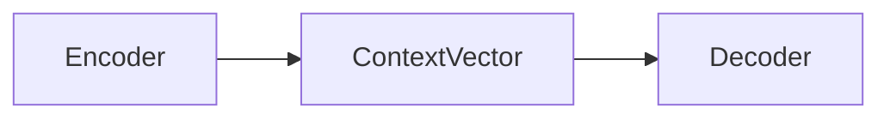

# Seq2Seq 结构

Seq2Seq 是一种常见的NLP模型结构，全称是：Sequence-to-Sequence。它的核心目标是：**将一个长度不固定的输入序列，转换成另一个长度不固定的输出序列**。其典型的任务有：机器翻译任务，文本摘要任务（长文章 -> 简短摘要），对话生成，语言识别（音频特征序列 -> 文本序列），图像描述（图像特征 -> 描述文本），语法纠错，代码生成（自然语言需求 -> 代码序列）等等


首先，我们先介绍一下 Seq2Seq 的基本结构

在此基础上，我们将沿着 Seq2Seq 架构的发展过程，依次介绍一下三个部分：

- **经典 Seq2Seq**
- **Attention 注意力机制**
- **Transformer**

通过这三个部分，我们可以看到 Seq2Seq 建模架构从 **固定长度表示**，再到 **动态关注输入信息**，最后到 **完全基于注意力机制** 的演进过程


## 零、基本结构

Seq2Seq 架构由两部分组成：**<span style="color: red">Encoder 和 Decoder</span>**

其基本流程如下：


首先，输入/输出序列可能是一段英文，一篇文章、用户提的一个问题，图像特征等等一系列可以表示为 Sequence 的二进制流。

接下来，我们来分别解释一下 **Encoder、Context Vector 和 Decoder**。

我们以翻译问题为例，即：`I love machine learning` 翻译为 `我喜欢机器学习`


### 1. Encoder：编码器

编码器逐个读取输入词元，并将输入序列压缩成一个**向量**或一组**隐藏状态**

例如输入：

```python
I -> love -> machine -> learning
```

使用 RNN、LSTM 或 GRU（Gate Recurrent Unit） 编码后，得到隐藏状态 $h_1, h_2, h_3, h_4$，一般情况下，Seq2Seq 通常将最后一个隐藏状态 $h_4$ 作为整个输入序列的语义表示，即：
$$
\text{Context Vector}: c = h_4
$$
其中，`c`被称为上下文向量


### 2. Context Vector

上下文向量的本质是：**编码器对输入序列进行处理后，提供给解码器的输入信息表示。**对于RNN/GRU 来说，上下文向量取得是其神经网络的最后一个隐藏状态 $h_n$，LSTM 取的是最终的隐藏状态和记忆状态$(h_n, c_n)$等等。如今，随着模型发展，Context Vector 已经逐渐从 **单个固定向量** 演变成了 **一组可以被动态查询的隐藏状态**


#### 2.1 经典的 Seq2Seq 的 Context Vector

早期的 Seq2Seq 会把整个输入压缩成一个固定向量，此时
$$
c = h_n
$$
其中，$h$ 为隐藏状态


#### 2.2 Attention 中的 Context Vector

接下来，带**注意力**的 Seq2Seq 使用动态Context Vector：
$$
c_t = \sum_i \alpha_{t,i} h_i
$$
其中：

- $c_t$ 代表在 $t$ 时间步时的 上下文向量
- $\alpha_{t, i}$ 代表解码器在生成第 $t$ 个 token 时，第 $i$ 个状态的权重
- $h_i$ 代表第 $i$ 个隐藏状态


#### 2.3 Transformer 中的 Context Vector

**Transformer** 直接保留完整的编码器输出：
$$
H = [h_1, h_2, ..., h_n]
$$
其形状通常是：`(batch_size, seq_length, hidden_size)`


### 3. Decoder：解码器

解码器根据编码器生成的上下文向量（Context Vector），逐个生成 token。生成过程如下：

```python
<BOS> -> 我 -> 喜欢 -> 机器 -> 学习 -> <EOS>
```

其中：

- `<BOS>`：Begin of Sequence，序列开始标记
- `<EOS>`：End of Sequence, 序列结束标记


Decoder 每生成一个 token 都会参考

- 编码器提供的上下文信息
- 解码器上一步的隐藏状态
- 上一步生成的词元

可以简化表示为：
$$
s_t = f(s_{t-1}, y_{t-1},c)
$$
然后预测当前词元：
$$
P(y_t) = Softmax(Ws_t + b)
$$


## 一、经典 Seq2Seq 架构

###  1. RNN

**RNN（Recurrent Neural Network），循环神经网络**，是一类专门用于处理 Sequence 数据的神经网络

常见的 Sequence 包括：

- 文本序列
- 语言序列
- 时间序列
- 视频帧序列

RNN 在处理当前输入时，会结合前一个时间步保存的信息


#### 1.1 基本结构

RNN  的基本结构如下：



其中：ContextVector 是每个时间步的隐藏状态所代表的向量


#### 1.2 核心原理

假设输入序列为：
$$
x_1, x_2, x_3,..., x_t
$$
RNN 会按照时间顺序依次处理这些输入：


其中：

- $x_t$：第 $t$ 个时间步的输入
- $h_t$：第 $t$ 个时间步的隐藏状态

隐藏状态 $h_t$ 可以理解为 RNN 处理到当前位置时，对前面序列信息的总结

即，RNN 在第 $t$ 个时间步，RNN 会同时接收两个信息：

- **当前输入 $x_t$**
- **上一个时间步的隐藏状态 $h_{t-1}$**

然后 RNN 会计算新的隐藏状态 $h_t$ 和 输出 $y_t$：
$$
h_t = \tanh(W_{xh}x_t + W_{hh}h_{t-1} + b_h) \\ \\
y_t = W_{hy}h_t + b_y
$$
在分类任务中，通常还会对 $y_t$ 使用 softmax：
$$
\hat{y_t} = softmax(y_t)
$$
其中：

- **$W_{xh}$ 表示输入到隐藏状态的权重**
- **$W_{hh}$ 表示隐藏状态之间的循环权重**
- **$W_{hy}$ 表示隐藏状态到输出的权重**
- **$b_h, b_y$ 分别代表偏置项**

**因此，当前隐藏状态 $h_t$ <span style="color: red">不仅包含当前输入的信息，也包含之前时间步传递过来的信息</span>**


#### 1.3 训练方式

RNN 的训练通常采用 **随时间反向传播（BPTT：Backpropagation Through Time）**

首先将 RNN 沿时间轴展开：


然后根据预测结果计算损失

如果每个时间步都有输出，总损失可以写成：
$$
L = \sum_{t=1}^T L_t
$$
之后，梯度会从最后一个时间步依次向前传播
$$
L_t \ \ -> h_t \ \ ->  h_{t-1} \ \ ->  h_{t-2} \ \ -> ...
$$
通过反向传播更新参数：
$$
W_{xh}, W_{hh}, W_{hy}
$$


#### 1.4 RNN 的优缺点

RNN 的**主要优点**包括：

- **能够处理不同长度的序列**
- **能够利用之前时间步的信息**
- **所有时间步共享参数**
- **适合文本、语言和时间序列任务**


RNN 的 **主要缺点**包括：

- **长期依赖能力较弱**：由于梯度消失/爆炸问题，RNN 难以记住很早之前的信息
- **计算必须串行进行**：必须先计算 $h_{t-1}$，才能计算 $h_t$
- **固定维度的隐藏状态存在信息瓶颈**：序列不断增长，但所有历史信息都要压缩到固定长度的隐藏状态中，容易丢失信息


**<span style="color: blue">RNN 虽然具备基础的序列记忆能力，但由于梯度消失、长期依赖和串行计算等问题，随后就衍生了 LSTM 和 GRU 这种网络架构</span>**


###  2. 其他神经网络

这里我们介绍两种神经网络，**LSTM 和 GRU**，它们都是用于改进传统的 RNN 结构的。

**LSTM（Long Short-Term Memory, 长短期记忆网络）**是一种改进版的 RNN，它在隐藏状态之外增加了一个 **Cell State（记忆状态）**，**用于在序列中传递长期信息**，并通过 **Forget Gate（遗忘门）、Input Gate 和 Output Gate** 对信息进行控制。其中，**遗忘门**决定丢弃哪些历史信息，**输入门**决定加入哪些信息，**输出门**则决定当前时刻输出哪些内容，通过这些**<span style="color: red">门控机制</span>**，LSTM 能够更加灵活地保留和更新序列信息，因此可以被广泛用于 Seq2Seq 场景。

**GRU（Gated Recurrent Unit, 门控循环单元）**可以看做 LSTM 的一种简化结构，它不在维护单独的 **Cell State**，而是将 **Cell State** 和 **Hidden State** 合并，并通过 **Update Gate（更新门）** 和 **Reset Gate（重置门）**控制信息的传递。**更新门**负责决定保留多少历史信息以及加入多少当前信息，**重置门**则控制在生成新状态时忽略多少过去的信息。

**相比 LSTM，GRU 的网络结构更简单，参数数量更少**，通常具有**更快的训练速度**和**更低的计算开销**，同时仍能较好地建模长距离依赖关系。在数据规模较小或对训练效率要求较高的任务中，GRU 往往是一种较为实用的选择。


### 3. 优缺点

:a: **优点**

经典的 Seq2Seq 采用 **Encoder-Decoder** 结构，可以将一个可变长度的输入序列转换为另一个可变长度的输出序列，因此能够处理机器翻译、文本摘要、对话生成等输入输出长度不一致的任务。整个模型可以通过端到端的方式进行训练，不需要人为设计复杂的中间特征，与此同时，编码器和解码器在结构上相对独立，可以根据任务选择RNN、LSTM 或 GRU 等不同的循环神经网络，具有较好的灵活性。


:b: **缺点**

**经典 Seq2Seq 最大的问题是 <span style="color: red">固定长度上下文向量</span>。**编码器需要将整个输入序列的信息压缩到一个固定维度的向量中，当输入序列较长时，早期信息容易丢失，形成明显的 **Information Bottleneck（信息瓶颈）。**此外，模型通常基于 RNN、LSTM 或 GRU，因此时间步之间存在依赖，必须按照序列顺序计算，**难以进行充分的并行训练**。

在训练方面，普通 RNN 还容易出现梯度消失或梯度爆炸的问题，LSTM 和 GRU 虽然能够缓解这些问题，但无法完全消除。经典 Seq2Seq 通常会使用 **Teacher Forcing** ，即将真实的前一个词作为解码器的输入，而推理时只能使用模型生成的词，这种差异会导致 **Exposure Bias（暴露偏差）**。一旦某个时间步预测错误，错误还可能继续传递到后续时间步，造成生成结果逐渐偏离正确答案。

**总的来说，**经典 Seq2Seq 结构清晰、能够处理可变长度的序列，是序列生成模型的重要基础，但它在长序列信息保留、并行计算和生成稳定性方面存在明显局限，这些问题也推动了 Attention 和 Transformer 的出现。


下面介绍一下 **Teacher Forcing** 和 **Exposure Bias**

**<span style="color: orange">Teacher Forcing</span>** 是训练 Seq2Seq 解码器时常用的一种方法，它的核心思想是：**在训练阶段，解码器生成下一个词时，使用真实的上一个词作为输入，而不是使用模型自己预测的结果。**

```python
<BOS> → 我 → 喜欢 → 学习 → <EOS>
```

训练过程如下：

```python
输入 <BOS>  → 预测“我”
输入真实的“我” → 预测“喜欢”
输入真实的“喜欢” → 预测“学习”
输入真实的“学习” → 预测 <EOS>
```


它的优点是训练过程更加稳定，因为模型在每个时间步接收到的都是正确的输入，即使前一个时间步预测错误，也不会影响后面的训练过程，因此模型通常能够更快收敛。

但是，它会引发 **<span style="color: orange">Exposure Bias（暴露偏差）</span>**这一问题，<span style="color: red">**因为在训练阶段，模型始终使用的是正确答案，这时它会缺少处理自身错误的经验，这就会导致训练与输出不一致，最终也就是会导致 Exposure Bias 问题**</span>

例如：正确输出应该是

```python
我 -> 喜欢 -> 机器 -> 学习
```

但模型在第二步错误地生成了 ”讨厌“：

```python
我 -> 讨厌 -> ...
```

接下来，这个错误就会一直影响后续生成，形成 **Error Accumulation（误差累积）**

最终，模型的效果表现的就不是很好。


⚠️另外，我们可以通过控制 <span style="color: blue">**Teacher Forcing Ratio 和 Scheduled Sampling**</span> 来缓解暴露偏差的问题。 

**<span style="color: orange">Teacher Forcing Ratio</span> 的思想为实际训练中，不一定每一个时间步都使用真实答案，可以设置一个 Ratio，比如，当 `teacher_forcing_ratio = 0.8` 时，它表示 80% 的概率使用真实词，20% 的概率使用预测词。**

**<span style="color: orange">Scheduled Sampling（计划采样）</span> 是指在训练初期，模型预测能力较弱，因此更多的使用真实答案，刚开始的时候 `teacher_forcing_ratio = 0.9`，随着训练的进行，逐步的降低 Teacher Forcing 的比例，这样会大大地缓解暴露偏差的问题**


## 二、Attention

<span style="color: red">**Attention 的核心思想是：模型在处理当前信息时，不再平均使用所有输入，而是动态的判断“哪些部分更重要”**</span>


### 1. 为什么需要 Attention

在经典的 Seq2Seq 中，Encoder 会依次读取整个输入序列，并将信息压缩到一个固定长度的上下文向量中，之后 Decoder 再依赖这个向量生成完整的输出：
$$
(x_1, x_2, ..., x_n) \xrightarrow{Encoder} \mathbf{c} \xrightarrow{Decoder} (y_1, y_2, ..., y_m)
$$
这样就存在一个明显的问题：**无论输入的句子多长，所有的信息都必须压缩到同一个固定长度的向量中。**那么，**句子变长后，前面的信息可能逐渐的丢失，所以这就会成为经典 Seq2Seq 框架的瓶颈。**

**Attention 的解决方案是：<span style="color: orange">不再只向 Decoder 提供最后一个隐藏状态，而是保留 Encoder 每个时刻的隐藏状态，并让 Decoder 生成每个词时重新选择需要关注的信息</span>**，即：
$$
(x_1, x_2, ..., x_n) \xrightarrow{Encoder} \mathbf{c}_1, \mathbf{c}_2, \mathbf{c}_3,..., \mathbf{c}_t \xrightarrow{Decoder} (y_1, y_2, ..., y_m)
$$
其中，$t$ 代表时间步


下面，我们来直观理解一下 **Attention** 机制

假设需要翻译 `I love machine learning`，Encoder 会为每个词都生成一个隐藏状态$h_1, h_2, h_3, h_4$， 那么，当 Decoder 生成中文词语是，它关注的位置会发生变化（其底层是 **权重的变化**）。

| 时间步 | 主要关注位置          | Attention 权重 ($h_1,h_2,h_3,h_4$) | 生成结果 |
| ------ | --------------------- | ---------------------------------- | -------- |
| t=1    | `I`                   | (**0.85**, 0.08, 0.04, 0.03)       | 我       |
| t=2    | `love`                | (0.05,  **0.80**, 0.10,  0.05)     | 喜欢     |
| t=3    | `machine`、`learning` | (0.02, 0.03, **0.45**, **0.50**)   | 机器学习 |
| t=4    | 句子整体信息          | (0.10, 0.10, 0.35, **0.45**)       | `<EOS>`  |


### 2. Attention 的计算过程

在经典 Seq2Seq Attention 中，主要分为四个步骤：**计算相关性分数，使用 Softmax 归一化，加权求和 和 生成当前输出**


#### 2.1 计算相关性分数

Decoder 首先计算当前状态与每个 Encoder 隐藏状态之间的相关性:
$$
rel_{t,i} = \text{score}(s_{t-1}, h_i) = \text{score}(Q_t, K_i) \\
或 \\
rel_{t,i} = \text{score}(s_{t-1}, h_i, h_i^{'}) = \text{score}(Q_t, K_i, V_i) \\
$$
其中：

- $t$：Decoder 当前生成的位置
- $i$：输入序列中的位置
- $s_{t-1}$ 表示生成第 $t-1$ 个词时，Decoder 的隐藏状态，可视为当前的 Query
- $h_i$ 或 $h_{i}^{'}$ 代表 Encoder 第 $i$ 个位置的隐藏层状态，可视为对应位置的 Key
- $rel_{t, i}$ 表示生成第 $t$ 个词时，第 $i$ 个输入位置的重要程度，也表示 Query 与第 $i$ 个 Key 之间的匹配分数


所以，对于当前的 Transformer 的 Attention 来说，其对应关系如下：
$$
Q_t = s_{t-1} \\
K_i = h_i \\
V_i = h_i
$$
下面介绍的几种 Attention 也秉承此映射关系


**<span style="color: red">接下来，我们来介绍几种计算相关性分数的方式（Attention）</span>**

**:one:Dot-Product Attention**

其公式为：
$$
Attention(Q, K) = QK^T
$$
**向量点积的计算方式天然可以计算相关性分数，因为当两个向量方向比较一致时，点积通常较大，方向相反时，点积为负**


**:two: Scaled Dot-Product Attention**

**Transformer 使用的是此 Attention 的计算方法，其公式为：**
$$
Attention(Q, K, V) = Softmax(\frac{QK^T}{\sqrt{d_k}})V
$$
**其中，$d_k$ 是矩阵 $Q$ 和 $K$ 的维度**

这里除以 $\sqrt{d_k}$ 的原因是可以控制分数的数量级，使得分数的值不会太大或者太小。


:three: **Bilinear Attention：双线性注意力**

双线性 Attention 经常被称为 **General Attention**、Multiplicative Attention、Luong General Attention, 其公式为：
$$
Attention(Q, K) = Q^T W K \\ 
或 \\
Attention(Q, K) = (W^TQ)^T K
$$
其中，$W$ 是一个可训练的权重矩阵，这两个公式的差异是 $W$ 的作用矩阵不同，可以作用到 $K$ 上，也可以作用到 $V$ 上。

其核心思想是：**让模型学习一个变换的空间，即：不单单只是做 $Q$ 到 $K$ 比较，而是做一个 $Q$ 到 $W · K$ 的比较**


:four: **Additive Attention：加性注意力**

加性 Attention 通常也叫 Bahdanau Attention、MLP Attention、Feed-Forward Attention

其常见的公式为：
$$
Attention(Q, K) = \mathbf{v_a}^T \tanh(W_q Q + W_kK + b_a)
$$
其中，$\mathbf{v_a}$ 是一个 **可训练的评分向量**，$b_a$ 代表偏置项，$W_q，W_k$ 分别是权重矩阵

它的变体是 **Concat Attention：拼接注意力**，其公式如下：
$$
Attention(Q,K) = \mathbf{v_a}^T \tanh(W_a[Q;K] + b_a)
$$
可以看到，这个公式和上面的如出一辙，将 $W_a$ 展开就与上述公式一致


#### 2.2 使用 Softmax 归一化

原始分数可能是任意实数，因此需要通过 Softmax 将值转成概率分布，即：
$$
\alpha_{t, i} = \frac{\exp(rel_{t,i})}{\sum_{j=1}^n \exp(e_{t, j})}
$$
得到：
$$
\alpha_t = [\alpha_{t, 1},\  \alpha_{t, 2},\  ...,\  \alpha_{t, n}]
$$


#### 2.3 加权求和

利用注意力权重，对所有 Encoder 的隐藏状态进行加权求和得到当前时刻的上下文向量 $c_t$
$$
\mathbf{c}_t = \sum_{i=1}^n \alpha_{t,i} \mathbf{h}_i
$$


#### 2.4 生成当前输出

Decoder 将上下文向量，上一时刻状态以及上一时刻的输出结合起来：
$$
\mathbf{s}_t = f(s_{t-1}, y_{t-1}, c_t)
$$
然后预测当前词：
$$
P(y_t) = Softmax(W_o[\mathbf{s}_t;\mathbf{c}_t] + b_0)
$$


### 3. Attention 的优缺点

**其优点是它<span style="color: red">更容易捕获长距离的依赖，且支持并行计算</span>，这大大增加了模型训练的速度**

**其缺点是<span style="color: blue">计算量大，需要位置编码且权重和因果贡献相当</span>**


## 三、Transformer

**Transformer 在 Encoder-Decoder 的架构下使用了 <span style="color: red">堆叠的 Self-Attention 和 逐位置的全连接层</span>组件，如下图所示**


**Transformer 延续了 Encoder-Decoder模式，其基本流程是：**
$$
(x_1, x_2, ..., x_n) \xrightarrow{Encoder} \mathbf{z} = (z_1, ..., z_n) \xrightarrow{Decoder} (y_1, y_2,...,y_m)
$$
**在每一个生成的步骤中，模型都采用<span style="color: red">自回归（auto-regressive）</span>的方式，即：在生成下一个输出的时候会使用之前所有的输入**


<span style="color: orange">**Transformer 的核心架构创新如下：**</span>

- <span style="color: orange">**去掉 RNN 和 CNN 的循环结构，仅使用 Attention 建模序列**</span>
- <span style="color: orange">**使用 Self-Attention 作为 Encoder 和 Decoder 的核心**</span>
- <span style="color: orange">**使用 Multi-Head Attention 从多个子空间建模关系**</span>

- <span style="color: orange">**使用 Masked Self-Attention 支持自回归训练**</span>

- <span style="color: orange">**使用位置编码补充顺序信息**</span>


### 1. Self-Attention

自注意力的核心作用是：**让序列中的每个词元，都能够根据当前语境关注同一序列中的其他词元，并融合这些词元的信息，生成新的上下文表示。**


**<span style="color: red">Self-Attention 的公式如下：</span>**
$$

\boxed{
\color{red}
\boldsymbol{
\text{\textbf{Self-Attention}}(Q,K,V)=\text{\textbf{Softmax}}\left(\frac{QK^{T}}{\sqrt{d_k}}\right)V
}
}
$$


**下面解释两个问题：**

**:one: $Q,K,V$  是什么？它们是怎么来的？**

**:a: 是什么**
$$
Q = XW^Q \\
K = XW^K \\
V = XW^V
$$
其中：

- **$X$：输入序列的表示矩阵**
- **$W^Q,W^K,W^V$：模型训练得到的权重矩阵**


**这里的输入序列 $X$ 有必要说一下，他不单单是 Token 的 Embedding 矩阵，而且增加了<span style="color: red">Positional Encoding（位置编码）</span>，即：**
$$
X = E + P
$$


**:b: 来源**

在 **Self-Attention** 中，$Q,K,V$ 均来自一个输入序列 $X$：
$$
Q,K,V \leftarrow X
$$
**虽然，它们来自于同一个输入序列，但是 $ Q,K,V $ 承担着不同的作用**

- **$Q$（Query） 表示当前词元想寻找什么信息，**

- **$K$（Key）表示当前词元可以和什么查询（Query）匹配**
- **$V$（Value）表示当前词元实际提供的是什么信息**

**这就是 $Q,K,V$的直觉理解**


**:two: $\sqrt{d_k}$ 是什么? 为什么要有？**


### 2. Multi-Head Attention


### 3. 位置编码


### 4. Encoder 与 Decoder


### 5. Transformer 的优缺点


