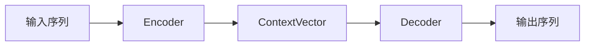
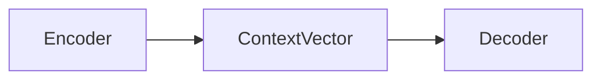

# Seq2Seq 结构

Seq2Seq 是一种常见的NLP模型结构，全称是：Sequence-to-Sequence。它的核心目标是：**将一个长度不固定的输入序列，转换成另一个长度不固定的输出序列**。其典型的任务有：机器翻译任务，文本摘要任务（长文章 -> 简短摘要），对话生成，语言识别（音频特征序列 -> 文本序列），图像描述（图像特征 -> 描述文本），语法纠错，代码生成（自然语言需求 -> 代码序列）等等


首先，我们先介绍一下 Seq2Seq 的基本结构

在此基础上，我们将沿着 Seq2Seq 架构的发展过程，依次介绍一下三个部分：

- **经典 Seq2Seq**
- **Attention 注意力机制**
- **Transformer**

通过这三个部分，我们可以看到 Seq2Seq 建模架构从 **固定长度表示**，再到 **动态关注输入信息**，最后到 **完全基于注意力机制** 的演进过程


## 零、基本结构

Seq2Seq 架构由两部分组成：**<span style="color: red">Encoder 和 Decoder</span>**

其基本流程如下：



首先，输入/输出序列可能是一段英文，一篇文章、用户提的一个问题，图像特征等等一系列可以表示为 Sequence 的二进制流。

接下来，我们来分别解释一下 **Encoder、Context Vector 和 Decoder**。

我们以翻译问题为例，即：`I love machine learning` 翻译为 `我喜欢机器学习`


### 1. Encoder：编码器

编码器逐个读取输入词元，并将输入序列压缩成一个**向量**或一组**隐藏状态**

例如输入：

```python
I -> love -> machine -> learning
```

使用 RNN、LSTM 或 GRU（Gate Recurrent Unit） 编码后，得到隐藏状态 $h_1, h_2, h_3, h_4$，一般情况下，Seq2Seq 通常将最后一个隐藏状态 $h_4$ 作为整个输入序列的语义表示，即：
$$
\text{Context Vector}: c = h_4
$$
其中，`c`被称为上下文向量


### 2. Context Vector

上下文向量的本质是：**编码器对输入序列进行处理后，提供给解码器的输入信息表示。**对于RNN/GRU 来说，上下文向量取得是其神经网络的最后一个隐藏状态 $h_n$，LSTM 取的是最终的隐藏状态和记忆状态$(h_n, c_n)$等等。如今，随着模型发展，Context Vector 已经逐渐从 **单个固定向量** 演变成了 **一组可以被动态查询的隐藏状态**


#### 2.1 经典的 Seq2Seq 的 Context Vector

早期的 Seq2Seq 会把整个输入压缩成一个固定向量，此时
$$
c = h_n
$$
其中，$h$ 为隐藏状态


#### 2.2 Attention 中的 Context Vector

接下来，带**注意力**的 Seq2Seq 使用动态Context Vector：
$$
c_t = \sum_i \alpha_{t,i} h_i
$$
其中：

- $c_t$ 代表在 $t$ 时间步时的 上下文向量
- $\alpha_{t, i}$ 代表解码器在生成第 $t$ 个 token 时，第 $i$ 个状态的权重
- $h_i$ 代表第 $i$ 个隐藏状态


#### 2.3 Transformer 中的 Context Vector

**Transformer** 直接保留完整的编码器输出：
$$
H = [h_1, h_2, ..., h_n]
$$
其形状通常是：`(batch_size, seq_length, hidden_size)`


### 3. Decoder：解码器

解码器根据编码器生成的上下文向量（Context Vector），逐个生成 token。生成过程如下：

```python
<BOS> -> 我 -> 喜欢 -> 机器 -> 学习 -> <EOS>
```

其中：

- `<BOS>`：Begin of Sequence，序列开始标记
- `<EOS>`：End of Sequence, 序列结束标记


Decoder 每生成一个 token 都会参考

- 编码器提供的上下文信息
- 解码器上一步的隐藏状态
- 上一步生成的词元

可以简化表示为：
$$
s_t = f(s_{t-1}, y_{t-1},c)
$$
然后预测当前词元：
$$
P(y_t) = Softmax(Ws_t + b)
$$


## 一、经典 Seq2Seq 架构

###  1. RNN

**RNN（Recurrent Neural Network），循环神经网络**，是一类专门用于处理 Sequence 数据的神经网络

常见的 Sequence 包括：

- 文本序列
- 语言序列
- 时间序列
- 视频帧序列

RNN 在处理当前输入时，会结合前一个时间步保存的信息


#### 1.1 基本结构

RNN  的基本结构如下：



其中：ContextVector 是每个时间步的隐藏状态所代表的向量


#### 1.2 核心原理

假设输入序列为：
$$
x_1, x_2, x_3,..., x_t
$$
RNN 会按照时间顺序依次处理这些输入：


其中：

- $x_t$：第 $t$ 个时间步的输入
- $h_t$：第 $t$ 个时间步的隐藏状态

隐藏状态 $h_t$ 可以理解为 RNN 处理到当前位置时，对前面序列信息的总结

即，RNN 在第 $t$ 个时间步，RNN 会同时接收两个信息：

- **当前输入 $x_t$**
- **上一个时间步的隐藏状态 $h_{t-1}$**

然后 RNN 会计算新的隐藏状态 $h_t$ 和 输出 $y_t$：
$$
h_t = \tanh(W_{xh}x_t + W_{hh}h_{t-1} + b_h) \\ \\
y_t = W_{hy}h_t + b_y
$$
在分类任务中，通常还会对 $y_t$ 使用 softmax：
$$
\hat{y_t} = softmax(y_t)
$$
其中：

- **$W_{xh}$ 表示输入到隐藏状态的权重**
- **$W_{hh}$ 表示隐藏状态之间的循环权重**
- **$W_{hy}$ 表示隐藏状态到输出的权重**
- **$b_h, b_y$ 分别代表偏置项**

**因此，当前隐藏状态 $h_t$ <span style="color: red">不仅包含当前输入的信息，也包含之前时间步传递过来的信息</span>**


#### 1.3 训练方式

RNN 的训练通常采用 **随时间反向传播（BPTT：Backpropagation Through Time）**

首先将 RNN 沿时间轴展开：


然后根据预测结果计算损失

如果每个时间步都有输出，总损失可以写成：
$$
L = \sum_{t=1}^T L_t
$$
之后，梯度会从最后一个时间步依次向前传播
$$
L_t \ \ -> h_t \ \ ->  h_{t-1} \ \ ->  h_{t-2} \ \ -> ...
$$
通过反向传播更新参数：
$$
W_{xh}, W_{hh}, W_{hy}
$$


#### 1.4 RNN 的优缺点

RNN 的**主要优点**包括：

- **能够处理不同长度的序列**
- **能够利用之前时间步的信息**
- **所有时间步共享参数**
- **适合文本、语言和时间序列任务**


RNN 的 **主要缺点**包括：

- **长期依赖能力较弱**：由于梯度消失/爆炸问题，RNN 难以记住很早之前的信息
- **计算必须串行进行**：必须先计算 $h_{t-1}$，才能计算 $h_t$
- **固定维度的隐藏状态存在信息瓶颈**：序列不断增长，但所有历史信息都要压缩到固定长度的隐藏状态中，容易丢失信息


**<span style="color: blue">RNN 虽然具备基础的序列记忆能力，但由于梯度消失、长期依赖和串行计算等问题，随后就衍生了 LSTM 和 GRU 这种网络架构</span>**


###  2. 其他神经网络

这里我们介绍两种神经网络，**LSTM 和 GRU**，它们都是用于改进传统的 RNN 结构的。

**LSTM（Long Short-Term Memory, 长短期记忆网络）**是一种改进版的 RNN，它在隐藏状态之外增加了一个 **Cell State（记忆状态）**，**用于在序列中传递长期信息**，并通过 **Forget Gate（遗忘门）、Input Gate 和 Output Gate** 对信息进行控制。其中，**遗忘门**决定丢弃哪些历史信息，**输入门**决定加入哪些信息，**输出门**则决定当前时刻输出哪些内容，通过这些**<span style="color: red">门控机制</span>**，LSTM 能够更加灵活地保留和更新序列信息，因此可以被广泛用于 Seq2Seq 场景。

**GRU（Gated Recurrent Unit, 门控循环单元）**可以看做 LSTM 的一种简化结构，它不在维护单独的 **Cell State**，而是将 **Cell State** 和 **Hidden State** 合并，并通过 **Update Gate（更新门）** 和 **Reset Gate（重置门）**控制信息的传递。**更新门**负责决定保留多少历史信息以及加入多少当前信息，**重置门**则控制在生成新状态时忽略多少过去的信息。

**相比 LSTM，GRU 的网络结构更简单，参数数量更少**，通常具有**更快的训练速度**和**更低的计算开销**，同时仍能较好地建模长距离依赖关系。在数据规模较小或对训练效率要求较高的任务中，GRU 往往是一种较为实用的选择。


### 3. 优缺点

:a: **优点**

经典的 Seq2Seq 采用 **Encoder-Decoder** 结构，可以将一个可变长度的输入序列转换为另一个可变长度的输出序列，因此能够处理机器翻译、文本摘要、对话生成等输入输出长度不一致的任务。整个模型可以通过端到端的方式进行训练，不需要人为设计复杂的中间特征，与此同时，编码器和解码器在结构上相对独立，可以根据任务选择RNN、LSTM 或 GRU 等不同的循环神经网络，具有较好的灵活性。


:b: **缺点**

**经典 Seq2Seq 最大的问题是 <span style="color: red">固定长度上下文向量</span>。**编码器需要将整个输入序列的信息压缩到一个固定维度的向量中，当输入序列较长时，早期信息容易丢失，形成明显的 **Information Bottleneck（信息瓶颈）。**此外，模型通常基于 RNN、LSTM 或 GRU，因此时间步之间存在依赖，必须按照序列顺序计算，**难以进行充分的并行训练**。

在训练方面，普通 RNN 还容易出现梯度消失或梯度爆炸的问题，LSTM 和 GRU 虽然能够缓解这些问题，但无法完全消除。经典 Seq2Seq 通常会使用 **Teacher Forcing** ，即将真实的前一个词作为解码器的输入，而推理时只能使用模型生成的词，这种差异会导致 **Exposure Bias（暴露偏差）**。一旦某个时间步预测错误，错误还可能继续传递到后续时间步，造成生成结果逐渐偏离正确答案。

**总的来说，**经典 Seq2Seq 结构清晰、能够处理可变长度的序列，是序列生成模型的重要基础，但它在长序列信息保留、并行计算和生成稳定性方面存在明显局限，这些问题也推动了 Attention 和 Transformer 的出现。


下面介绍一下 **Teacher Forcing** 和 **Exposure Bias**

**<span style="color: orange">Teacher Forcing</span>** 是训练 Seq2Seq 解码器时常用的一种方法，它的核心思想是：**在训练阶段，解码器生成下一个词时，使用真实的上一个词作为输入，而不是使用模型自己预测的结果。**

```python
<BOS> → 我 → 喜欢 → 学习 → <EOS>
```

训练过程如下：

```python
输入 <BOS>  → 预测“我”
输入真实的“我” → 预测“喜欢”
输入真实的“喜欢” → 预测“学习”
输入真实的“学习” → 预测 <EOS>
```


它的优点是训练过程更加稳定，因为模型在每个时间步接收到的都是正确的输入，即使前一个时间步预测错误，也不会影响后面的训练过程，因此模型通常能够更快收敛。

但是，它会引发 **<span style="color: orange">Exposure Bias（暴露偏差）</span>**这一问题，<span style="color: red">**因为在训练阶段，模型始终使用的是正确答案，这时它会缺少处理自身错误的经验，这就会导致训练与输出不一致，最终也就是会导致 Exposure Bias 问题**</span>

例如：正确输出应该是

```python
我 -> 喜欢 -> 机器 -> 学习
```

但模型在第二步错误地生成了 ”讨厌“：

```python
我 -> 讨厌 -> ...
```

接下来，这个错误就会一直影响后续生成，形成 **Error Accumulation（误差累积）**

最终，模型的效果表现的就不是很好。


⚠️另外，我们可以通过控制 <span style="color: blue">**Teacher Forcing Ratio 和 Scheduled Sampling**</span> 来缓解暴露偏差的问题。 

**<span style="color: orange">Teacher Forcing Ratio</span> 的思想为实际训练中，不一定每一个时间步都使用真实答案，可以设置一个 Ratio，比如，当 `teacher_forcing_ratio = 0.8` 时，它表示 80% 的概率使用真实词，20% 的概率使用预测词。**

**<span style="color: orange">Scheduled Sampling（计划采样）</span> 是指在训练初期，模型预测能力较弱，因此更多的使用真实答案，刚开始的时候 `teacher_forcing_ratio = 0.9`，随着训练的进行，逐步的降低 Teacher Forcing 的比例，这样会大大地缓解暴露偏差的问题**


## 二、Attention

<span style="color: red">**Attention 的核心思想是：模型在处理当前信息时，不再平均使用所有输入，而是动态的判断“哪些部分更重要”**</span>


### 1. 为什么需要 Attention

在经典的 Seq2Seq 中，Encoder 会依次读取整个输入序列，并将信息压缩到一个固定长度的上下文向量中，之后 Decoder 再依赖这个向量生成完整的输出：
$$
(x_1, x_2, ..., x_n) \xrightarrow{Encoder} \mathbf{c} \xrightarrow{Decoder} (y_1, y_2, ..., y_m)
$$
这样就存在一个明显的问题：**无论输入的句子多长，所有的信息都必须压缩到同一个固定长度的向量中。**那么，**句子变长后，前面的信息可能逐渐的丢失，所以这就会成为经典 Seq2Seq 框架的瓶颈。**

**Attention 的解决方案是：<span style="color: orange">不再只向 Decoder 提供最后一个隐藏状态，而是保留 Encoder 每个时刻的隐藏状态，并让 Decoder 生成每个词时重新选择需要关注的信息</span>**，即：
$$
(x_1, x_2, ..., x_n) \xrightarrow{Encoder} \mathbf{c}_1, \mathbf{c}_2, \mathbf{c}_3,..., \mathbf{c}_t \xrightarrow{Decoder} (y_1, y_2, ..., y_m)
$$
其中，$t$ 代表时间步


下面，我们来直观理解一下 **Attention** 机制

假设需要翻译 `I love machine learning`，Encoder 会为每个词都生成一个隐藏状态$h_1, h_2, h_3, h_4$， 那么，当 Decoder 生成中文词语是，它关注的位置会发生变化（其底层是 **权重的变化**）。

| 时间步 | 主要关注位置          | Attention 权重 ($h_1,h_2,h_3,h_4$) | 生成结果 |
| ------ | --------------------- | ---------------------------------- | -------- |
| t=1    | `I`                   | (**0.85**, 0.08, 0.04, 0.03)       | 我       |
| t=2    | `love`                | (0.05,  **0.80**, 0.10,  0.05)     | 喜欢     |
| t=3    | `machine`、`learning` | (0.02, 0.03, **0.45**, **0.50**)   | 机器学习 |
| t=4    | 句子整体信息          | (0.10, 0.10, 0.35, **0.45**)       | `<EOS>`  |


### 2. Attention 的计算过程

在经典 Seq2Seq Attention 中，主要分为四个步骤：**计算相关性分数，使用 Softmax 归一化，加权求和 和 生成当前输出**


#### 2.1 计算相关性分数

Decoder 首先计算当前状态与每个 Encoder 隐藏状态之间的相关性:
$$
rel_{t,i} = \text{score}(s_{t-1}, h_i) = \text{score}(Q_t, K_i) \\
或 \\
rel_{t,i} = \text{score}(s_{t-1}, h_i, h_i^{'}) = \text{score}(Q_t, K_i, V_i) \\
$$
其中：

- $t$：Decoder 当前生成的位置
- $i$：输入序列中的位置
- $s_{t-1}$ 表示生成第 $t-1$ 个词时，Decoder 的隐藏状态，可视为当前的 Query
- $h_i$ 或 $h_{i}^{'}$ 代表 Encoder 第 $i$ 个位置的隐藏层状态，可视为对应位置的 Key
- $rel_{t, i}$ 表示生成第 $t$ 个词时，第 $i$ 个输入位置的重要程度，也表示 Query 与第 $i$ 个 Key 之间的匹配分数


所以，对于当前的 Transformer 的 Attention 来说，其对应关系如下：
$$
Q_t = s_{t-1} \\
K_i = h_i \\
V_i = h_i
$$
下面介绍的几种 Attention 也秉承此映射关系


**<span style="color: red">接下来，我们来介绍几种计算相关性分数的方式（Attention）</span>**

**:one:Dot-Product Attention**

其公式为：
$$
Attention(Q, K) = QK^T
$$
**向量点积的计算方式天然可以计算相关性分数，因为当两个向量方向比较一致时，点积通常较大，方向相反时，点积为负**


**:two: Scaled Dot-Product Attention**

**Transformer 使用的是此 Attention 的计算方法，其公式为：**
$$
Attention(Q, K, V) = Softmax(\frac{QK^T}{\sqrt{d_k}})V
$$
**其中，$d_k$ 是矩阵 $Q$ 和 $K$ 的维度**

这里除以 $\sqrt{d_k}$ 的原因是可以控制分数的数量级，使得分数的值不会太大或者太小。


:three: **Bilinear Attention：双线性注意力**

双线性 Attention 经常被称为 **General Attention**、Multiplicative Attention、Luong General Attention, 其公式为：
$$
Attention(Q, K) = Q^T W K \\ 
或 \\
Attention(Q, K) = (W^TQ)^T K
$$
其中，$W$ 是一个可训练的权重矩阵，这两个公式的差异是 $W$ 的作用矩阵不同，可以作用到 $K$ 上，也可以作用到 $V$ 上。

其核心思想是：**让模型学习一个变换的空间，即：不单单只是做 $Q$ 到 $K$ 比较，而是做一个 $Q$ 到 $W · K$ 的比较**


:four: **Additive Attention：加性注意力**

加性 Attention 通常也叫 Bahdanau Attention、MLP Attention、Feed-Forward Attention

其常见的公式为：
$$
Attention(Q, K) = \mathbf{v_a}^T \tanh(W_q Q + W_kK + b_a)
$$
其中，$\mathbf{v_a}$ 是一个 **可训练的评分向量**，$b_a$ 代表偏置项，$W_q，W_k$ 分别是权重矩阵

它的变体是 **Concat Attention：拼接注意力**，其公式如下：
$$
Attention(Q,K) = \mathbf{v_a}^T \tanh(W_a[Q;K] + b_a)
$$
可以看到，这个公式和上面的如出一辙，将 $W_a$ 展开就与上述公式一致


#### 2.2 使用 Softmax 归一化

原始分数可能是任意实数，因此需要通过 Softmax 将值转成概率分布，即：
$$
\alpha_{t, i} = \frac{\exp(rel_{t,i})}{\sum_{j=1}^n \exp(e_{t, j})}
$$
得到：
$$
\alpha_t = [\alpha_{t, 1},\  \alpha_{t, 2},\  ...,\  \alpha_{t, n}]
$$


#### 2.3 加权求和

利用注意力权重，对所有 Encoder 的隐藏状态进行加权求和得到当前时刻的上下文向量 $c_t$
$$
\mathbf{c}_t = \sum_{i=1}^n \alpha_{t,i} \mathbf{h}_i
$$


#### 2.4 生成当前输出

Decoder 将上下文向量，上一时刻状态以及上一时刻的输出结合起来：
$$
\mathbf{s}_t = f(s_{t-1}, y_{t-1}, c_t)
$$
然后预测当前词：
$$
P(y_t) = Softmax(W_o[\mathbf{s}_t;\mathbf{c}_t] + b_0)
$$


### 3. Attention 的优缺点

**其优点是它<span style="color: red">更容易捕获长距离的依赖，且支持并行计算</span>，这大大增加了模型训练的速度**

**其缺点是<span style="color: blue">计算量大，需要位置编码且权重和因果贡献相当</span>**


## 三、Transformer（2017）

**Transformer 延续了 Encoder-Decoder模式，其基本流程是：**
$$
(x_1, x_2, ..., x_n) \xrightarrow{Encoder} \mathbf{z} = (z_1, ..., z_n) \xrightarrow{Decoder} (y_1, y_2,...,y_m)
$$
**在每一个生成的步骤中，模型都采用<span style="color: red">自回归（auto-regressive）</span>的方式，即：在生成下一个输出的时候会使用之前所有的输入**


<span style="color: orange">**Transformer 的核心架构创新如下：**</span>

- <span style="color: orange">**去掉 RNN 和 CNN 的循环结构，仅使用 Attention 建模序列**</span>
- <span style="color: orange">**使用 Self-Attention 作为 Encoder 和 Decoder 的核心**</span>
- <span style="color: orange">**使用 Multi-Head Attention 从多个子空间建模关系**</span>

- <span style="color: orange">**使用 Masked Self-Attention 支持自回归训练**</span>

- <span style="color: orange">**使用位置编码补充顺序信息**</span>


**下面，我们来讲解一下这个图**


:a: **Encoder：位于图左**

**Encoder 由 $N$（默认 $N=6$） 个相同的层（Layers）组合堆叠而成，每一层都包含两个子层（Sub-layer）：第一个子层是<span style="color: red">多头自注意力机制</span>，第二个子层是<span style="color: red">逐位置的全连接的前馈神经网络</span>。在这两个子层之间，我们应用了残差连接，紧接着又使用了层归一化。这样，每个子层（Sub-layer）的输出就是 **
$$
\text{Output}_{Sub-layer} = \text{LayerNorm}(x + \text{Sublayer}(x))
$$
**其中：$\text{Sublayer}(x)$ 是由子层 Sub-layer 自己实现的一个函数**

**为了使用残差连接，模型里的所有子层（Sub-layer）和嵌入层都必须产生 $d_{model} $ （默认 $d_{model} = 512$）维度的输出**

**全连接的前馈神经网络 FFN 为：**
$$
FFN(x) = \max(0, xW_1 + b_1)W_2 + b_2
$$


**:b: Decoder：位于图右**

**Decoder 也是由 $N$ （默认 $N=6$）个相同的层（Layers）堆叠起来的。除了在 Encoder 中的那两个子层外，Decoder 还有另一种子层（Sub layer）：它在 Encoder 堆叠的输出之上执行了<span style="color: red"> Masked Multi-head Attention</span>。和 Encoder 相似，每个子层（Sub-layer）也使用了残差连接和层归一化。我们还修改了 Decoder 中的自注意力子层，使得当前位置无法关注后续位置（subsequent position）。通过这种掩码机制，再结合输出的嵌入矩阵向后偏移一个位置的事实，就可以保证位置 $i$ 的预测仅依赖于位置小于 $i$ 的输出**


### 1. 位置编码

**在 Transformer 中，因为没有循环和卷积网络，所以为了使模型能够利用Sequence 的顺序信息，我们必须了解一个词在一个序列中的位置信息。为此，我们在 Encoder 和 Decoder 输入的时候加入了 <span style="color: red">Positional encoding</span>，位置编码和嵌入矩阵有着相同的维度**


在 Transformer 中，使用的是 **Sinusoidal Positional Encoding，即：正弦位置编码**

位置编码定义为：
$$
PE(pos, 2i) = \large \sin \left(\frac{pos}{10000^{{2i}/{d_{model}}}}\right) \\ \\
PE(pos, 2i + 1) = \large \cos \left(\frac{pos}{10000^{{2i}/{d_{model}}}}\right) \\
$$
其中：

- $pos$：词元在序列中的位置，例如 $0, 1, 2,, ...$
- $i$：维度
- $d_{model}$：模型隐藏层的维度


选择此位置编码算法的**最重要的原因**是**容易表达相对位置，即：** <span style="color: orange">**对于固定的偏移量 $k$ 来说，$PE(pos + k)$ 可以由 $PE(pos)$ 来表示**</span>，其原理是三角函数的和差公式。

另外，还有**一个原因**，是**<span style="color: orange">不同频率可以表达不同尺度的位置关系</span>**

对于：

- **较小**的 $i$ 来说：$i$ **越小**，分母越小，频率越高，变化的越快，**这样它就能够很敏感的区分相邻的位置**
- **较大**的 $i$ 来说：$i$ **越大**，分母越大，频率越低，变化的越慢，**就更适合描述大范围的位置变化**

因此，**不同维度共同提供了多种位置尺度**


<span style="color: #a11420">**这和钟表有些类似：秒针变化的快，分针变化慢，时针变化的更慢，但是多种不同速度的指针组合起来，就可以唯一地描述当前的时间。**</span>

<span style="color: red">**位置编码也一样，它通过多个不同频率的曲线共同表示位置**</span>


#### # 计算过程示例

当：

$$
d_{\text{model}}=4
$$

时，每个词元的位置编码向量有 4 个维度：

$$
PE(pos)=
\left[
PE(pos,0),
PE(pos,1),
PE(pos,2),
PE(pos,3)
\right]
$$

此时：

$$
i=0,1
$$

因为每个 $i$ 负责一组维度：

- $i=0$ 对应第 $0$、$1$ 维
- $i=1$ 对应第 $2$、$3$ 维

当 $i=0$ 时：

$$
PE(pos,0)
=
\sin\left(
\frac{pos}{10000^{0/4}}
\right)
=
\sin(pos)
$$

$$
PE(pos,1)
=
\cos\left(
\frac{pos}{10000^{0/4}}
\right)
=
\cos(pos)
$$

当 $i=1$ 时：

$$
PE(pos,2)
=
\sin\left(
\frac{pos}{10000^{2/4}}
\right)
=
\sin\left(\frac{pos}{100}\right)
$$

$$
PE(pos,3)
=
\cos\left(
\frac{pos}{10000^{2/4}}
\right)
=
\cos\left(\frac{pos}{100}\right)
$$

因此：

$$
PE(pos)=
\left[
\sin(pos),
\cos(pos),
\sin\left(\frac{pos}{100}\right),
\cos\left(\frac{pos}{100}\right)
\right]
$$

例如，当：

$$
pos=2
$$

时：

$$
PE(2)=
\left[
\sin(2),
\cos(2),
\sin\left(\frac{2}{100}\right),
\cos\left(\frac{2}{100}\right)
\right]
$$

近似结果为：

$$
PE(2)\approx
\left[
0.9093,
-0.4161,
0.0200,
0.9998
\right]
$$


### 2. Scaled Dot-Product Attention


自注意力的核心作用是：**让序列中的每个词元，都能够根据当前语境关注同一序列中的其他词元，并融合这些词元的信息，生成新的上下文表示。**


**<span style="color: red">Scaled Dot-Product Attention(Self-Attention) 的公式如下：</span>**
$$
\boxed{
\color{red}
\boldsymbol{
\text{\textbf{Self-Attention}}(Q,K,V)=\text{\textbf{Softmax}}\left(\frac{QK^{T}}{\sqrt{d_k}}\right)V
}
}
$$

$Q,K,V$ 的形状是
$$
Q\in\mathbb{R}^{n\times d_k} \\
K \in \mathbb{R}^{n\times d_k} \\
V \in \mathbb{R}^{n \times d_v}
$$


上述公式展开之后可以是
$$
\operatorname{Self-Attention}(X)
=
\operatorname{Softmax}
\left(
\frac{(XW_Q)(XW_K)^T}{\sqrt{d_k}}
\right)
XW_V
$$
再进一步展开
$$
\text{Self-Attention}(X) = \operatorname{Self-Attention}(E+P)
=
\operatorname{Softmax}
\left(
\frac{
((E+P)W_Q)
((E+P)W_K)^T
}{
\sqrt{d_k}
}
\right)
(E+P)W_V
$$
其中：

- $n$ 表示序列中的词元数量
- $d_k$ 表示单个 $Q$ 或 $K$ 的特征维度
- $d_v$ 表示 $V$ 的特征维度
- $X,E,P \in \mathbb{R}^{n \times d_{model}}$ 分别表示输入序列矩阵，嵌入矩阵和位置编码矩阵


**下面解释两个问题：**

**:one: $Q,K,V$  是什么？它们是怎么来的？**

**:a: $Q,K,V$ 分别是什么？**

在 **Self-Attention** 中，每个输入序列 $X$ 会产生 $Q,K,V$ 矩阵：
$$
Q,K,V \leftarrow X
$$
**虽然，它们来自于同一个输入序列，但是 $ Q,K,V $ 承担着不同的作用**

- **$Q$（Query） 表示当前词元想寻找什么信息**

- **$K$（Key）表示当前词元可以和什么查询（Query）匹配**
- **$V$（Value）表示当前词元实际提供的是什么信息**

**这就是 $Q,K,V$的直觉理解**


**:b: $Q,K,V$ 的来源**

$Q,K,V$ 不是人为提前定义好的，它们是由输入向量（矩阵） $X$ 经过三个不同的**线性变换**得到的，如下所示
$$
Q = XW^Q \\
K = XW^K \\
V = XW^V
$$
其中：

- **$X$：输入序列的表示矩阵**
- **$W^Q,W^K,W^V$：模型训练得到的权重矩阵**


**这里的输入序列 $X$ 有必要说一下，他不单单是 Token 的 Embedding 矩阵，而且增加了<span style="color: red">Positional Encoding（位置编码）</span>，即：**
$$
X = E + P
$$


**:two: $\sqrt{d_k}$ 是什么? 为什么要有？**

Transformer 使用的相关性分数不是简单的 $QK^T$，而是：
$$
\frac{QK^T}{\sqrt{d_k}}
$$
其中，**$d_k$ 是 $Query$ 和 $Key$ 的特征维度，也就是 $Q$ 的列数或者说 $K^T$ 的行数**

当向量维度较大时，点积结果的绝对值容易变得很大，将较大的数送入 $Softmax$ ，可能会是概率分布过于极端，例如，$[0.001, 0.001, 0.998]$，这会导致 $Softmax$ 梯度较大或较小，不利于模型训练。除以 $\sqrt{d_k}$ 后，可以控制分数的数值范围，使训练更加稳定，这种机制称为**<span style="color: red">缩放点积注意力</span>**


### 3. Multi-Head Attention


**多头注意力是<span style="color: red">将 $Q,K,V$ 分别投影 $h$ 次，将其投影到多个不同的子空间，我们并行的计算每个子空间中的 Attention，之后将这些输出拼接起来，再次进行投影，最终得到最后的输出值。</span>**

**其公式如下：**
$$
\color{red}
\boxed{
\text{MultiHead Attention}(Q,K,V) = \text{Concat}(head_1, ..., head_h)W^O 
}
$$
**其中：**
$$
\color{red}
\boxed{
head_{\text{i}} = \text{Self-Attention}(QW_i^Q, KW_i^K, VW_i^V)
}
$$


**我们关注一下这个问题，⚠️⚠️⚠️什么是“不同的表示子空间”？**

**假设一个词元原来的向量为：**
$$
x \in \mathbb{R}^{d_{model}}
$$
**经过不同的投影矩阵（投影 $h$ 次）后，会得到很多不同的表示：**
$$
xW^Q_1, xW^Q_1,..., \ xW^Q_h, 
$$
**这些向量虽然都来自同一个词元，但包含的信息⚠️侧重点不同⚠️**

**例如，对于 “苹果” 这个词（词元）来说：**

- 一个子空间可能更**关注它<span style="color: orange">作为食物</span>的语义**
- 一个子空间可能更**关注它<span style="color: orange">与“吃”的关系</span>**
- 一个子空间可能更**关注它<span style="color: orange">与前后词元的位置关系</span>**
- 一个子空间可能更**关注它<span style="color: orange">是名词还是动词</span>**


**在 Transformer 中，多头注意力以三种不同的方式使用：**

- **<span style="color: red">Cross-Attention：</span>在 "encoder-decoder attention" 连接的地方，$Q$ 矩阵来源于之前 decoder 层的输出，而 $K,V$ 来自于 encoder 的输出。这样，decoder  的每个位置就能关注到输入序列中的所有位置。这种机制就类似于典型的 Seq2Seq 模型的 encoder-decoder 注意力一样**
- **<span style="color: red">Encoder Self-Attention：</span>Encoder 包含 Self-Attention 层，在 Self-Attention 中，$Q,K,V$ 均来自于 Encoder 中的上一层的输出。这样，Encoder 的每个位置就可以关注 Encoder 上一层的所有位置**

- **<span style="color: red">Masked Self-Attention：</span>Decoder 中的 Self-Attention 允许关注 Decoder 中截至当前位置的所有位置。为了保证自回归的特性，我们需要阻止 Decoder 中从右向左的信息流。我们通过在缩放点积注意力中使用掩码来实现这一点，即将 Softmax 输入中所有的非法连接的位置设置为 $-\infty$**


### 4. 图解 Attention


## 四、Transformer 架构的优化

Transformer 的优化方向很多，下面以 **Transformer 内部组件，到整体架构，再到工程实现和应用扩展**这样的顺序来介绍。其中，注意力机制优化、位置表示优化和 Block 优化属于**模型内部的结构**；整体架构优化和参数容量优化属于**模型级设计**；系统与计算优化属于**工程实现**；多模态架构扩展属于**应用范围扩展**。

| 优化分类                   | 典型方案                                                     |
| -------------------------- | ------------------------------------------------------------ |
| **注意力机制优化**         | 稀疏注意力：Longformer、BigBird<br />近似注意力：Linformer、Performer、Reformer<br />QKV 结构优化：MQA、GQA、MLA |
| **位置表示优化**           | 相对位置编码、RoPE、ALiBi                                    |
| **Transformer Block 优化** | 归一化位置优化：Pre-Norm<br />归一化方法优化：RMSNorm<br />前馈网络优化：SwiGLU、GEGLU |
| **整体架构优化**           | 长序列记忆机制：Transformer-XL<br />单向生成架构：Decoder-only Transformer<br />混合序列架构：Jamba、Griffin |
| **参数容量优化**           | 混合专家模型：MoE<br />稀疏专家路由：Switch Transformer<br />细粒度专家结构：DeepSeekMoE |
| **系统与计算优化**         | 注意力计算优化：FlashAttention<br />KV Cache 管理：PagedAttention<br />请求调度优化：Continuous Batching |
| **多模态架构扩展**         | 图像理解：Vision Transformer<br />分层视觉建模：Swin Transformer<br />扩散生成：Diffusion Transformer |


### 1. 内部结构优化

#### 1.1 注意力机制优化

> *内容简介*
>
> <span style="color: orange">**`1.1.1` — `1.1.5` 主要解决的是长序列计算问题**</span>
>
> <span style="color: orange">**`1.1.6` 主要解决的是KV Cache 占用过大的问题**</span>


> *<span style="color: #772125">Longformer 与 BigBird 都是稀疏注意力机制</span>*

##### 1.1.1 Longformer

Longformer 将注意力分成两种：**局部窗口注意力** 和 **全局注意力**。

在**局部窗口注意力**中，**每个 Token 只关注附近固定范围内的 token**，这就类似于 word2vec  算法中的 `windows_size`，这样做的好处是：假设窗口大小为 $w$，序列长度为 $n$，则 Attention 计算的复杂度可以由 $O(n^2)$ 变成 $O(nw)$，当 $w \ll n$ 时，则复杂度甚至可以降低到线性复杂度

在**全局注意力**中，它允许**某些特殊的 Token 使用全局注意力，即：关注整个序列**

因此，Longformer 可以概括为：
$$
\text{Longformer} = \text{Local Attention} \ + \ \text{Global Attention}
$$
**它更适合长文档分类、长文本问答和文档摘要等任务**


##### 1.1.2 BigBird

BigBird 使用三类注意力链接：
$$
\text{BigBird Attention} = \text{Local Attention} \ + \ \text{Random Attention} \ + \ \text{Global Attention} 
$$
**Local Attention** 和 **Global Attention** 在介绍 **Longformer** 的时候已经介绍过，我们现在只介绍 **Random Attention**，它**使得某个Token 随机关注部分远距离的 Token,**这样信息可以在不同区域之间传递


> *<span style="color: #772125">Linformer、Performer 和 Reformer 都属于近似注意力机制</span>*

##### 1.1.3 Linformer

其核心思想是：**将 Attention 矩阵压缩到更低维度，**这里的假设是低秩的矩阵也会体现出一部分特性

标准的 Attention 中：
$$
K, V \in \mathbb{R}^{n \times d}
$$
Linformer 使用投影矩阵压缩维度：
$$
K' = EK \\
V' = FV
$$
其中：
$$
E,F \in \mathbb{R}^{k\times n}, k \ll n
$$
则
$$
K',V' \in \mathbb{R}^{k \times d}
$$
这样，当 $k \ll n$ 时，Attention 的计算量就会很小，本质上也是一种**低秩近似**


##### 1.1.4 Performer

它的核心思想是：**使用核函数和随机特征映射近似 Attention 的计算**

标准计算为：
$$
\text{Attention}(Q,K,V) = \text{Softmax}(\frac{QK^T}{\sqrt{d_k}})V
$$
Performer 使用特征映射 $\phi$，将其近似转换为：
$$
\text{Attention} = \phi(Q)(\phi(K)^T V)
$$
这样，就可以先算 $\phi(K)^T V$ ，之后再左乘 $\phi(Q)$


##### 1.1.5 Reformer

Reformer 主要包含两项优化：**LHS Attention** 和 **Reversible Residual Layers**

- LHS（Locality-Sensitive Hashing）Attention：**局部敏感哈希**

它会将相似的 $Q$ 和 $K$ 分配到相同或相近的桶中，这样模型只在同一个桶内计算 Attention，而不是让所有的 token 两两计算。

- Reversible Residual Layers：**可逆残差层**

普通 Transformer 在训练时需要保存每一层的中间激活值，用于反向传播。可逆网络则可以根据后一层结果重新计算前一层结果，因此不需要保存所有层的完整激活值，可以降低训练显存占用。


> *<span style="color: #772125">MQA、GQA 和 MLA 都属于 QKV 的结构优化</span>：解决 **<span style="color: red">KV Cache</span>** 过大的问题*
>
> 再看这部分之前，我们先来说一个问题：*为什么需要 KV Cache？*
>
> **因为**生成第一个 token 时，模型会计算所有历史的 Token 的 $K$ 和 $V$，那么，生成下一个 token 时，历史 Token 的 $K$ 和 $V$ 没有发生变化，没必要重新计算，所以产生了 **KV Cache**。
>
> 慢慢的你会发现，随着上下文长度、Transformer 的层数，注意力头的数量等等的增加，KV Cache 还是会快速变大。
>
> 所以，为了解决这一痛点，就衍生出了以下三种算法

##### 1.1.6 MQA、GQA 和 MLA

**:one: MQA：Multi-Query Attention 多组查询注意力**


**:two: GQA：Grouped-Query Attention，分组查询注意力**


**:three: MLA：Multi-Head Latent Attention，多头隐空间注意力**


#### 1.2 Positional Encoding 优化

> $q^Tk$ 和 $qk^T$ 本质上都是向量的点积，只不过是向量方向约定不同

##### 1.2.1 相对位置编码

此编码表示的是 token 之间的相对位置，对于位置 $i, j$ 的词元来说，注意力分数为
$$
\text{Score}(q, k) = q_i k_j^T + q_i r_{i-j}
$$
其中：$r_{i-j}$ 表示位置 $i$ 和位置 $j$ 之间的相对位置向量

这样，位置 $i$ 和 $j$ 对应的词元之间的注意力分数，**不仅仅由二者的内容相关性 $q_i k_j^T $决定，还会受它们的相对距离 $r_{i-j}$ 的影响**


##### 1.2.2 RoPE：Rotary Position Embedding

它的核心是**根据位置旋转 $Q$ 和 $K$，**设旋转矩阵为 $R$，对于位置 $m$ 的 $Query$ 和 位置 $n$ 的 $Key$ 来说：
$$
q_m = R_m q \\ \\
k_n = R_n k \\
$$
则：
$$
\text{Score}(q,k) = q_m^T k_n = q^T R_m^T R_n k
$$
又因为旋转矩阵具有如下性质：
$$
\color{red}
R_m^T R_n = R_m^{-1}R_n = R_{n-m}
$$
所以
$$
\text{Score}(q,k) = q_m^T k_n = q^T \color{red}R_{n-m} \color{black} k
$$
这样，**最终的注意力分数也会包含相对位置信息**


> 另外，我们来说一下**旋转矩阵**，它描述的是：<span style="color: orange">*一个向量（点）旋转后，其横纵坐标如何变化*</span>

例如：二维旋转矩阵为
$$
R = \begin{bmatrix}
\cos\theta & -\sin\theta \\
\sin\theta & \cos\theta
\end{bmatrix}
$$
它有一些良好的性质

- 两个向量经过 $R$ 做旋转之后，**向量的长度和夹角保持不变**
- **正交性：$R^TR = I$**
- **角度可叠加：$R(\alpha)R(\beta) = R(\alpha + \beta)$**


##### 1.2.3 ALiBi：Attention with Linear Bias

它的核心思想是：**在注意力分数中增加与距离相关的惩罚**

公式如下：
$$
\text{Score}(q,k) = \frac{q_ik_j^T}{\sqrt{d_k}} - m |i-j|
$$
其中：

- $|i -j|$ 表示两个 token 之间的距离
- $m$ 是一个惩罚因子

因此，**距离越大，惩罚越大，相关性得分也就越小**


#### 1.3 Transformer Block 优化

常见的 Transformer Block 优化包括**归一化方式的优化**以及 **FFN 中激活函数的优化**

**:one: Pre-Norm**

原始的 Transformer 使用的层归一化的步骤是：
$$
x' = LayerNorm(x + Attention(x))
$$
而 **Per-Norm** 是*先*把输入做一次**层归一化**，之后*再计算* Attention 的分数
$$
x' = x + Attention(LayerNorm(x))
$$


**:two: RMS Norm**

RMSNorm（Root Mean Sqaure Layer Normalization）的核心思想是：**通过统一缩放向量的尺度，来将其稳定到某一数值范围，同时保留原方向和维度关系**

其公式为：
$$
\operatorname{RMSNorm}(x)
=
\frac{x}{\operatorname{RMS}(x)}
\odot\gamma
$$
其中：
$$
\text{RMS}(x) =
\sqrt{
\frac{1}{d}
\sum_{i=1}^{d}
x_i^2
+
\epsilon
}
$$

- $\odot$ 代表逐元素相乘
- $\vec x$ 表示隐藏状态，$d$ 是 $\vec x$ 的维度
- $\vec\gamma$ 是可学习的参数，代表着**恢复尺度的自由度**
- $\epsilon$ 是防止分母为 $0$ 的一个很小的数


**这里有一个问题要说明，隐藏状态 $x$ 在经过 RMS 缩放后，它的尺度（数值）会变小，这样可能会丢失一些信息或者会限制模型的表达能力，所以，为了在必要的情况下恢复它的信息（尺度），增加了一个可学习的参数 $\gamma$**


👉🏻*另外，我们来看一个数学细节*

设原始向量 $\vec{x}$ 的均值和方差分别为：
$$
\mu=\frac{1}{d}\sum_{i=1}^{d}x_i
$$

$$
\sigma^2=\frac{1}{d}\sum_{i=1}^{d}(x_i-\mu)^2
$$


经过缩放后的 $x'$ 等于
$$
x' = \frac{x}{\text{RMS}(x)}
$$
其均值和方差为：
$$
\mu' = \frac{\mu}{\sqrt{\sigma^2+\mu^2+\epsilon}} \\ \\
\sigma'^2 =\frac{\sigma^2}{\sigma^2+\mu^2+\epsilon}
$$
**之后，我们计算一下均值和方差的平方和**
$$
\color{red}\boxed{\mu'^2 + \sigma'^2} \color{black} = \frac{\mu^2 + \sigma^2}{\mu^2 + \sigma^2 + \epsilon} \color{red}\boxed{\approx 1}
$$
**<span style="color: red">这是 RMSNorm 最关键的性质，它控制的是这组数据的均值 + 方差的和约等于 `1`</span>**


**:three: Swish GLU 和 GE GLU**

先来介绍**门控前馈网络（Gated FFN）**，下面是它和普通 FFN 的对比


原始 Transformer 的 FFN 表示为：
$$
FFN(x) = ReLU(xW_1 + b_1)W_2 + b_2
$$
它仅仅是对输入的一次升维和非线性变换，可以总结为：
$$
h = \phi(xW_1)
$$
**而门控前馈网络会将输入映射为两个分支**
$$
g = \phi(xW_g) \\ \\
v = xW_v
$$
**随后再将其投影，公式为：**
$$
GatedFFN(x) = [g \odot v]W_o = [\phi(xW_g) \odot (xW_v)]W_o
$$
其中：

- **<span style="color: red">$g$ 表示门控分支：决定哪些特征应该被保留还是废弃</span>**
- **<span style="color: red">$v$ 表示内容分支：用于给模型提供实际传递了那些输入信息</span>**
- $\phi$ 代表激活函数
- $W_g,W_v,W_o$ 均为可训练的权重矩阵

另外，<span style="color: #988924">**$g \odot v$ 可以称之为门控线性单元**</span>


由此，我们引出了 **GLU（Gated Linear Unit），门控线性单元**

**经典的 GLU** 使用的是 **Sigmoid（$\sigma(x)$）** 作为激活函数（门控函数），即
$$
GLU(x) = \sigma(xW_g + b_g) \odot (xW_v + b_v)
$$
可以把偏置项放进权重矩阵中（在 $x$ 的后面加一列 $1$ 即可），所以，上式也可以写成
$$
GLU(x) = \sigma(xW_g) \odot (xW_v)
$$
则，**使用经典 GLU 的前馈神经网络就可以这样表示：**
$$
GLU\text{-}FFN = [\sigma(xW_g) \odot (xW_v)]W_o
$$
其中，$\sigma(·)$ 为 Sigmoid 函数，定义为：
$$
\sigma(x) =  \frac{1}{1 + e^{-x}}
$$


那么，**<span style="color: #558825">Swish GLU</span> 和 <span style="color: #885525">GE GLU</span> 仅仅是改变了对应的激活函数**

**<span style="color: #558825">Swish</span> 激活函数定义为：**
$$
Swish_{\beta}(z) = z\sigma(\beta z)
$$
**其中，$\sigma$ 为 Sigmoid 函数**

**当 $\beta = 1$ 时，它又称为 $\text{SiLU}$ **
$$
\text{SiLU}(z) = z\sigma(z)
$$


**<span style="color: #885525">GE GLU</span> 函数定义为：**
$$
GELU(z) = z\Phi(z)
$$
 **其中：$\Phi(z)$ 是标准正态分布的累积分布函数，函数定义如下：**
$$
\Phi (z)
=
P(Z \le z)
=
\frac{1}{\sqrt{2\pi}}
\int_{-\infty}^{z}
e^{-\frac{t^2}{2}}
\,dt
$$


### 2. 整体架构优化

#### 2.1 架构优化


#### 2.2 参数容量优化


### 3. 系统与计算优化

#### 3.1 Flash Attention


#### 3.2 KV-Cache


#### 3.3 请求调度优化（Continuous Batching）


### 4. 多模态架构扩展

#### 4.1 Vision Transformer：图像理解


#### 4.2 Swin Transformer：分层视觉建模


#### 4.3 Diffusion Transformer：扩散生成


